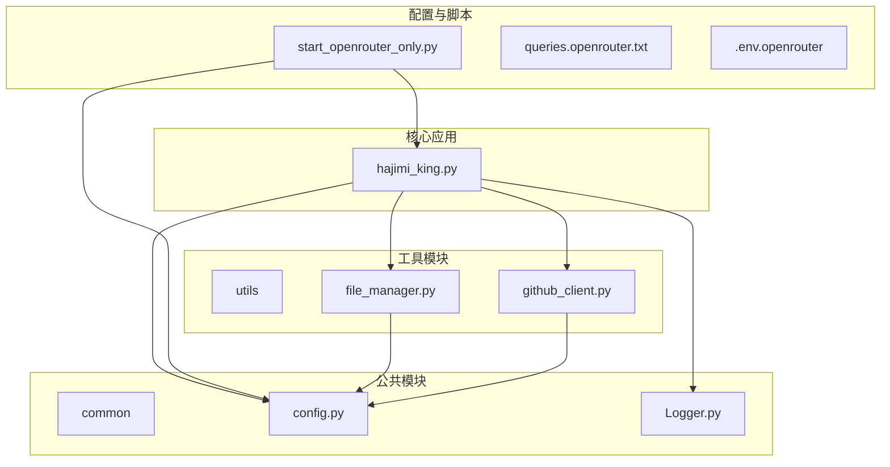

# OpenRouter 使用指南

<cite>
**本文档引用的文件**  
- [OPENROUTER_USAGE.md](file://OPENROUTER_USAGE.md)
- [start_openrouter_only.py](file://start_openrouter_only.py)
- [app/hajimi_king.py](file://app/hajimi_king.py)
- [common/config.py](file://common/config.py)
- [queries.openrouter.txt](file://queries.openrouter.txt)
</cite>

## 目录
1. [简介](#简介)
2. [项目结构](#项目结构)
3. [核心功能](#核心功能)
4. [OpenRouter 专用扫描模式](#openrouter-专用扫描模式)
5. [配置说明](#配置说明)
6. [使用方法](#使用方法)
7. [输出结果](#输出结果)
8. [故障排除](#故障排除)
9. [总结](#总结)

## 简介
本指南详细介绍了如何在 `APIKEY-king` 项目中使用 **OpenRouter 专用扫描模式**。该模式专为高效提取 OpenRouter API 密钥而设计，通过跳过不必要的验证步骤，显著提升扫描速度和效率。

OpenRouter 是一个统一的 AI 模型 API 平台，允许开发者通过单一接口访问多个 AI 模型服务。`APIKEY-king` 项目通过其专用扫描模式，能够精准识别并提取 GitHub 代码库中泄露的 OpenRouter 密钥，适用于安全审计、密钥监控等场景。

本模式的核心优势在于：
- **高效率**：仅提取，不验证，避免了 API 调用的延迟和配额消耗。
- **高精度**：结合上下文和文件内容进行智能过滤，减少误报。
- **增量扫描**：支持断点续传，避免重复工作。

**Section sources**
- [OPENROUTER_USAGE.md](file://OPENROUTER_USAGE.md#L1-L110)

## 项目结构
`APIKEY-king` 项目的目录结构清晰，各组件职责分明，便于维护和扩展。



**Diagram sources**
- [app/hajimi_king.py](file://app/hajimi_king.py#L1-L596)
- [common/config.py](file://common/config.py#L1-L188)
- [start_openrouter_only.py](file://start_openrouter_only.py#L1-L46)

**Section sources**
- [app/hajimi_king.py](file://app/hajimi_king.py#L1-L596)
- [common/config.py](file://common/config.py#L1-L188)

## 核心功能
`APIKEY-king` 项目提供了一系列强大的功能，用于自动化地在 GitHub 上搜索和提取 API 密钥。

| 功能 | 描述 |
|------|------|
| **GitHub 搜索** | 利用 GitHub Code Search API，根据自定义查询语句在海量代码中定位潜在密钥。 |
| **代理支持** | 支持配置 HTTP/SOCKS5 代理，有效规避 IP 封禁，确保扫描任务的稳定性。 |
| **增量扫描** | 通过记录已扫描文件的 SHA 值，实现断点续传，避免重复扫描，节省时间和资源。 |
| **智能过滤** | 内置文件路径黑名单（如 `readme`, `.md`, `test` 等），自动跳过文档和示例文件，专注于核心代码。 |
| **多平台支持** | 支持提取 ModelScope 和 OpenRouter 的专用密钥，并可回退到通用的 Gemini 密钥提取逻辑。 |

**Section sources**
- [README.md](file://README.md#L30-L60)

## OpenRouter 专用扫描模式
OpenRouter 专用扫描模式是 `APIKEY-king` 项目的一个高级功能，旨在以最高效率提取 OpenRouter 平台的 API 密钥。

### 模式特点
此模式通过以下方式优化了扫描流程：
1.  **禁用验证**：设置 `OPENROUTER_EXTRACT_ONLY=true`，程序在提取到密钥后直接保存，不再调用 OpenRouter API 进行有效性验证，从而极大提升扫描速度。
2.  **禁用其他提取**：通过清空 `TARGET_BASE_URLS` 并设置 `MODELSCOPE_EXTRACT_ONLY=false`，完全关闭 ModelScope 和通用 Gemini 密钥的提取逻辑，将资源集中于 OpenRouter 密钥。
3.  **专用查询**：使用 `queries.openrouter.txt` 文件中的针对性查询语句，精准定位包含 OpenRouter 信息的代码文件。

### 工作流程
```mermaid
flowchart TD
A[启动扫描] --> B{读取配置}
B --> C[OPENROUTER_BASE_URLS 存在?]
C --> |否| D[自动设置默认URL]
C --> |是| E[继续]
D --> E
E --> F[加载 queries.openrouter.txt]
F --> G[执行GitHub搜索]
G --> H{文件内容包含<br/>OpenRouter URL?}
H --> |否| I[跳过]
H --> |是| J[在内容中搜索 sk-or-v1-<64位十六进制>]
J --> K{找到密钥?}
K --> |否| L[跳过]
K --> |是| M[过滤占位符和示例]
M --> N{启用上下文检查?<br/>(OPENROUTER_REQUIRE_KEY_CONTEXT)]
N --> |是| O[检查密钥附近是否有 key/token 等词]
N --> |否| P[直接通过]
O --> Q{存在上下文?}
Q --> |否| L
Q --> |是| P
P --> R[保存有效密钥]
R --> S[记录文件SHA]
S --> T[处理下一个文件]
```

**Diagram sources**
- [start_openrouter_only.py](file://start_openrouter_only.py#L1-L46)
- [app/hajimi_king.py](file://app/hajimi_king.py#L1-L596)
- [common/config.py](file://common/config.py#L1-L188)

**Section sources**
- [OPENROUTER_USAGE.md](file://OPENROUTER_USAGE.md#L1-L110)
- [start_openrouter_only.py](file://start_openrouter_only.py#L1-L46)

## 配置说明
正确配置环境变量是成功运行 OpenRouter 专用扫描模式的关键。

### 核心配置项
以下配置项在 `.env` 文件中设置，对 OpenRouter 模式至关重要。

| 配置项 | 推荐值 | 说明 |
|--------|--------|------|
| `OPENROUTER_BASE_URLS` | `https://openrouter.ai/api/v1,openrouter.ai` | 定义了触发 OpenRouter 密钥提取的“触发器”。文件内容中必须包含这些 URL 之一，程序才会尝试提取密钥。 |
| `OPENROUTER_EXTRACT_ONLY` | `true` | 关键开关。设置为 `true` 时，程序仅提取密钥，不进行任何 API 验证，实现纯扫描模式。 |
| `TARGET_BASE_URLS` | (空) | 必须留空或删除，以禁用 ModelScope 密钥的提取逻辑，避免干扰。 |
| `MODELSCOPE_EXTRACT_ONLY` | `false` | 明确关闭 ModelScope 提取模式。 |
| `QUERIES_FILE` | `queries.openrouter.txt` | 指定使用 OpenRouter 专用的查询文件，以提高搜索的针对性。 |

### 高级配置项
这些配置项用于微调提取的精度和召回率。

| 配置项 | 默认值 | 说明 |
|--------|--------|------|
| `OPENROUTER_USE_LOOSE_PATTERN` | `false` | 是否使用宽松的正则模式（`sk-or-v1-[40位以上十六进制]`）。建议保持 `false` 以保证精度。 |
| `OPENROUTER_PROXIMITY_CHARS` | `0` | 当使用宽松模式时，此值定义了密钥与 `OPENROUTER_BASE_URLS` 在文件中的最大字符距离（例如 800），用于减少噪音。 |
| `OPENROUTER_REQUIRE_KEY_CONTEXT` | `false` | 是否要求密钥附近出现 `key`, `token`, `secret` 等上下文词汇。开启后可进一步过滤误报。 |

**Section sources**
- [OPENROUTER_USAGE.md](file://OPENROUTER_USAGE.md#L40-L70)
- [common/config.py](file://common/config.py#L1-L188)

## 使用方法
启动 OpenRouter 专用扫描模式有多种方法，推荐使用专用启动脚本。

### 方法一：使用专用启动脚本（推荐）
这是最简单、最不容易出错的方法。

1.  **配置环境**：
    ```bash
    # 复制 OpenRouter 专用的环境配置模板
    cp .env.openrouter .env
    
    # 编辑 .env 文件，填入你的 GitHub Token
    # GITHUB_TOKENS=ghp_your_token_here
    ```

2.  **运行扫描**：
    ```bash
    # 执行专用启动脚本
    python start_openrouter_only.py
    ```
    该脚本会自动设置正确的环境变量并启动 `hajimi_king.py`。

### 方法二：使用命令行参数
直接在运行主程序时指定模式。

```bash
# 使用 --mode 参数启动 OpenRouter 专用模式
python app/hajimi_king.py --mode openrouter-only
```
此方法会覆盖 `.env` 文件中的相关配置。

### 方法三：手动配置环境变量
在 `.env` 文件中手动设置所有必要的变量。

```bash
# 启用 OpenRouter 提取
OPENROUTER_BASE_URLS=https://openrouter.ai/api/v1,openrouter.ai
OPENROUTER_EXTRACT_ONLY=true

# 禁用 ModelScope 提取
TARGET_BASE_URLS=
MODELSCOPE_EXTRACT_ONLY=false

# 使用专用查询文件
QUERIES_FILE=queries.openrouter.txt

# 其他配置...
GITHUB_TOKENS=your_github_tokens_here
```

**Section sources**
- [OPENROUTER_USAGE.md](file://OPENROUTER_USAGE.md#L10-L35)
- [start_openrouter_only.py](file://start_openrouter_only.py#L1-L46)

## 输出结果
扫描过程中和结束后，程序会生成详细的日志和结果文件。

### 结果文件
所有输出文件均位于 `data/` 目录下。

| 文件类型 | 文件路径 | 说明 |
|----------|----------|------|
| **有效密钥列表** | `data/keys/keys_valid_YYYYMMDD.txt` | 包含当天扫描到的所有有效 OpenRouter 密钥，每行一个。这是最主要的结果文件。 |
| **详细日志** | `data/logs/keys_valid_detail_YYYYMMDD.log` | 记录每个密钥的详细信息，包括其所在的仓库名、文件路径和原始 URL，便于溯源。 |

### 日志输出示例
程序运行时的控制台输出示例如下：
```
🔥 启动 OpenRouter 专用扫描模式
✅ Found 3 OpenRouter key(s) (no validation)
📁 Saved 3 OpenRouter key(s)
```

**Section sources**
- [OPENROUTER_USAGE.md](file://OPENROUTER_USAGE.md#L75-L85)

## 故障排除
在使用过程中可能会遇到一些问题，以下是常见问题的解决方案。

### 常见问题及解决方法
1.  **问题：没有找到任何密钥**
    *   **原因**：`OPENROUTER_BASE_URLS` 配置错误，或查询文件 `queries.openrouter.txt` 不存在或内容不匹配。
    *   **解决**：检查 `.env` 文件中的 `OPENROUTER_BASE_URLS` 是否正确。确认 `data/queries.openrouter.txt` 文件存在且内容无误。

2.  **问题：扫描速度非常慢或频繁中断**
    *   **原因**：GitHub API 速率限制或 IP 被临时封禁。
    *   **解决**：配置代理服务器。在 `.env` 文件中设置 `PROXY=http://your_proxy:port`。推荐使用稳定的代理服务。

3.  **问题：程序报错，提示权限不足或配置检查失败**
    *   **原因**：GitHub Token 无效或缺少 `public_repo` 权限，或 `data` 目录没有写入权限。
    *   **解决**：重新生成一个具有 `public_repo` 权限的 GitHub Token 并更新 `.env` 文件。检查 `data` 目录的权限，确保程序可以读写。

**Section sources**
- [OPENROUTER_USAGE.md](file://OPENROUTER_USAGE.md#L90-L109)

## 总结
OpenRouter 专用扫描模式是 `APIKEY-king` 项目中一个高效、精准的工具，专为发现和提取 OpenRouter API 密钥而设计。通过理解其工作原理、正确配置环境变量并选择合适的启动方式，用户可以快速部署扫描任务，有效地监控和发现潜在的密钥泄露风险。

该模式的核心价值在于其“只提取、不验证”的设计理念，这使得它能够在短时间内处理海量的 GitHub 代码，极大地提升了安全审计的效率。结合增量扫描和智能过滤功能，它是一个强大且实用的自动化安全工具。