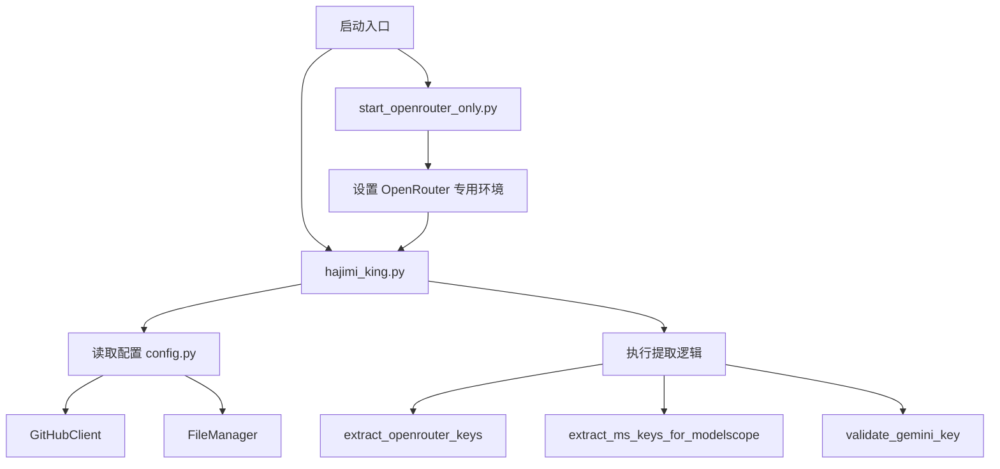
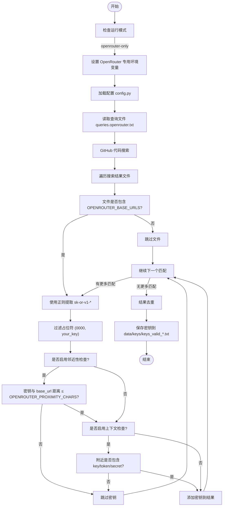

# OpenRouter 密钥提取

<cite>
**本文档引用的文件**   
- [app/hajimi_king.py](file://app/hajimi_king.py)
- [common/config.py](file://common/config.py)
- [start_openrouter_only.py](file://start_openrouter_only.py)
- [OPENROUTER_USAGE.md](file://OPENROUTER_USAGE.md)
</cite>

## 目录
1. [简介](#简介)
2. [项目结构](#项目结构)
3. [核心组件](#核心组件)
4. [OpenRouter 密钥提取逻辑](#openrouter-密钥提取逻辑)
5. [配置与运行模式](#配置与运行模式)
6. [流程图与执行流程](#流程图与执行流程)
7. [故障排除](#故障排除)
8. [结论](#结论)

## 简介
本文档详细说明了 `APIKEY-king` 项目中 OpenRouter API 密钥的提取机制。该系统通过 GitHub 代码搜索，结合正则表达式匹配、上下文分析、邻近性过滤和占位符识别，实现对 OpenRouter 密钥（`sk-or-v1-` 格式）的高效提取。文档涵盖提取逻辑、配置参数、执行流程及最佳实践，适用于开发者和技术用户理解与优化密钥扫描行为。

## 项目结构
项目采用模块化设计，主要分为应用层、通用工具层和配置管理层。OpenRouter 密钥提取功能由核心应用模块驱动，依赖配置文件进行参数控制，并通过专用启动脚本简化操作。



**图示来源**
- [start_openrouter_only.py](file://start_openrouter_only.py#L1-L45)
- [app/hajimi_king.py](file://app/hajimi_king.py#L1-L595)
- [common/config.py](file://common/config.py#L1-L187)

**本节来源**
- [app/hajimi_king.py](file://app/hajimi_king.py#L1-L595)
- [start_openrouter_only.py](file://start_openrouter_only.py#L1-L45)

## 核心组件
系统的核心组件包括配置管理器（Config）、GitHub 客户端（GitHubClient）、文件管理器（FileManager）和主应用逻辑（hajimi_king.py）。其中，`extract_openrouter_keys` 函数是 OpenRouter 密钥提取的核心实现。

**本节来源**
- [app/hajimi_king.py](file://app/hajimi_king.py#L1-L595)
- [common/config.py](file://common/config.py#L1-L187)

## OpenRouter 密钥提取逻辑
OpenRouter 密钥提取遵循严格的条件链，确保高精度和低误报率。提取过程分为以下几个关键步骤：

### 1. 基础 URL 匹配
提取的第一步是检查文件内容是否包含任一配置的 OpenRouter 基础 URL。此步骤通过 `_contains_base_url` 函数实现，对内容进行小写化处理后进行子串匹配。

**配置项**：`OPENROUTER_BASE_URLS`  
**默认值**：`https://openrouter.ai/api/v1,openrouter.ai`

### 2. 正则表达式匹配
在确认文件包含基础 URL 后，系统使用正则表达式提取潜在的密钥。匹配模式分为严格模式和宽松模式：

- **严格模式**（默认）：`\bsk-or-v1-[0-9a-f]{64}\b`  
  匹配以 `sk-or-v1-` 开头，后跟恰好 64 位十六进制字符的字符串。
- **宽松模式**：`\bsk-or-v1-[0-9a-f]{40,}\b`  
  匹配以 `sk-or-v1-` 开头，后跟至少 40 位十六进制字符的字符串。

**配置项**：`OPENROUTER_USE_LOOSE_PATTERN`  
**默认值**：`false`

### 3. 邻近性过滤
当启用宽松模式时，系统可启用邻近性过滤，确保密钥与基础 URL 的字符距离在指定范围内。

**配置项**：`OPENROUTER_PROXIMITY_CHARS`  
**默认值**：`0`（禁用）  
**建议值**：`300-1000`（用于降噪）

### 4. 上下文关键词检查
系统可选择性要求密钥附近包含 `key`, `token`, `secret`, `authorization`, `openrouter` 等关键词，以增加匹配的可信度。

**配置项**：`OPENROUTER_REQUIRE_KEY_CONTEXT`  
**默认值**：`false`

### 5. 占位符过滤
系统自动过滤明显的占位符密钥，如包含 `0000000000000000`、`your_key` 或 `example` 的字符串。

### 6. 去重处理
对提取结果进行去重，保持原始顺序。

```python
def extract_openrouter_keys(content: str) -> List[str]:
    base_urls = Config.OPENROUTER_BASE_URLS
    has_base, base_positions = _contains_base_url(content, base_urls)
    if not has_base:
        return []

    strict_pat = r'\bsk-or-v1-[0-9a-f]{64}\b'
    loose_pat = r'\bsk-or-v1-[0-9a-f]{40,}\b'
    use_loose = Config.parse_bool(Config.OPENROUTER_USE_LOOSE_PATTERN)
    pattern = loose_pat if use_loose else strict_pat

    proximity_chars = Config.OPENROUTER_PROXIMITY_CHARS if use_loose else 0
    require_ctx = Config.parse_bool(Config.OPENROUTER_REQUIRE_KEY_CONTEXT)
    ctx_re = re.compile(r"(key|token|secret|authorization|api[-_ ]?key|openrouter)", re.IGNORECASE)

    results: List[str] = []
    for m in re.finditer(pattern, content, re.IGNORECASE):
        k = m.group(0)
        if "0000000000000000" in k.lower() or "your_key" in k.lower() or "example" in k.lower():
            continue

        if proximity_chars and base_positions:
            pos = m.start()
            near = any(abs(pos - bp) <= proximity_chars for bp in base_positions)
            if not near:
                continue

        if require_ctx:
            start = max(0, m.start() - 80)
            end = min(len(content), m.end() + 80)
            snippet = content[start:end]
            if not ctx_re.search(snippet):
                continue

        results.append(k)

    seen = set()
    deduped = [x for x in results if not (x in seen or seen.add(x))]
    return deduped
```

**本节来源**
- [app/hajimi_king.py](file://app/hajimi_king.py#L200-L250)

## 配置与运行模式
系统支持多种方式配置 OpenRouter 专用模式，确保灵活性和易用性。

### 1. 专用启动脚本（推荐）
使用 `start_openrouter_only.py` 脚本可一键启动 OpenRouter 专用模式，自动设置必要环境变量。

```python
os.environ['OPENROUTER_EXTRACT_ONLY'] = 'true'
os.environ['MODELSCOPE_EXTRACT_ONLY'] = 'false'
os.environ['TARGET_BASE_URLS'] = ''
```

### 2. 命令行参数
通过 `--mode openrouter-only` 参数启动主程序。

```bash
python app/hajimi_king.py --mode openrouter-only
```

### 3. 环境变量配置
在 `.env` 文件中直接设置相关变量。

```bash
OPENROUTER_BASE_URLS=https://openrouter.ai/api/v1,openrouter.ai
OPENROUTER_EXTRACT_ONLY=true
TARGET_BASE_URLS=
MODELSCOPE_EXTRACT_ONLY=false
QUERIES_FILE=queries.openrouter.txt
```

**本节来源**
- [start_openrouter_only.py](file://start_openrouter_only.py#L1-L45)
- [OPENROUTER_USAGE.md](file://OPENROUTER_USAGE.md#L1-L109)

## 流程图与执行流程
以下流程图展示了 OpenRouter 密钥提取的完整执行流程。



**图示来源**
- [app/hajimi_king.py](file://app/hajimi_king.py#L200-L250)
- [start_openrouter_only.py](file://start_openrouter_only.py#L1-L45)

**本节来源**
- [app/hajimi_king.py](file://app/hajimi_king.py#L1-L595)
- [start_openrouter_only.py](file://start_openrouter_only.py#L1-L45)

## 故障排除
### 常见问题
1. **未找到密钥**
   - 检查 `OPENROUTER_BASE_URLS` 配置是否正确。
   - 确认 `queries.openrouter.txt` 文件存在且内容正确。
   - 验证 GitHub Token 是否有效且具有 `public_repo` 权限。

2. **扫描速度慢**
   - 配置代理服务器：`PROXY=http://localhost:1080`
   - 减少查询数量或优化查询表达式。

3. **权限错误**
   - 确保 GitHub Token 有 `public_repo` 权限。
   - 检查 `data` 目录是否可写。

**本节来源**
- [OPENROUTER_USAGE.md](file://OPENROUTER_USAGE.md#L80-L109)

## 结论
`APIKEY-king` 项目通过精细化的配置和多层过滤机制，实现了对 OpenRouter API 密钥的高效、精准提取。其核心优势在于：
- **高精度**：通过基础 URL 匹配和上下文验证，大幅降低误报率。
- **灵活性**：支持严格/宽松模式切换，适应不同场景需求。
- **易用性**：提供专用启动脚本和清晰的配置说明，降低使用门槛。
- **高效性**：纯提取模式跳过验证步骤，显著提升扫描速度。

该系统为自动化密钥发现提供了强大工具，建议用户根据实际需求调整配置参数以达到最佳效果。