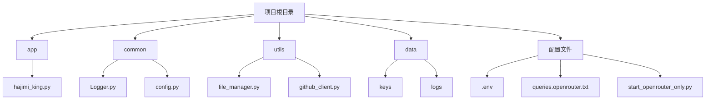
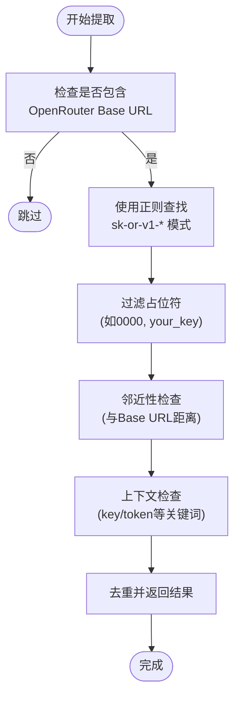
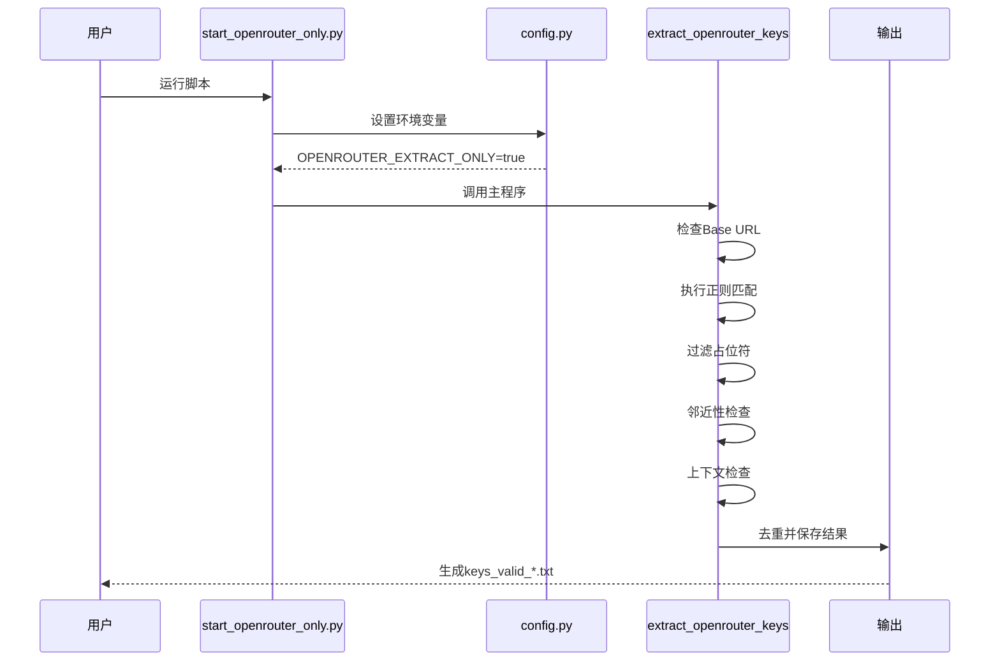

# OpenRouter 提取逻辑详解

<cite>
**本文档引用的文件**  
- [app/hajimi_king.py](file://app/hajimi_king.py)
- [common/config.py](file://common/config.py)
- [start_openrouter_only.py](file://start_openrouter_only.py)
- [queries.openrouter.txt](file://queries.openrouter.txt)
- [OPENROUTER_USAGE.md](file://OPENROUTER_USAGE.md)
</cite>

## 目录
1. [简介](#简介)
2. [项目结构](#项目结构)
3. [核心组件](#核心组件)
4. [OpenRouter 提取机制详解](#openrouter-提取机制详解)
5. [正则表达式与模式匹配](#正则表达式与模式匹配)
6. [上下文与邻近性过滤](#上下文与邻近性过滤)
7. [占位符检测与过滤](#占位符检测与过滤)
8. [配置参数说明](#配置参数说明)
9. [执行流程图](#执行流程图)
10. [故障排除指南](#故障排除指南)

## 简介
本项目旨在从 GitHub 代码库中高效提取 OpenRouter API 密钥。通过精准的正则匹配、上下文分析和邻近性判断，系统能够识别真实密钥并过滤占位符。本文档深入解析其提取逻辑，涵盖正则表达式设计、上下文匹配规则、邻近性过滤机制及占位符识别策略。

## 项目结构
项目采用模块化设计，各组件职责清晰，便于维护与扩展。



**Diagram sources**
- [app/hajimi_king.py](file://app/hajimi_king.py#L1-L596)
- [common/config.py](file://common/config.py#L1-L188)

**Section sources**
- [app/hajimi_king.py](file://app/hajimi_king.py#L1-L596)
- [common/config.py](file://common/config.py#L1-L188)

## 核心组件
系统核心由配置管理、密钥提取、文件处理和日志记录四大模块构成。`config.py` 负责加载环境变量，`hajimi_king.py` 实现核心提取逻辑，`file_manager.py` 管理文件读写，`Logger.py` 提供结构化日志输出。

**Section sources**
- [app/hajimi_king.py](file://app/hajimi_king.py#L1-L596)
- [common/config.py](file://common/config.py#L1-L188)

## OpenRouter 提取机制详解
当文件内容包含 `OPENROUTER_BASE_URLS` 中任一地址时，系统启动 OpenRouter 密钥提取流程。该机制通过正则匹配、邻近性检查和上下文验证三重过滤，确保提取结果的准确性。



**Diagram sources**
- [app/hajimi_king.py](file://app/hajimi_king.py#L200-L250)

**Section sources**
- [app/hajimi_king.py](file://app/hajimi_king.py#L200-L250)
- [common/config.py](file://common/config.py#L120-L140)

## 正则表达式与模式匹配
系统采用两种正则模式进行密钥匹配，可根据配置灵活切换。

### 严格模式
匹配标准的 OpenRouter 密钥格式：`sk-or-v1-[64位十六进制字符]`。

```python
strict_pat = r'\bsk-or-v1-[0-9a-f]{64}\b'
```

### 宽松模式
匹配至少40位十六进制字符的密钥，用于召回可能的变体。

```python
loose_pat = r'\bsk-or-v1-[0-9a-f]{40,}\b'
```

模式选择由 `OPENROUTER_USE_LOOSE_PATTERN` 配置项控制。

**Section sources**
- [app/hajimi_king.py](file://app/hajimi_king.py#L215-L218)
- [common/config.py](file://common/config.py#L130)

## 上下文与邻近性过滤
为提高提取精度，系统引入上下文和邻近性双重过滤机制。

### 邻近性过滤
当启用宽松模式时，系统检查密钥与 `OPENROUTER_BASE_URLS` 的字符距离。若超过 `OPENROUTER_PROXIMITY_CHARS` 配置值，则视为噪声并过滤。

```python
if proximity_chars and base_positions:
    pos = m.start()
    near = any(abs(pos - bp) <= proximity_chars for bp in base_positions)
    if not near:
        continue
```

### 上下文过滤
当 `OPENROUTER_REQUIRE_KEY_CONTEXT` 启用时，系统检查密钥附近80字符内是否包含 `key`, `token`, `secret`, `authorization`, `openrouter` 等关键词。

```python
ctx_re = re.compile(r"(key|token|secret|authorization|api[-_ ]?key|openrouter)", re.IGNORECASE)
```

**Section sources**
- [app/hajimi_king.py](file://app/hajimi_king.py#L220-L240)
- [common/config.py](file://common/config.py#L130-L140)

## 占位符检测与过滤
系统自动过滤常见的占位符密钥，避免无效结果。

### 过滤规则
以下模式的密钥将被自动过滤：
- 包含连续 `0000000000000000` 的密钥
- 包含 `your_key` 的密钥
- 包含 `example` 的密钥

```python
if "0000000000000000" in k.lower() or "your_key" in k.lower() or "example" in k.lower():
    continue
```

此机制确保输出结果均为潜在的有效密钥。

**Section sources**
- [app/hajimi_king.py](file://app/hajimi_king.py#L230-L232)

## 配置参数说明
OpenRouter 提取功能由以下环境变量控制：

| 配置项 | 默认值 | 说明 |
|--------|--------|------|
| `OPENROUTER_BASE_URLS` | `https://openrouter.ai/api/v1` | 触发提取的API地址，多个用逗号分隔 |
| `OPENROUTER_EXTRACT_ONLY` | `true` | 仅提取，不进行API验证 |
| `OPENROUTER_USE_LOOSE_PATTERN` | `false` | 是否启用宽松正则匹配模式 |
| `OPENROUTER_PROXIMITY_CHARS` | `0` | 与Base URL的最大字符距离（宽松模式下建议设置） |
| `OPENROUTER_REQUIRE_KEY_CONTEXT` | `false` | 是否要求密钥附近存在上下文关键词 |

**Section sources**
- [common/config.py](file://common/config.py#L120-L140)
- [OPENROUTER_USAGE.md](file://OPENROUTER_USAGE.md#L1-L110)

## 执行流程图
完整执行流程如下：



**Diagram sources**
- [start_openrouter_only.py](file://start_openrouter_only.py#L1-L46)
- [app/hajimi_king.py](file://app/hajimi_king.py#L200-L250)

**Section sources**
- [start_openrouter_only.py](file://start_openrouter_only.py#L1-L46)
- [app/hajimi_king.py](file://app/hajimi_king.py#L200-L250)

## 故障排除指南
### 常见问题及解决方案

#### 未找到密钥
- **检查配置**：确认 `OPENROUTER_BASE_URLS` 配置正确。
- **验证查询文件**：确保 `queries.openrouter.txt` 存在且内容正确。
- **GitHub Token**：检查 `GITHUB_TOKENS` 是否有效且具有 `public_repo` 权限。

#### 扫描速度慢
- **配置代理**：在 `.env` 文件中设置 `PROXY=http://localhost:1080`。
- **优化查询**：减少 `queries.openrouter.txt` 中的查询数量。

#### 权限错误
- **Token权限**：确保 GitHub Token 有 `public_repo` 权限。
- **目录权限**：检查 `data` 目录是否可读写。

**Section sources**
- [OPENROUTER_USAGE.md](file://OPENROUTER_USAGE.md#L80-L110)
- [app/hajimi_king.py](file://app/hajimi_king.py#L1-L596)