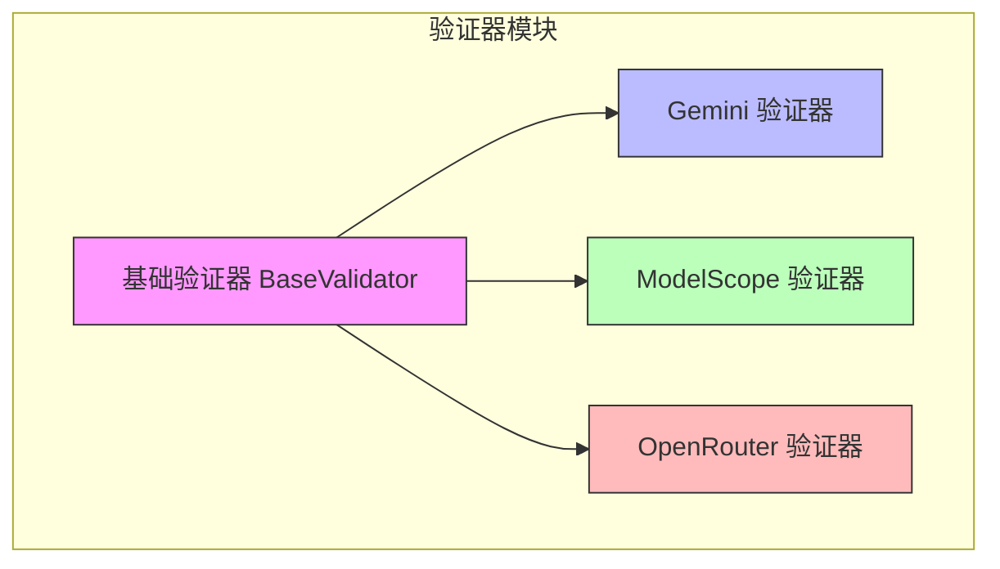
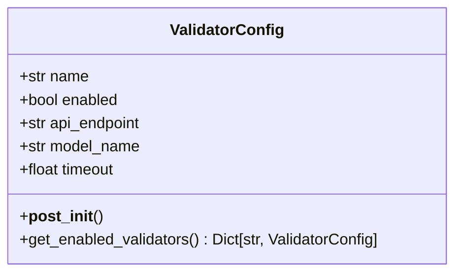
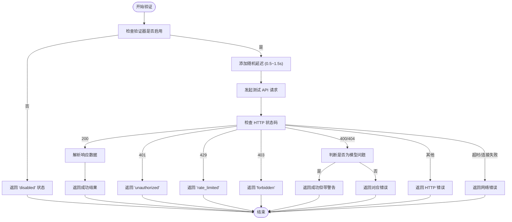

# 全面验证指南

<cite>
**本文档引用的文件**  
- [base.py](file://src/validators/base.py)
- [gemini.py](file://src/validators/gemini.py)
- [modelscope.py](file://src/validators/modelscope.py)
- [openrouter.py](file://src/validators/openrouter.py)
- [config.py](file://src/models/config.py)
- [default.yaml](file://config/default.yaml)
</cite>

## 目录
1. [引言](#引言)
2. [验证模式概述](#验证模式概述)
3. [核心验证组件](#核心验证组件)
4. [验证器配置详解](#验证器配置详解)
5. [各平台验证器分析](#各平台验证器分析)
6. [验证流程与工作机制](#验证流程与工作机制)
7. [错误处理与状态码](#错误处理与状态码)
8. [最佳实践与使用建议](#最佳实践与使用建议)
9. [总结](#总结)

## 引言
本指南旨在全面解析 APIKEY-king 项目中的验证系统，深入探讨其工作原理、配置参数、使用场景及最佳实践。该系统通过多平台 API 密钥验证机制，确保密钥的有效性与安全性，适用于自动化密钥扫描、安全审计等场景。

## 验证模式概述
APIKEY-king 的验证模式基于模块化设计，支持多种主流 AI 平台的 API 密钥验证。系统通过独立的验证器（Validator）实现对不同平台密钥的精准识别与测试调用，具备高可扩展性与灵活性。

**图示来源**  
- [base.py](file://src/validators/base.py#L1-L48)
- [gemini.py](file://src/validators/gemini.py#L1-L100)
- [modelscope.py](file://src/validators/modelscope.py#L1-L208)
- [openrouter.py](file://src/validators/openrouter.py#L1-L188)

## 核心验证组件
系统的核心验证组件继承自 `BaseValidator` 类，提供统一的接口与基础功能，包括延迟控制、结果封装、错误处理等。所有具体平台验证器均基于此基类实现。

**核心功能包括：**
- `can_validate`: 判断是否可处理指定密钥
- `validate`: 执行实际的 API 测试调用
- `_add_delay`: 添加随机延迟防止限流
- `_create_success_result` / `_create_error_result`: 统一结果返回格式

**本节来源**  
- [base.py](file://src/validators/base.py#L1-L48)
- [config.py](file://src/models/config.py#L1-L111)

## 验证器配置详解
验证器的行为由 `ValidatorConfig` 类定义，支持以下关键参数：

| 参数名 | 类型 | 默认值 | 说明 |
|-------|------|--------|------|
| `name` | str | - | 验证器名称（如 gemini、modelscope） |
| `enabled` | bool | True | 是否启用该验证器 |
| `api_endpoint` | str | None | 自定义 API 接入点 |
| `model_name` | str | None | 测试所用模型名称 |
| `timeout` | float | 30.0 | 请求超时时间（秒） |

配置可通过 `default.yaml` 文件或环境变量进行全局设置，支持动态启用/禁用特定验证器。

**图示来源**  
- [config.py](file://src/models/config.py#L50-L75)
- [default.yaml](file://config/default.yaml#L1-L18)

## 各平台验证器分析

### Gemini 验证器
专用于验证 Google Gemini API 密钥，通过 `google.generativeai` SDK 进行测试调用。

- **支持密钥类型**: `gemini`, `google-ai`
- **密钥特征**: 以 `AIzaSy` 开头，长度为 39 位
- **默认模型**: `gemini-2.5-flash`
- **异常处理**: 区分权限拒绝、配额耗尽、服务未启用等状态

**本节来源**  
- [gemini.py](file://src/validators/gemini.py#L1-L100)

### ModelScope 验证器
用于验证魔搭（ModelScope）平台 API 密钥，兼容 OpenAI 格式接口。

- **支持密钥类型**: `modelscope`
- **密钥特征**: 以 `ms-` 开头，后接 UUID 格式字符串
- **测试模型**: 默认使用 `Qwen/Qwen2-1.5B-Instruct`
- **请求优化**: 设置 `max_tokens=1`, `temperature=0` 降低开销
- **智能判断**: 即使返回 400/404，若能确认密钥有效仍标记为成功

**本节来源**  
- [modelscope.py](file://src/validators/modelscope.py#L1-L208)

### OpenRouter 验证器
用于验证 OpenRouter 平台 API 密钥，支持多模型路由。

- **支持密钥类型**: `openrouter`
- **密钥特征**: 以 `sk-or-v1-` 开头
- **测试模型**: 使用免费模型 `deepseek/deepseek-chat-v3.1:free`
- **请求头设置**: 包含 `HTTP-Referer` 和 `X-Title` 用于平台排名
- **代理支持**: 支持通过上下文传入代理配置

**本节来源**  
- [openrouter.py](file://src/validators/openrouter.py#L1-L188)

## 验证流程与工作机制
验证流程遵循标准化步骤，确保一致性与可靠性：

**图示来源**  
- [base.py](file://src/validators/base.py#L35-L48)
- [gemini.py](file://src/validators/gemini.py#L50-L100)
- [modelscope.py](file://src/validators/modelscope.py#L50-L208)
- [openrouter.py](file://src/validators/openrouter.py#L50-L188)

## 错误处理与状态码
系统定义了统一的错误状态体系，便于后续处理与分析：

| 状态码 | 含义 | 常见原因 |
|--------|------|----------|
| `valid` | 有效 | 成功通过测试调用 |
| `unauthorized` | 未授权 | 密钥无效或权限不足 |
| `rate_limited` | 被限流 | 触发平台速率限制 |
| `service_disabled` | 服务未启用 | API 未在控制台启用 |
| `timeout` | 超时 | 请求超时（默认 30s） |
| `connection_error` | 连接失败 | 网络或代理问题 |
| `disabled` | 已禁用 | 验证器被配置禁用 |

所有错误结果均包含详细的 `error_message` 和 `metadata`，便于调试与日志分析。

**本节来源**  
- [base.py](file://src/validators/base.py#L40-L48)
- [gemini.py](file://src/validators/gemini.py#L70-L100)
- [modelscope.py](file://src/validators/modelscope.py#L100-L208)
- [openrouter.py](file://src/validators/openrouter.py#L100-L188)

## 最佳实践与使用建议
为确保验证系统的高效与稳定，建议遵循以下最佳实践：

1. **合理配置超时时间**：根据网络环境调整 `timeout` 参数，避免误判。
2. **启用代理支持**：在受限网络环境下，通过 `proxy_list` 配置代理池。
3. **控制验证频率**：利用随机延迟机制避免触发平台限流。
4. **选择合适测试模型**：优先使用轻量级、免费模型降低验证成本。
5. **定期更新配置**：根据平台变更及时调整 `api_endpoint` 或 `model_name`。
6. **监控限流状态**：对 `rate_limited` 状态进行重试策略设计（如指数退避）。
7. **启用日志记录**：通过 `enable_file_logging` 记录验证过程便于审计。

**本节来源**  
- [config.py](file://src/models/config.py#L1-L111)
- [default.yaml](file://config/default.yaml#L1-L18)

## 总结
APIKEY-king 的全面验证模式通过模块化、可配置的设计，实现了对多平台 API 密钥的高效、准确验证。其核心优势在于：
- **统一接口**：所有验证器遵循相同接口规范
- **灵活配置**：支持动态启用/禁用、自定义参数
- **智能判断**：区分真实无效与临时错误
- **健壮性高**：完善的异常处理与网络容错机制

该系统不仅适用于密钥扫描场景，也可作为通用 API 密钥验证组件集成到其他安全工具中。