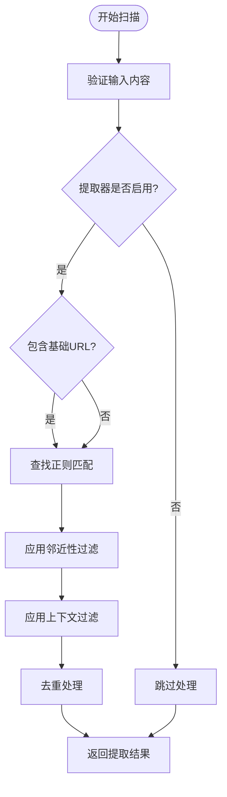
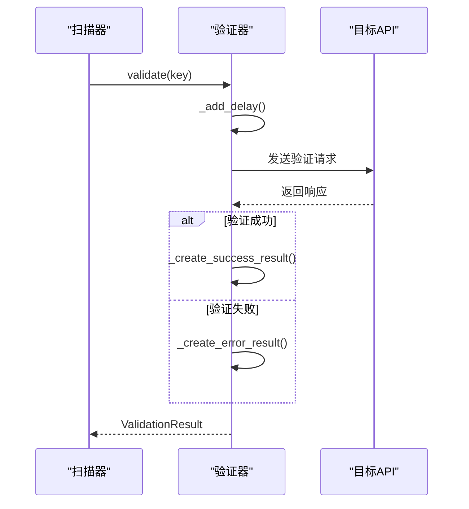
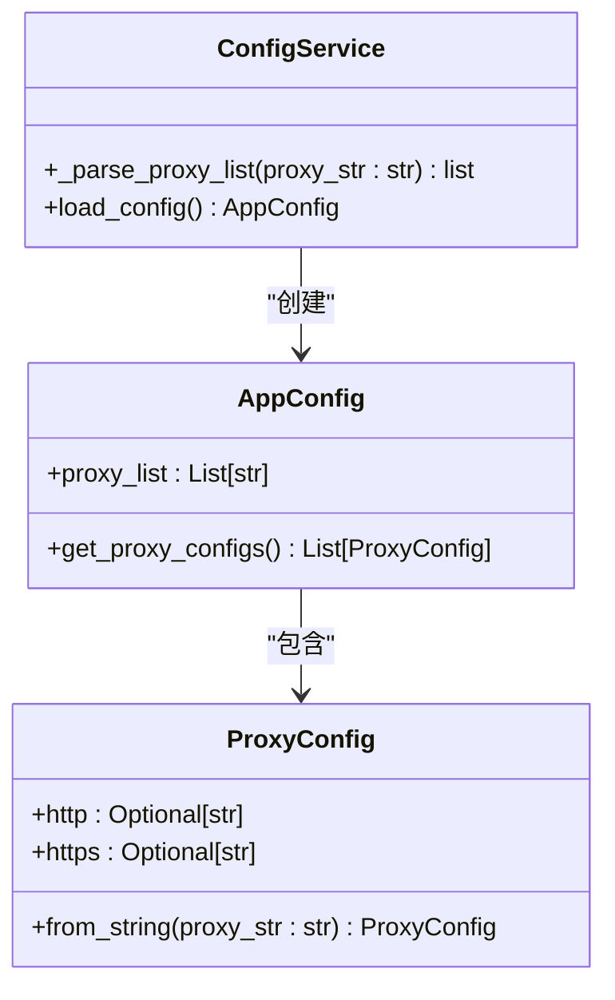
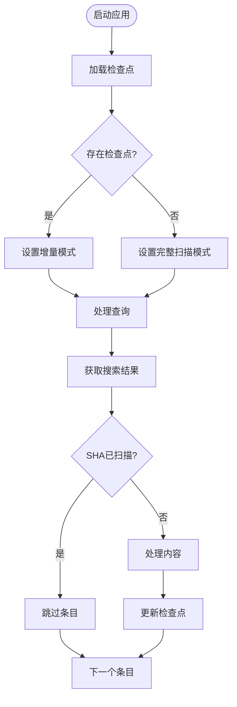
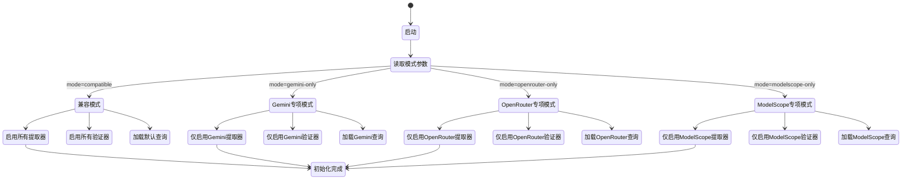
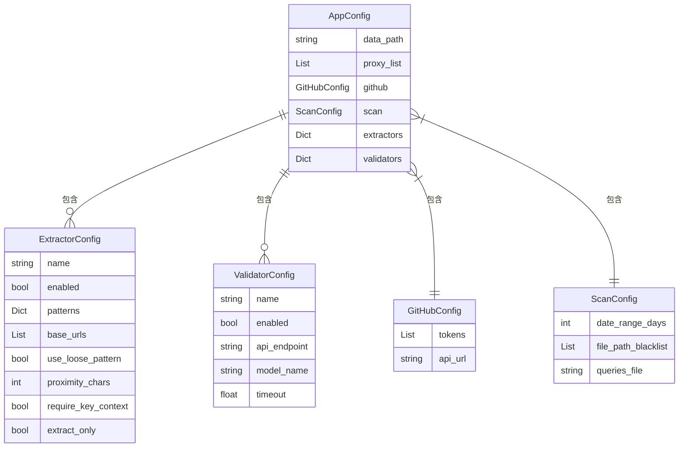
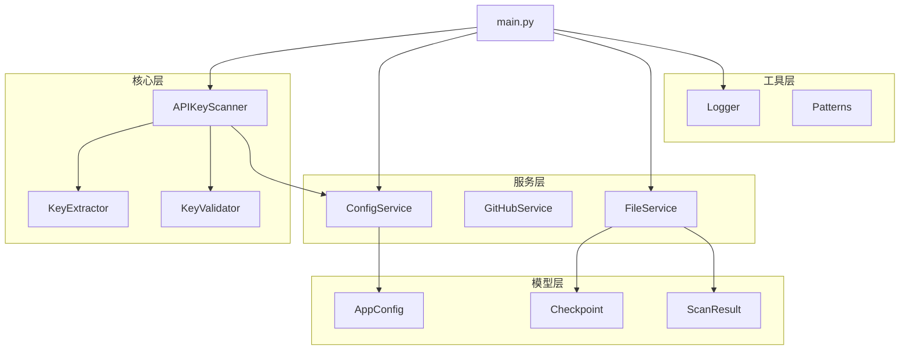

# 功能特性概览

<cite>
**本文档引用的文件**  
- [FEATURE_SUMMARY.md](file://FEATURE_SUMMARY.md)
- [scanner.py](file://src/core/scanner.py)
- [base.py](file://src/extractors/base.py)
- [base.py](file://src/validators/base.py)
- [config_service.py](file://src/services/config_service.py)
- [main.py](file://src/main.py)
- [config.py](file://src/models/config.py)
- [logger.py](file://src/utils/logger.py)
- [file_service.py](file://src/services/file_service.py)
</cite>

## 目录
1. [项目现状](#项目现状)
2. [核心功能概览](#核心功能概览)
3. [密钥扫描机制](#密钥扫描机制)
4. [实时验证系统](#实时验证系统)
5. [代理支持与网络优化](#代理支持与网络优化)
6. [增量扫描与断点续传](#增量扫描与断点续传)
7. [灵活模式切换](#灵活模式切换)
8. [配置管理与扩展性](#配置管理与扩展性)
9. [技术架构设计](#技术架构设计)
10. [安全与数据保护](#安全与数据保护)

## 项目现状

**APIKEY-king** 已从单一 Gemini 密钥提取工具发展为**全面的多平台 API 密钥发现与验证系统**。

**Section sources**
- [FEATURE_SUMMARY.md](file://FEATURE_SUMMARY.md#L4-L7)

## 核心功能概览

### 多平台密钥发现
支持三大主流 AI 平台的 API 密钥发现：

| 平台 | 密钥格式 | 正则模式 | 提取状态 |
|------|----------|----------|----------|
| **Google Gemini** | `AIzaSy...` | `AIzaSy[A-Za-z0-9\-_]{33}` | ✅ 完整支持 |
| **OpenRouter** | `sk-or-v1-...` | `sk-or-v1-[0-9a-f]{64}` | ✅ 完整支持 |
| **ModelScope** | `ms-UUID...` | `ms-[0-9a-f]{8}-[0-9a-f]{4}-[0-9a-f]{4}-[0-9a-f]{4}-[0-9a-f]{12}` | ✅ 完整支持 |

### 实时密钥验证
**业界首个**支持三种密钥类型完整验证的系统：

#### Gemini 验证
- 通过 Google GenerativeAI SDK 验证
- 使用 `gemini-2.5-flash` 最快模型
- 最小成本验证（1-2 个token）
- 智能错误分类：valid, unauthorized, quota_exceeded, service_disabled

#### OpenRouter 验证
- 通过 OpenRouter Chat Completions API
- 使用免费模型（如 `deepseek/deepseek-chat-v3.1:free`）
- 零成本验证策略
- 详细元数据：模型使用、token消耗、验证时间

#### ModelScope 验证
- 通过 ModelScope Chat Completions API
- 使用轻量模型（如 `Qwen/Qwen2-1.5B-Instruct`）
- 低成本验证
- 全面错误处理：unauthorized, forbidden, rate_limited, model_issue

### 灵活模式系统
支持多种扫描模式，满足不同使用场景：

```bash
# 全面验证模式（推荐）
python -m src.main --mode compatible

# 专项模式
python -m src.main --mode gemini-only      # 仅 Gemini + 验证
python -m src.main --mode openrouter-only  # 仅 OpenRouter + 验证  
python -m src.main --mode modelscope-only  # 仅 ModelScope + 验证
```

### 快捷启动系统
多种启动方式，适应不同用户习惯：

#### Python 快捷脚本
```bash
python scripts/quick_launch.py [all|gemini|openrouter|modelscope]
```

#### Shell 脚本 (Linux/Mac)
```bash
./scripts/quick_scan.sh [all|gm|or|ms]
```

#### Windows 批处理
```cmd
scripts\quick_scan.bat [all|gm|or|ms]
```

#### 配置预设
```bash
python -m src.main --config-preset [gemini-only|openrouter-only|modelscope-only]
```

**Section sources**
- [FEATURE_SUMMARY.md](file://FEATURE_SUMMARY.md#L10-L128)

## 密钥扫描机制

APIKEY-king 采用模块化提取器架构，通过正则表达式模式匹配从代码内容中发现 API 密钥。系统基于 `BaseExtractor` 基类实现多平台支持，每个平台（Gemini、OpenRouter、ModelScope）都有独立的提取器。

提取过程包含多个过滤阶段：
1. **基础URL检测**：检查内容中是否包含特定API基础URL
2. **邻近性过滤**：确保密钥在指定字符距离内与基础URL共现
3. **上下文过滤**：验证密钥周围是否存在"key"、"token"等上下文关键词
4. **占位符检测**：自动排除"your_key"、"example"等示例密钥

提取器配置通过YAML文件定义，支持严格模式和宽松模式两种正则表达式匹配策略。



**Diagram sources**
- [base.py](file://src/extractors/base.py#L45-L178)
- [config.py](file://src/models/config.py#L25-L41)

**Section sources**
- [base.py](file://src/extractors/base.py#L1-L178)
- [config.py](file://src/models/config.py#L25-L41)

## 实时验证系统

APIKEY-king 实现了业界领先的实时密钥验证功能，通过真实API调用验证密钥有效性，而非简单的格式检查。

验证系统基于 `BaseValidator` 基类构建，采用策略模式实现多平台验证器。每个验证器负责特定平台的验证逻辑，包括：

- **验证延迟**：内置随机延迟机制避免触发速率限制
- **错误分类**：精确区分有效、无效、配额耗尽、服务禁用等状态
- **元数据收集**：记录验证时间、token消耗等详细信息

验证过程采用最小成本策略：
- Gemini 使用 `gemini-2.5-flash` 最快模型
- OpenRouter 优先使用免费模型
- ModelScope 使用轻量级推理模型



**Diagram sources**
- [base.py](file://src/validators/base.py#L1-L48)
- [config.py](file://src/models/config.py#L43-L52)

**Section sources**
- [base.py](file://src/validators/base.py#L1-L48)
- [config.py](file://src/models/config.py#L43-L52)

## 代理支持与网络优化

系统内置强大的代理支持功能，有效避免IP封禁问题，确保扫描任务的持续性和稳定性。

代理配置特点：
- 支持HTTP/HTTPS代理
- 可配置代理列表轮换使用
- 通过环境变量动态覆盖
- 与验证请求无缝集成

代理系统通过 `ProxyConfig` 数据类管理，支持从配置文件和环境变量加载代理设置。在扫描过程中，系统会自动为网络请求配置适当的代理。



**Diagram sources**
- [config.py](file://src/models/config.py#L13-L23)
- [config_service.py](file://src/services/config_service.py#L1-L215)

**Section sources**
- [config.py](file://src/models/config.py#L13-L23)
- [config_service.py](file://src/services/config_service.py#L1-L215)

## 增量扫描与断点续传

APIKEY-king 实现了高效的增量扫描机制，通过检查点（checkpoint）系统实现断点续传功能。

核心组件：
- **Checkpoint**：记录上次扫描时间、已处理查询、已扫描文件SHA
- **FileService**：负责检查点的持久化存储和加载
- **增量过滤**：自动跳过已处理的文件和查询

该机制显著提升了扫描效率，避免重复处理相同内容，特别适合长期运行的监控任务。



**Diagram sources**
- [main.py](file://src/main.py#L1-L451)
- [file_service.py](file://src/services/file_service.py#L1-L216)

**Section sources**
- [main.py](file://src/main.py#L1-L451)
- [file_service.py](file://src/services/file_service.py#L1-L216)

## 灵活模式切换

系统支持多种扫描模式，通过命令行参数或配置预设灵活切换：

- **兼容模式** (`--mode compatible`)：全面扫描所有平台
- **专项模式**：仅扫描特定平台（gemini-only、openrouter-only、modelscope-only）

模式切换通过 `ScanMode` 枚举实现，在应用初始化时根据模式配置动态启用相应的提取器和验证器，并加载对应的查询文件。



**Diagram sources**
- [main.py](file://src/main.py#L1-L451)
- [config.py](file://src/models/config.py#L64-L68)

**Section sources**
- [main.py](file://src/main.py#L1-L451)
- [config.py](file://src/models/config.py#L64-L68)

## 配置管理与扩展性

系统采用分层配置管理体系，支持多种配置来源：

1. **YAML配置文件**：`config/default.yaml` 及平台特定配置
2. **环境变量**：支持运行时动态覆盖配置
3. **命令行参数**：提供即时配置选项
4. **配置预设**：通过`.env`文件加载预设配置

配置系统具有良好的扩展性，通过模块化设计支持轻松添加新平台：

- 新提取器继承 `BaseExtractor`
- 新验证器继承 `BaseValidator`
- 配置文件自动加载
- 扫描器自动注册



**Diagram sources**
- [config.py](file://src/models/config.py#L1-L111)
- [config_service.py](file://src/services/config_service.py#L1-L215)

**Section sources**
- [config.py](file://src/models/config.py#L1-L111)
- [config_service.py](file://src/services/config_service.py#L1-L215)

## 技术架构设计

APIKEY-king 采用清晰的模块化架构设计，各组件职责分明：



系统采用策略模式实现提取器和验证器的多态性，通过依赖注入方式将配置和服务传递给核心组件，确保了高内聚低耦合的设计原则。

**Diagram sources**
- [scanner.py](file://src/core/scanner.py#L1-L78)
- [main.py](file://src/main.py#L1-L451)

**Section sources**
- [scanner.py](file://src/core/scanner.py#L1-L78)
- [main.py](file://src/main.py#L1-L451)

## 安全与数据保护

系统设计充分考虑安全性和数据保护：

- **验证安全**：最小权限API调用，不存储密钥内容，代理隐藏验证来源，SSL/TLS加密传输
- **数据保护**：本地数据存储，可配置数据路径，自动日志轮换，敏感信息脱敏
- **访问控制**：GitHub Token权限最小化，代理认证支持，频率限制处理，IP封禁规避

日志系统采用双语输出，同时确保敏感信息不会被意外记录。所有输出文件都存储在本地指定目录，避免数据泄露风险。

**Section sources**
- [FEATURE_SUMMARY.md](file://FEATURE_SUMMARY.md#L175-L193)
- [logger.py](file://src/utils/logger.py#L1-L259)