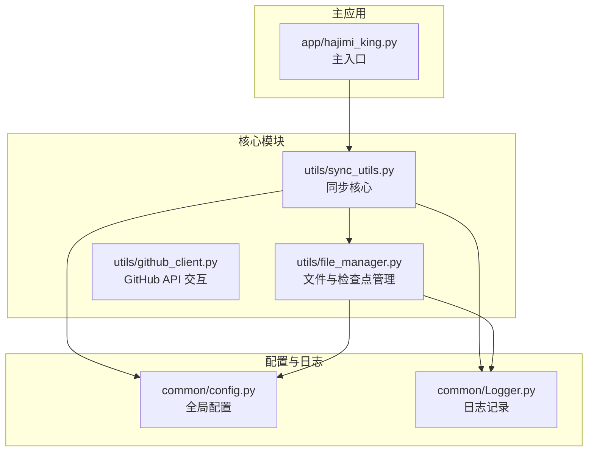
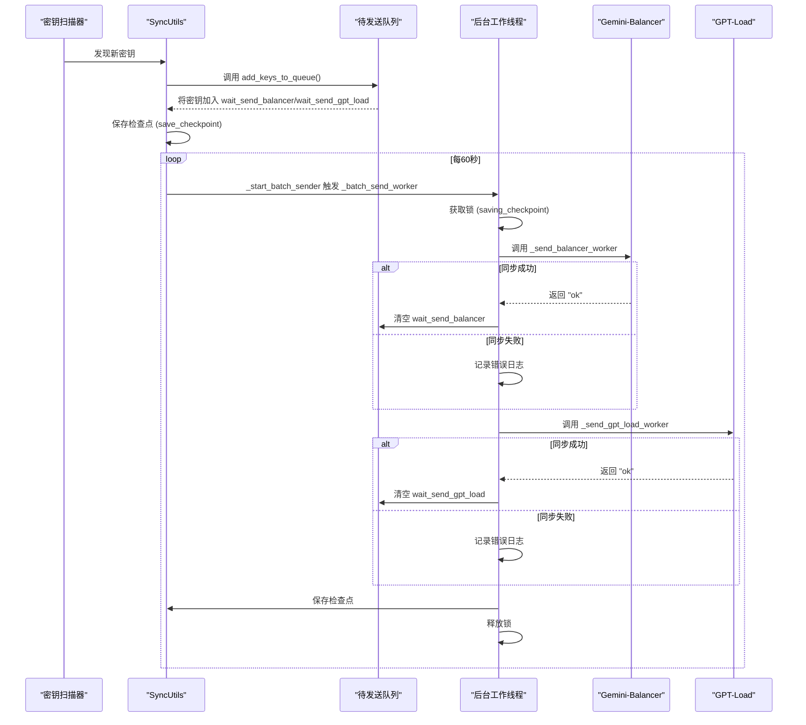
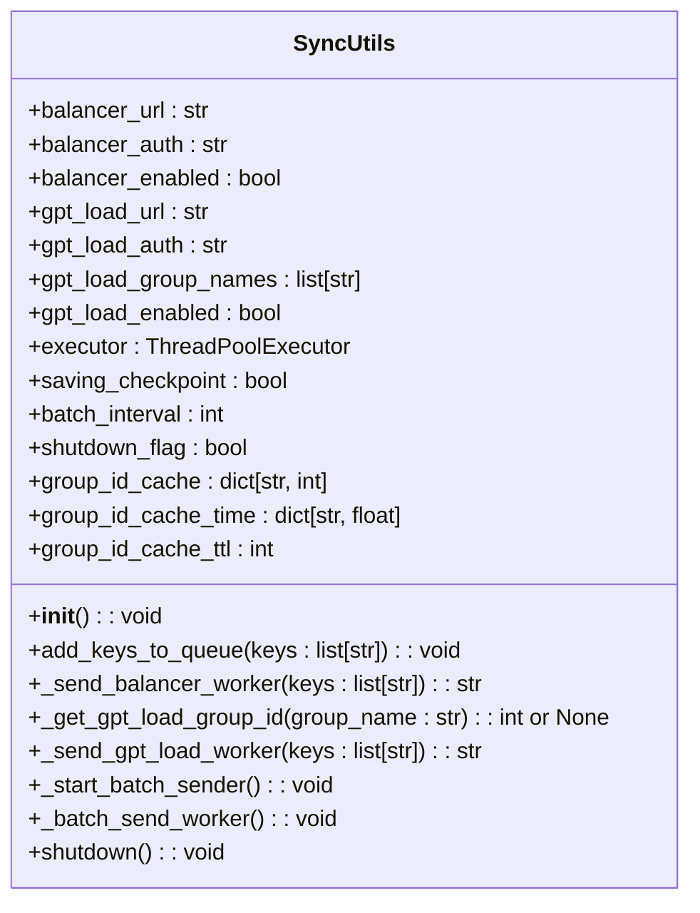
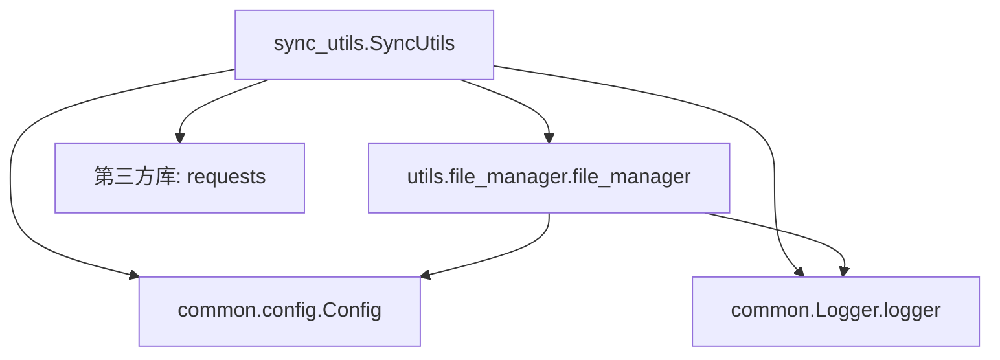

# 外部服务同步机制

<cite>
**本文档引用的文件**  
- [sync_utils.py](file://utils/sync_utils.py#L1-L484)
- [config.py](file://common/config.py#L1-L203)
- [file_manager.py](file://utils/file_manager.py#L1-L492)
</cite>

## 目录
1. [项目结构](#项目结构)  
2. [核心组件](#核心组件)  
3. [架构概述](#架构概述)  
4. [详细组件分析](#详细组件分析)  
5. [依赖分析](#依赖分析)  
6. [性能考虑](#性能考虑)  
7. [故障排除指南](#故障排除指南)  
8. [结论](#结论)

## 项目结构

项目采用模块化设计，主要分为 `app`、`common`、`scripts` 和 `utils` 四个核心目录。`utils` 目录中的 `sync_utils.py` 是实现外部服务同步的核心模块，负责将扫描发现的 API 密钥安全、高效地同步至 Gemini-Balancer 和 GPT-Load 等外部负载均衡服务。



**图示来源**  
- [sync_utils.py](file://utils/sync_utils.py#L1-L484)
- [file_manager.py](file://utils/file_manager.py#L1-L492)
- [config.py](file://common/config.py#L1-L203)

**本节来源**  
- [sync_utils.py](file://utils/sync_utils.py#L1-L484)
- [file_manager.py](file://utils/file_manager.py#L1-L492)

## 核心组件

`SyncUtils` 类是外部服务同步功能的核心，它通过异步任务队列和线程池机制，实现了对 Gemini-Balancer 和 GPT-Load 服务的安全、高效密钥同步。该类在初始化时会根据 `config.py` 中的环境变量配置，动态决定是否启用对特定外部服务的同步功能。

**本节来源**  
- [sync_utils.py](file://utils/sync_utils.py#L14-L484)
- [config.py](file://common/config.py#L1-L203)

## 架构概述

`SyncUtils` 模块采用生产者-消费者模式，结合周期性批处理机制，确保了同步操作的稳定性和效率。



**图示来源**  
- [sync_utils.py](file://utils/sync_utils.py#L14-L484)

## 详细组件分析

### SyncUtils 类分析

`SyncUtils` 类是整个同步机制的控制中心，其主要功能包括初始化配置、管理同步队列、执行异步发送任务以及处理错误。

#### 类结构图


**图示来源**  
- [sync_utils.py](file://utils/sync_utils.py#L14-L484)

#### 核心方法分析

##### add_keys_to_queue 方法
该方法是同步队列的“生产者”，负责将新发现的密钥添加到待发送队列中。

```python
def add_keys_to_queue(self, keys: List[str]):
    # ... (省略部分代码)
    # 使用锁机制防止与保存检查点的操作冲突
    while self.saving_checkpoint:
        time.sleep(0.5)
    self.saving_checkpoint = True
    try:
        # 添加到Gemini Balancer队列
        if self.balancer_enabled:
            checkpoint.wait_send_balancer.update(keys)
        # 添加到GPT Load Balancer队列
        if self.gpt_load_enabled:
            checkpoint.wait_send_gpt_load.update(keys)
        # 原子性地保存检查点
        file_manager.save_checkpoint(checkpoint)
    finally:
        self.saving_checkpoint = False # 释放锁
```

此方法通过 `saving_checkpoint` 标志位实现了简单的互斥锁，确保在保存检查点（checkpoint）的过程中，不会同时有新的密钥被加入队列，从而保证了数据的一致性。

**本节来源**  
- [sync_utils.py](file://utils/sync_utils.py#L60-L100)

##### _send_balancer_worker 方法
该方法是向 Gemini-Balancer 发送密钥的“消费者”工作线程。

1.  **获取当前配置**：通过 `GET /api/config` 接口获取 Balancer 当前的配置。
2.  **合并密钥**：将待发送的密钥与现有密钥合并，并进行去重。
3.  **更新配置**：通过 `PUT /api/config` 接口将更新后的配置（包含新密钥）发送回 Balancer。
4.  **验证结果**：检查更新后的配置，确认新密钥是否成功添加。
5.  **错误处理**：捕获并处理网络超时、连接错误、JSON 解析错误等异常。

```python
def _send_balancer_worker(self, keys: List[str]) -> str:
    # ... (省略部分代码)
    try:
        # 1. 获取当前配置
        response = requests.get(config_url, headers=headers, timeout=30)
        if response.status_code != 200:
            return "get_config_failed_not_200"
        
        config_data = response.json()
        current_api_keys = config_data.get('API_KEYS', [])
        
        # 2. & 3. 合并新密钥
        existing_keys_set = set(current_api_keys)
        new_add_keys_set = {key for key in keys if key not in existing_keys_set}
        
        # 4. & 5. 更新并验证配置
        config_data['API_KEYS'] = list(existing_keys_set)
        update_response = requests.put(config_url, headers=update_headers, json=config_data, timeout=60)
        
        # 验证是否添加成功
        updated_keys_set = set(update_response.json().get('API_KEYS', []))
        failed_to_add = [key for key in new_add_keys_set if key not in updated_keys_set]
        if failed_to_add:
            return "update_failed"
            
        return "ok"
        
    except requests.exceptions.Timeout:
        return "timeout"
    # ... (其他异常处理)
```

**本节来源**  
- [sync_utils.py](file://utils/sync_utils.py#L102-L205)

##### _send_gpt_load_worker 方法
该方法负责向 GPT-Load Balancer 发送密钥，其流程与 `_send_balancer_worker` 类似，但更复杂，因为它需要处理多个组（group）。

1.  **获取组ID**：调用 `_get_gpt_load_group_id` 方法，根据组名获取对应的组ID。该方法实现了15分钟的缓存，以减少对API的频繁调用。
2.  **发送密钥**：对每个组，构造包含 `group_id` 和 `keys_text` 的 payload，并通过 `POST /api/keys/add-async` 接口发送。
3.  **处理响应**：解析响应，检查任务是否成功启动。

```python
def _send_gpt_load_worker(self, keys: List[str]) -> str:
    # ... (省略部分代码)
    all_success = True
    for group_name in self.gpt_load_group_names:
        # 1. 获取组ID (带缓存)
        group_id = self._get_gpt_load_group_id(group_name)
        if group_id is None:
            all_success = False
            continue
            
        # 2. 发送密钥
        payload = {"group_id": group_id, "keys_text": ",".join(keys)}
        add_response = requests.post(add_keys_url, headers=add_headers, json=payload, timeout=60)
        
        # 3. 处理响应
        if add_response.status_code != 200 or add_data.get('code') != 0:
            all_success = False
            continue
            
    return "ok" if all_success else "partial_failure"
```

**本节来源**  
- [sync_utils.py](file://utils/sync_utils.py#L207-L350)

### 错误重试与持久化机制

#### 错误重试策略
`SyncUtils` 并未在单次任务中实现指数退避重试，而是依赖于其**周期性批处理机制**。所有失败的任务（即未成功发送的密钥）会保留在 `checkpoint.wait_send_balancer` 和 `checkpoint.wait_send_gpt_load` 队列中。`_batch_send_worker` 每60秒执行一次，会自动重试这些失败的任务，这本质上形成了一种**固定间隔的重试策略**。

#### 失败任务持久化
持久化是通过 `file_manager.py` 模块实现的。`Checkpoint` 类定义了 `wait_send_balancer` 和 `wait_send_gpt_load` 两个 `Set` 类型的字段，用于存储待发送的密钥。每当有密钥被加入队列或从队列中移除时，`file_manager.save_checkpoint(checkpoint)` 方法都会被调用，将当前的队列状态（包括待发送的密钥）序列化并保存到 `data/checkpoint.json` 文件中。即使程序意外终止，重启后也能从检查点文件中恢复未完成的同步任务。

```python
@dataclass
class Checkpoint:
    # ... 其他字段
    wait_send_balancer: Set[str] = field(default_factory=set)
    wait_send_gpt_load: Set[str] = field(default_factory=set)
```

**本节来源**  
- [sync_utils.py](file://utils/sync_utils.py#L14-L484)
- [file_manager.py](file://utils/file_manager.py#L1-L492)

### 状态反馈与日志记录

模块通过 `common.Logger` 进行详细的日志记录，所有关键操作（如添加密钥、发送请求、成功/失败）都会输出到日志中。此外，`file_manager.save_keys_send_result()` 方法会将每次发送操作的详细结果（包括每个密钥的状态）记录到 `data/logs/keys_send_detail_YYYYMMDD.log` 文件中，实现了状态的持久化反馈。

```python
# 在 _send_balancer_worker 中
send_result = {key: "ok" for key in new_add_keys_set}
file_manager.save_keys_send_result(list(new_add_keys_set), send_result)
```

**本节来源**  
- [sync_utils.py](file://utils/sync_utils.py#L178-L180)
- [file_manager.py](file://utils/file_manager.py#L280-L298)

### 并发控制与配置

模块通过 `ThreadPoolExecutor` 创建了一个最大工作线程数为2的线程池（`max_workers=2`），用于执行 `_batch_send_worker` 任务。这有效地限制了并发量，避免了因同时发起过多网络请求而导致外部服务过载或本地资源耗尽。

```python
self.executor = ThreadPoolExecutor(max_workers=2, thread_name_prefix="SyncUtils")
```

该并发数是硬编码的，但可以根据需要修改 `max_workers` 参数进行调整。

**本节来源**  
- [sync_utils.py](file://utils/sync_utils.py#L40-L41)

## 依赖分析

`SyncUtils` 模块高度依赖于其他几个核心模块：



**图示来源**  
- [sync_utils.py](file://utils/sync_utils.py#L1-L484)
- [file_manager.py](file://utils/file_manager.py#L1-L492)

## 性能考虑

*   **I/O 密集型**：同步操作主要是网络I/O，使用线程池是合适的。
*   **批处理优化**：每60秒批量发送一次，减少了HTTP请求的开销。
*   **缓存优化**：对 GPT-Load 的 `group_id` 进行缓存，避免了重复的API调用。
*   **锁竞争**：`saving_checkpoint` 锁虽然简单，但在高并发场景下可能成为瓶颈，可以考虑使用更高级的锁机制（如 `threading.Lock`）。

## 故障排除指南

| 问题现象 | 可能原因 | 解决方案 |
| :--- | :--- | :--- |
| 日志中出现 "Gemini Balancer sync disabled" | `GEMINI_BALANCER_URL` 或 `GEMINI_BALANCER_AUTH` 环境变量未正确配置 | 检查 `.env` 文件或环境变量设置 |
| 日志中出现 "GPT Load Balancer sync disabled" | `GPT_LOAD_URL`, `GPT_LOAD_AUTH`, `GPT_LOAD_GROUP_NAME` 或 `GPT_LOAD_SYNC_ENABLED` 配置不全 | 检查相关环境变量，确保 `GPT_LOAD_GROUP_NAME` 不为空 |
| 同步任务频繁超时 | 网络延迟高或外部服务响应慢 | 检查网络连接，确认外部服务是否正常运行 |
| 密钥发送成功但外部服务未生效 | 外部服务API行为变更 | 检查 `_send_balancer_worker` 和 `_send_gpt_load_worker` 中的API调用逻辑是否与最新文档一致 |
| `checkpoint.json` 文件损坏 | 程序异常退出导致写入中断 | 删除 `checkpoint.json` 文件，让程序重新创建（会丢失未发送的密钥） |

**本节来源**  
- [sync_utils.py](file://utils/sync_utils.py#L48-L57)
- [config.py](file://common/config.py#L1-L203)

## 结论

`sync_utils.py` 模块实现了一个健壮、可靠的外部服务同步机制。它通过异步队列、周期性批处理、错误持久化和详细的日志记录，确保了API密钥能够安全、高效地同步到Gemini-Balancer和GPT-Load服务。其模块化设计和清晰的错误处理策略使得系统易于维护和扩展。开发者可以基于此模块，通过继承或修改现有逻辑，轻松集成新的第三方服务。