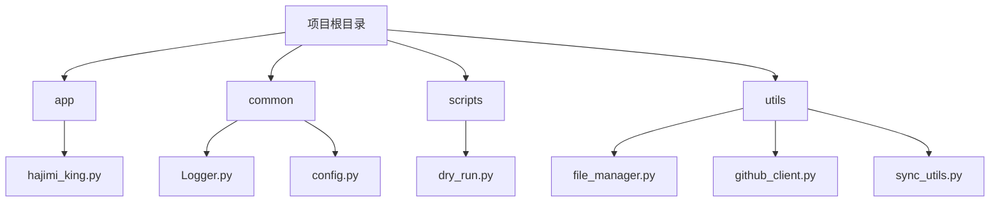
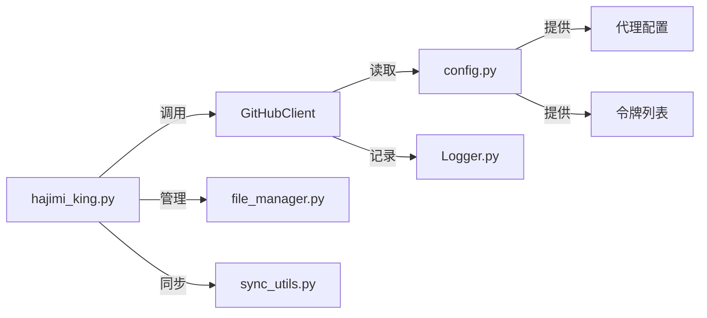
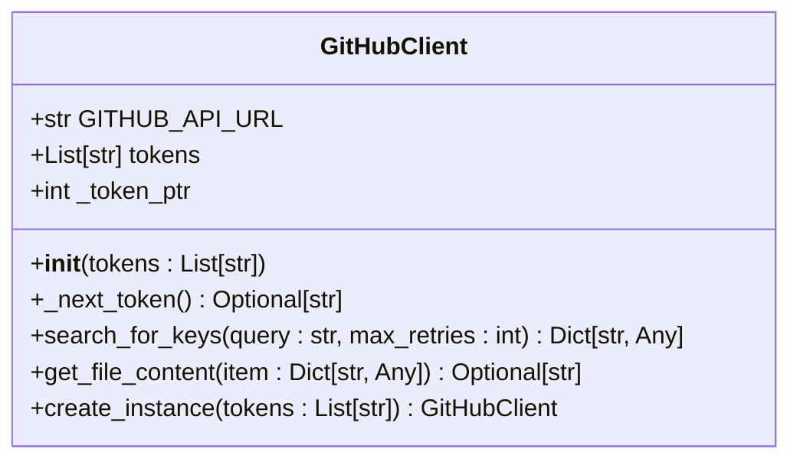
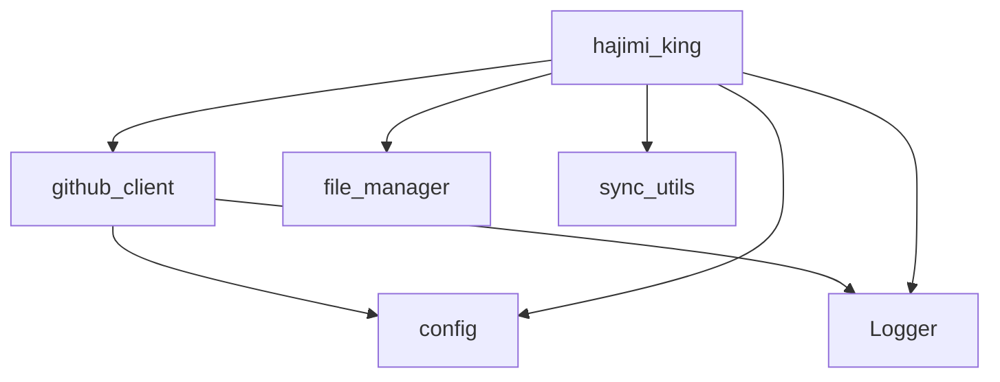

# GitHub客户端模块

<cite>
**本文档引用的文件**  
- [github_client.py](file://utils/github_client.py#L1-L217)
- [config.py](file://common/config.py#L1-L203)
- [Logger.py](file://common/Logger.py#L1-L24)
- [hajimi_king.py](file://app/hajimi_king.py#L1-L523)
</cite>

## 目录
1. [项目结构](#项目结构)  
2. [核心组件分析](#核心组件分析)  
3. [架构概览](#架构概览)  
4. [详细组件分析](#详细组件分析)  
5. [依赖关系分析](#依赖关系分析)  
6. [性能与错误处理](#性能与错误处理)  
7. [交互接口与使用方式](#交互接口与使用方式)  
8. [总结](#总结)

## 项目结构

本项目采用模块化设计，按功能划分目录结构，清晰分离关注点。主要模块包括应用主控、通用配置、工具脚本和核心工具类。



**图示来源**  
- [项目结构](file://#L1-L20)

## 核心组件分析

`GitHubClient` 是本系统中用于与 GitHub API 交互的核心类，封装了搜索、内容获取、令牌轮换、代理支持和错误重试等关键功能。其设计目标是实现高可用、低频率限制风险的代码搜索服务。

该类位于 `utils/github_client.py`，通过工厂方法 `create_instance` 实例化，接收多个 GitHub 访问令牌以支持轮换机制。

**本节来源**  
- [github_client.py](file://utils/github_client.py#L11-L217)

## 架构概览

系统整体架构围绕 `GitHubClient` 展开，由主控制器 `hajimi_king.py` 调用其接口执行搜索任务，并结合配置管理、日志记录和文件管理模块完成完整的密钥发现流程。



**图示来源**  
- [github_client.py](file://utils/github_client.py#L11-L217)  
- [hajimi_king.py](file://app/hajimi_king.py#L1-L523)  
- [config.py](file://common/config.py#L1-L203)

## 详细组件分析

### GitHubClient 类分析

`GitHubClient` 类实现了对 GitHub 搜索 API 的完整封装，包含多令牌轮换、请求配置、分页处理、错误重试和速率控制等机制。

#### 类结构图



**图示来源**  
- [github_client.py](file://utils/github_client.py#L11-L217)

#### 多令牌轮换机制

`GitHubClient` 使用循环指针 `_token_ptr` 实现令牌轮换策略。每次请求前调用 `_next_token()` 方法获取下一个可用令牌：

```python
def _next_token(self) -> Optional[str]:
    if not self.tokens:
        return None
    token = self.tokens[self._token_ptr % len(self.tokens)]
    self._token_ptr += 1
    return token.strip() if isinstance(token, str) else token
```

该机制有效分散请求来源，降低单个令牌触发速率限制的风险，提升整体搜索稳定性。

**本节来源**  
- [github_client.py](file://utils/github_client.py#L20-L30)

#### 搜索查询构建与执行

`search_for_keys()` 方法构建并执行 GitHub 代码搜索请求，支持分页（最多10页）、每页100条结果，最大返回1000条。

请求参数包括：
- `q`: 搜索查询字符串
- `per_page`: 每页数量（固定为100）
- `page`: 当前页码

请求头包含：
- `Accept`: 指定 API 版本
- `User-Agent`: 模拟浏览器行为
- `Authorization`: 使用当前令牌认证

```python
headers = {
    "Accept": "application/vnd.github.v3+json",
    "User-Agent": "Mozilla/5.0 ..."
}
if current_token:
    headers["Authorization"] = f"token {current_token}"
```

**本节来源**  
- [github_client.py](file://utils/github_client.py#L32-L60)

#### 代理支持实现

通过 `Config.get_random_proxy()` 方法从环境变量 `PROXY` 加载代理列表，并在请求时随机选择一个使用：

```python
proxies = Config.get_random_proxy()
if proxies:
    response = requests.get(..., proxies=proxies)
```

此设计增强了请求的匿名性和抗封锁能力，适用于大规模扫描场景。

**本节来源**  
- [config.py](file://common/config.py#L45-L55)  
- [github_client.py](file://utils/github_client.py#L50-L55)

#### 响应数据解析逻辑

搜索结果以 JSON 格式返回，包含 `total_count`、`incomplete_results` 和 `items` 字段。客户端逐页获取结果，直到：
- 达到最大页数（10页）
- 返回结果为空
- 累计结果数达到预期总数（最多1000）

```python
if page == 1:
    total_count = page_result.get("total_count", 0)
    expected_total = min(total_count, 1000)
```

最终结果合并所有页面的 `items`，并标记是否完整。

**本节来源**  
- [github_client.py](file://utils/github_client.py#L80-L110)

#### 分页处理与速率控制

客户端按页循环（1-10），每页最多重试5次。成功获取一页后，随机休眠0.5-1.5秒再请求下一页，避免高频请求：

```python
sleep_time = random.uniform(0.5, 1.5)
time.sleep(sleep_time)
```

同时，通过检查 `X-RateLimit-Remaining` 头部监控剩余配额，当低于3次时发出警告。

**本节来源**  
- [github_client.py](file://utils/github_client.py#L130-L140)

#### 错误重试策略

客户端实现了指数退避重试机制，针对不同错误类型采取不同策略：

- **403/429 错误（速率限制）**：等待 `2^attempt + random` 秒后重试，最多60秒。
- **其他HTTP错误**：等待 `2^attempt` 秒后重试。
- **网络错误**：等待 `min(2^attempt, 30)` 秒后重试。

```python
wait = min(2 ** attempt + random.uniform(0, 1), 60)
time.sleep(wait)
```

该策略在保证可靠性的同时避免过度重试。

**本节来源**  
- [github_client.py](file://utils/github_client.py#L65-L100)

#### 文件内容获取

`get_file_content()` 方法通过 `/repos/{owner}/{repo}/contents/{path}` 接口获取文件内容。优先尝试解析 `content` 字段的 base64 编码内容，失败则回退到 `download_url`：

```python
if encoding == "base64" and content:
    decoded_content = base64.b64decode(content).decode('utf-8')
else:
    content_response = requests.get(download_url, ...)
    return content_response.text
```

此双重机制确保在不同响应格式下均能正确获取内容。

**本节来源**  
- [github_client.py](file://utils/github_client.py#L150-L200)

## 依赖关系分析

系统各模块间依赖关系清晰，低耦合高内聚。



`GitHubClient` 依赖 `config` 获取令牌和代理，依赖 `Logger` 输出日志；`hajimi_king` 作为主控制器，协调所有模块运行。

**图示来源**  
- [github_client.py](file://utils/github_client.py#L1-L217)  
- [hajimi_king.py](file://app/hajimi_king.py#L1-L523)

## 性能与错误处理

### 性能特性

- **并发控制**：通过随机休眠和令牌轮换实现软限流。
- **缓存机制**：主程序通过 `checkpoint` 避免重复扫描。
- **资源管理**：代理和令牌池化使用，提升资源利用率。

### 错误处理机制

- **日志分级**：INFO、WARNING、ERROR 分级输出，便于监控。
- **异常捕获**：捕获 `HTTPError` 和 `RequestException`，区分处理。
- **数据完整性检查**：对比预期与实际结果数，超过10%差异时警告。

```python
if discrepancy > expected_total * 0.1:
    logger.warning(f"⚠️ Significant data loss: {discrepancy}/{expected_total} items missing")
```

**本节来源**  
- [github_client.py](file://utils/github_client.py#L140-L145)  
- [Logger.py](file://common/Logger.py#L1-L24)

## 交互接口与使用方式

`GitHubClient` 提供两个主要接口：

1. `search_for_keys(query: str)`：执行代码搜索，返回结果列表。
2. `get_file_content(item: Dict)`：获取搜索结果中文件的原始内容。

主程序通过工厂方法创建实例：

```python
github_utils = GitHubClient.create_instance(Config.GITHUB_TOKENS)
```

开发者可直接调用其方法进行安全高效的 GitHub 搜索操作。

**本节来源**  
- [github_client.py](file://utils/github_client.py#L210-L217)  
- [hajimi_king.py](file://app/hajimi_king.py#L22)

## 总结

`GitHubClient` 模块通过多令牌轮换、代理支持、智能重试和速率控制等机制，构建了一个稳定可靠的 GitHub API 访问层。其设计充分考虑了大规模扫描场景下的频率限制、网络波动和数据完整性问题，为上层应用提供了坚实的基础支持。开发者可基于此模块安全高效地进行代码搜索与密钥发现任务。