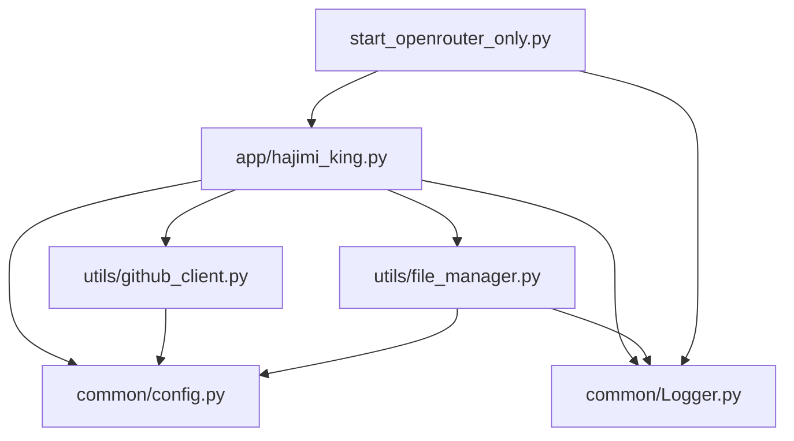
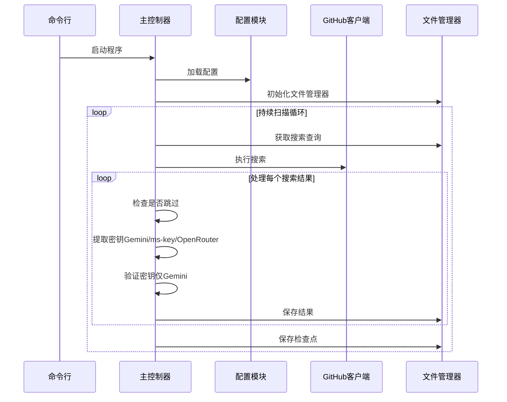
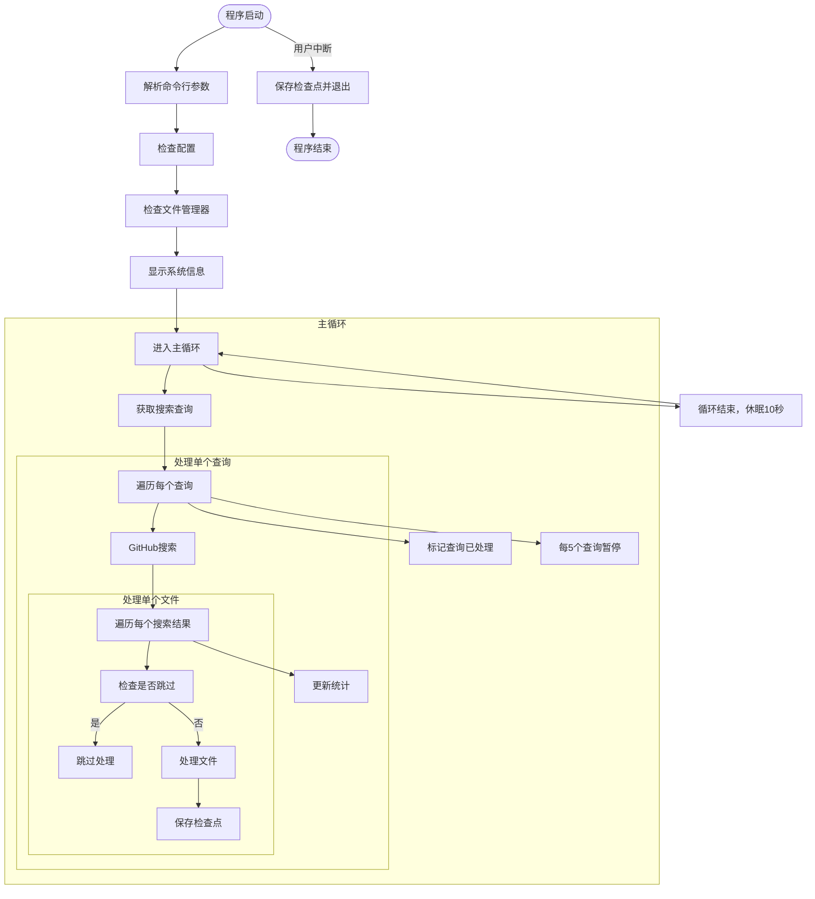
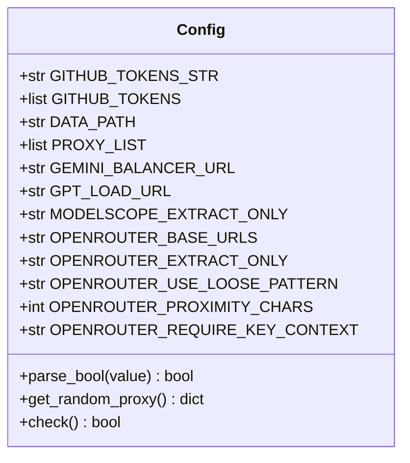
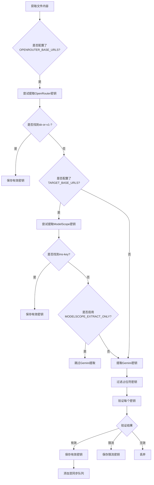
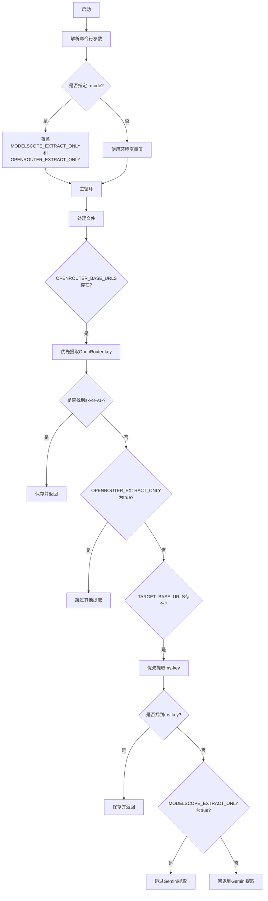
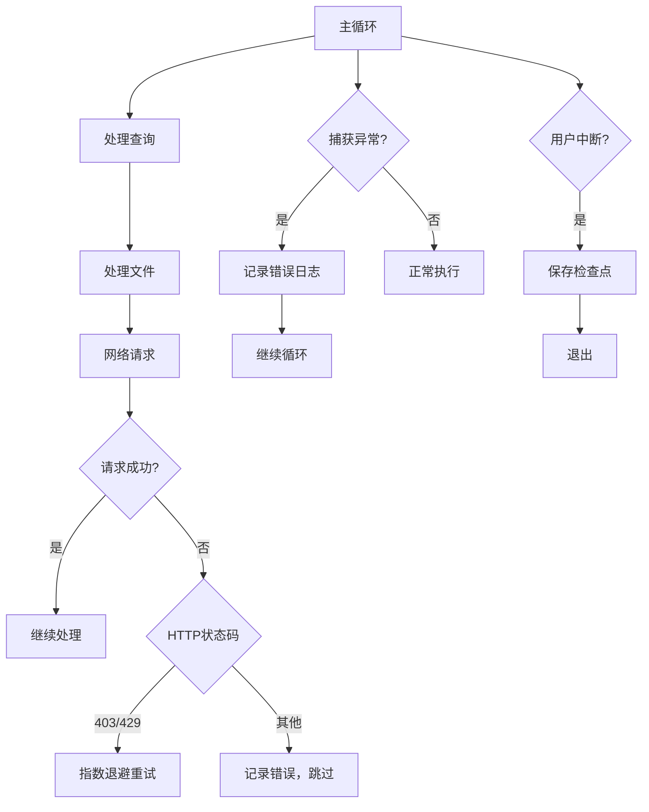
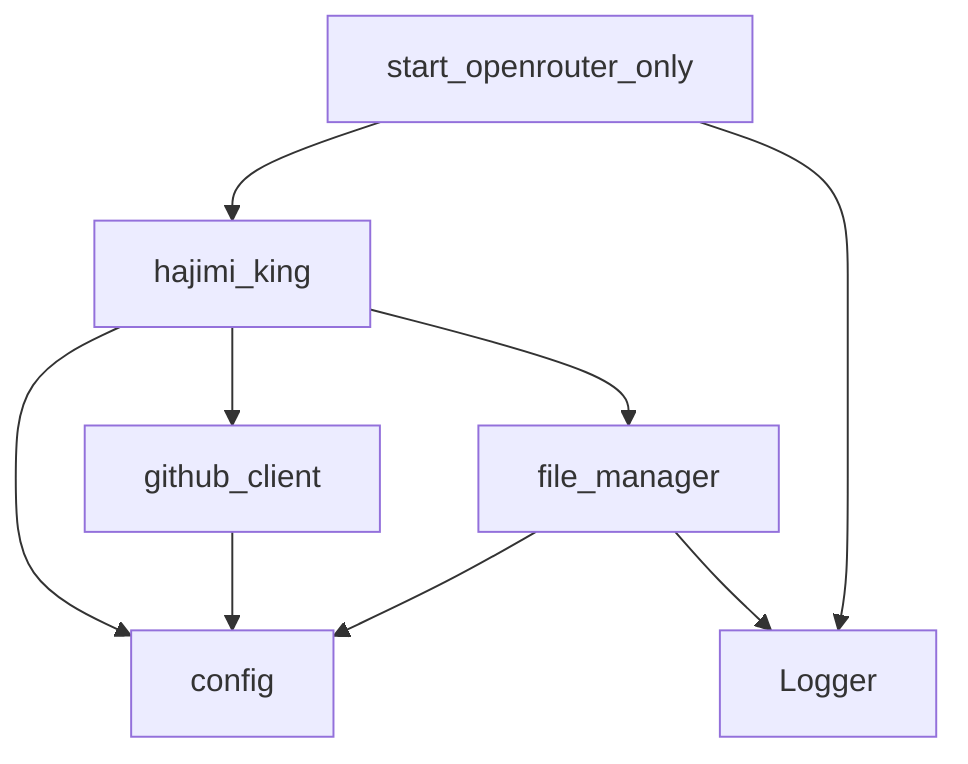

# 主控制器设计

<cite>
**本文档中引用的文件**  
- [hajimi_king.py](file://app/hajimi_king.py) - *新增 OpenRouter-only 模式支持*
- [config.py](file://common/config.py) - *新增 OPENROUTER 相关配置项*
- [github_client.py](file://utils/github_client.py)
- [file_manager.py](file://utils/file_manager.py)
- [start_openrouter_only.py](file://start_openrouter_only.py) - *新增 OpenRouter 专用启动脚本*
</cite>

## 更新摘要
**变更内容**  
- 更新了主控制器对 OpenRouter API 密钥提取的支持
- 新增 `--mode` 命令行参数说明，支持三种运行模式
- 添加 `start_openrouter_only.py` 专用启动脚本的说明
- 修正数据处理流程以反映 OpenRouter 密钥提取逻辑
- 更新运行模式控制分支图示与说明
- 移除已废弃的 `sync_utils.py` 引用

### 目录
1. [项目结构](#项目结构)  
2. [核心组件](#核心组件)  
3. [主控制器架构概述](#主控制器架构概述)  
4. [详细组件分析](#详细组件分析)  
5. [数据处理流程](#数据处理流程)  
6. [运行模式与控制分支](#运行模式与控制分支)  
7. [错误处理与日志策略](#错误处理与日志策略)  
8. [依赖关系分析](#依赖关系分析)

## 项目结构

本项目采用模块化分层架构，核心功能由 `app`、`utils`、`common` 三大目录支撑，结构清晰，职责分明。新增 `start_openrouter_only.py` 作为专用启动入口。

**图示来源**  
- [hajimi_king.py](file://app/hajimi_king.py)
- [config.py](file://common/config.py)
- [github_client.py](file://utils/github_client.py)
- [file_manager.py](file://utils/file_manager.py)
- [start_openrouter_only.py](file://start_openrouter_only.py)

## 核心组件

项目由四大核心模块构成，协同完成密钥搜索、提取、验证与同步的全流程。

- **主控制器** (`hajimi_king.py`)：系统入口，协调各模块运行，现支持 OpenRouter 密钥提取。
- **配置管理器** (`config.py`)：集中管理所有运行时配置，新增 OpenRouter 相关参数。
- **GitHub客户端** (`github_client.py`)：封装GitHub API调用。
- **文件管理器** (`file_manager.py`)：负责文件读写与状态持久化。
- **专用启动脚本** (`start_openrouter_only.py`)：用于启动 OpenRouter 专用扫描模式。

**本节来源**  
- [hajimi_king.py](file://app/hajimi_king.py)
- [config.py](file://common/config.py)
- [github_client.py](file://utils/github_client.py)
- [file_manager.py](file://utils/file_manager.py)
- [start_openrouter_only.py](file://start_openrouter_only.py)

## 主控制器架构概述

`hajimi_king.py` 作为系统核心，实现了从命令行解析到任务循环的完整控制流，现已扩展支持 OpenRouter API 密钥的提取。

**图示来源**  
- [hajimi_king.py](file://app/hajimi_king.py#L357-L518)
- [file_manager.py](file://utils/file_manager.py)
- [github_client.py](file://utils/github_client.py)

## 详细组件分析

### 主控制器 (`hajimi_king.py`) 分析

主控制器通过 `main()` 函数驱动整个系统，其核心逻辑包括配置检查、循环扫描与异常处理。现已支持 `--mode` 参数控制提取行为。

#### 主函数执行流程

**图示来源**  
- [hajimi_king.py](file://app/hajimi_king.py#L357-L518)

**本节来源**  
- [hajimi_king.py](file://app/hajimi_king.py#L357-L518)

### 配置管理模块分析

`config.py` 模块通过 `Config` 类集中管理所有配置项，支持环境变量注入与类型转换，新增 OpenRouter 相关配置。

**图示来源**  
- [config.py](file://common/config.py#L1-L204)

**本节来源**  
- [config.py](file://common/config.py#L1-L204)

## 数据处理流程

系统采用“搜索-提取-验证-同步”的流水线模式处理数据，现已支持 OpenRouter 密钥提取。

### 密钥提取与验证流程

**图示来源**  
- [hajimi_king.py](file://app/hajimi_king.py#L213-L305)
- [config.py](file://common/config.py)

**本节来源**  
- [hajimi_king.py](file://app/hajimi_king.py#L213-L305)

## 运行模式与控制分支

系统支持多种运行模式，通过 `--mode` 命令行参数或环境变量灵活控制行为。

### 运行模式控制逻辑

**图示来源**  
- [hajimi_king.py](file://app/hajimi_king.py#L357-L375)
- [config.py](file://common/config.py)
- [start_openrouter_only.py](file://start_openrouter_only.py)

**本节来源**  
- [hajimi_king.py](file://app/hajimi_king.py#L357-L375)

## 错误处理与日志策略

系统具备完善的错误处理机制与日志记录策略，确保运行稳定可追踪。

### 异常处理流程

**图示来源**  
- [hajimi_king.py](file://app/hajimi_king.py#L488-L518)
- [github_client.py](file://utils/github_client.py)

**本节来源**  
- [hajimi_king.py](file://app/hajimi_king.py#L488-L518)

## 依赖关系分析

系统各模块间依赖清晰，耦合度低，便于维护与扩展。

**图示来源**  
- [hajimi_king.py](file://app/hajimi_king.py)
- [github_client.py](file://utils/github_client.py)
- [file_manager.py](file://utils/file_manager.py)
- [start_openrouter_only.py](file://start_openrouter_only.py)

**本节来源**  
- [hajimi_king.py](file://app/hajimi_king.py)
- [github_client.py](file://utils/github_client.py)
- [file_manager.py](file://utils/file_manager.py)
- [start_openrouter_only.py](file://start_openrouter_only.py)