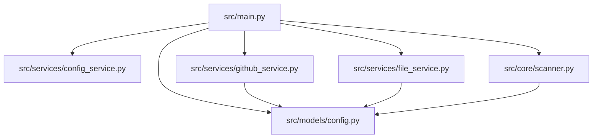
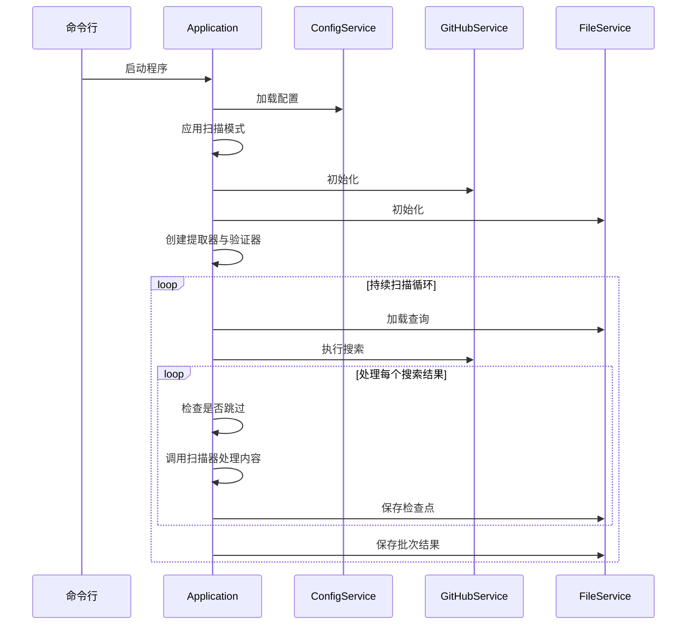
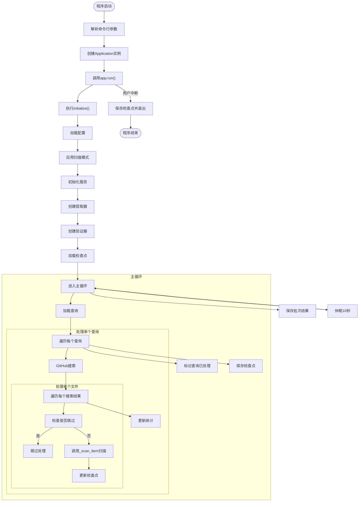
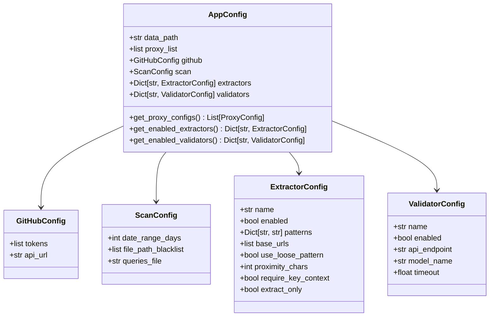
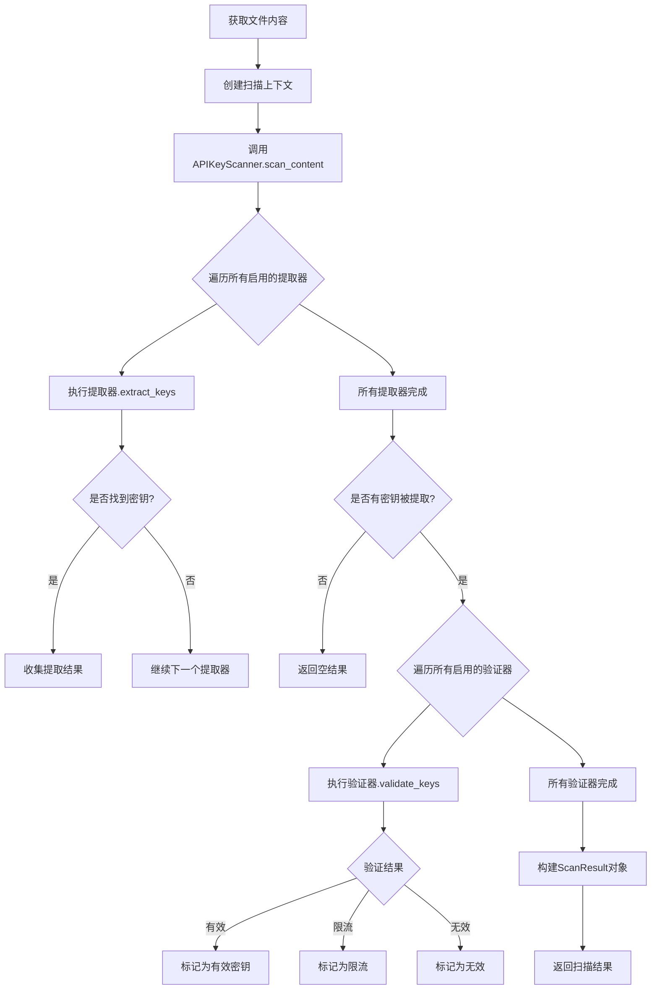
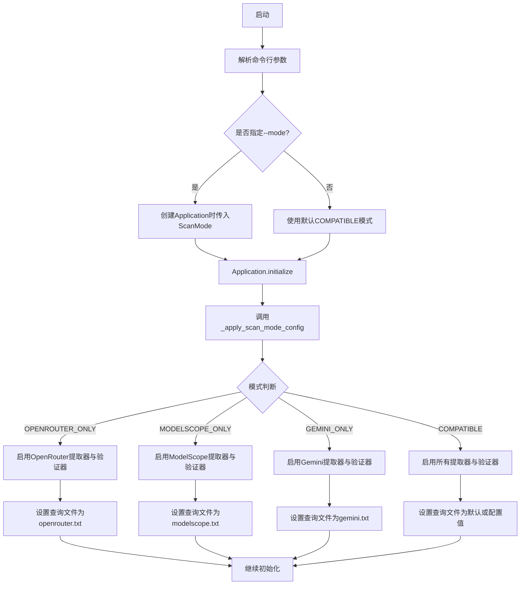
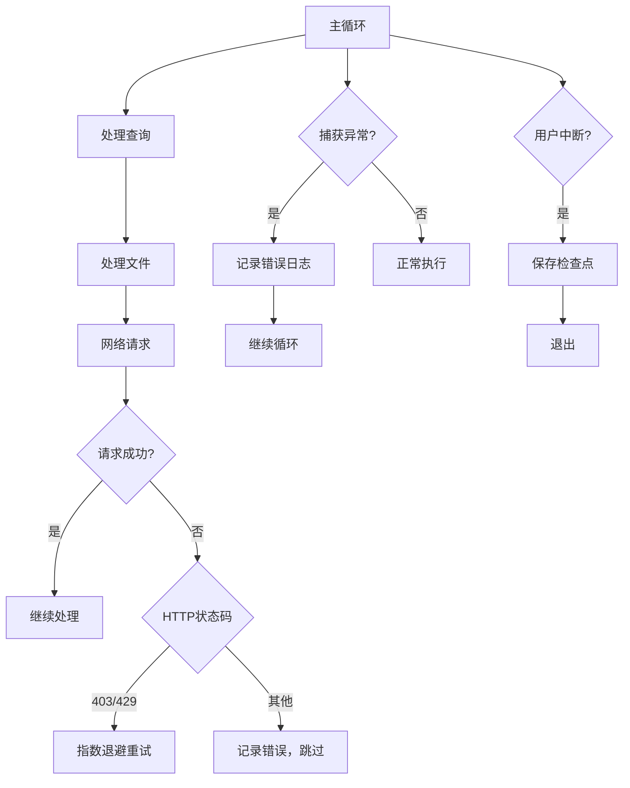
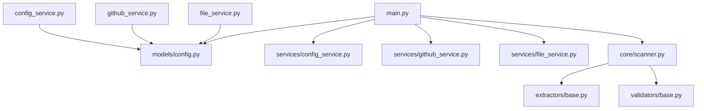

# 主控制器设计

<cite>
**本文档中引用的文件**  
- [main.py](file://src\main.py) - *重构为主应用类设计，替代旧版hajimi_king.py*
- [config.py](file://src\models\config.py) - *更新为数据类配置模型*
- [config_service.py](file://src\services\config_service.py) - *重构配置加载服务*
- [github_service.py](file://src\services\github_service.py) - *更新为服务类实现*
- [scanner.py](file://src\core\scanner.py) - *新增核心扫描器模块*
</cite>

## 更新摘要
**变更内容**  
- 主控制器重构为 `Application` 类，采用模块化初始化与扫描循环
- 新增 `ScanMode` 枚举支持多种运行模式（兼容、仅OpenRouter、仅ModelScope、仅Gemini）
- 配置系统重构为基于数据类的 `AppConfig` 模型，提升类型安全
- 服务层拆分为 `ConfigService`、`GitHubService`、`FileService` 等独立服务类
- 移除已废弃的 `hajimi_king.py`，主入口迁移至 `src/main.py`
- 更新数据处理流程以反映新的提取器与验证器管理机制
- 修正运行模式控制逻辑以匹配新配置结构

### 目录
1. [项目结构](#项目结构)  
2. [核心组件](#核心组件)  
3. [主控制器架构概述](#主控制器架构概述)  
4. [详细组件分析](#详细组件分析)  
5. [数据处理流程](#数据处理流程)  
6. [运行模式与控制分支](#运行模式与控制分支)  
7. [错误处理与日志策略](#错误处理与日志策略)  
8. [依赖关系分析](#依赖关系分析)

## 项目结构

本项目采用模块化分层架构，核心功能由 `src/core`、`src/services`、`src/models`、`src/extractors`、`src/validators` 五大模块支撑，结构清晰，职责分明。主入口已迁移至 `src/main.py`。

**图示来源**  
- [main.py](file://src\main.py)
- [config.py](file://src\models\config.py)
- [config_service.py](file://src\services\config_service.py)
- [github_service.py](file://src\services\github_service.py)
- [file_service.py](file://src\services\file_service.py)

## 核心组件

项目由五大核心模块构成，协同完成密钥搜索、提取、验证与同步的全流程。

- **主控制器** (`main.py`)：系统入口，基于 `Application` 类驱动整个流程。
- **配置模型** (`config.py`)：定义 `AppConfig` 等数据类，集中管理运行时配置。
- **配置服务** (`config_service.py`)：负责加载 `default.yaml` 与环境变量，构建配置对象。
- **GitHub服务** (`github_service.py`)：封装GitHub API调用，支持多令牌轮换与代理。
- **文件服务** (`file_service.py`)：管理查询、检查点与扫描结果的持久化。
- **核心扫描器** (`scanner.py`)：协调提取器与验证器，执行内容扫描。

**本节来源**  
- [main.py](file://src\main.py)
- [config.py](file://src\models\config.py)
- [config_service.py](file://src\services\config_service.py)
- [github_service.py](file://src\services\github_service.py)
- [file_service.py](file://src\services\file_service.py)
- [scanner.py](file://src\core\scanner.py)

## 主控制器架构概述

`main.py` 中的 `Application` 类作为系统核心，实现了从命令行解析到任务循环的完整控制流，采用面向对象设计提升可维护性。

**图示来源**  
- [main.py](file://src\main.py#L150-L450)
- [config_service.py](file://src\services\config_service.py)
- [github_service.py](file://src\services\github_service.py)

## 详细组件分析

### 主控制器 (`main.py`) 分析

主控制器通过 `Application` 类和 `main()` 函数驱动整个系统，其核心逻辑包括配置初始化、扫描模式应用与主循环调度。

#### 主函数执行流程

**图示来源**  
- [main.py](file://src\main.py#L150-L450)

**本节来源**  
- [main.py](file://src\main.py#L150-L450)

### 配置管理模块分析

`config.py` 模块通过 `AppConfig` 数据类集中管理所有配置项，支持嵌套配置结构与类型安全，取代旧版字典式配置。

**图示来源**  
- [config.py](file://src\models\config.py#L1-L112)

**本节来源**  
- [config.py](file://src\models\config.py#L1-L112)

## 数据处理流程

系统采用“搜索-提取-验证-同步”的流水线模式处理数据，通过 `APIKeyScanner` 统一调度提取器与验证器。

### 密钥提取与验证流程

**图示来源**  
- [main.py](file://src\main.py#L300-L350)
- [scanner.py](file://src\core\scanner.py)
- [config.py](file://src\models\config.py)

**本节来源**  
- [main.py](file://src\main.py#L300-L350)

## 运行模式与控制分支

系统支持多种运行模式，通过 `--mode` 命令行参数或环境变量灵活控制行为，由 `Application._apply_scan_mode_config` 方法实现。

### 运行模式控制逻辑

**图示来源**  
- [main.py](file://src\main.py#L100-L145)
- [config_service.py](file://src\services\config_service.py)
- [config.py](file://src\models\config.py)

**本节来源**  
- [main.py](file://src\main.py#L100-L145)

## 错误处理与日志策略

系统具备完善的错误处理机制与日志记录策略，确保运行稳定可追踪。

### 异常处理流程

**图示来源**  
- [main.py](file://src\main.py#L400-L450)
- [github_service.py](file://src\services\github_service.py)

**本节来源**  
- [main.py](file://src\main.py#L400-L450)

## 依赖关系分析

系统各模块间依赖清晰，耦合度低，便于维护与扩展。

**图示来源**  
- [main.py](file://src\main.py)
- [config_service.py](file://src\services\config_service.py)
- [github_service.py](file://src\services\github_service.py)
- [file_service.py](file://src\services\file_service.py)
- [scanner.py](file://src\core\scanner.py)

**本节来源**  
- [main.py](file://src\main.py)
- [config_service.py](file://src\services\config_service.py)
- [github_service.py](file://src\services\github_service.py)
- [file_service.py](file://src\services\file_service.py)
- [scanner.py](file://src\core\scanner.py)