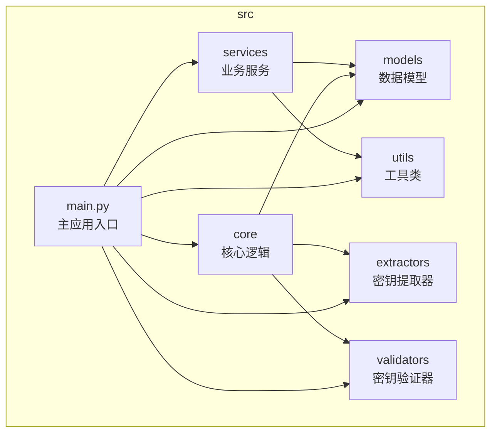
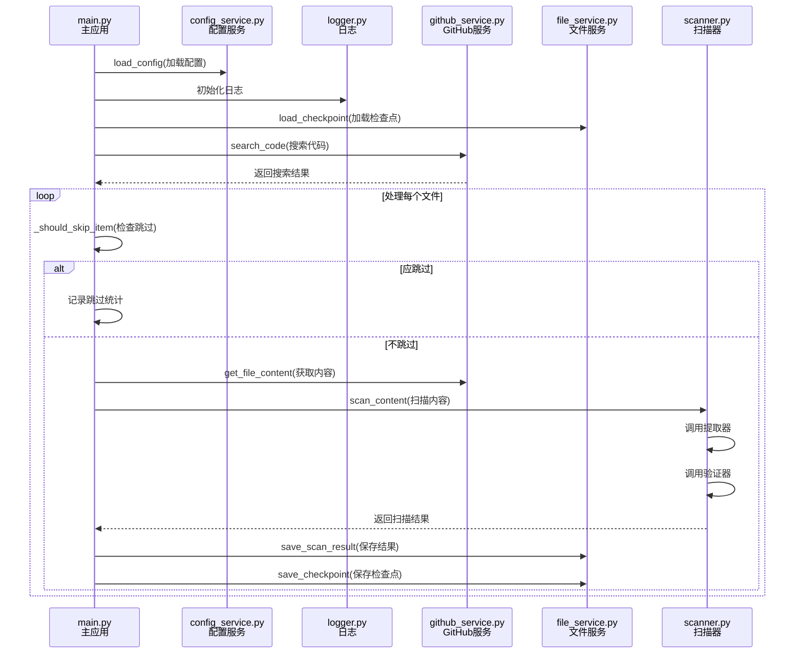
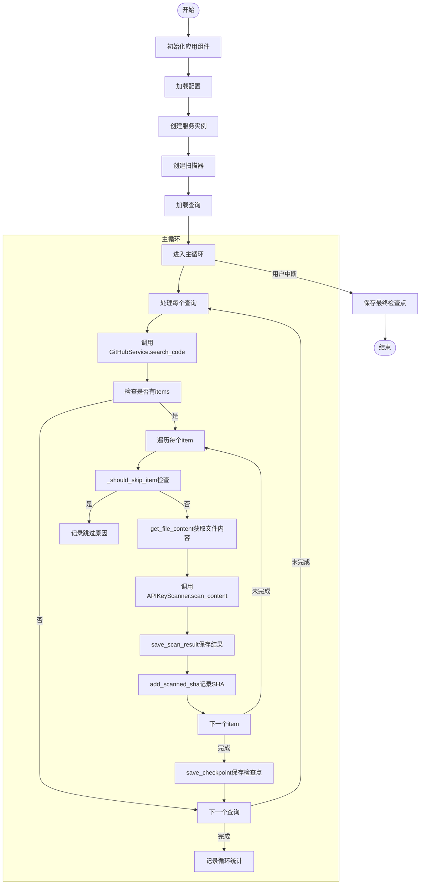
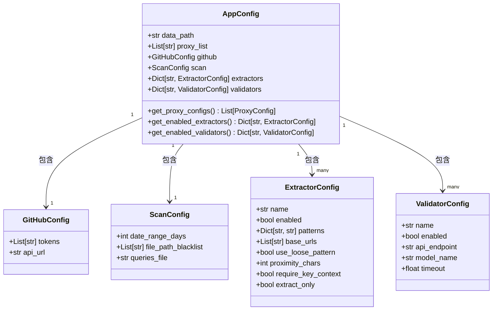
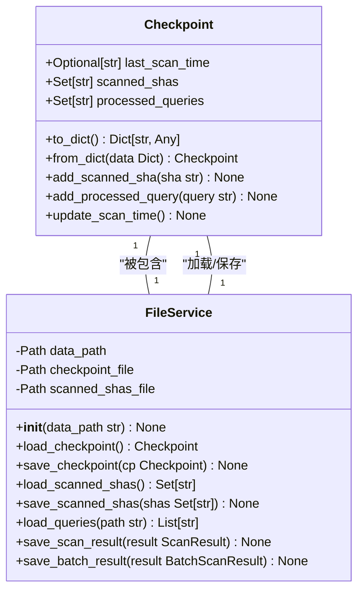
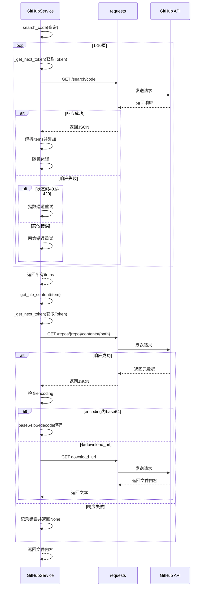
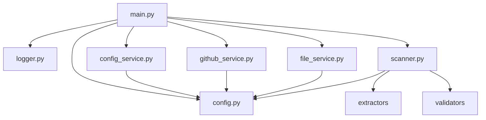

# 代码架构与模块设计

<cite>
**本文档中引用的文件**   
- [main.py](file://src\main.py) - *重构后的新主入口文件*
- [config.py](file://src\models\config.py) - *配置模型重构*
- [logger.py](file://src\utils\logger.py) - *日志系统升级*
- [config_service.py](file://src\services\config_service.py) - *配置服务实现*
- [github_service.py](file://src\services\github_service.py) - *GitHub服务封装*
- [file_service.py](file://src\services\file_service.py) - *文件服务实现*
- [scanner.py](file://src\core\scanner.py) - *核心扫描器*
</cite>

## 更新摘要
**变更内容**   
- 项目架构重构，核心代码迁移至src目录，采用模块化设计
- 主入口文件从app/hajimi_king.py迁移至src/main.py
- 配置系统重构，使用dataclass实现类型安全的配置模型
- 新增services层，分离配置、GitHub、文件操作等服务
- 核心扫描逻辑迁移至core/scanner.py
- 日志系统升级，支持双语输出和增强功能
- 移除旧的同步功能相关组件
- 新增对OpenRouter API密钥提取功能的支持，通过命令行参数`--mode openrouter-only`启用

## 目录
1. [项目结构](#项目结构)
2. [核心组件](#核心组件)
3. [架构概述](#架构概述)
4. [详细组件分析](#详细组件分析)
5. [依赖关系分析](#依赖关系分析)
6. [性能考量](#性能考量)
7. [故障排除指南](#故障排除指南)
8. [结论](#结论)

## 项目结构

项目采用清晰的分层模块化设计，各目录职责分明，便于维护和扩展。

**图示来源**
- [main.py](file://src\main.py)
- [config.py](file://src\models\config.py)
- [logger.py](file://src\utils\logger.py)
- [config_service.py](file://src\services\config_service.py)
- [github_service.py](file://src\services\github_service.py)
- [file_service.py](file://src\services\file_service.py)

**本节来源**
- [main.py](file://src\main.py)
- [config.py](file://src\models\config.py)

## 核心组件

本项目由多个核心组件构成，共同实现API密钥扫描功能。

- **main.py**：主应用入口，协调所有模块，实现核心业务逻辑。
- **config.py**：配置模型，使用dataclass定义类型安全的配置结构。
- **logger.py**：统一日志接口，支持双语输出，贯穿所有模块。
- **config_service.py**：配置服务，负责加载和管理应用配置。
- **github_service.py**：GitHub服务，封装GitHub API调用。
- **file_service.py**：文件服务，管理扫描状态、检查点和文件I/O。
- **scanner.py**：核心扫描器，协调提取器和验证器处理内容。

**本节来源**
- [main.py](file://src\main.py#L1-L451)
- [config.py](file://src\models\config.py#L1-L111)
- [logger.py](file://src\utils\logger.py#L1-L259)

## 架构概述

系统采用分层架构，`main.py`作为主控制器，通过`config_service`加载配置，`github_service`进行搜索，`file_service`管理状态。

**图示来源**
- [main.py](file://src\main.py#L1-L451)
- [config_service.py](file://src\services\config_service.py#L1-L215)
- [logger.py](file://src\utils\logger.py#L1-L259)
- [github_service.py](file://src\services\github_service.py#L1-L255)
- [file_service.py](file://src\services\file_service.py#L1-L216)
- [scanner.py](file://src\core\scanner.py)

## 详细组件分析

### 主控制器分析 (main.py)

`main.py`是整个应用的入口和协调中心，负责调度所有其他模块。

#### 核心流程

**图示来源**
- [main.py](file://src\main.py#L1-L451)

**本节来源**
- [main.py](file://src\main.py#L1-L451)

### 配置管理分析 (config.py)

`config.py`使用dataclass实现类型安全的配置模型，集中管理所有配置。

#### 配置类结构

**图示来源**
- [config.py](file://src\models\config.py#L1-L111)

**本节来源**
- [config.py](file://src\models\config.py#L1-L111)

### 文件与状态管理分析 (file_service.py)

`file_service.py`负责持久化存储、检查点管理和文件I/O操作。

#### 核心数据结构

**图示来源**
- [file_service.py](file://src\services\file_service.py#L1-L216)

**本节来源**
- [file_service.py](file://src\services\file_service.py#L1-L216)

### GitHub服务分析 (github_service.py)

`github_service.py`封装了对GitHub API的所有调用，提供高可用的搜索和文件获取功能。

#### API调用流程

**图示来源**
- [github_service.py](file://src\services\github_service.py#L1-L255)

**本节来源**
- [github_service.py](file://src\services\github_service.py#L1-L255)

## 依赖关系分析

系统各模块间依赖关系清晰，耦合度低。

**图示来源**
- [main.py](file://src\main.py)
- [config.py](file://src\models\config.py)
- [logger.py](file://src\utils\logger.py)
- [config_service.py](file://src\services\config_service.py)
- [github_service.py](file://src\services\github_service.py)
- [file_service.py](file://src\services\file_service.py)
- [scanner.py](file://src\core\scanner.py)

**本节来源**
- [main.py](file://src\main.py)
- [config.py](file://src\models\config.py)
- [config_service.py](file://src\services\config_service.py)
- [github_service.py](file://src\services\github_service.py)
- [file_service.py](file://src\services\file_service.py)

## 性能考量

系统在设计上考虑了性能和稳定性：

1. **请求节流**：`github_service.py`在每页请求后随机休眠0.5-1.5秒，避免触发速率限制。
2. **指数退避**：当遇到403/429错误时，使用指数退避策略进行重试。
3. **增量扫描**：通过`checkpoint`机制，支持断点续传，避免重复扫描。
4. **智能过滤**：通过`FILE_PATH_BLACKLIST`过滤文档和示例文件，提高扫描效率。
5. **多Token轮换**：支持多个GitHub Token自动轮换，提高扫描效率和稳定性。

## 故障排除指南

### 常见问题

**GitHub API 调用失败**
- **现象**：日志中出现`HTTP 403`或`HTTP 429`错误。
- **原因**：Token无效或速率限制。
- **解决方案**：检查`GITHUB_TOKENS`配置，确保Token具有`public_repo`权限，并考虑增加Token数量或使用代理。

**无法获取文件内容**
- **现象**：日志中出现`Failed to fetch file content`。
- **原因**：网络问题或GitHub API临时故障。
- **解决方案**：检查网络连接，或配置`PROXY`使用代理。

**OpenRouter密钥未被提取**
- **现象**：已知包含OpenRouter密钥的文件未被识别。
- **原因**：`OPENROUTER_BASE_URLS`配置不正确或`OPENROUTER_EXTRACT_ONLY`模式未启用。
- **解决方案**：检查`OPENROUTER_BASE_URLS`环境变量，确保包含`https://openrouter.ai/api/v1`等目标URL。

**本节来源**
- [main.py](file://src\main.py#L1-L451)
- [github_service.py](file://src\services\github_service.py#L1-L255)

## 结论

本项目采用模块化设计，代码结构清晰，职责分明。`main.py`作为主控制器，通过`config_service.py`获取配置，利用`github_service.py`进行API调用，通过`file_service.py`管理状态和文件。这种设计使得系统易于维护和扩展。日志系统贯穿所有模块，便于调试和监控。整体架构合理，性能和稳定性得到了充分考虑。新增的OpenRouter密钥提取功能通过命令行参数灵活控制，增强了系统的适用性。