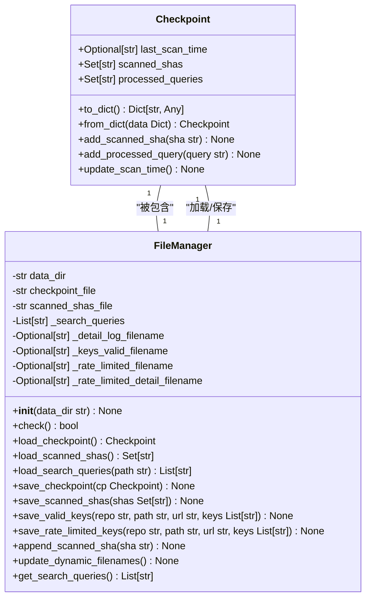

# 代码架构与模块设计

<cite>
**本文档中引用的文件**   
- [hajimi_king.py](file://app/hajimi_king.py)
- [Logger.py](file://common/Logger.py)
- [config.py](file://common/config.py)
- [file_manager.py](file://utils/file_manager.py)
- [github_client.py](file://utils/github_client.py)
</cite>

## 更新摘要
**变更内容**   
- 移除了与同步功能相关的所有组件和配置，包括`sync_utils.py`模块及其在主程序中的依赖
- 更新了架构概述、详细组件分析和依赖关系分析，以反映同步功能的移除
- 删除了“异步同步工具分析”章节，因其对应的功能已被完全移除
- 修正了性能考量和故障排除指南中提及同步功能的部分
- 新增对OpenRouter API密钥提取功能的支持，通过命令行参数`--mode openrouter-only`启用
- 扩展`config.py`以支持OpenRouter相关配置，包括`OPENROUTER_BASE_URLS`、`OPENROUTER_EXTRACT_ONLY`等

## 目录
1. [项目结构](#项目结构)
2. [核心组件](#核心组件)
3. [架构概述](#架构概述)
4. [详细组件分析](#详细组件分析)
5. [依赖关系分析](#依赖关系分析)
6. [性能考量](#性能考量)
7. [故障排除指南](#故障排除指南)
8. [结论](#结论)

## 项目结构

项目采用清晰的分层模块化设计，各目录职责分明，便于维护和扩展。


**图示来源**
- [hajimi_king.py](file://app/hajimi_king.py)
- [Logger.py](file://common/Logger.py)
- [config.py](file://common/config.py)
- [file_manager.py](file://utils/file_manager.py)
- [github_client.py](file://utils/github_client.py)

**本节来源**
- [hajimi_king.py](file://app/hajimi_king.py)
- [config.py](file://common/config.py)

## 核心组件

本项目由多个核心组件构成，共同实现API密钥扫描功能。

- **hajimi_king.py**：主控制器，协调所有模块，实现核心业务逻辑。
- **config.py**：配置管理，使用单例模式提供全局配置访问。
- **Logger.py**：统一日志接口，贯穿所有模块。
- **github_client.py**：封装GitHub API调用，支持多Token轮换和代理。
- **file_manager.py**：管理扫描状态、检查点和文件I/O。

**本节来源**
- [hajimi_king.py](file://app/hajimi_king.py#L1-L595)
- [config.py](file://common/config.py#L1-L187)
- [Logger.py](file://common/Logger.py#L1-L182)

## 架构概述

系统采用主从式架构，`hajimi_king.py`作为主控制器，协调`github_client`进行搜索、`file_manager`管理状态。

```mermaid
sequenceDiagram
participant Main as hajimi_king.py<br/>主控制器
participant Config as config.py<br/>配置
participant Logger as Logger.py<br/>日志
participant GitHub as github_client.py<br/>GitHub客户端
participant FileMgr as file_manager.py<br/>文件管理
Main->>Config : 加载配置
Main->>Logger : 初始化日志
Main->>FileMgr : 初始化并加载检查点
Main->>GitHub : 创建实例
loop 主循环
Main->>GitHub : search_for_keys(查询)
GitHub-->>Main : 返回搜索结果
loop 处理每个文件
Main->>Main : should_skip_item(检查跳过)
alt 应跳过
Main->>Main : 记录跳过统计
else 不跳过
Main->>GitHub : get_file_content(获取内容)
Main->>Main : extract_ms_keys_for_modelscope(提取ModelScope密钥)
alt 找到ms-key
Main->>FileMgr : save_valid_keys(保存密钥)
else 未找到ms-key
Main->>Main : extract_openrouter_keys(提取OpenRouter密钥)
alt 找到OpenRouter key
Main->>FileMgr : save_valid_keys(保存密钥)
else 未找到
Main->>Main : validate_gemini_key(验证Gemini密钥)
Main->>FileMgr : save_valid_keys(保存有效密钥)
Main->>FileMgr : save_rate_limited_keys(保存限流密钥)
end
Main->>FileMgr : add_scanned_sha(记录已扫描SHA)
end
end
Main->>FileMgr : save_checkpoint(保存检查点)
```

**图示来源**
- [hajimi_king.py](file://app/hajimi_king.py#L1-L595)
- [config.py](file://common/config.py#L1-L187)
- [Logger.py](file://common/Logger.py#L1-L182)
- [github_client.py](file://utils/github_client.py#L1-L217)
- [file_manager.py](file://utils/file_manager.py#L1-L431)

## 详细组件分析

### 主控制器分析 (hajimi_king.py)

`hajimi_king.py`是整个应用的入口和协调中心，负责调度所有其他模块。

#### 核心流程


**图示来源**
- [hajimi_king.py](file://app/hajimi_king.py#L1-L595)

**本节来源**
- [hajimi_king.py](file://app/hajimi_king.py#L1-L595)

### 配置管理分析 (config.py)

`config.py`实现了全局配置的单例模式，集中管理所有环境变量。

#### 配置类结构
```mermaid
classDiagram
class Config {
+str GITHUB_TOKENS_STR
+List[str] GITHUB_TOKENS
+str DATA_PATH
+List[str] PROXY_LIST
+str VALID_KEY_PREFIX
+str RATE_LIMITED_KEY_PREFIX
+str VALID_KEY_DETAIL_PREFIX
+str RATE_LIMITED_KEY_DETAIL_PREFIX
+int DATE_RANGE_DAYS
+str QUERIES_FILE
+str SCANNED_SHAS_FILE
+str HAJIMI_CHECK_MODEL
+List[str] FILE_PATH_BLACKLIST
+List[str] TARGET_BASE_URLS
+str MS_USE_LOOSE_PATTERN
+int MS_PROXIMITY_CHARS
+str MS_REQUIRE_KEY_CONTEXT
+str MODELSCOPE_EXTRACT_ONLY
+List[str] OPENROUTER_BASE_URLS
+str OPENROUTER_USE_LOOSE_PATTERN
+int OPENROUTER_PROXIMITY_CHARS
+str OPENROUTER_REQUIRE_KEY_CONTEXT
+str OPENROUTER_EXTRACT_ONLY
+parse_bool(value str) bool
+get_random_proxy() Dict[str, str]
+check() bool
}
class config {
+Config 实例
}
note right of Config
单例模式：通过类方法和全局变量config暴露实例
所有模块通过import config来访问配置
end
```

**图示来源**
- [config.py](file://common/config.py#L1-L187)

**本节来源**
- [config.py](file://common/config.py#L1-L187)

### 文件与状态管理分析 (file_manager.py)

`file_manager.py`负责持久化存储、检查点管理和文件I/O操作。

#### 核心数据结构


**图示来源**
- [file_manager.py](file://utils/file_manager.py#L1-L431)

**本节来源**
- [file_manager.py](file://utils/file_manager.py#L1-L431)

### GitHub客户端分析 (github_client.py)

`github_client.py`封装了对GitHub API的所有调用，提供高可用的搜索和文件获取功能。

#### API调用流程


**图示来源**
- [github_client.py](file://utils/github_client.py#L1-L217)

**本节来源**
- [github_client.py](file://utils/github_client.py#L1-L217)

## 依赖关系分析

系统各模块间依赖关系清晰，耦合度低。


**图示来源**
- [hajimi_king.py](file://app/hajimi_king.py)
- [config.py](file://common/config.py)
- [Logger.py](file://common/Logger.py)
- [github_client.py](file://utils/github_client.py)
- [file_manager.py](file://utils/file_manager.py)

**本节来源**
- [hajimi_king.py](file://app/hajimi_king.py)
- [config.py](file://common/config.py)
- [github_client.py](file://utils/github_client.py)
- [file_manager.py](file://utils/file_manager.py)

## 性能考量

系统在设计上考虑了性能和稳定性：

1. **请求节流**：`github_client.py`在每页请求后随机休眠0.5-1.5秒，避免触发速率限制。
2. **指数退避**：当遇到403/429错误时，使用指数退避策略进行重试。
3. **增量扫描**：通过`checkpoint`机制，支持断点续传，避免重复扫描。
4. **智能过滤**：通过`FILE_PATH_BLACKLIST`过滤文档和示例文件，提高扫描效率。
5. **多Token轮换**：支持多个GitHub Token自动轮换，提高扫描效率和稳定性。

## 故障排除指南

### 常见问题

**GitHub API 调用失败**
- **现象**：日志中出现`HTTP 403`或`HTTP 429`错误。
- **原因**：Token无效或速率限制。
- **解决方案**：检查`GITHUB_TOKENS`配置，确保Token具有`public_repo`权限，并考虑增加Token数量或使用代理。

**无法获取文件内容**
- **现象**：日志中出现`Failed to fetch file content`。
- **原因**：网络问题或GitHub API临时故障。
- **解决方案**：检查网络连接，或配置`PROXY`使用代理。

**OpenRouter密钥未被提取**
- **现象**：已知包含OpenRouter密钥的文件未被识别。
- **原因**：`OPENROUTER_BASE_URLS`配置不正确或`OPENROUTER_EXTRACT_ONLY`模式未启用。
- **解决方案**：检查`OPENROUTER_BASE_URLS`环境变量，确保包含`https://openrouter.ai/api/v1`等目标URL。

**本节来源**
- [hajimi_king.py](file://app/hajimi_king.py#L1-L595)
- [github_client.py](file://utils/github_client.py#L1-L217)

## 结论

本项目采用模块化设计，代码结构清晰，职责分明。`hajimi_king.py`作为主控制器，通过`config.py`获取配置，利用`github_client.py`进行API调用，通过`file_manager.py`管理状态和文件。这种设计使得系统易于维护和扩展。日志系统贯穿所有模块，便于调试和监控。整体架构合理，性能和稳定性得到了充分考虑。新增的OpenRouter密钥提取功能通过命令行参数灵活控制，增强了系统的适用性。