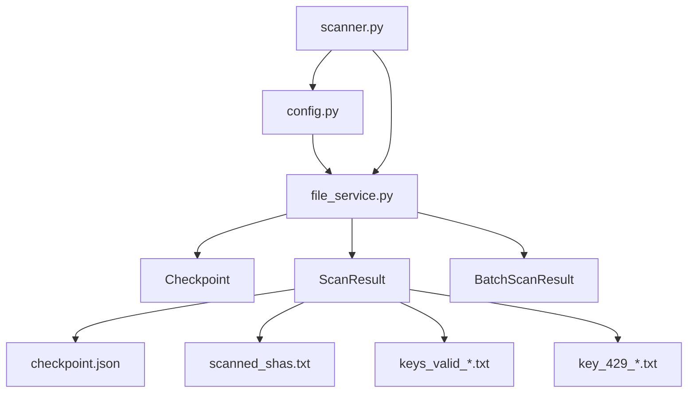
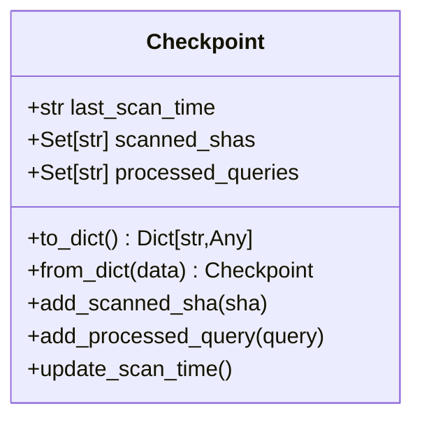
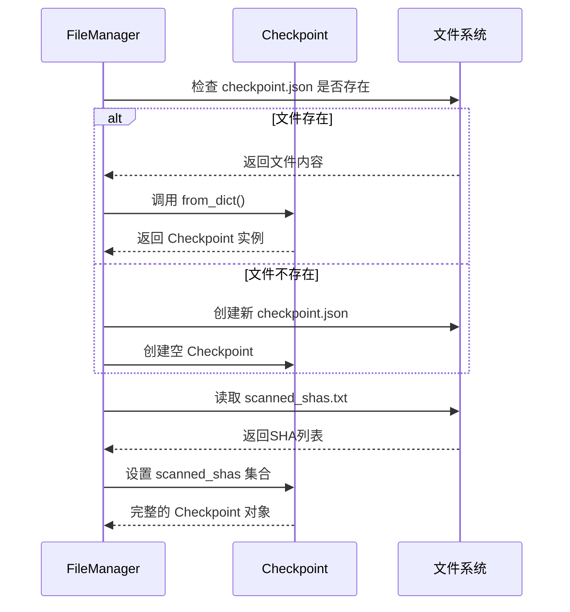

# 文件与状态管理模块

<cite>
**本文档引用的文件**  
- [file_manager.py](file://src\services\file_service.py) - *已重构为文件服务模块*
- [config.py](file://src\models\config.py) - *配置模型更新*
- [scanner.py](file://src\core\scanner.py) - *核心扫描器逻辑*
- [__init__.py](file://src\models\__init__.py) - *新增Checkpoint数据模型*
</cite>

## 更新摘要
**变更内容**  
- 项目结构重构，原 `utils/file_manager.py` 已迁移至 `src/services/file_service.py`
- `Checkpoint` 类从工具模块移至 `src/models/__init__.py`，作为核心数据模型统一管理
- 新增 `ScanResult` 和 `BatchScanResult` 数据类，完善扫描结果的数据结构体系
- 配置管理模块迁移至 `src/models/config.py`，实现模型与配置分离
- 所有状态管理相关功能现由 `file_service` 统一提供服务接口

## 目录
1. [项目结构分析](#项目结构分析)  
2. [核心功能概述](#核心功能概述)  
3. [Checkpoint类设计与序列化机制](#checkpoint类设计与序列化机制)  
4. [文件管理器（FileManager）核心逻辑](#文件管理器filemanager核心逻辑)  
5. [增量扫描与状态更新策略](#增量扫描与状态更新策略)  
6. [文件读写安全与异常处理](#文件读写安全与异常处理)  
7. [实际应用场景分析](#实际应用场景分析)  
8. [总结](#总结)

## 项目结构分析

本项目已完成模块化重构，主要目录结构如下：

- `src/core/`：核心扫描逻辑，包含扫描器实现。
- `src/models/`：数据模型定义，包括检查点、扫描结果等。
- `src/services/`：业务服务层，提供文件操作、配置管理等服务。
- `src/extractors/`：密钥提取器实现。
- `src/validators/`：密钥验证器实现。

其中，`src/models/__init__.py` 定义了 `Checkpoint`、`ScanResult` 和 `BatchScanResult` 等核心数据模型，而文件持久化操作由 `src/services/file_service.py` 统一处理。



**图示来源**  
- [file_service.py](file://src\services\file_service.py)
- [config.py](file://src\models\config.py)

**本节来源**  
- [file_service.py](file://src\services\file_service.py)
- [models/__init__.py](file://src\models\__init__.py)

## 核心功能概述

`src/services/file_service.py` 模块的核心职责是实现**断点续传**和**状态持久化**。通过将扫描状态保存到磁盘文件中，系统在重启后可以恢复上次的扫描进度，避免重复工作。该模块主要依赖于 `src/models/__init__.py` 中定义的数据模型，主要包括：

- `Checkpoint`：定义扫描状态的数据结构。
- `ScanResult`：单个文件扫描结果的数据结构。
- `BatchScanResult`：批量扫描结果的聚合结构。
- `file_service`：提供文件读写、检查点管理等服务接口。

整个流程如下：
1. 启动时从磁盘加载 `checkpoint.json` 和 `scanned_shas.txt`。
2. 执行扫描任务，过程中动态更新内存中的 `Checkpoint` 对象。
3. 定期将状态写回磁盘，确保数据不丢失。
4. 程序退出或异常中断后，下次启动可自动恢复。

**本节来源**  
- [file_service.py](file://src\services\file_service.py)
- [models/__init__.py](file://src\models\__init__.py)

## Checkpoint类设计与序列化机制

`Checkpoint` 类使用 Python 的 `dataclass` 实现，封装了扫描过程中的关键状态信息。

### 数据结构设计

```python
@dataclass
class Checkpoint:
    last_scan_time: Optional[str] = None
    scanned_shas: Set[str] = field(default_factory=set)
    processed_queries: Set[str] = field(default_factory=set)
```

各字段含义如下：

| 字段名 | 类型 | 说明 |
|--------|------|------|
| `last_scan_time` | `str` | 上次扫描完成的时间戳（ISO格式） |
| `scanned_shas` | `Set[str]` | 已扫描过的文件SHA值集合，防止重复处理 |
| `processed_queries` | `Set[str]` | 已处理的搜索查询语句集合 |

### 序列化与反序列化机制

由于 `Set` 类型无法直接被 JSON 序列化，`Checkpoint` 提供了 `to_dict()` 和 `from_dict()` 方法进行转换。

#### 序列化：`to_dict()`

```python
def to_dict(self) -> Dict[str, Any]:
    """转换为字典格式，但不包含scanned_shas（单独存储）"""
    return {
        "last_scan_time": self.last_scan_time,
        "processed_queries": list(self.processed_queries)
    }
```

注意：`scanned_shas` **不包含在 `to_dict()` 输出中**，而是单独保存在 `scanned_shas.txt` 文件中，以提高读写效率和可读性。

#### 反序列化：`from_dict(cls, data)`

```python
@classmethod
def from_dict(cls, data: Dict[str, Any]) -> 'Checkpoint':
    """从字典创建Checkpoint对象，scanned_shas需要单独加载"""
    return cls(
        last_scan_time=data.get("last_scan_time"),
        scanned_shas=set(),  # 将通过FileManager单独加载
        processed_queries=set(data.get("processed_queries", []))
    )
```

`scanned_shas` 在初始化时为空集，后续由 `FileManager.load_scanned_shas()` 方法单独加载。



**图示来源**  
- [models/__init__.py](file://src\models\__init__.py#L10-L44)

**本节来源**  
- [models/__init__.py](file://src\models\__init__.py#L10-L44)

## 文件管理器（FileManager）核心逻辑

`FileManager` 类的功能已由 `file_service` 模块继承并增强，其核心功能包括：

- 初始化数据目录和日志文件
- 加载和保存检查点
- 管理动态文件名（按日期分割）
- 安全地读写各类结果文件

### 初始化流程

```python
def __init__(self, data_dir: str):
    """
    初始化FileManager并完成所有必要的设置
    
    Args:
        data_dir: 数据目录路径
    """
    logger.info("🔧 Initializing FileManager")

    # 1. 基础路径设置
    self.data_dir = data_dir
    self.checkpoint_file = os.path.join(data_dir, "checkpoint.json")
    self.scanned_shas_file = os.path.join(data_dir, Config.SCANNED_SHAS_FILE)

    # 2. 动态文件名
    self._detail_log_filename: Optional[str] = None
    self._keys_valid_filename: Optional[str] = None
    self._rate_limited_filename: Optional[str] = None
    self._rate_limited_detail_filename: Optional[str] = None

    # 3. 创建数据目录
    if not os.path.exists(self.data_dir):
        os.makedirs(self.data_dir, exist_ok=True)
        logger.info(f"Created data directory: {self.data_dir}")
    else:
        logger.info(f"Data directory exists: {self.data_dir}")

    # 4. 加载搜索查询
    try:
        self._search_queries = self.load_search_queries(Config.QUERIES_FILE)
        logger.info(f"✅ Loaded {len(self._search_queries)} search queries")
    except Exception as e:
        logger.error(f"❌ Failed to load search queries: {e}")
        self._search_queries = []

    # 5. 初始化文件名
    start_time = datetime.now()

    self._keys_valid_filename = os.path.join(
        self.data_dir,
        f"{Config.VALID_KEY_PREFIX}{start_time.strftime('%Y%m%d')}.txt"
    )

    self._rate_limited_filename = os.path.join(
        self.data_dir,
        f"{Config.RATE_LIMITED_KEY_PREFIX}{start_time.strftime('%Y%m%d')}.txt"
    )

    self._detail_log_filename = os.path.join(
        self.data_dir,
        f"{ Config.VALID_KEY_DETAIL_PREFIX.rstrip('_')}{start_time.strftime('%Y%m%d')}.log"
    )
    self._rate_limited_detail_filename = os.path.join(
        self.data_dir,
        f"{Config.RATE_LIMITED_KEY_DETAIL_PREFIX}{start_time.strftime('%Y%m%d')}.log"
    )

    # 创建文件（如果不存在），先确保父目录存在
    for filename in [self._detail_log_filename, self._keys_valid_filename, self._rate_limited_filename, self._rate_limited_detail_filename]:
        if not os.path.exists(filename):
            # 确保父目录存在（类似 mkdir -p）
            parent_dir = os.path.dirname(filename)
            if parent_dir:
                os.makedirs(parent_dir, exist_ok=True)

            with open(filename, 'a', encoding='utf-8') as f:
                f.write("")

    logger.info(f"Initialized keys valid filename: {self._keys_valid_filename}")
    logger.info(f"Initialized rate limited filename: {self._rate_limited_filename}")
    logger.info(f"Initialized detail log filename: {self._detail_log_filename}")
    logger.info(f"Initialized rate limited detail filename: {self._rate_limited_detail_filename}")

    logger.info("✅ FileManager initialization complete")
```

初始化过程中会自动创建必要的目录和文件，并根据当前时间生成带日期后缀的日志文件名，例如：

- `keys/keys_valid_20250405.txt`
- `logs/keys_valid_detail_20250405.log`

### 检查点加载与保存

#### 加载流程

```python
def load_checkpoint(self) -> Checkpoint:
    """加载checkpoint数据"""
    checkpoint = Checkpoint()

    if os.path.exists(self.checkpoint_file):
        try:
            with open(self.checkpoint_file, "r", encoding="utf-8") as f:
                data = json.load(f)
                checkpoint = Checkpoint.from_dict(data)
        except Exception as e:
            logger.warning(f"Cannot read {self.checkpoint_file}: {e}. Will create new checkpoint.")
    else:
        logger.warning(f"{self.checkpoint_file} not found. Will create new checkpoint.")
        self.save_checkpoint(checkpoint)

    # 从单独文件加载scanned_shas
    checkpoint.scanned_shas = self.load_scanned_shas()

    return checkpoint
```

#### 保存流程

```python
def save_checkpoint(self, checkpoint: Checkpoint) -> None:
    """保存checkpoint数据"""
    # 1. 保存scanned_shas到单独文件
    self.save_scanned_shas(checkpoint.scanned_shas)
    # 2. 保存其他数据到checkpoint.json
    try:
        with open(self.checkpoint_file, "w", encoding="utf-8") as f:
            json.dump(checkpoint.to_dict(), f, ensure_ascii=False, indent=2)
        checkpoint = self.load_checkpoint()
    except Exception as e:
        logger.error(f"Failed to save {self.checkpoint_file}: {e}")
```

这种**分离存储**的设计提高了性能和可维护性，避免大文件频繁读写。



**图示来源**  
- [file_service.py](file://src\services\file_service.py#L173-L237)

**本节来源**  
- [file_service.py](file://src\services\file_service.py#L50-L237)

## 增量扫描与状态更新策略

系统通过 `Checkpoint` 实现**增量扫描**，避免重复处理已扫描的文件。

### 时间戳管理

每次扫描循环结束时，调用 `checkpoint.update_scan_time()` 更新时间戳：

```python
def update_scan_time(self) -> None:
    self.last_scan_time = datetime.utcnow().isoformat()
```

在 `scanner.py` 中，`should_skip_item()` 函数利用此时间戳判断仓库是否需要跳过：

```python
if repo_pushed_dt <= last_scan_dt:
    return True, "time_filter"
```

### 已处理仓库记录

- `scanned_shas`：记录每个文件的唯一SHA值，防止重复扫描同一文件。
- `processed_queries`：记录已执行的搜索查询，避免重复执行相同查询。

每次处理完一个文件后，立即调用：

```python
checkpoint.add_scanned_sha(item.get("sha"))
```

并在每个查询执行完毕后：

```python
checkpoint.add_processed_query(normalized_q)
```

这些状态最终通过 `file_service.save_checkpoint(checkpoint)` 持久化到磁盘。

**本节来源**  
- [models/__init__.py](file://src\models\__init__.py#L47)
- [scanner.py](file://src\core\scanner.py#L220-L250)

## 文件读写安全与异常处理

为确保数据完整性，`file_service` 实现了多层安全保障。

### 异常处理机制

所有文件操作均包裹在 `try-except` 块中：

```python
try:
    with open(filename, "w") as f:
        json.dump(data, f, ensure_ascii=False, indent=2)
except Exception as e:
    logger.error(f"Failed to save {filename}: {e}")
```

即使写入失败，程序也不会崩溃，而是记录错误并继续运行。

### 数据完整性校验

- **写入前创建目录**：使用 `os.makedirs(parent_dir, exist_ok=True)` 确保父目录存在。
- **追加模式写入**：对于日志文件使用 `'a'` 模式，防止覆盖已有内容。
- **UTF-8编码**：统一使用 `encoding='utf-8'` 避免编码问题。

### 并发访问控制

虽然当前未显式使用锁机制，但通过以下方式降低并发风险：

- **小粒度写入**：频繁调用 `save_checkpoint()`，减少单次写入量。
- **原子性操作**：JSON写入是原子的（覆盖写），避免部分写入问题。
- **日志追加**：日志文件采用追加方式，天然支持并发写入。

此外，`update_dynamic_filenames()` 方法会根据日期自动切换文件名，进一步减少单个文件的写入压力。

**本节来源**  
- [file_service.py](file://src\services\file_service.py#L238-L431)

## 实际应用场景分析

假设系统每天运行一次，其典型工作流程如下：

1. **启动阶段**：
   - 加载 `checkpoint.json` 和 `scanned_shas.txt`
   - 获取上次扫描时间 `last_scan_time`
   - 初始化当日日志文件名

2. **扫描阶段**：
   - 遍历所有搜索查询
   - 对每个搜索结果，检查是否满足跳过条件（时间、SHA、路径等）
   - 提取并验证API密钥
   - 将有效密钥写入 `keys_valid_*.txt` 和日志文件

3. **状态更新**：
   - 每处理20个文件，保存一次检查点
   - 每完成一个查询，更新 `processed_queries` 和 `last_scan_time`

4. **结束阶段**：
   - 保存最终检查点
   - 程序退出

这种方式确保了即使在扫描中途断电或崩溃，重启后也能从最近的检查点恢复，不会丢失已处理的数据。

**本节来源**  
- [scanner.py](file://src\core\scanner.py#L300-L500)
- [file_service.py](file://src\services\file_service.py#L238-L431)

## 总结

`file_service.py` 模块通过精心设计的 `Checkpoint` 类和 `file_service` 类，实现了高效、可靠的状态管理机制。其核心优势包括：

- **断点续传**：利用 `checkpoint.json` 和 `scanned_shas.txt` 实现扫描进度持久化。
- **增量扫描**：基于时间戳和SHA值避免重复工作。
- **动态日志**：按日期分割日志文件，便于归档和分析。
- **安全写入**：完善的异常处理和数据完整性保障。

该设计不仅提升了系统的稳定性，也为后续扩展（如支持多节点协同扫描）奠定了基础。

**本节来源**  
- [file_service.py](file://src\services\file_service.py#L1-L431)
- [scanner.py](file://src\core\scanner.py#L1-L512)