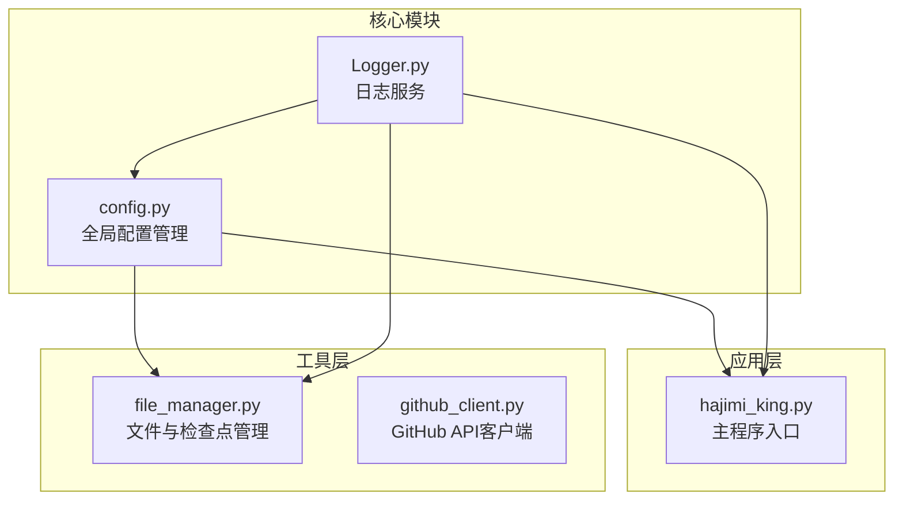
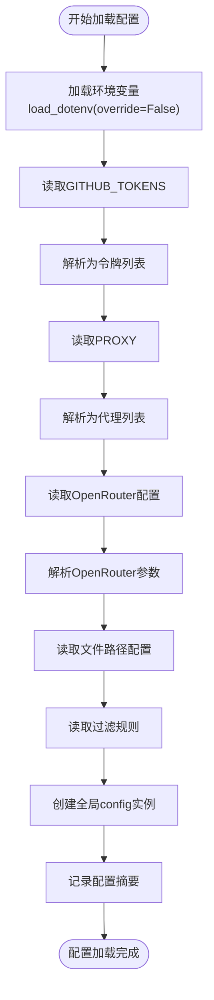
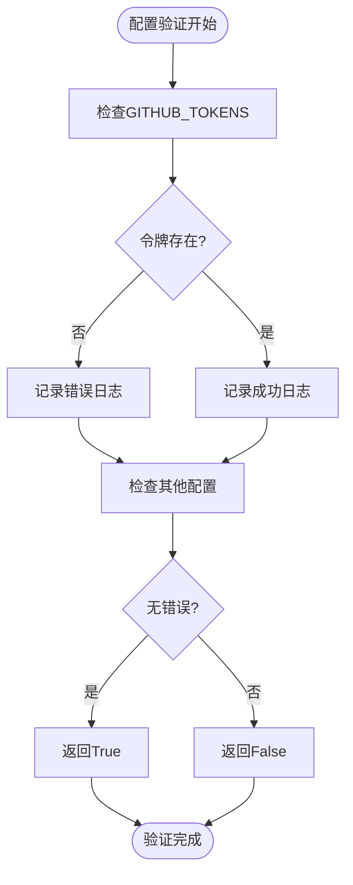
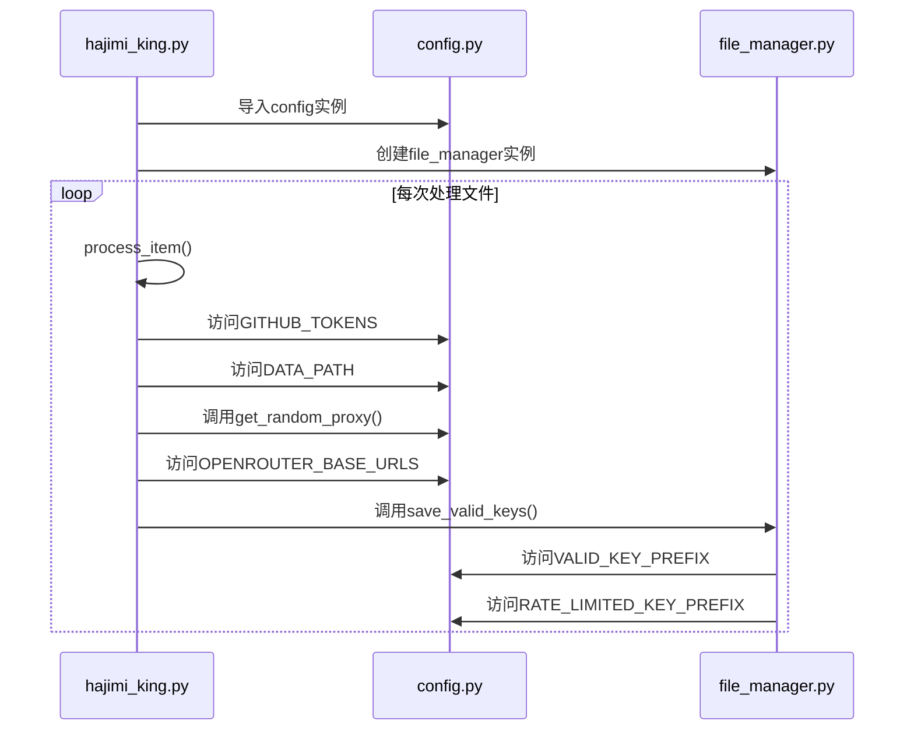
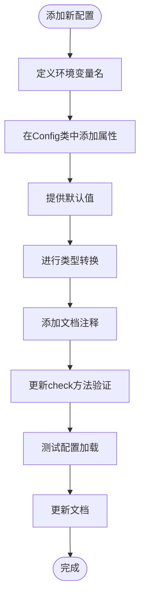

# 配置管理模块

<cite>
**本文档中引用的文件**  
- [config.py](file://common\config.py) - *新增OpenRouter配置支持*
- [hajimi_king.py](file://app\hajimi_king.py) - *支持OpenRouter密钥提取逻辑*
- [.env.template](file://.env.template) - *新增OpenRouter环境变量模板*
</cite>

## 更新摘要
**变更内容**   
- 新增OpenRouter API密钥提取相关配置项
- 在`config.py`中添加`OPENROUTER_BASE_URLS`等5个新配置参数
- 在`hajimi_king.py`中实现OpenRouter密钥提取功能
- 更新`.env.template`文件包含OpenRouter配置示例
- 扩展配置验证日志输出，包含新的OpenRouter配置项

## 目录
1. [项目结构分析](#项目结构分析)  
2. [配置类实现原理](#配置类实现原理)  
3. [单例模式与全局配置](#单例模式与全局配置)  
4. [环境变量加载机制](#环境变量加载机制)  
5. [配置项类型转换与验证](#配置项类型转换与验证)  
6. [实际使用场景与模块共享](#实际使用场景与模块共享)  
7. [线程安全性与一致性保障](#线程安全性与一致性保障)  
8. [自定义配置扩展建议](#自定义配置扩展建议)

## 项目结构分析

本项目采用分层模块化设计，核心功能围绕API密钥扫描与同步展开。主要目录结构如下：



**图示来源**  
- [config.py](file://common\config.py)
- [hajimi_king.py](file://app\hajimi_king.py)
- [file_manager.py](file://utils\file_manager.py)

**本节来源**  
- [config.py](file://common\config.py)
- [hajimi_king.py](file://app\hajimi_king.py)

## 配置类实现原理

`Config` 类是整个系统的核心配置中心，采用类属性与类方法结合的方式实现静态配置管理。

### 类属性初始化流程

```python
class Config:
    GITHUB_TOKENS_STR = os.getenv("GITHUB_TOKENS", "")
    GITHUB_TOKENS = [token.strip() for token in GITHUB_TOKENS_STR.split(',') if token.strip()]
```

配置项在类定义时即通过 `os.getenv()` 从环境变量中读取，并立即进行解析处理。这种设计确保了配置在模块加载时就已完成初始化。

### 配置项分类

| 配置类型 | 示例配置项 | 说明 |
|---------|----------|------|
| 认证信息 | GITHUB_TOKENS | 用于服务认证的敏感信息 |
| 文件路径 | DATA_PATH, QUERIES_FILE | 本地数据存储路径配置 |
| 过滤规则 | FILE_PATH_BLACKLIST, DATE_RANGE_DAYS | 扫描过程中的过滤条件 |
| 前缀配置 | VALID_KEY_PREFIX, RATE_LIMITED_KEY_PREFIX | 输出文件的命名前缀 |
| 模型配置 | HAJIMI_CHECK_MODEL | 使用的AI模型名称 |
| ModelScope提取配置 | TARGET_BASE_URLS, MS_USE_LOOSE_PATTERN | ModelScope密钥提取相关设置 |
| OpenRouter提取配置 | OPENROUTER_BASE_URLS, OPENROUTER_USE_LOOSE_PATTERN | OpenRouter密钥提取相关设置 |

**本节来源**  
- [config.py](file://common\config.py#L12-L100)

## 单例模式与全局配置

### 单例实现机制

```python
# 创建全局配置实例
config = Config()
```

该模块通过在模块级别创建 `Config` 类的实例 `config` 来实现单例模式。这种方式具有以下特点：

- **模块级单例**：Python模块天然具有单例特性，导入同一模块始终返回同一对象
- **延迟初始化**：配置在模块首次导入时完成初始化
- **全局可访问**：任何模块通过 `from common.config import config` 即可访问

### 单例优势分析

1. **内存效率**：整个应用生命周期中仅存在一个配置实例
2. **状态一致性**：所有模块访问的是同一份配置数据
3. **简化依赖**：无需依赖注入容器，直接导入即可使用
4. **初始化控制**：模块加载时自动完成配置解析

```mermaid
classDiagram
class Config {
+str GITHUB_TOKENS_STR
+list GITHUB_TOKENS
+str DATA_PATH
+list PROXY_LIST
+str VALID_KEY_PREFIX
+str RATE_LIMITED_KEY_PREFIX
+int DATE_RANGE_DAYS
+str QUERIES_FILE
+str SCANNED_SHAS_FILE
+str HAJIMI_CHECK_MODEL
+list FILE_PATH_BLACKLIST
+list TARGET_BASE_URLS
+bool MS_USE_LOOSE_PATTERN
+int MS_PROXIMITY_CHARS
+bool MS_REQUIRE_KEY_CONTEXT
+bool MODELSCOPE_EXTRACT_ONLY
+list OPENROUTER_BASE_URLS
+bool OPENROUTER_USE_LOOSE_PATTERN
+int OPENROUTER_PROXIMITY_CHARS
+bool OPENROUTER_REQUIRE_KEY_CONTEXT
+bool OPENROUTER_EXTRACT_ONLY
+parse_bool(value) bool
+get_random_proxy() dict
+check() bool
}
class GlobalInstance {
+Config config
}
note right of GlobalInstance
全局唯一配置实例
通过模块导入共享
end
GlobalInstance --> Config : "实例化"
```

**图示来源**  
- [config.py](file://common\config.py#L12-L204)

**本节来源**  
- [config.py](file://common\config.py#L1-L204)

## 环境变量加载机制

### 环境变量加载流程

```python
# 只在环境变量不存在时才从.env加载值
load_dotenv(override=False)
```

系统使用 `python-dotenv` 库从 `.env` 文件加载环境变量，但设置 `override=False` 确保已存在的环境变量不会被覆盖。

### 关键配置项解析

#### GitHub认证配置
- **GITHUB_TOKENS**：GitHub API访问令牌，支持多个令牌逗号分隔
- **加载方式**：`os.getenv("GITHUB_TOKENS", "")`
- **处理逻辑**：分割、去空格、过滤空值

#### 代理配置
```python
PROXY_LIST_STR = os.getenv("PROXY", "")
PROXY_LIST = []
if PROXY_LIST_STR:
    for proxy_str in PROXY_LIST_STR.split(','):
        proxy_str = proxy_str.strip()
        if proxy_str:
            PROXY_LIST.append(proxy_str)
```
- 支持多种代理协议：http、https、socks5
- 格式：`协议://用户:密码@主机:端口`

#### OpenRouter提取配置
```python
OPENROUTER_BASE_URLS_STR = os.getenv("OPENROUTER_BASE_URLS", "https://openrouter.ai/api/v1")
OPENROUTER_BASE_URLS = [u.strip() for u in OPENROUTER_BASE_URLS_STR.split(',') if u.strip()]
OPENROUTER_USE_LOOSE_PATTERN = os.getenv("OPENROUTER_USE_LOOSE_PATTERN", "false")
OPENROUTER_PROXIMITY_CHARS = int(os.getenv("OPENROUTER_PROXIMITY_CHARS", "0"))
OPENROUTER_REQUIRE_KEY_CONTEXT = os.getenv("OPENROUTER_REQUIRE_KEY_CONTEXT", "false")
OPENROUTER_EXTRACT_ONLY = os.getenv("OPENROUTER_EXTRACT_ONLY", "true")
```
- **OPENROUTER_BASE_URLS**：检测OpenRouter密钥的目标API地址
- **OPENROUTER_USE_LOOSE_PATTERN**：是否使用宽松匹配模式
- **OPENROUTER_PROXIMITY_CHARS**：宽松模式下的字符距离阈值
- **OPENROUTER_REQUIRE_KEY_CONTEXT**：是否要求密钥上下文关键词
- **OPENROUTER_EXTRACT_ONLY**：是否仅提取不验证

#### 文件路径配置
- **DATA_PATH**：数据存储根目录，默认 `/app/data`
- **QUERIES_FILE**：搜索查询文件路径，默认 `queries.txt`
- **SCANNED_SHAS_FILE**：已扫描文件SHA记录文件



**图示来源**  
- [config.py](file://common\config.py#L1-L204)
- [.env.template](file://.env.template#L30-L38)

**本节来源**  
- [config.py](file://common\config.py#L1-L204)
- [.env.template](file://.env.template#L30-L38)

## 配置项类型转换与验证

### 类型转换机制

#### 布尔值解析
```python
@classmethod
def parse_bool(cls, value: str) -> bool:
    if isinstance(value, bool):
        return value
    if isinstance(value, str):
        value = value.strip().lower()
        return value in ('true', '1', 'yes', 'on', 'enabled')
    if isinstance(value, int):
        return bool(value)
    return False
```
支持多种布尔值表示形式：`true/1/yes/on/enabled`

#### 整数转换
```python
DATE_RANGE_DAYS = int(os.getenv("DATE_RANGE_DAYS", "730"))
MS_PROXIMITY_CHARS = int(os.getenv("MS_PROXIMITY_CHARS", "0"))
OPENROUTER_PROXIMITY_CHARS = int(os.getenv("OPENROUTER_PROXIMITY_CHARS", "0"))
```
直接使用 `int()` 转换，提供默认值防止转换失败

#### 列表解析
```python
GITHUB_TOKENS = [token.strip() for token in GITHUB_TOKENS_STR.split(',') if token.strip()]
FILE_PATH_BLACKLIST = [token.strip().lower() for token in FILE_PATH_BLACKLIST_STR.split(',') if token.strip()]
TARGET_BASE_URLS = [u.strip() for u in TARGET_BASE_URLS_STR.split(',') if u.strip()]
OPENROUTER_BASE_URLS = [u.strip() for u in OPENROUTER_BASE_URLS_STR.split(',') if u.strip()]
```
采用字符串分割、去空格、过滤空值的标准处理流程

### 配置验证逻辑

#### 验证方法实现
```python
@classmethod
def check(cls) -> bool:
    logger.info("🔍 Checking required configurations...")
    errors = []
    
    # 检查GitHub tokens
    if not cls.GITHUB_TOKENS:
        errors.append("GitHub tokens not found...")
        logger.error("❌ GitHub tokens: Missing")
    else:
        logger.info(f"✅ GitHub tokens: {len(cls.GITHUB_TOKENS)} configured")
    
    # 同步功能配置检查已移除
    logger.info("ℹ️ 同步功能已被移除")
    
    return len(errors) == 0
```

#### 验证流程
1. 启动时自动调用 `Config.check()`
2. 检查关键配置项的完整性
3. 记录验证结果到日志
4. 返回布尔值指示配置是否有效



**图示来源**  
- [config.py](file://common\config.py#L120-L180)

**本节来源**  
- [config.py](file://common\config.py#L120-L180)

## 实际使用场景与模块共享

### 跨模块配置共享

#### 在 `hajimi_king.py` 中的使用
```python
from common.config import Config

# 创建GitHub工具实例
github_utils = GitHubClient.create_instance(Config.GITHUB_TOKENS)

# 在验证密钥时使用代理
proxy_config = Config.get_random_proxy()

# 提取OpenRouter密钥
if Config.OPENROUTER_BASE_URLS:
    openrouter_keys = extract_openrouter_keys(content)
```

#### 在 `file_manager.py` 中的使用
```python
from common.config import Config

class FileManager:
    def __init__(self, data_dir: str):
        self.data_dir = data_dir
        self.checkpoint_file = os.path.join(data_dir, "checkpoint.json")
        self.scanned_shas_file = os.path.join(data_dir, Config.SCANNED_SHAS_FILE)
```

#### 在 `file_manager.py` 中的文件名生成
```python
self._keys_valid_filename = os.path.join(
    self.data_dir,
    f"{Config.VALID_KEY_PREFIX}{start_time.strftime('%Y%m%d')}.txt"
)
```

### 配置使用模式



**图示来源**  
- [hajimi_king.py](file://app\hajimi_king.py#L1-L524)
- [file_manager.py](file://utils\file_manager.py#L1-L493)

**本节来源**  
- [hajimi_king.py](file://app\hajimi_king.py#L1-L524)
- [file_manager.py](file://utils\file_manager.py#L1-L493)

## 线程安全性与一致性保障

### 线程安全分析

#### 配置读取安全性
- **只读属性**：大多数配置项在初始化后不再修改
- **不可变数据**：字符串、元组等不可变类型天然线程安全
- **列表处理**：`GITHUB_TOKENS`、`PROXY_LIST` 等列表在初始化后不修改

#### 特殊方法线程安全
```python
@classmethod
def get_random_proxy(cls) -> Optional[Dict[str, str]]:
    if not cls.PROXY_LIST:
        return None
    proxy_url = random.choice(cls.PROXY_LIST).strip()
    return {'http': proxy_url, 'https': proxy_url}
```
- `random.choice()` 是线程安全的操作
- 返回新创建的字典对象，避免共享可变状态

### 一致性保障机制

#### 配置检查机制
```python
# 在main函数中
if not Config.check():
    logger.info("❌ Config check failed. Exiting...")
    sys.exit(1)
```
启动时进行完整性检查，确保配置一致有效

#### 配置日志记录
```python
logger.info(f"*" * 30 + " CONFIG START " + "*" * 30)
logger.info(f"GITHUB_TOKENS: {len(Config.GITHUB_TOKENS)} tokens")
logger.info(f"DATA_PATH: {Config.DATA_PATH}")
# ... 记录所有配置项
logger.info(f"OPENROUTER_BASE_URLS: {len(Config.OPENROUTER_BASE_URLS)} configured")
logger.info(f"OPENROUTER_USE_LOOSE_PATTERN: {Config.parse_bool(Config.OPENROUTER_USE_LOOSE_PATTERN)}")
logger.info(f"OPENROUTER_PROXIMITY_CHARS: {Config.OPENROUTER_PROXIMITY_CHARS}")
logger.info(f"OPENROUTER_REQUIRE_KEY_CONTEXT: {Config.parse_bool(Config.OPENROUTER_REQUIRE_KEY_CONTEXT)}")
logger.info(f"OPENROUTER_EXTRACT_ONLY: {Config.parse_bool(Config.OPENROUTER_EXTRACT_ONLY)}")
logger.info(f"*" * 30 + " CONFIG END " + "*" * 30)
```
启动时输出完整配置摘要，便于调试和验证

#### 命令行参数覆盖
```python
# 在main函数中
args = _parse_cli_args()
if getattr(args, "mode", None):
    if args.mode == "openrouter-only":
        Config.OPENROUTER_EXTRACT_ONLY = "true"
        Config.MODELSCOPE_EXTRACT_ONLY = "false"
        Config.TARGET_BASE_URLS = []
```
支持运行时动态修改配置，但通过字符串赋值保持类型一致性

**本节来源**  
- [config.py](file://common\config.py#L1-L204)
- [hajimi_king.py](file://app\hajimi_king.py#L1-L524)

## 自定义配置扩展建议

### 安全扩展原则

1. **遵循命名规范**：使用大写字母和下划线，如 `NEW_FEATURE_ENABLED`
2. **提供默认值**：`os.getenv("KEY", "default_value")`
3. **类型明确**：根据需要进行类型转换（str、int、bool、list）
4. **文档化**：在代码中添加注释说明配置项用途

### 扩展示例

#### 添加新的环境变量
```python
# 在config.py中添加
NEW_FEATURE_ENABLED = os.getenv("NEW_FEATURE_ENABLED", "false")
NEW_FEATURE_THRESHOLD = int(os.getenv("NEW_FEATURE_THRESHOLD", "100"))
NEW_FEATURE_ENDPOINTS_STR = os.getenv("NEW_FEATURE_ENDPOINTS", "")
NEW_FEATURE_ENDPOINTS = [e.strip() for e in NEW_FEATURE_ENDPOINTS_STR.split(',') if e.strip()]
```

#### 添加类型转换方法
```python
@classmethod
def parse_list(cls, value: str, separator: str = ',') -> list:
    """解析列表配置项"""
    if not value:
        return []
    return [item.strip() for item in value.split(separator) if item.strip()]
```

#### 添加验证逻辑
```python
@classmethod
def extended_check(cls) -> bool:
    base_check = cls.check()
    if not base_check:
        return False
        
    # 添加自定义验证
    if cls.NEW_FEATURE_ENABLED and not cls.NEW_FEATURE_ENDPOINTS:
        logger.warning("⚠️ New feature enabled but no endpoints configured")
        
    return True
```

### 最佳实践建议

1. **集中管理**：所有配置项集中在 `config.py` 文件中
2. **避免硬编码**：将常量提取为配置项
3. **合理分组**：按功能模块组织配置项
4. **安全处理**：敏感信息不记录明文，使用掩码显示
5. **向后兼容**：新增配置项提供合理的默认值



**图示来源**  
- [config.py](file://common\config.py#L1-L204)

**本节来源**  
- [config.py](file://common\config.py#L1-L204)