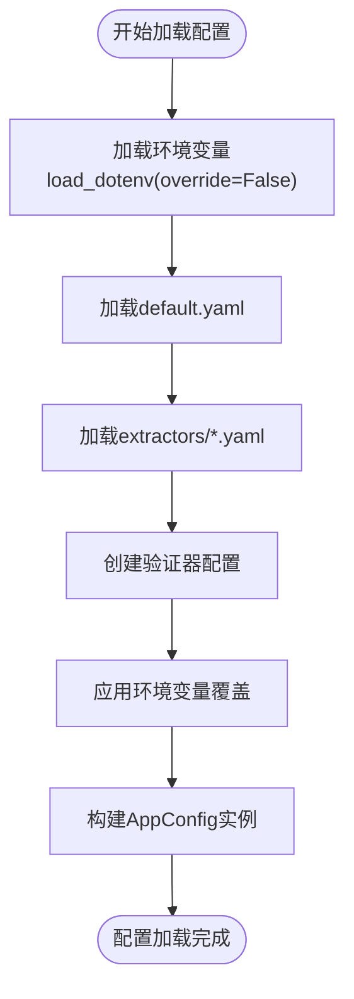

# 配置管理模块

<cite>
**本文档中引用的文件**  
- [config.py](file://src\models\config.py) - *重构为数据类配置模型*
- [config_service.py](file://src\services\config_service.py) - *新增配置服务实现多源加载*
- [main.py](file://src\main.py) - *集成新配置系统*
- [default.yaml](file://config\default.yaml) - *默认配置文件*
- [modelscope.yaml](file://config\extractors\modelscope.yaml) - *ModelScope提取器配置*
- [openrouter.yaml](file://config\extractors\openrouter.yaml) - *OpenRouter提取器配置*
</cite>

## 更新摘要
**变更内容**   
- 重构配置系统，采用`ConfigService`服务实现多源配置加载
- 将配置模型从模块级变量重构为数据类（`AppConfig`）
- 支持从YAML文件、环境变量和预设配置多源加载
- 实现提取器和验证器的动态配置管理
- 移除旧版`common/config.py`，配置功能迁移至`src/models/config.py`和`src/services/config_service.py`

## 目录
1. [项目结构分析](#项目结构分析)  
2. [配置类实现原理](#配置类实现原理)  
3. [单例模式与全局配置](#单例模式与全局配置)  
4. [环境变量加载机制](#环境变量加载机制)  
5. [配置项类型转换与验证](#配置项类型转换与验证)  
6. [实际使用场景与模块共享](#实际使用场景与模块共享)  
7. [线程安全性与一致性保障](#线程安全性与一致性保障)  
8. [自定义配置扩展建议](#自定义配置扩展建议)

## 项目结构分析

本项目采用分层模块化设计，核心功能围绕API密钥扫描与同步展开。主要目录结构如下：


**图示来源**  
- [config.py](file://src\models\config.py)
- [config_service.py](file://src\services\config_service.py)
- [main.py](file://src\main.py)

**本节来源**  
- [config.py](file://src\models\config.py)
- [config_service.py](file://src\services\config_service.py)

## 配置类实现原理

`AppConfig` 类是整个系统的核心配置中心，采用数据类（dataclass）实现类型安全的配置管理。

### 数据类初始化流程

```python
@dataclass
class AppConfig:
    data_path: str = "./data"
    proxy_list: List[str] = field(default_factory=list)
    github: GitHubConfig = field(default_factory=GitHubConfig)
    scan: ScanConfig = field(default_factory=ScanConfig)
    extractors: Dict[str, ExtractorConfig] = field(default_factory=dict)
    validators: Dict[str, ValidatorConfig] = field(default_factory=dict)
```

配置项通过嵌套的数据类结构组织，确保类型安全和层次化管理。每个配置类别由专门的数据类表示，如`GitHubConfig`、`ScanConfig`等。

### 配置项分类

| 配置类型 | 示例配置项 | 说明 |
|---------|----------|------|
| 认证信息 | github.tokens | GitHub API访问令牌 |
| 文件路径 | data_path, queries_file | 本地数据存储路径配置 |
| 过滤规则 | scan.file_path_blacklist, scan.date_range_days | 扫描过程中的过滤条件 |
| 提取器配置 | extractors | 各API密钥提取器的独立配置 |
| 验证器配置 | validators | 各API密钥验证器的独立配置 |
| 代理配置 | proxy_list | 代理服务器列表 |

**本节来源**  
- [config.py](file://src\models\config.py#L70-L111)

## 单例模式与全局配置

### 单例实现机制

```python
# 在Application类中创建配置服务实例
self.config_service = ConfigService()
self.config = self.config_service.load_config()
```

系统通过`ConfigService`类实现配置的单例管理。`ConfigService`在首次调用`load_config()`时创建`AppConfig`实例，并缓存该实例供后续使用。

### 单例优势分析

1. **延迟初始化**：配置在首次使用时才加载，提高启动效率
2. **状态一致性**：通过服务实例保证配置的全局一致性
3. **可重载性**：支持`reload_config()`方法实现配置热更新
4. **依赖注入**：通过应用类统一管理配置服务实例


**图示来源**  
- [config.py](file://src\models\config.py#L70-L111)
- [config_service.py](file://src\services\config_service.py#L15-L215)
- [main.py](file://src\main.py#L20-L22)

**本节来源**  
- [config.py](file://src\models\config.py#L70-L111)
- [config_service.py](file://src\services\config_service.py#L15-L215)

## 环境变量加载机制

### 环境变量加载流程

```python
# 在ConfigService初始化时加载环境变量
if os.path.exists(env_file):
    load_dotenv(env_file, override=False)
```

系统使用`python-dotenv`库从`.env`文件加载环境变量，但设置`override=False`确保已存在的环境变量不会被覆盖。

### 关键配置项解析

#### GitHub认证配置
- **GITHUB_TOKENS**：GitHub API访问令牌，支持多个令牌逗号分隔
- **加载方式**：通过`_parse_token_list()`方法解析
- **处理逻辑**：分割、去空格、过滤空值

#### 代理配置
```python
def _parse_proxy_list(self, proxy_str: str) -> list:
    if not proxy_str:
        return []
    return [proxy.strip() for proxy in proxy_str.split(',') if proxy.strip()]
```
- 支持多种代理协议：http、https、socks5
- 格式：`协议://用户:密码@主机:端口`

#### 提取器配置
```python
# 从YAML文件加载提取器配置
extractors = {}
extractor_dir = self.config_dir / "extractors"
for config_file in extractor_dir.glob("*.yaml"):
    with open(config_file, 'r', encoding='utf-8') as f:
        data = yaml.safe_load(f) or {}
    name = config_file.stem
    extractors[name] = ExtractorConfig(
        name=name,
        enabled=data.get('enabled', True),
        patterns=data.get('patterns', {}),
        base_urls=data.get('base_urls', []),
        use_loose_pattern=data.get('use_loose_pattern', False),
        proximity_chars=data.get('proximity_chars', 0),
        require_key_context=data.get('require_key_context', False),
        extract_only=data.get('extract_only', False)
    )
```
- **base_urls**：检测API密钥的目标API地址
- **use_loose_pattern**：是否使用宽松匹配模式
- **proximity_chars**：宽松模式下的字符距离阈值
- **require_key_context**：是否要求密钥上下文关键词
- **extract_only**：是否仅提取不验证

#### 文件路径配置
- **data_path**：数据存储根目录，默认 `./data`
- **queries_file**：搜索查询文件路径，默认 `queries.txt`



**图示来源**  
- [config_service.py](file://src\services\config_service.py#L15-L215)
- [default.yaml](file://config\default.yaml)
- [modelscope.yaml](file://config\extractors\modelscope.yaml)

**本节来源**  
- [config_service.py](file://src\services\config_service.py#L15-L215)

## 配置项类型转换与验证

### 类型转换机制

#### 布尔值解析
```python
def _parse_bool(self, value: str) -> bool:
    if isinstance(value, bool):
        return value
    if isinstance(value, str):
        return value.strip().lower() in ('true', '1', 'yes', 'on', 'enabled')
    return False
```
支持多种布尔值表示形式：`true/1/yes/on/enabled`

#### 整数转换
```python
scan=ScanConfig(
    date_range_days=int(config_data.get('date_range_days', 730)),
    proximity_chars=int(os.getenv('MS_PROXIMITY_CHARS', '0'))
)
```
直接使用 `int()` 转换，提供默认值防止转换失败

#### 列表解析
```python
def _parse_list(self, list_str: str) -> list:
    if not list_str:
        return []
    return [item.strip() for item in list_str.split(',') if item.strip()]
```
采用字符串分割、去空格、过滤空值的标准处理流程

### 配置验证逻辑

#### 验证方法实现
```python
# 在Application初始化时验证配置
def initialize(self) -> bool:
    try:
        self.config = self.config_service.load_config()
        # 配置已通过数据类的__post_init__方法验证
        return True
    except Exception as e:
        logger.error(f"初始化失败 Failed to initialize application: {e}")
        return False
```

#### 数据类验证
```python
def __post_init__(self):
    if self.date_range_days <= 0:
        self.date_range_days = 730
    if not isinstance(self.file_path_blacklist, list):
        self.file_path_blacklist = []
```
通过`__post_init__`方法实现配置项的自动验证和修正


**图示来源**  
- [config.py](file://src\models\config.py#L30-L111)
- [config_service.py](file://src\services\config_service.py#L15-L215)

**本节来源**  
- [config.py](file://src\models\config.py#L30-L111)

## 实际使用场景与模块共享

### 跨模块配置共享

#### 在 `main.py` 中的使用
```python
# 创建应用实例
app = Application(scan_mode)

# 初始化时加载配置
if not app.initialize():
    sys.exit(1)

# 使用配置创建服务
self.github_service = GitHubService(self.config)
self.file_service = FileService(self.config.data_path)
```

#### 在 `scanner.py` 中的使用
```python
# 创建扫描器时传入配置
extractors = self._create_extractors()
validators = self._create_validators()
self.scanner = APIKeyScanner(extractors, validators)
```

#### 在模式切换中的使用
```python
def _apply_scan_mode_config(self) -> None:
    if self.scan_mode == ScanMode.OPENROUTER_ONLY:
        # 启用仅OpenRouter提取器
        for name, extractor_config in self.config.extractors.items():
            extractor_config.enabled = (name == 'openrouter')
```

### 配置使用模式


**图示来源**  
- [main.py](file://src\main.py#L20-L451)
- [config_service.py](file://src\services\config_service.py#L15-L215)
- [scanner.py](file://src\core\scanner.py#L1-L78)

**本节来源**  
- [main.py](file://src\main.py#L20-L451)

## 线程安全性与一致性保障

### 线程安全分析

#### 配置读取安全性
- **不可变性**：`AppConfig`实例在创建后不应被修改
- **线程安全访问**：`ConfigService`的`get_config()`方法保证返回同一实例
- **延迟加载**：`_config`属性在首次访问时初始化，后续直接返回缓存实例

#### 特殊方法线程安全
```python
def get_proxy_configs(self) -> List[ProxyConfig]:
    return [ProxyConfig.from_string(proxy) for proxy in self.proxy_list if proxy.strip()]
```
- 返回新创建的`ProxyConfig`实例列表，避免共享可变状态
- 不修改原始配置数据

### 一致性保障机制

#### 配置检查机制
```python
# 在Application初始化时检查配置
def initialize(self) -> bool:
    try:
        self.config = self.config_service.load_config()
        # 配置有效性由数据类保证
        return True
    except Exception as e:
        logger.error(f"初始化失败 Failed to initialize application: {e}")
        return False
```
启动时进行完整性检查，确保配置一致有效

#### 配置日志记录
```python
def _print_startup_info(self) -> None:
    logger.github_tokens(len(self.config.github.tokens))
    logger.info(f"📅 日期过滤 Date filter: {self.config.scan.date_range_days} 天 days")
    if self.config.get_proxy_configs():
        logger.info(f"🌐 代理配置 Proxies: {len(self.config.get_proxy_configs())} 个已配置 configured")
```
启动时输出关键配置摘要，便于调试和验证

#### 命令行参数覆盖
```python
# 支持配置预设
if args.config_preset:
    preset_file = f"config/presets/{args.config_preset}.env"
    if os.path.exists(preset_file):
        load_dotenv(preset_file, override=True)
```
支持通过预设文件动态修改配置，保持类型一致性

**本节来源**  
- [config.py](file://src\models\config.py#L70-L111)
- [config_service.py](file://src\services\config_service.py#L15-L215)
- [main.py](file://src\main.py#L20-L451)

## 自定义配置扩展建议

### 安全扩展原则

1. **遵循数据类规范**：使用`@dataclass`装饰器定义新配置类
2. **提供默认值**：在字段定义时提供合理的默认值
3. **类型明确**：使用类型注解明确配置项类型
4. **文档化**：添加类文档字符串说明配置用途

### 扩展示例

#### 添加新的提取器配置
```python
# 在extractors目录添加new_extractor.yaml
name: new_extractor
enabled: true
patterns:
  key_pattern: "new_extractor_[a-zA-Z0-9]{32}"
  secret_pattern: "new_secret_[a-zA-Z0-9]{40}"
base_urls:
  - "https://api.newservice.com/v1"
use_loose_pattern: false
proximity_chars: 10
require_key_context: true
extract_only: false
```

#### 添加新的验证器
```python
# 在_config_service.py中扩展_load_validator_configs
def _load_validator_configs(self) -> Dict[str, ValidatorConfig]:
    validators = {}
    # ... existing validators
    # Add new validator
    validators['new_validator'] = ValidatorConfig(
        name='new_validator',
        enabled=self._parse_bool(os.getenv('NEW_VALIDATOR_ENABLED', 'true')),
        api_endpoint='api.newservice.com',
        model_name=os.getenv('NEW_VALIDATOR_MODEL', 'default'),
        timeout=float(os.getenv('NEW_VALIDATOR_TIMEOUT', '30.0'))
    )
    return validators
```

### 最佳实践建议

1. **集中管理**：所有提取器配置集中在`config/extractors/`目录
2. **避免硬编码**：将常量提取为配置项
3. **合理分组**：按功能模块组织配置文件
4. **安全处理**：敏感信息不记录明文，使用掩码显示
5. **向后兼容**：新增配置项提供合理的默认值


**图示来源**  
- [config.py](file://src\models\config.py#L1-L111)
- [config_service.py](file://src\services\config_service.py#L1-L215)

**本节来源**  
- [config.py](file://src\models\config.py#L1-L111)
- [config_service.py](file://src\services\config_service.py#L1-L215)