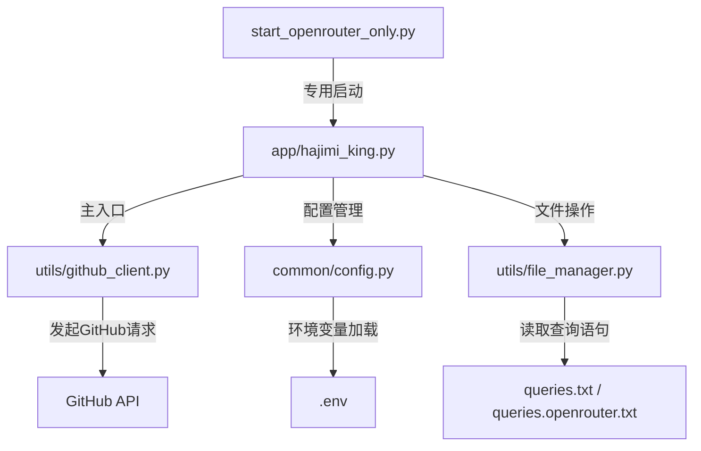
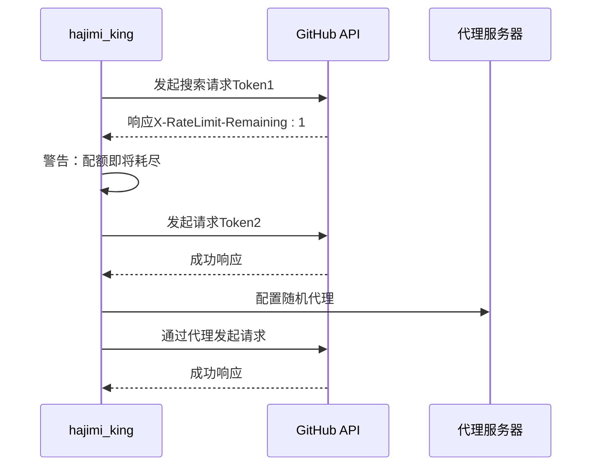

# 修改搜索查询逻辑

<cite>
**本文档引用的文件**  
- [github_client.py](file://utils/github_client.py#L1-L218) - *查询逻辑核心实现*
- [config.py](file://common/config.py#L1-L204) - *配置管理与查询文件路径*
- [hajimi_king.py](file://app/hajimi_king.py#L1-L595) - *主流程与命令行模式控制*
- [queries.openrouter.txt](file://queries.openrouter.txt#L1-L25) - *新增：OpenRouter专用查询配置*
- [start_openrouter_only.py](file://start_openrouter_only.py#L1-L42) - *新增：OpenRouter专用启动脚本*
</cite>

## 更新摘要
**变更内容**  
- 新增对 OpenRouter API 密钥提取的支持
- 引入专用查询文件 `queries.openrouter.txt` 和优化版本
- 增加命令行模式切换功能（`--mode` 参数）
- 更新配置项以支持 OpenRouter 特定提取逻辑
- 移除已废弃的同步功能相关代码与配置

**新增章节**  
- OpenRouter 专用查询配置说明
- 命令行模式切换机制
- OpenRouter 密钥提取逻辑详解

**已移除内容**  
- 所有与外部同步服务（如 Gemini-Balancer）相关的描述
- `KEYS_SEND_PREFIX` 等已废弃的配置项引用

**来源追踪系统更新**  
- 新增 `queries.openrouter.txt` 和 `start_openrouter_only.py` 的引用
- 标注 `config.py` 中新增的 OpenRouter 配置项
- 更新 `hajimi_king.py` 中 CLI 模式解析逻辑的引用

## 目录

1. [项目结构分析](#项目结构分析)  
2. [核心功能与查询机制](#核心功能与查询机制)  
3. [GitHub查询构造逻辑详解](#github查询构造逻辑详解)  
4. [自定义查询参数注入方法](#自定义查询参数注入方法)  
5. [高级过滤条件扩展示例](#高级过滤条件扩展示例)  
6. [与多令牌轮换及速率限制的协同机制](#与多令牌轮换及速率限制的协同机制)  
7. [API配额消耗风险与应对策略](#api配额消耗风险与应对策略)  
8. [OpenRouter 专用查询配置说明](#openrouter-专用查询配置说明)  
9. [命令行模式切换机制](#命令行模式切换机制)  
10. [OpenRouter 密钥提取逻辑详解](#openrouter-密钥提取逻辑详解)

## 项目结构分析

本项目 `APIKEY-king` 是一个用于在 GitHub 上搜索 API 密钥的工具，其主要功能是通过自定义查询语句扫描公开代码库中的敏感信息（如 ModelScope 或 Gemini 的 API Key）。项目采用模块化设计，结构清晰，职责分明。



**Diagram sources**  
- [github_client.py](file://utils/github_client.py#L1-L218)
- [config.py](file://common/config.py#L1-L204)
- [hajimi_king.py](file://app/hajimi_king.py#L1-L595)

**Section sources**  
- [github_client.py](file://utils/github_client.py#L1-L218)
- [config.py](file://common/config.py#L1-L204)

## 核心功能与查询机制

该项目的核心功能包括：
- **GitHub代码搜索**：基于用户定义的查询语句，搜索 GitHub 上的代码文件。
- **密钥提取与验证**：从文件内容中提取疑似密钥，并通过 API 验证其有效性。
- **增量扫描与断点续传**：支持记录已扫描文件的 SHA，避免重复处理。
- **智能过滤**：通过黑名单路径（如 `readme`, `docs`）排除非代码文件。
- **多平台支持**：现已支持 ModelScope、Gemini 和 **OpenRouter** 三种平台的密钥提取。

查询机制由 `github_client.py` 中的 `GitHubClient.search_for_keys()` 方法驱动，该方法封装了对 GitHub 搜索 API 的调用逻辑，支持分页、重试、代理和多令牌轮换。

**Section sources**  
- [hajimi_king.py](file://app/hajimi_king.py#L1-L595)
- [github_client.py](file://utils/github_client.py#L1-L218)

## GitHub查询构造逻辑详解

`GitHubClient.search_for_keys()` 方法负责构造并执行 GitHub 搜索请求。其核心参数如下：

```python
params = {
    "q": query,           # 用户提供的查询字符串
    "per_page": 100,      # 每页返回100条结果
    "page": page          # 当前请求的页码
}
```

查询字符串 `query` 来自配置文件（默认 `queries.txt`，可通过 `QUERIES_FILE` 环境变量指定），每行代表一个独立的搜索表达式。例如：

```
"https://api-inference.modelscope.cn/v1/" in:file
api-inference.modelscope.cn in:file
```

这些查询语句遵循 [GitHub 代码搜索语法](https://docs.github.com/en/search-github/searching-on-github/searching-code)，支持 `in:file`、`filename:`、`path:`、`language:` 等限定符。

该方法还实现了以下关键机制：
- **多令牌轮换**：通过 `_next_token()` 方法循环使用配置的多个 `GITHUB_TOKENS`，避免单个令牌过快耗尽。
- **自动重试**：遇到 403/429 错误时，指数退避重试最多 5 次。
- **速率限制监控**：当 `X-RateLimit-Remaining` 小于 3 时发出警告。
- **结果分页处理**：最多获取前 10 页（共 1000 条）结果。

**Section sources**  
- [github_client.py](file://utils/github_client.py#L27-L156)

## 自定义查询参数注入方法

要安全地调整查询逻辑以适应不同平台或场景，可通过以下方式注入自定义参数：

### 1. 修改查询文件
直接编辑查询文件（如 `queries.txt` 或 `queries.openrouter.txt`），添加针对特定平台的查询语句。例如，搜索阿里云密钥：

```
"access_key_id" in:file language:python
"secret_access_key" in:file filename:config.py
```

### 2. 动态构造查询语句
在 `hajimi_king.py` 中，可通过 `normalize_query()` 函数预处理查询语句，确保格式统一。也可在调用 `search_for_keys()` 前动态拼接参数。

### 3. 配置驱动的查询模板
通过环境变量扩展查询模板。例如，在 `.env` 中添加：

```bash
CUSTOM_QUERY_TEMPLATE="api_key in:file language:{lang} path:{path}"
```

然后在代码中读取并格式化：

```python
query = Config.CUSTOM_QUERY_TEMPLATE.format(lang="python", path="secrets/")
```

这种方式便于集中管理查询策略，无需修改代码。

**Section sources**  
- [queries.openrouter.txt](file://queries.openrouter.txt#L1-L25)
- [hajimi_king.py](file://app/hajimi_king.py#L1-L595)

## 高级过滤条件扩展示例

可通过扩展查询语句添加高级过滤条件，提升搜索精度和效率。

### 示例 1：添加时间范围过滤
限制只搜索最近 30 天内更新的仓库：

```
AIzaSy in:file pushed:>2024-01-01
```

或通过 `DATE_RANGE_DAYS` 配置（默认 730 天）在代码中实现：

```python
# config.py
DATE_RANGE_DAYS = 30  # 仅扫描最近30天的仓库
```

### 示例 2：限定编程语言
只搜索 Python 或 JavaScript 文件中的密钥：

```
AIzaSy in:file language:python
"gemini-api-key" in:file language:javascript
```

### 示例 3：限定仓库星级
搜索 star 数大于 100 的仓库中的密钥（GitHub API 支持）：

```
AIzaSy in:file stars:>100
```

### 示例 4：组合高级条件
综合时间、语言、路径和星级：

```
"api_key" in:file language:python path:/config/ pushed:>2024-01-01 stars:>50
```

这些条件可显著减少无效结果，提高密钥发现效率。

**Section sources**  
- [queries.openrouter.txt](file://queries.openrouter.txt#L1-L25)
- [config.py](file://common/config.py#L1-L204)

## 与多令牌轮换及速率限制的协同机制

项目已内置完善的令牌轮换与速率限制处理机制，确保查询过程稳定高效。

### 多令牌轮换
- **令牌列表**：从 `GITHUB_TOKENS` 环境变量读取多个令牌，以逗号分隔。
- **轮换策略**：`_next_token()` 方法采用循环指针（`_token_ptr`）依次使用每个令牌。
- **优势**：分散请求压力，避免单一令牌因高频访问被限流。

### 速率限制处理
- **自动检测**：检查响应头 `X-RateLimit-Remaining`，剩余请求少于 3 时发出警告。
- **错误处理**：
  - 遇到 403/429 错误时，进行指数退避重试（`2^attempt + random` 秒）。
  - 最多重试 5 次，失败后跳过当前页。
- **随机延迟**：每页请求后随机休眠 0.5~1.5 秒，模拟人类行为，降低被限风险。

### 代理支持
通过 `PROXY` 环境变量配置代理列表，`Config.get_random_proxy()` 随机选择代理发送请求，进一步规避 IP 封禁。



**Diagram sources**  
- [github_client.py](file://utils/github_client.py#L1-L218)
- [config.py](file://common/config.py#L1-L204)

**Section sources**  
- [github_client.py](file://utils/github_client.py#L1-L218)

## API配额消耗风险与应对策略

### 风险分析
- **配额限制**：每个 GitHub 令牌每小时最多 30 次未认证请求或 5000 次认证请求。
- **高频扫描**：项目默认每页休眠 0.5~1.5 秒，但连续多页请求仍可能快速消耗配额。
- **429 错误**：触发速率限制后，需等待重置，影响扫描进度。

### 应对策略
1. **合理配置令牌数量**：使用多个令牌轮换，线性提升总配额。
2. **优化查询语句**：精准的查询可减少无效请求，例如限定 `language:` 和 `path:`。
3. **调整扫描频率**：增加 `time.sleep()` 延迟，降低请求密度。
4. **启用增量扫描**：利用 `scanned_shas.txt` 避免重复扫描，节省配额。
5. **监控配额使用**：关注日志中的 `Rate limit low` 警告，及时调整策略。
6. **使用代理**：结合代理轮换，分散请求来源，降低单个 IP 的请求频率。

通过以上策略，可在保证扫描效率的同时，最大限度地避免 API 配额耗尽或 IP 被封禁的风险。

**Section sources**  
- [github_client.py](file://utils/github_client.py#L1-L218)
- [config.py](file://common/config.py#L1-L204)

## OpenRouter 专用查询配置说明

项目现已支持 OpenRouter API 密钥的专用搜索。为此，新增了 `queries.openrouter.txt` 文件，包含针对 OpenRouter 的优化查询语句。

### 查询文件内容
`queries.openrouter.txt` 包含以下类型的查询：

```txt
# ==== 核心 OpenRouter 搜索 ====
"https://openrouter.ai/api/v1" in:file
openrouter.ai in:file
sk-or-v1- in:file

# ==== 特定文件类型搜索 ====
"openrouter.ai" in:file filename:.env
"sk-or-v1-" in:file filename:config
"sk-or-v1-" in:file filename:.env
"openrouter" in:file language:javascript
"openrouter" in:file language:python
"openrouter" in:file language:typescript

# ==== 上下文相关搜索 ====
"OPENROUTER_API_KEY" in:file
"openrouter_key" in:file
"OpenRouter" in:file
"api.openrouter" in:file

# ==== 变体搜索 ====
"sk-or-v1" in:file
openrouter in:file language:json
```

### 使用方法
可通过设置环境变量 `QUERIES_FILE=queries.openrouter.txt` 来使用此专用查询文件，或通过 `start_openrouter_only.py` 脚本一键启动。

**Section sources**  
- [queries.openrouter.txt](file://queries.openrouter.txt#L1-L25)
- [config.py](file://common/config.py#L1-L204)

## 命令行模式切换机制

项目引入了命令行参数 `--mode`，允许用户在不同提取模式间切换：

### 支持的模式
- **`modelscope-only`**：仅提取 ModelScope 密钥，不回退到 Gemini。
- **`openrouter-only`**：仅提取 OpenRouter 密钥，不回退到其他平台。
- **`compatible`**：兼容模式，优先尝试 ModelScope/OpenRouter，未命中时回退到原有 Gemini 提取逻辑。

### 使用示例
```bash
python app/hajimi_king.py --mode openrouter-only
```

### 实现逻辑
在 `hajimi_king.py` 的 `main()` 函数中，通过 `_parse_cli_args()` 解析参数，并动态修改 `Config` 中的相关配置项（如 `OPENROUTER_EXTRACT_ONLY`），实现模式切换。

**Section sources**  
- [hajimi_king.py](file://app/hajimi_king.py#L426-L590)
- [start_openrouter_only.py](file://start_openrouter_only.py#L13-L42)

## OpenRouter 密钥提取逻辑详解

项目通过 `extract_openrouter_keys()` 函数实现 OpenRouter 密钥的提取，其逻辑如下：

### 提取条件
1. 文件内容必须包含 `OPENROUTER_BASE_URLS` 中的任一 URL（如 `https://openrouter.ai/api/v1`）。
2. 文件中必须存在符合 OpenRouter 密钥格式的字符串。

### 密钥格式
- **严格模式**：`sk-or-v1-[64位十六进制字符串]`
- **宽松模式**：`sk-or-v1-[至少40位十六进制字符]`（由 `OPENROUTER_USE_LOOSE_PATTERN` 控制）

### 高级过滤
- **邻近性检查**：当启用宽松模式时，可通过 `OPENROUTER_PROXIMITY_CHARS` 设置密钥与 base URL 的最大字符距离。
- **上下文检查**：通过 `OPENROUTER_REQUIRE_KEY_CONTEXT` 启用，要求密钥附近出现 `key`、`token` 等关键词。

### 示例代码
```python
def extract_openrouter_keys(content: str) -> List[str]:
    base_urls = Config.OPENROUTER_BASE_URLS
    has_base, base_positions = _contains_base_url(content, base_urls)
    if not has_base:
        return []

    use_loose = Config.parse_bool(Config.OPENROUTER_USE_LOOSE_PATTERN)
    pattern = r'\bsk-or-v1-[0-9a-f]{64}\b' if not use_loose else r'\bsk-or-v1-[0-9a-f]{40,}\b'
    
    # ... 邻近性和上下文检查 ...
    return deduped
```

此逻辑确保了高精度的密钥提取，同时避免了大量误报。

**Section sources**  
- [hajimi_king.py](file://app/hajimi_king.py#L1-L595)
- [config.py](file://common/config.py#L1-L204)