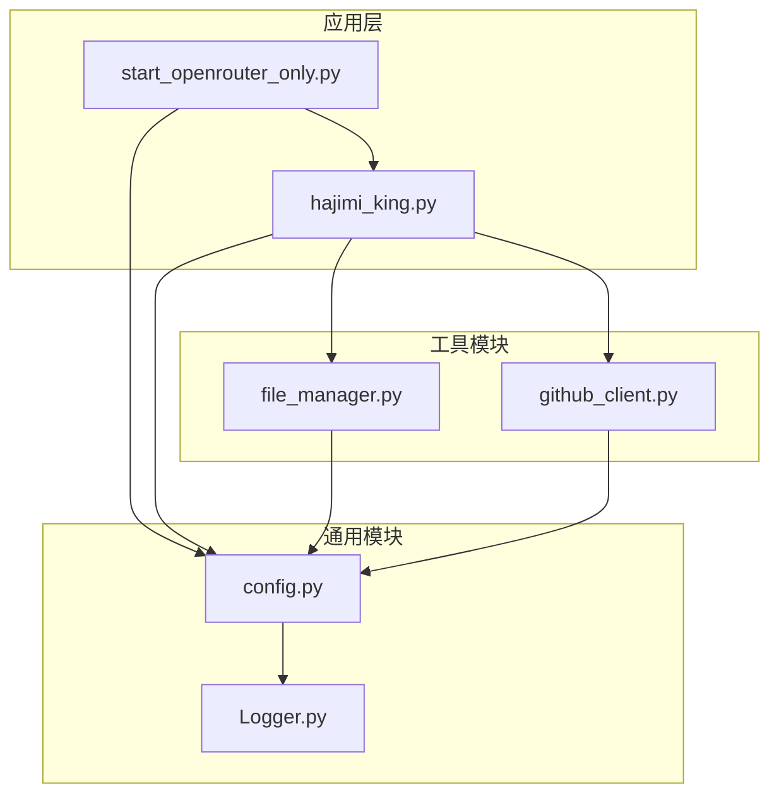
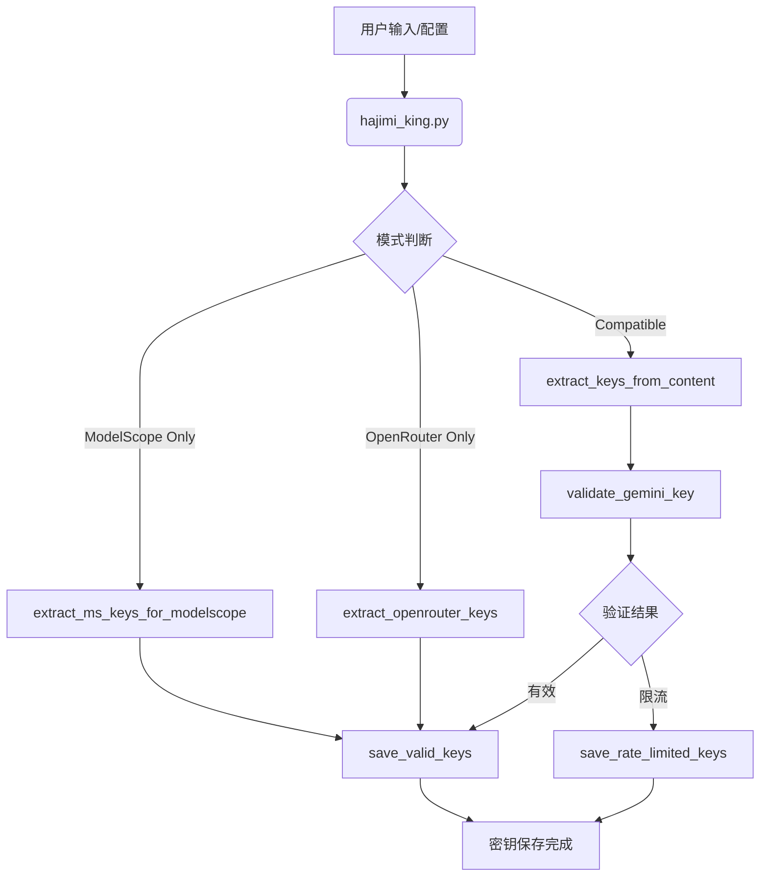
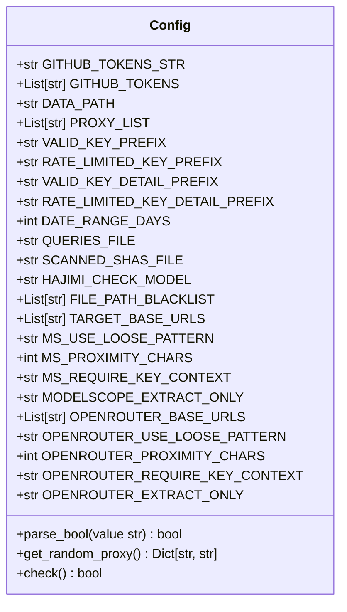
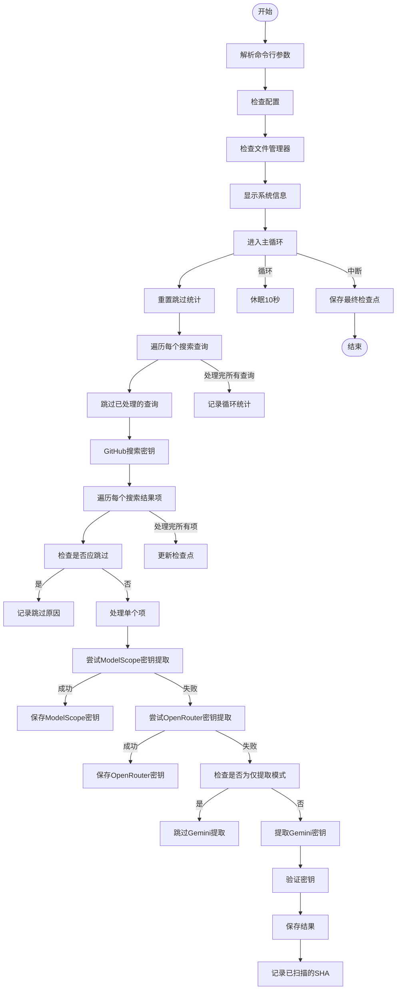
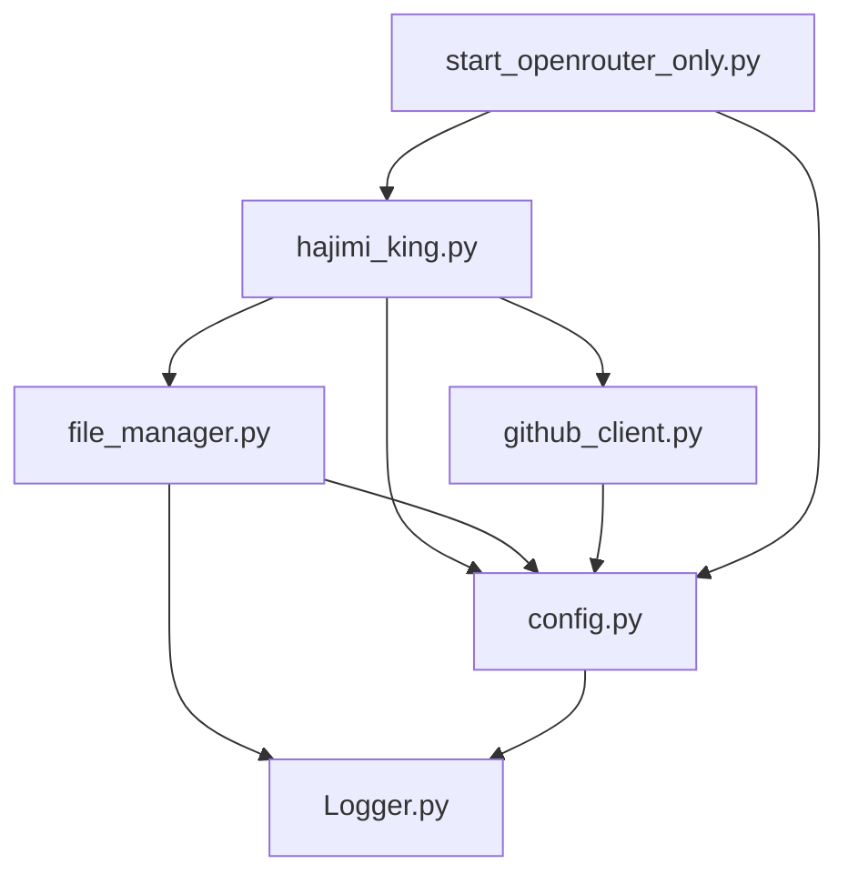

# 功能扩展指南

<cite>
**本文档中引用的文件**  
- [hajimi_king.py](file://app/hajimi_king.py#L1-L596) - *更新：新增OpenRouter密钥提取功能*
- [config.py](file://common/config.py#L1-L188) - *更新：新增OpenRouter相关配置项*
- [file_manager.py](file://utils/file_manager.py#L1-L493)
- [github_client.py](file://utils/github_client.py#L1-L218)
- [start_openrouter_only.py](file://start_openrouter_only.py#L1-L46) - *新增：OpenRouter专用启动脚本*
- [OPENROUTER_USAGE.md](file://OPENROUTER_USAGE.md#L1-L110) - *新增：OpenRouter使用说明文档*
- [queries.openrouter.txt](file://queries.openrouter.txt#L1-L10) - *新增：OpenRouter专用查询文件*
- [queries.openrouter.optimized.txt](file://queries.openrouter.optimized.txt#L1-L8) - *新增：优化版OpenRouter查询文件*
</cite>

## 更新摘要
**已做更改**  
- 在简介、核心组件、架构概览、详细组件分析等章节中添加了对OpenRouter平台支持的说明
- 新增“OpenRouter密钥提取机制分析”章节，详细说明新功能实现
- 更新项目结构图和架构流程图以反映新增组件
- 修订故障排除指南以包含OpenRouter相关问题
- 移除已废弃的sync_utils.py相关引用和说明

## 目录
1. [简介](#简介)
2. [项目结构](#项目结构)
3. [核心组件](#核心组件)
4. [架构概览](#架构概览)
5. [详细组件分析](#详细组件分析)
6. [依赖分析](#依赖分析)
7. [性能考虑](#性能考虑)
8. [故障排除指南](#故障排除指南)
9. [结论](#结论)

## 简介
本指南旨在为开发者提供一个全面的框架，用于安全地扩展“哈基米大王”（Hajimi King）项目功能。该项目是一个用于从GitHub代码库中提取API密钥的工具，支持ModelScope、Gemini和OpenRouter等平台。本文档将详细说明如何通过配置或继承方式添加新功能，如支持新的API密钥提取规则、集成额外的外部同步服务、自定义文件过滤策略或修改搜索查询逻辑，同时确保不破坏现有架构。我们将强调设计原则、安全性与兼容性注意事项，并提供具体的代码示例。

**本节来源**
- [hajimi_king.py](file://app/hajimi_king.py#L1-L596) - *更新：支持多平台密钥提取*
- [start_openrouter_only.py](file://start_openrouter_only.py#L1-L46) - *新增：OpenRouter专用模式*

## 项目结构
项目采用模块化设计，各组件职责分明，便于维护和扩展。主要目录包括`app`（主应用逻辑）、`common`（通用工具和配置）、`scripts`（脚本文件）、`utils`（实用工具函数）以及根目录下的配置和部署文件。新增了OpenRouter专用的查询文件和启动脚本。



**图示来源**
- [hajimi_king.py](file://app/hajimi_king.py#L1-L596) - *更新：主应用逻辑*
- [config.py](file://common/config.py#L1-L188) - *更新：配置管理*
- [file_manager.py](file://utils/file_manager.py#L1-L493)
- [github_client.py](file://utils/github_client.py#L1-L218)
- [start_openrouter_only.py](file://start_openrouter_only.py#L1-L46) - *新增：专用启动器*

**本节来源**
- [hajimi_king.py](file://app/hajimi_king.py#L1-L596)
- [config.py](file://common/config.py#L1-L188)

## 核心组件
项目的核心组件包括配置管理、文件管理、GitHub客户端和主应用逻辑。`config.py`负责加载和解析环境变量，提供全局配置。`file_manager.py`管理所有文件操作，包括日志、密钥存储和检查点。`github_client.py`封装了与GitHub API的交互。`hajimi_king.py`是主控制器，协调所有组件。新增了对OpenRouter平台的专用支持，通过`start_openrouter_only.py`脚本实现专用扫描模式。

**本节来源**
- [hajimi_king.py](file://app/hajimi_king.py#L1-L596) - *更新：支持OpenRouter*
- [config.py](file://common/config.py#L1-L188) - *更新：新增OpenRouter配置*
- [file_manager.py](file://utils/file_manager.py#L1-L493)
- [github_client.py](file://utils/github_client.py#L1-L218)
- [start_openrouter_only.py](file://start_openrouter_only.py#L1-L46) - *新增：专用启动脚本*

## 架构概览
系统采用分层架构，从上至下分为应用层、业务逻辑层和工具层。应用层（`hajimi_king.py`）负责流程控制和调度。业务逻辑层包含密钥提取、验证和过滤等核心功能。工具层提供配置、文件操作、网络请求等基础服务。数据流始于GitHub搜索查询，经过内容获取、密钥提取、验证，最终存储。新增了OpenRouter专用提取路径。



**图示来源**
- [hajimi_king.py](file://app/hajimi_king.py#L1-L596) - *更新：新增OpenRouter分支*
- [config.py](file://common/config.py#L1-L188) - *更新：模式控制*

## 详细组件分析
本节将深入分析关键组件的实现细节，为功能扩展提供具体指导。

### 配置管理分析
`config.py`模块是整个系统的配置中心，通过环境变量进行配置，确保了部署的灵活性和安全性。新增了OpenRouter专用配置项。

#### 配置类结构


**图示来源**
- [config.py](file://common/config.py#L1-L188) - *更新：新增OpenRouter配置属性*

**本节来源**
- [config.py](file://common/config.py#L1-L188)

### 主应用流程分析
`hajimi_king.py`是系统的入口和控制中心，其`main`函数实现了核心的循环扫描逻辑。已更新以支持OpenRouter专用模式。

#### 主应用执行流程


**图示来源**
- [hajimi_king.py](file://app/hajimi_king.py#L1-L596) - *更新：新增OpenRouter提取分支*

**本节来源**
- [hajimi_king.py](file://app/hajimi_king.py#L1-L596)

### OpenRouter密钥提取机制分析
新增的OpenRouter密钥提取功能通过专用配置和提取函数实现，支持在包含OpenRouter API地址的文件中精准识别密钥。

#### OpenRouter密钥提取逻辑
```mermaid
flowchart TD
A[输入文件内容] --> B{包含OPENROUTER_BASE_URLS?}
B --> |否| C[返回空列表]
B --> |是| D[应用正则匹配]
D --> E{使用宽松模式?}
E --> |是| F[模式: sk-or-v1-[至少40位十六进制]]
E --> |否| G[模式: sk-or-v1-[精确64位十六进制]]
F --> H
G --> H[H: 找到所有匹配]
H --> I{启用邻近性检查?}
I --> |是| J[检查密钥与base_url距离]
I --> |否| K[跳过距离检查]
J --> L{在proximity_chars范围内?}
L --> |否| M[过滤该密钥]
L --> |是| N[保留该密钥]
M --> O
N --> O
K --> O[所有匹配密钥]
O --> P{启用上下文检查?}
P --> |是| Q[检查密钥周围是否有key/token等词]
P --> |否| R[跳过上下文检查]
Q --> S{找到上下文词?}
S --> |否| T[过滤该密钥]
S --> |是| U[保留该密钥]
T --> V
U --> V
R --> V[最终密钥列表]
V --> W[去重并返回]
```

**图示来源**
- [hajimi_king.py](file://app/hajimi_king.py#L1-L596) - *新增：extract_openrouter_keys函数*
- [config.py](file://common/config.py#L1-L188) - *新增：OPENROUTER_*配置项*

**本节来源**
- [hajimi_king.py](file://app/hajimi_king.py#L1-L596)
- [config.py](file://common/config.py#L1-L188)

## 依赖分析
项目依赖关系清晰，遵循依赖倒置原则。高层模块（如`hajimi_king.py`）依赖于低层模块（如`config.py`, `file_manager.py`）提供的抽象接口。`github_client.py`依赖于`config.py`来获取配置信息。`file_manager.py`依赖于`config.py`和`Logger.py`。这种设计使得组件可以独立测试和替换。



**图示来源**
- [hajimi_king.py](file://app/hajimi_king.py#L1-L596)
- [config.py](file://common/config.py#L1-L188)
- [file_manager.py](file://utils/file_manager.py#L1-L493)
- [github_client.py](file://utils/github_client.py#L1-L218)
- [start_openrouter_only.py](file://start_openrouter_only.py#L1-L46) - *新增依赖*

**本节来源**
- [hajimi_king.py](file://app/hajimi_king.py#L1-L596)
- [config.py](file://common/config.py#L1-L188)
- [file_manager.py](file://utils/file_manager.py#L1-L493)
- [github_client.py](file://utils/github_client.py#L1-L218)

## 性能考虑
系统在设计时已考虑性能因素。例如，`github_client.py`实现了多令牌轮换和代理支持，以应对API速率限制。`file_manager.py`使用检查点机制实现增量扫描，避免重复工作。密钥验证环节（`validate_gemini_key`）存在同步阻塞，未来可考虑引入异步HTTP客户端（如aiohttp）进行优化。OpenRouter专用模式通过跳过验证步骤显著提升了扫描效率。

## 故障排除指南
本节提供常见问题的解决方案。

**本节来源**
- [hajimi_king.py](file://app/hajimi_king.py#L1-L596)
- [config.py](file://common/config.py#L1-L188)
- [file_manager.py](file://utils/file_manager.py#L1-L493)
- [github_client.py](file://utils/github_client.py#L1-L218)
- [OPENROUTER_USAGE.md](file://OPENROUTER_USAGE.md#L1-L110) - *新增：OpenRouter故障排除*

### 常见问题
1.  **问题：** 程序启动失败，提示“GitHub tokens not found”。
    **解决方案：** 检查`.env`文件中的`GITHUB_TOKENS`环境变量是否已正确配置。

2.  **问题：** GitHub搜索返回403或429错误。
    **解决方案：** 这通常是速率限制所致。确保配置了有效的代理（`PROXY`）和多个GitHub令牌以进行轮换。

3.  **问题：** 未找到预期的OpenRouter密钥。
    **解决方案：** 检查`queries.openrouter.txt`文件中的搜索查询是否准确。确保`OPENROUTER_BASE_URLS`配置正确，并且文件内容确实包含这些URL。

4.  **问题：** OpenRouter专用模式未生效。
    **解决方案：** 确认已正确设置`OPENROUTER_EXTRACT_ONLY=true`且`TARGET_BASE_URLS`为空，或使用`--mode openrouter-only`命令行参数。

5.  **问题：** 未找到预期的密钥。
    **解决方案：** 检查`queries.txt`文件中的搜索查询是否准确。对于ModelScope密钥，确保`TARGET_BASE_URLS`配置正确，并且文件内容确实包含这些URL。

## 结论
通过对“哈基米大王”项目的深入分析，我们明确了其模块化、可配置的架构设计。开发者在扩展功能时，应优先通过修改配置（如添加新的`TARGET_BASE_URLS`或`QUERIES_FILE`条目）来实现，这最安全且不会破坏现有逻辑。对于更复杂的需求，如支持新的平台，应遵循现有模式，通过继承或创建新的工具类来实现，并确保与主应用的松耦合。新增的OpenRouter支持展示了如何通过配置驱动的方式安全地扩展功能。始终关注安全性，避免在代码中硬编码敏感信息，并在修改核心逻辑时进行充分的测试。