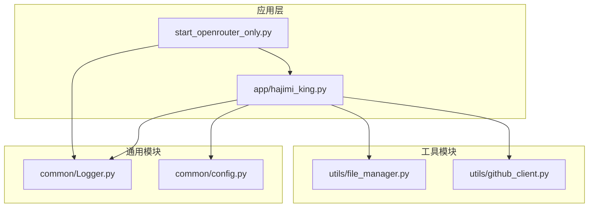
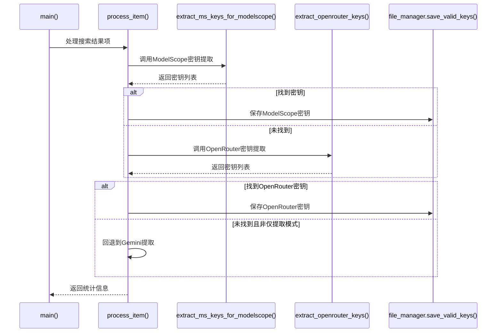
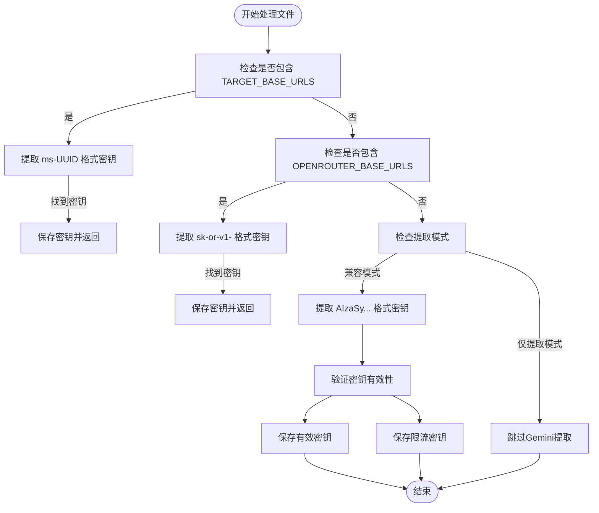
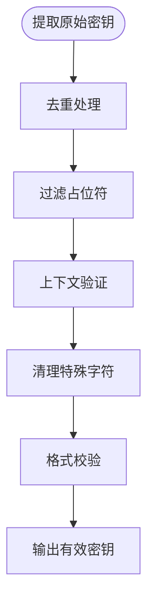

# 添加新的API密钥提取规则

<cite>
**本文档引用的文件**  
- [app/hajimi_king.py](file://app/hajimi_king.py) - *在最近的提交中更新，新增OpenRouter密钥提取功能*
- [common/config.py](file://common/config.py) - *在最近的提交中更新，新增OpenRouter配置项*
- [start_openrouter_only.py](file://start_openrouter_only.py) - *在提交21a2b1b中新增，OpenRouter专用启动脚本*
- [OPENROUTER_USAGE.md](file://OPENROUTER_USAGE.md) - *在提交21a2b1b中新增，OpenRouter使用指南*
- [utils/file_manager.py](file://utils/file_manager.py)
- [utils/github_client.py](file://utils/github_client.py)
</cite>

## 更新摘要
**变更内容**  
- 新增对OpenRouter API密钥提取的支持
- 添加`start_openrouter_only.py`专用启动脚本
- 在`hajimi_king.py`中实现`extract_openrouter_keys`函数
- 在`config.py`中添加OpenRouter相关配置项
- 新增`OPENROUTER_USAGE.md`使用指南
- 更新文档以反映OpenRouter专用模式的架构和用法

## 目录

1. [引言](#引言)  
2. [项目结构分析](#项目结构分析)  
3. [核心组件分析](#核心组件分析)  
4. [API密钥提取机制详解](#api密钥提取机制详解)  
5. [新增API密钥提取规则的方法](#新增api密钥提取规则的方法)  
6. [正则表达式设计原则](#正则表达式设计原则)  
7. [上下文验证与提取后处理](#上下文验证与提取后处理)  
8. [与现有机制的兼容性说明](#与现有机制的兼容性说明)  
9. [代码示例：添加OpenRouter密钥提取](#代码示例添加openrouter密钥提取)  
10. [最佳实践与维护建议](#最佳实践与维护建议)

## 引言

本项目旨在从GitHub代码中自动提取泄露的API密钥，当前已支持ModelScope、Gemini和OpenRouter平台的密钥提取。本文档详细说明如何为项目添加对新型API密钥（如OpenAI、Anthropic等）的提取支持，重点介绍正则表达式匹配模式的设计、上下文验证逻辑、提取后处理流程，并确保与现有架构的一致性。特别说明了OpenRouter密钥提取功能的实现方式。

## 项目结构分析

项目采用模块化设计，主要分为应用层、通用工具层和配置管理层。



**图示来源**  
- [app/hajimi_king.py](file://app/hajimi_king.py)
- [start_openrouter_only.py](file://start_openrouter_only.py)
- [common/config.py](file://common/config.py)

**本节来源**  
- [app/hajimi_king.py](file://app/hajimi_king.py)
- [common/config.py](file://common/config.py)

## 核心组件分析

### 主程序入口分析

`app/hajimi_king.py` 是项目的主入口文件，负责协调密钥提取流程。其核心功能包括：

- 命令行参数解析
- 配置加载与验证
- 搜索查询执行
- 文件内容获取
- 密钥提取与验证
- 结果保存与同步

关键函数包括：
- `main()`：主控制流程
- `process_item()`：处理单个搜索结果
- `extract_ms_keys_for_modelscope()`：提取ModelScope密钥
- `extract_openrouter_keys()`：提取OpenRouter密钥
- `extract_keys_from_content()`：提取Gemini密钥



**图示来源**  
- [app/hajimi_king.py](file://app/hajimi_king.py)

**本节来源**  
- [app/hajimi_king.py](file://app/hajimi_king.py)

## API密钥提取机制详解

### 提取流程概述

项目采用多阶段提取策略：
1. **优先提取**：尝试提取ModelScope密钥（基于`TARGET_BASE_URLS`）
2. **次级提取**：若未找到，尝试提取OpenRouter密钥（基于`OPENROUTER_BASE_URLS`）
3. **回退提取**：若未找到且非仅提取模式，则提取Gemini密钥

该机制通过配置`MODELSCOPE_EXTRACT_ONLY`和`OPENROUTER_EXTRACT_ONLY`控制是否启用回退。

### 提取逻辑分支



**图示来源**  
- [app/hajimi_king.py](file://app/hajimi_king.py)

**本节来源**  
- [app/hajimi_king.py](file://app/hajimi_king.py)

## 新增API密钥提取规则的方法

### 扩展配置方式

最简单的方法是通过配置文件扩展提取规则，无需修改核心代码。

#### 配置项说明

| 配置项 | 说明 |
|--------|------|
| `TARGET_BASE_URLS` | ModelScope API的基础URL，逗号分隔 |
| `MS_USE_LOOSE_PATTERN` | 是否使用宽松正则模式 |
| `MS_PROXIMITY_CHARS` | 密钥与base_url的最大字符距离 |
| `MS_REQUIRE_KEY_CONTEXT` | 是否要求上下文包含key/token等词 |
| `OPENROUTER_BASE_URLS` | OpenRouter API的基础URL，逗号分隔 |
| `OPENROUTER_USE_LOOSE_PATTERN` | OpenRouter是否使用宽松正则模式 |
| `OPENROUTER_PROXIMITY_CHARS` | OpenRouter密钥与base_url的最大字符距离 |
| `OPENROUTER_REQUIRE_KEY_CONTEXT` | OpenRouter是否要求上下文包含相关词 |

#### 示例：添加OpenRouter密钥提取

```bash
# .env 配置文件
OPENROUTER_BASE_URLS=https://openrouter.ai/api/v1,openrouter.ai
OPENROUTER_USE_LOOSE_PATTERN=false
OPENROUTER_PROXIMITY_CHARS=0
OPENROUTER_REQUIRE_KEY_CONTEXT=true
OPENROUTER_EXTRACT_ONLY=true
MODELSCOPE_EXTRACT_ONLY=false
```

### 继承Extractor类方式

对于复杂提取逻辑，建议创建新的提取器类。

```python
class OpenRouterExtractor:
    """OpenRouter API密钥提取器"""
    
    # OpenRouter密钥正则模式
    OPENROUTER_PATTERN = r'\bsk-or-v1-[0-9a-f]{64}\b'
    
    # 上下文关键词
    CONTEXT_KEYWORDS = ['openrouter', 'OPENROUTER_API_KEY', 'api_key', 'secret_key', 'authorization']
    
    @staticmethod
    def extract(content: str) -> List[str]:
        """从内容中提取OpenRouter密钥"""
        keys = re.findall(OpenRouterExtractor.OPENROUTER_PATTERN, content, re.IGNORECASE)
        
        # 过滤占位符
        filtered = [k for k in keys if not any(placeholder in k.lower() for placeholder in ['00000000', 'your_key', 'example'])]
        
        return list(set(filtered))  # 去重
    
    @staticmethod
    def validate_context(content: str, key: str) -> bool:
        """验证密钥上下文相关性"""
        start = max(0, content.find(key) - 100)
        end = min(len(content), content.find(key) + 100)
        context = content[start:end].lower()
        
        return any(keyword.lower() in context for keyword in OpenRouterExtractor.CONTEXT_KEYWORDS)
```

**本节来源**  
- [app/hajimi_king.py](file://app/hajimi_king.py)
- [common/config.py](file://common/config.py)

## 正则表达式设计原则

### 模式设计准则

1. **精确性**：避免过度匹配
2. **鲁棒性**：适应不同编码格式
3. **可读性**：便于维护和调试
4. **性能**：避免回溯灾难

### 常见API密钥模式

| 平台 | 正则表达式 | 说明 |
|------|-----------|------|
| OpenRouter | `r'\bsk-or-v1-[0-9a-f]{64}\b'` | sk-or-v1-前缀，64位十六进制 |
| OpenAI | `r'sk-[a-zA-Z0-9]{48}'` | 以sk-开头，48位字母数字 |
| Anthropic | `r'claude-[a-zA-Z0-9]{36}'` | claude-前缀，36位 |
| AWS | `r'AKIA[0-9A-Z]{16}'` | AKIA前缀，16位 |

### 正则表达式优化技巧

```python
# 推荐：使用原始字符串和明确限定
pattern = r'\bsk-or-v1-[0-9a-f]{64}\b'

# 避免：不使用单词边界，可能导致部分匹配
bad_pattern = r'sk-or-v1-[0-9a-f]{64}'

# 对于复杂模式，使用编译提升性能
compiled_pattern = re.compile(r'\bsk-or-v1-[0-9a-f]{64}\b', re.IGNORECASE)
```

**本节来源**  
- [app/hajimi_king.py](file://app/hajimi_king.py)

## 上下文验证与提取后处理

### 上下文验证逻辑

上下文验证可显著降低误报率，主要检查：

1. **语义相关性**：附近是否出现平台名称或关键词
2. **语法结构**：是否在赋值语句或配置中
3. **文件类型**：是否在代码文件而非文档中

```python
def validate_context(content: str, key_pos: int, keywords: List[str]) -> bool:
    """验证密钥上下文"""
    start = max(0, key_pos - 150)
    end = min(len(content), key_pos + 150)
    context = content[start:end].lower()
    
    # 检查关键词出现
    keyword_found = any(k.lower() in context for k in keywords)
    
    # 检查是否在字符串赋值中
    assignment_pattern = r'[\'"][^\'"]*' + re.escape(key[start:key_pos+50])[:20]
    in_string = bool(re.search(assignment_pattern, content[start:end]))
    
    return keyword_found and in_string
```

### 提取后处理流程



**图示来源**  
- [app/hajimi_king.py](file://app/hajimi_king.py)

**本节来源**  
- [app/hajimi_king.py](file://app/hajimi_king.py)

## 与现有机制的兼容性说明

### 架构一致性

新增提取规则需遵循以下原则以确保兼容性：

1. **配置驱动**：通过环境变量控制行为
2. **无侵入性**：不修改核心扫描逻辑
3. **模块化**：功能独立，易于启用/禁用
4. **错误隔离**：异常不影响主流程

### 错误处理策略

```python
try:
    # 新增提取逻辑
    new_keys = extract_openrouter_keys(content)
except Exception as e:
    logger.error(f"OpenRouter密钥提取错误: {e}")
    # 继续执行其他提取，不影响整体流程
    new_keys = []
```

### 性能考量

- **短路执行**：优先执行高命中率的提取器
- **延迟加载**：按需导入大型依赖
- **缓存机制**：避免重复正则编译

**本节来源**  
- [app/hajimi_king.py](file://app/hajimi_king.py)

## 代码示例：添加OpenRouter密钥提取

### 完整实现代码

```python
import re
from typing import List, Dict, Any
import logging

logger = logging.getLogger(__name__)

class OpenRouterKeyExtractor:
    """OpenRouter API密钥提取器"""
    
    # 正则模式
    OPENROUTER_PATTERN = r'\bsk-or-v1-[0-9a-f]{64}\b'
    LOOSE_PATTERN = r'\bsk-or-v1-[0-9a-f]{40,}\b'
    
    # 上下文关键词
    CONTEXT_TERMS = [
        'openrouter', 'OPENROUTER_API_KEY', 'openrouter.api_key', 
        'api_key', 'secret_key', 'authorization'
    ]
    
    @staticmethod
    def extract_from_content(content: str) -> List[str]:
        """
        从内容中提取OpenRouter密钥
        
        Args:
            content: 文件内容
            
        Returns:
            提取到的密钥列表
        """
        if not content or len(content) < 10:
            return []
            
        # 提取sk-or-v1-开头的密钥
        use_loose = Config.parse_bool(Config.OPENROUTER_USE_LOOSE_PATTERN)
        pattern = OpenRouterKeyExtractor.LOOSE_PATTERN if use_loose else OpenRouterKeyExtractor.OPENROUTER_PATTERN
        
        keys = re.findall(pattern, content, re.IGNORECASE)
        
        # 过滤明显占位符
        filtered_keys = []
        for key in keys:
            if any(placeholder in key.lower() for placeholder in ['0000000000000000', 'your_key', 'example']):
                continue
            filtered_keys.append(key)
            
        # 去重并保持顺序
        seen = set()
        unique_keys = [k for k in filtered_keys if not (k in seen or seen.add(k))]
        
        # 上下文验证
        valid_keys = []
        for key in unique_keys:
            if OpenRouterKeyExtractor._validate_context(content, key):
                valid_keys.append(key)
                
        return valid_keys
    
    @staticmethod
    def _validate_context(content: str, key: str) -> bool:
        """验证密钥上下文相关性"""
        try:
            key_pos = content.find(key)
            if key_pos == -1:
                return False
                
            # 检查附近上下文
            start = max(0, key_pos - 200)
            end = min(len(content), key_pos + 200)
            context = content[start:end].lower()
            
            # 必须包含至少一个上下文关键词
            has_context = any(term.lower() in context for term in OpenRouterKeyExtractor.CONTEXT_TERMS)
            
            # 检查是否在合理语法结构中
            in_assignment = any([
                '=' in context,
                ':' in context,
                '"' in context or "'" in context
            ])
            
            return has_context and in_assignment
            
        except Exception as e:
            logger.warning(f"上下文验证异常: {e}")
            return True  # 宽松处理，避免因验证失败丢失密钥
    
    @staticmethod
    def integrate_with_main_flow(content: str) -> List[str]:
        """
        与主流程集成的接口函数
        """
        return OpenRouterKeyExtractor.extract_from_content(content)
```

### 集成到主程序

```python
# 在 app/hajimi_king.py 中添加
def process_item(item: Dict[str, Any]) -> tuple:
    """处理单个GitHub搜索结果item"""
    
    # ...原有代码...
    
    # 新增：OpenRouter密钥提取
    openrouter_keys = []
    try:
        if Config.OPENROUTER_BASE_URLS:
            openrouter_keys = extract_openrouter_keys(content)
    except Exception as e:
        logger.error(f"OpenRouter密钥提取失败: {e}")
    
    if openrouter_keys:
        logger.success(f"Found {len(openrouter_keys)} OpenRouter key(s) (no validation)")
        file_manager.save_valid_keys(repo_name, file_path, file_url, openrouter_keys)
        return len(openrouter_keys), 0
    
    # ...原有提取逻辑...
```

### 配置支持

```bash
# .env 配置文件新增
OPENROUTER_BASE_URLS=https://openrouter.ai/api/v1,openrouter.ai
OPENROUTER_USE_LOOSE_PATTERN=false
OPENROUTER_PROXIMITY_CHARS=0
OPENROUTER_REQUIRE_KEY_CONTEXT=true
OPENROUTER_EXTRACT_ONLY=true
```

**本节来源**  
- [app/hajimi_king.py](file://app/hajimi_king.py)
- [common/config.py](file://common/config.py)
- [start_openrouter_only.py](file://start_openrouter_only.py)

## 最佳实践与维护建议

### 设计原则

1. **渐进式增强**：先通过配置实现，再考虑代码扩展
2. **配置优先**：将可变参数外部化
3. **防御性编程**：充分考虑异常情况
4. **日志完备**：关键步骤添加日志记录

### 维护建议

- **定期更新正则**：适应API密钥格式变化
- **监控误报率**：调整上下文验证严格度
- **性能测试**：确保新增逻辑不影响整体性能
- **文档同步**：及时更新README和配置说明

### 故障排查

| 问题现象 | 可能原因 | 解决方案 |
|---------|--------|---------|
| 无法提取密钥 | 正则表达式不匹配 | 使用在线正则测试工具调试 |
| 误报过多 | 上下文验证过松 | 增加关键词或缩短验证范围 |
| 性能下降 | 正则回溯严重 | 优化正则表达式，添加超时 |
| 配置不生效 | 环境变量未加载 | 检查配置加载顺序和默认值 |

**本节来源**  
- [app/hajimi_king.py](file://app/hajimi_king.py)
- [common/config.py](file://common/config.py)
- [OPENROUTER_USAGE.md](file://OPENROUTER_USAGE.md)