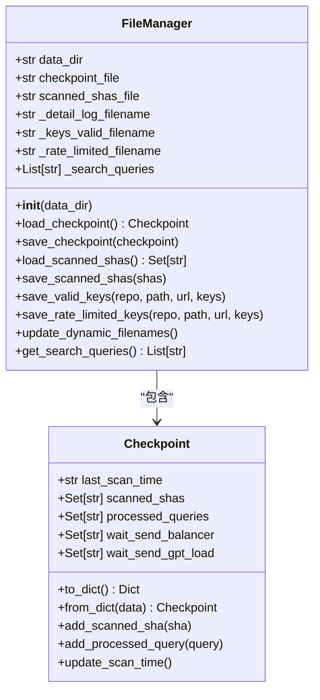
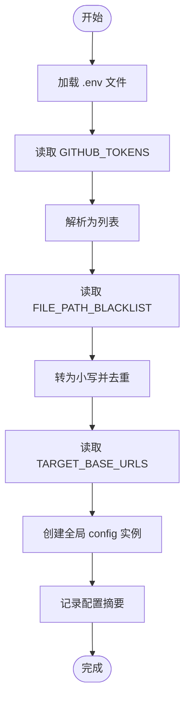
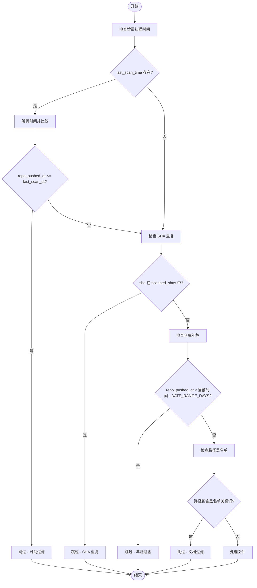

# 自定义文件过滤策略

<cite>
**本文档引用的文件**  
- [file_manager.py](file://utils/file_manager.py)
- [config.py](file://common/config.py)
- [hajimi_king.py](file://app/hajimi_king.py)
</cite>

## 目录
1. [项目结构分析](#项目结构分析)  
2. [核心组件分析](#核心组件分析)  
3. [文件过滤逻辑实现](#文件过滤逻辑实现)  
4. [自定义过滤规则扩展](#自定义过滤规则扩展)  
5. [避免误判有效密钥文件](#避免误判有效密钥文件)  
6. [性能影响与缓存优化](#性能影响与缓存优化)  
7. [总结与建议](#总结与建议)

## 项目结构分析

项目采用模块化设计，主要分为以下几个目录：

- `app/`：主应用入口，包含 `hajimi_king.py` 作为核心执行脚本。
- `common/`：通用工具和配置，包括日志记录器 `Logger.py` 和全局配置 `config.py`。
- `scripts/`：辅助脚本，如 `dry_run.py`。
- `utils/`：工具类模块，包含 `file_manager.py`、`github_client.py` 和 `sync_utils.py`。
- 根目录包含构建和部署文件（如 `Dockerfile`、`docker-compose.yml`）及文档（`README.md`、`CHANGELOG.md`）。

该结构清晰分离了业务逻辑、配置管理和工具功能，便于维护和扩展。

**Section sources**  
- [hajimi_king.py](file://app/hajimi_king.py#L1-L524)  
- [config.py](file://common/config.py#L1-L204)  
- [file_manager.py](file://utils/file_manager.py#L1-L493)

## 核心组件分析

### FileManager 类
`FileManager` 是系统中负责所有文件操作的核心类，位于 `utils/file_manager.py`。其主要职责包括：
- 初始化数据目录和日志文件路径
- 加载和保存检查点（checkpoint）信息
- 管理已扫描文件的 SHA 值
- 动态生成按日期命名的日志文件
- 提供统一接口保存密钥结果

#### 类结构图


**Diagram sources**  
- [file_manager.py](file://utils/file_manager.py#L1-L493)

**Section sources**  
- [file_manager.py](file://utils/file_manager.py#L1-L493)

### Config 类
`Config` 类位于 `common/config.py`，用于集中管理所有环境变量和运行时配置。它通过 `os.getenv` 读取环境变量，并提供默认值。

关键配置项包括：
- `GITHUB_TOKENS`：GitHub API 访问令牌列表
- `DATA_PATH`：数据存储路径
- `FILE_PATH_BLACKLIST`：文件路径黑名单，用于过滤文档类文件
- `TARGET_BASE_URLS`：目标 API 地址，用于 ModelScope 密钥提取
- `MODELSCOPE_EXTRACT_ONLY`：是否仅提取 ModelScope 密钥

#### 配置加载流程


**Diagram sources**  
- [config.py](file://common/config.py#L1-L204)

**Section sources**  
- [config.py](file://common/config.py#L1-L204)

## 文件过滤逻辑实现

文件过滤逻辑主要在 `hajimi_king.py` 中的 `should_skip_item` 函数中实现，该函数决定是否跳过某个搜索结果项。

### 过滤条件分析

| 过滤条件 | 实现方式 | 配置参数 |
|--------|--------|--------|
| 时间增量扫描 | 比较仓库最后推送时间与上次扫描时间 | `checkpoint.last_scan_time` |
| SHA 重复检测 | 检查文件 SHA 是否已在 `scanned_shas` 集合中 | `checkpoint.scanned_shas` |
| 仓库年龄限制 | 推送时间早于 `DATE_RANGE_DAYS` 天前 | `Config.DATE_RANGE_DAYS` |
| 路径黑名单过滤 | 检查文件路径是否包含黑名单关键词 | `Config.FILE_PATH_BLACKLIST` |

### 过滤流程图


**Diagram sources**  
- [hajimi_king.py](file://app/hajimi_king.py#L171-L205)

**Section sources**  
- [hajimi_king.py](file://app/hajimi_king.py#L171-L205)

## 自定义过滤规则扩展

### 通过配置文件扩展
系统支持通过环境变量自定义过滤规则，无需修改代码即可扩展功能。

#### 1. 扩展路径黑名单
可通过设置 `FILE_PATH_BLACKLIST` 环境变量添加更多需要过滤的路径关键词：

```bash
export FILE_PATH_BLACKLIST="readme,docs,doc/,.md,sample,tutorial,test,example,config"
```

这将额外过滤测试文件、示例文件和配置文件。

#### 2. 自定义目标 API 地址
通过 `TARGET_BASE_URLS` 可指定需要监控的特定 API 地址：

```bash
export TARGET_BASE_URLS="https://api-inference.modelscope.cn/v1/,https://my-api.company.com/v1/"
```

#### 3. 启用宽松密钥匹配模式
对于非标准格式的密钥，可启用宽松匹配模式：

```bash
export MS_USE_LOOSE_PATTERN=true
export MS_PROXIMITY_CHARS=100
export MS_REQUIRE_KEY_CONTEXT=true
```

### 通过代码插件方式扩展

可在 `hajimi_king.py` 中添加新的过滤条件函数：

```python
def should_skip_by_content(item: Dict[str, Any], content: str) -> tuple[bool, str]:
    """
    基于文件内容的过滤规则
    """
    # 示例：过滤包含特定注释的文件
    if "AUTO-GENERATED" in content.upper():
        return True, "auto_generated"
    
    # 示例：过滤过小的文件
    if len(content) < 50:
        return True, "content_too_short"
        
    return False, ""

# 在 process_item 中调用
def process_item(item: Dict[str, Any]) -> tuple:
    # ... 前续逻辑
    content = github_utils.get_file_content(item)
    if not content:
        return 0, 0
        
    # 新增内容过滤
    should_skip, reason = should_skip_by_content(item, content)
    if should_skip:
        logger.info(f"🚫 跳过内容过滤, 原因: {reason}")
        return 0, 0
    # ... 后续逻辑
```

**Section sources**  
- [hajimi_king.py](file://app/hajimi_king.py#L171-L205)  
- [config.py](file://common/config.py#L61-L62)

## 避免误判有效密钥文件

### 当前防误判机制

1. **占位符过滤**：在 `process_item` 中检查密钥上下文是否包含 `"..."` 或 `"YOUR_"` 等占位符标识。
2. **路径黑名单**：通过 `FILE_PATH_BLACKLIST` 过滤常见文档和示例文件。
3. **内容特征分析**：ModelScope 模式下支持上下文关键词匹配（如 key、token、secret）。

### 改进建议

#### 1. 增加文件类型白名单
避免在非代码文件中误判：

```python
# 在 config.py 中添加
FILE_TYPE_WHITELIST = ['.py', '.js', '.ts', '.java', '.cpp', '.go', '.rb', '.php']

# 在 should_skip_item 中添加检查
def should_skip_item(item: Dict[str, Any], checkpoint: Checkpoint) -> tuple[bool, str]:
    # ... 其他检查
    file_ext = os.path.splitext(item["path"].lower())[1]
    if file_ext not in Config.FILE_TYPE_WHITELIST:
        return True, "file_type_not_supported"
    # ... 原有逻辑
```

#### 2. 增强上下文验证
对于疑似密钥，检查其声明方式：

```python
def is_valid_key_context(content: str, key: str) -> bool:
    """
    检查密钥是否在合理的上下文中声明
    """
    context_start = max(0, content.find(key) - 50)
    context_end = min(len(content), content.find(key) + 50)
    context = content[context_start:context_end]
    
    # 常见的密钥声明模式
    patterns = [
        r'api[_-]?key', r'token', r'secret', r'password', r'credential',
        r'const\s+\w+\s*=', r'let\s+\w+\s*=', r'var\s+\w+\s*='
    ]
    
    return any(re.search(pattern, context, re.IGNORECASE) for pattern in patterns)
```

#### 3. 添加密钥使用验证
不仅验证密钥本身有效性，还检查其是否被实际使用：

```python
def is_key_used_in_file(content: str, key: str) -> bool:
    """
    检查密钥是否在文件中被多次引用
    """
    # 至少出现两次（声明 + 使用）
    return content.count(key) >= 2
```

**Section sources**  
- [hajimi_king.py](file://app/hajimi_king.py#L250-L270)  
- [config.py](file://common/config.py#L61-L62)

## 性能影响与缓存优化

### 当前性能特征

1. **I/O 操作**：频繁读写 `scanned_shas.txt` 和 `checkpoint.json` 文件。
2. **内存占用**：`scanned_shas` 集合可能随时间增长而变大。
3. **网络延迟**：GitHub API 调用和密钥验证存在网络开销。

### 缓存优化建议

#### 1. SHA 集合内存缓存
当前 `scanned_shas` 已在内存中维护，但可优化加载性能：

```python
# 在 file_manager.py 中优化 load_scanned_shas
def load_scanned_shas(self) -> Set[str]:
    """优化：批量读取并减少 I/O 次数"""
    scanned_shas = set()
    if os.path.isfile(self.scanned_shas_file):
        try:
            with open(self.scanned_shas_file, "r", encoding="utf-8") as f:
                lines = f.readlines()
                for line in lines:
                    line = line.strip()
                    if line and not line.startswith('#'):
                        scanned_shas.add(line)
        except Exception as e:
            logger.error(f"读取 {self.scanned_shas_file} 失败: {e}")
    return scanned_shas
```

#### 2. 查询结果缓存
避免重复执行相同搜索查询：

```python
# 在 GitHubClient 中添加查询缓存
class GitHubClient:
    def __init__(self, tokens):
        self.tokens = tokens
        self._query_cache = {}
        self._cache_ttl = 3600  # 1小时
    
    def search_for_keys(self, query):
        if query in self._query_cache:
            cached_time, result = self._query_cache[query]
            if time.time() - cached_time < self._cache_ttl:
                return result
        
        # 执行实际查询...
        self._query_cache[query] = (time.time(), result)
        return result
```

#### 3. 批量处理优化
当前每 20 个文件保存一次检查点，可动态调整：

```python
# 在 main 循环中优化
checkpoint_save_interval = 20
files_since_last_save = 0

for item in items:
    # ... 处理逻辑
    files_since_last_save += 1
    
    # 动态保存间隔：文件越多，保存越频繁
    if files_since_last_save >= min(50, max(10, len(items)//5)):
        file_manager.save_checkpoint(checkpoint)
        files_since_last_save = 0
```

### 性能监控建议

添加性能统计：

```python
# 在 main 函数中添加
performance_stats = {
    "total_files": 0,
    "total_processing_time": 0,
    "avg_processing_time": 0,
    "cache_hit_rate": 0
}

# 在 process_item 前后添加计时
start_time = time.time()
# ... 处理逻辑
end_time = time.time()

performance_stats["total_processing_time"] += (end_time - start_time)
performance_stats["total_files"] += 1
performance_stats["avg_processing_time"] = performance_stats["total_processing_time"] / performance_stats["total_files"]
```

**Section sources**  
- [file_manager.py](file://utils/file_manager.py#L1-L493)  
- [hajimi_king.py](file://app/hajimi_king.py#L300-L350)

## 总结与建议

本系统通过 `FileManager` 和 `Config` 类实现了灵活的文件过滤机制，支持基于路径、时间、重复性和内容特征的多维度过滤。通过环境变量配置，用户可以轻松扩展过滤规则而无需修改代码。

### 主要优势
- **配置驱动**：大多数过滤规则可通过环境变量调整
- **模块化设计**：过滤逻辑与核心处理分离，易于维护
- **增量扫描**：基于检查点实现高效增量扫描
- **可扩展性**：支持通过代码插件方式添加新规则

### 改进建议
1. **引入数据库**：对于大规模扫描，建议将 `scanned_shas` 迁移到轻量级数据库（如 SQLite）以提升查询性能。
2. **分布式处理**：支持多节点协同扫描，避免单点瓶颈。
3. **机器学习辅助**：训练模型识别有效密钥文件模式，降低误报率。
4. **实时监控面板**：提供 Web 界面实时查看扫描进度和统计信息。

通过以上优化，系统可在保证准确性的前提下显著提升扫描效率和可维护性。