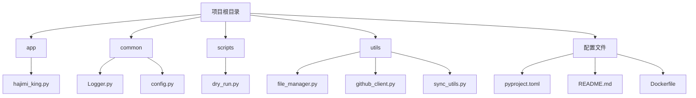
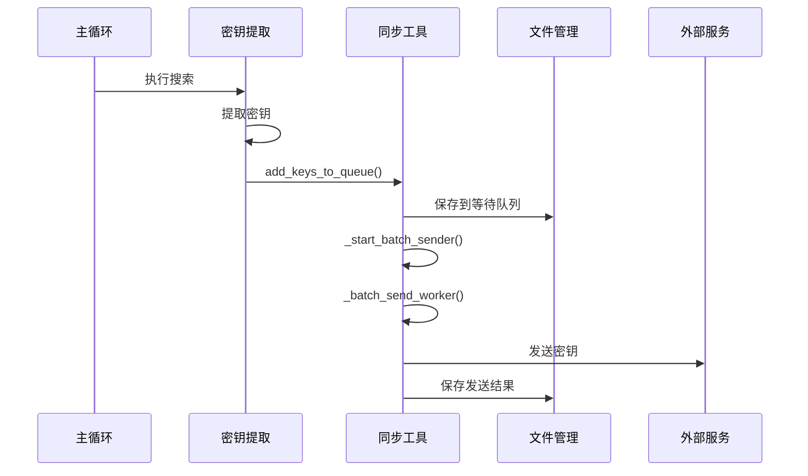
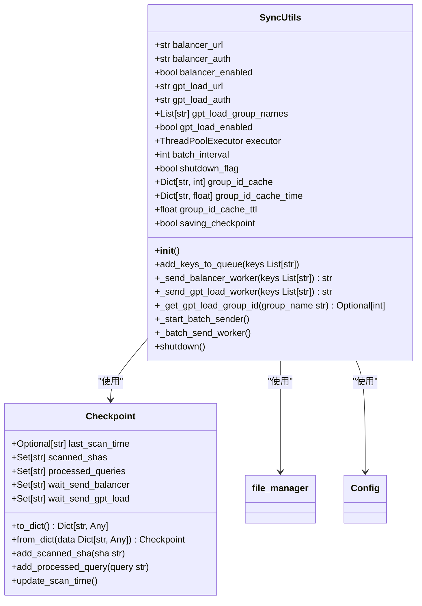
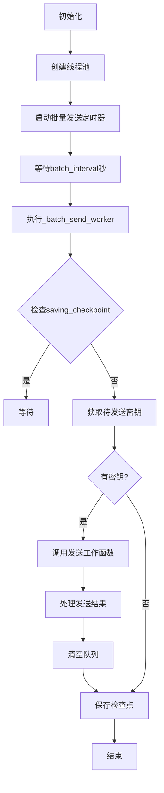
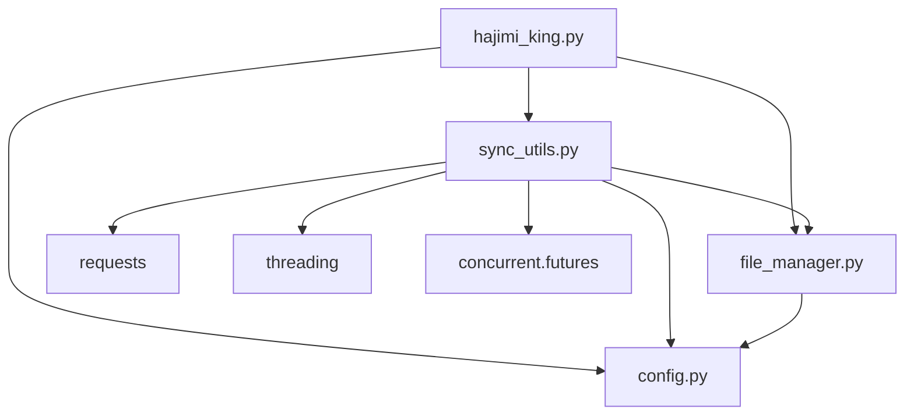
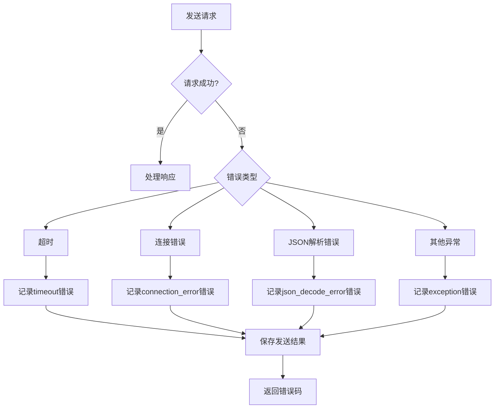

# 集成外部同步服务

<cite>
**本文档中引用的文件**  
- [hajimi_king.py](file://app/hajimi_king.py)
- [sync_utils.py](file://utils/sync_utils.py)
- [config.py](file://common/config.py)
- [file_manager.py](file://utils/file_manager.py)
</cite>

## 目录
1. [项目结构](#项目结构)
2. [核心组件](#核心组件)
3. [架构概述](#架构概述)
4. [详细组件分析](#详细组件分析)
5. [依赖分析](#依赖分析)
6. [性能考虑](#性能考虑)
7. [故障排除指南](#故障排除指南)

## 项目结构

项目采用模块化设计，主要分为以下几个目录：

- `app/`：主应用入口
- `common/`：通用工具和配置
- `scripts/`：辅助脚本
- `utils/`：核心工具模块
- 根目录：配置和部署文件

**图示来源**
- [hajimi_king.py](file://app/hajimi_king.py)
- [sync_utils.py](file://utils/sync_utils.py)
- [config.py](file://common/config.py)

**节来源**
- [hajimi_king.py](file://app/hajimi_king.py)
- [sync_utils.py](file://utils/sync_utils.py)

## 核心组件

项目的核心组件包括：
- **密钥提取引擎**：负责从GitHub代码中提取API密钥
- **同步工具**：将发现的密钥异步发送到外部服务
- **文件管理器**：处理所有文件操作和状态持久化
- **配置管理**：集中管理所有环境变量和配置

这些组件通过清晰的接口进行通信，确保了系统的可维护性和可扩展性。

**节来源**
- [hajimi_king.py](file://app/hajimi_king.py)
- [sync_utils.py](file://utils/sync_utils.py)

## 架构概述

系统采用事件驱动架构，主要流程如下：

**图示来源**
- [hajimi_king.py](file://app/hajimi_king.py#L1-L524)
- [sync_utils.py](file://utils/sync_utils.py#L1-L485)

**节来源**
- [hajimi_king.py](file://app/hajimi_king.py#L1-L524)
- [sync_utils.py](file://utils/sync_utils.py#L1-L485)

## 详细组件分析

### SyncUtils 组件分析

`SyncUtils` 类是外部服务集成的核心，负责异步发送密钥到外部负载均衡器。

**图示来源**
- [sync_utils.py](file://utils/sync_utils.py#L14-L479)
- [file_manager.py](file://utils/file_manager.py#L14-L492)

**节来源**
- [sync_utils.py](file://utils/sync_utils.py#L14-L479)
- [file_manager.py](file://utils/file_manager.py#L14-L492)

### 异步任务处理机制

`SyncUtils` 使用线程池和定时器实现异步任务处理：

**图示来源**
- [sync_utils.py](file://utils/sync_utils.py#L300-L400)

**节来源**
- [sync_utils.py](file://utils/sync_utils.py#L300-L400)

## 依赖分析

系统组件之间的依赖关系如下：

**图示来源**
- [hajimi_king.py](file://app/hajimi_king.py)
- [sync_utils.py](file://utils/sync_utils.py)
- [file_manager.py](file://utils/file_manager.py)

**节来源**
- [hajimi_king.py](file://app/hajimi_king.py)
- [sync_utils.py](file://utils/sync_utils.py)

## 性能考虑

### 线程池配置

`SyncUtils` 使用 `ThreadPoolExecutor` 进行异步处理，配置如下：

- **最大工作线程数**：2个
- **线程名称前缀**：SyncUtils
- **批量发送间隔**：60秒

这种配置平衡了并发性能和资源消耗，避免了对外部服务的过度请求。

### 缓存机制

系统实现了多级缓存以提高性能：

1. **组ID缓存**：GPT Load Balancer的组ID缓存15分钟
2. **检查点持久化**：定期保存扫描状态
3. **代理轮换**：支持多代理配置，提高访问稳定性

## 故障排除指南

### 常见问题

1. **密钥未同步到外部服务**
   - 检查 `GEMINI_BALANCER_SYNC_ENABLED` 或 `GPT_LOAD_SYNC_ENABLED` 是否设置为 `true`
   - 确认URL和认证信息配置正确
   - 检查网络连接和防火墙设置

2. **频繁出现429错误**
   - 配置代理服务器
   - 减少搜索频率
   - 增加 `batch_interval` 间隔

3. **配置检查失败**
   - 确保 `.env` 文件中的 `GITHUB_TOKENS` 已正确设置
   - 检查环境变量格式是否正确

### 错误处理

系统实现了全面的错误处理机制：

**图示来源**
- [sync_utils.py](file://utils/sync_utils.py#L150-L250)

**节来源**
- [sync_utils.py](file://utils/sync_utils.py#L150-L250)