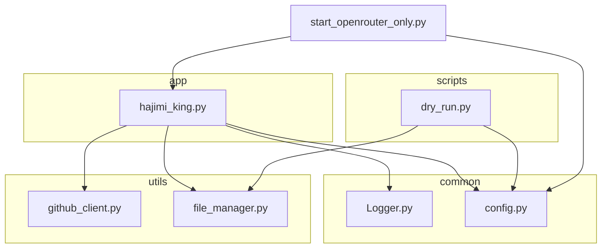
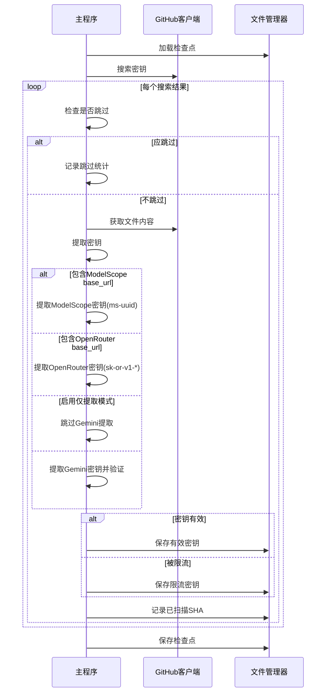
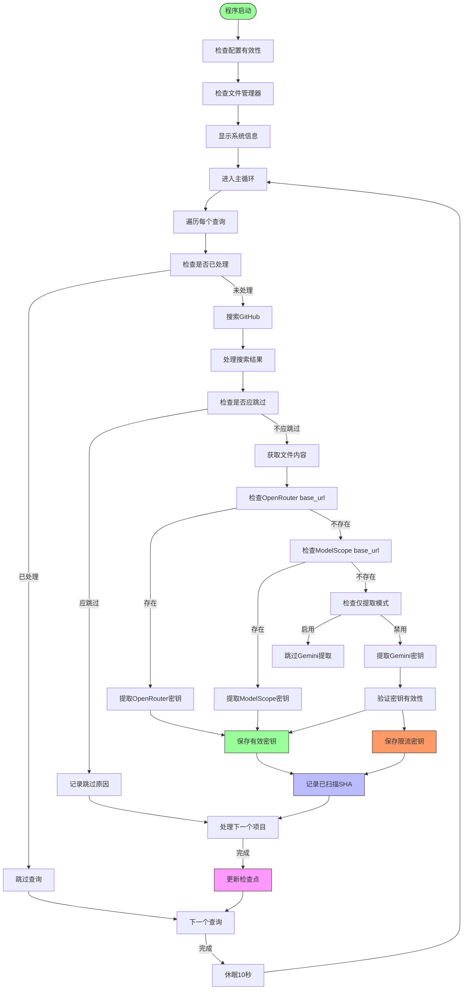
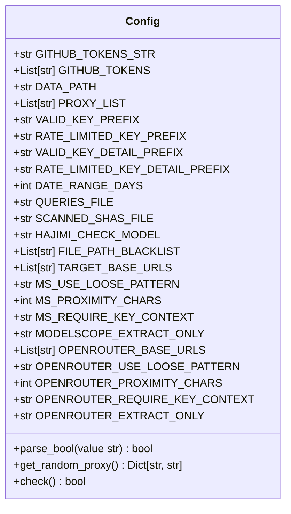
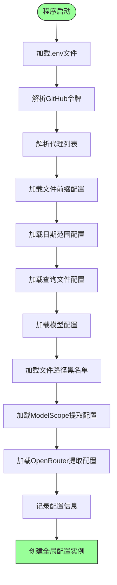
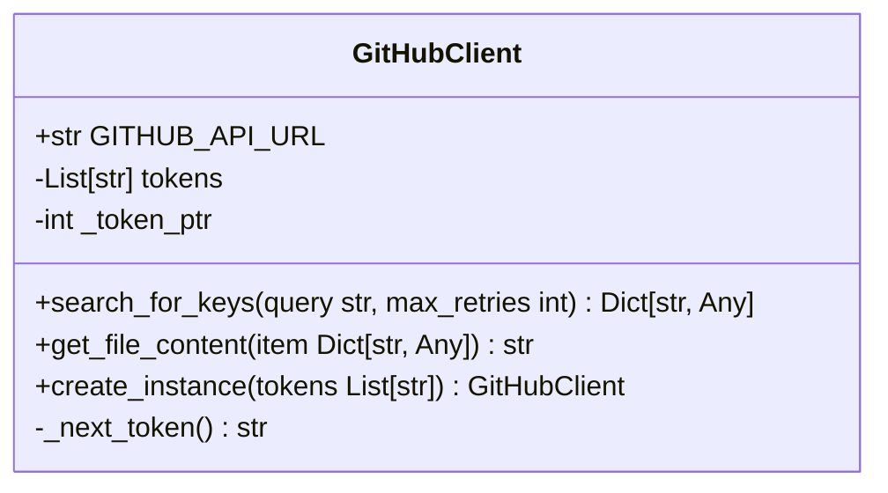
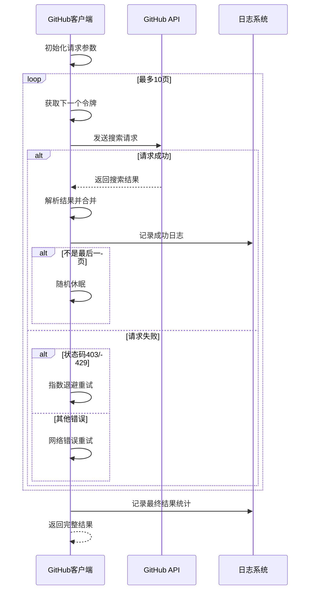
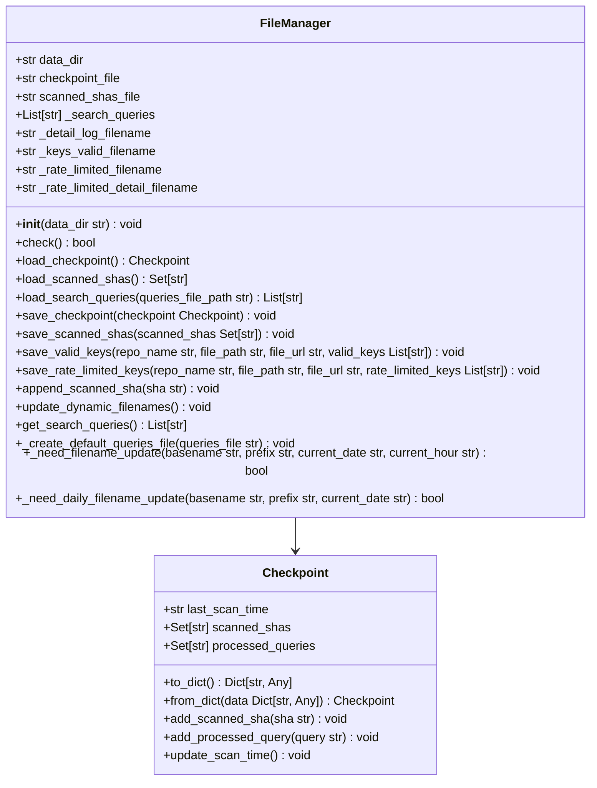
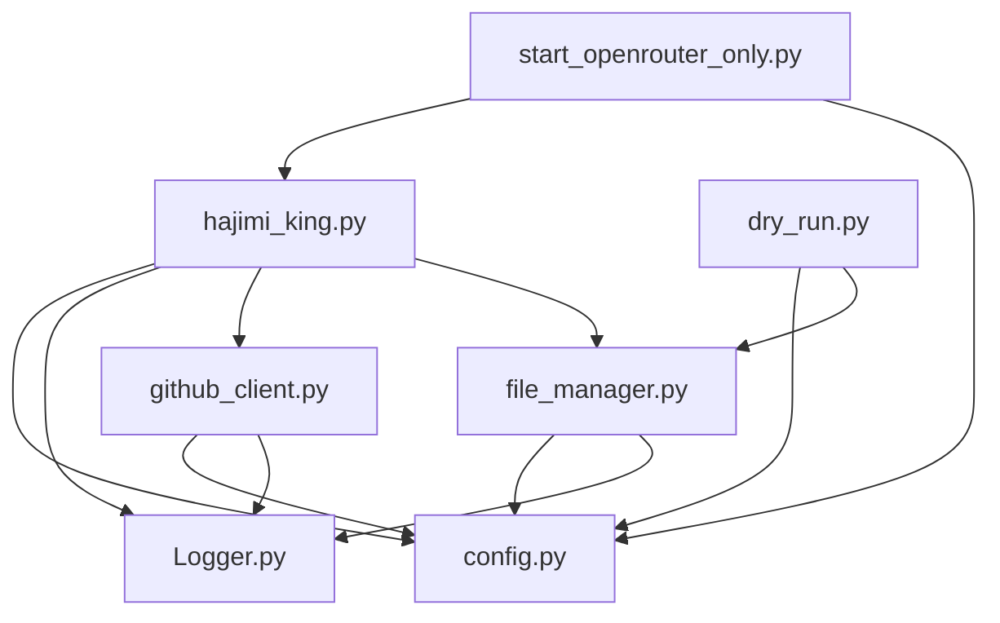
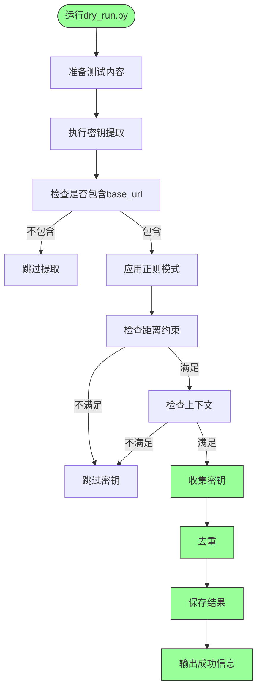

# 开发者指南

<cite>
**本文档中引用的文件**   
- [hajimi_king.py](file://app/hajimi_king.py) - *已移除同步功能，新增OpenRouter密钥提取支持*
- [config.py](file://common/config.py) - *已移除同步相关配置，新增OpenRouter配置项*
- [Logger.py](file://common/Logger.py) - *重构日志模块，提升日志输出体验和功能*
- [github_client.py](file://utils/github_client.py)
- [file_manager.py](file://utils/file_manager.py) - *已移除keys_send相关方法*
- [dry_run.py](file://scripts/dry_run.py)
- [start_openrouter_only.py](file://start_openrouter_only.py) - *新增OpenRouter专用启动脚本*
</cite>

## 更新摘要
**变更内容**   
- 新增OpenRouter API密钥提取功能，支持通过配置控制提取行为
- 在`hajimi_king.py`中添加`extract_openrouter_keys`函数，实现OpenRouter密钥提取逻辑
- 在`config.py`中添加OpenRouter相关配置项，包括`OPENROUTER_BASE_URLS`、`OPENROUTER_EXTRACT_ONLY`等
- 添加`start_openrouter_only.py`专用启动脚本，支持仅扫描OpenRouter密钥的模式
- 更新“核心组件”和“详细组件分析”章节，反映新增的OpenRouter功能
- 所有引用和图表均已更新以反映最新的代码状态

## 目录
1. [项目结构](#项目结构)
2. [核心组件](#核心组件)
3. [架构概览](#架构概览)
4. [详细组件分析](#详细组件分析)
5. [依赖分析](#依赖分析)
6. [测试策略](#测试策略)
7. [贡献流程](#贡献流程)

## 项目结构

本项目采用模块化分层架构，各目录职责明确，便于维护和扩展。

**图示来源**
- [hajimi_king.py](file://app/hajimi_king.py)
- [config.py](file://common/config.py)
- [Logger.py](file://common/Logger.py)
- [github_client.py](file://utils/github_client.py)
- [file_manager.py](file://utils/file_manager.py)
- [dry_run.py](file://scripts/dry_run.py)
- [start_openrouter_only.py](file://start_openrouter_only.py)

**本节来源**
- [hajimi_king.py](file://app/hajimi_king.py)
- [config.py](file://common/config.py)
- [github_client.py](file://utils/github_client.py)
- [file_manager.py](file://utils/file_manager.py)

## 核心组件

项目由多个核心组件构成，共同完成API密钥扫描任务。

- **app/hajimi_king.py**: 主程序入口，协调各组件工作流程，新增OpenRouter密钥提取功能
- **common/config.py**: 配置管理，集中处理环境变量和运行时配置，新增OpenRouter相关配置
- **common/Logger.py**: 日志系统，提供统一的日志输出接口
- **utils/github_client.py**: GitHub API客户端，负责搜索和获取文件内容
- **utils/file_manager.py**: 文件管理器，处理所有文件读写和检查点管理
- **start_openrouter_only.py**: OpenRouter专用启动脚本，支持仅扫描OpenRouter密钥的模式

这些组件通过清晰的接口进行交互，实现了高内聚、低耦合的设计目标。

**本节来源**
- [hajimi_king.py](file://app/hajimi_king.py)
- [config.py](file://common/config.py)
- [Logger.py](file://common/Logger.py)
- [github_client.py](file://utils/github_client.py)
- [file_manager.py](file://utils/file_manager.py)
- [start_openrouter_only.py](file://start_openrouter_only.py)

## 架构概览

系统采用主循环驱动的架构模式，通过增量扫描机制持续发现新的API密钥，支持多种密钥类型的提取。

**图示来源**
- [hajimi_king.py](file://app/hajimi_king.py#L1-L595)
- [github_client.py](file://utils/github_client.py#L1-L217)
- [file_manager.py](file://utils/file_manager.py#L1-L431)

## 详细组件分析

### 主程序分析

`hajimi_king.py` 是系统的核心控制器，负责协调各个组件完成扫描任务，现已支持OpenRouter密钥提取。

#### 主要功能流程

**图示来源**
- [hajimi_king.py](file://app/hajimi_king.py#L1-L595)

#### 核心方法说明

- **main()**: 主程序入口，包含主循环逻辑，支持命令行参数配置提取模式
- **process_item()**: 处理单个GitHub搜索结果的核心方法，优先尝试提取ModelScope或OpenRouter密钥
- **validate_gemini_key()**: 验证Gemini API密钥有效性的方法
- **should_skip_item()**: 判断是否应跳过处理某个项目的决策方法
- **extract_openrouter_keys()**: 新增方法，提取OpenRouter API密钥
- **_parse_cli_args()**: 解析命令行参数，支持配置提取模式

**本节来源**
- [hajimi_king.py](file://app/hajimi_king.py#L1-L595)

### 配置管理分析

`config.py` 模块负责管理所有运行时配置，提供类型安全的配置访问，现已支持OpenRouter相关配置。

#### 配置类结构

**图示来源**
- [config.py](file://common/config.py#L1-L188)

#### 配置加载流程

**图示来源**
- [config.py](file://common/config.py#L1-L188)

**本节来源**
- [config.py](file://common/config.py#L1-L188)

### GitHub客户端分析

`github_client.py` 模块封装了与GitHub API的交互逻辑。

#### 类结构

**图示来源**
- [github_client.py](file://utils/github_client.py#L1-L217)

#### 搜索流程

**图示来源**
- [github_client.py](file://utils/github_client.py#L1-L217)

**本节来源**
- [github_client.py](file://utils/github_client.py#L1-L217)

### 文件管理器分析

`file_manager.py` 模块负责所有文件操作和状态管理。

#### 类结构

**图示来源**
- [file_manager.py](file://utils/file_manager.py#L1-L431)

#### 检查点管理流程

**图示来源**
- [file_manager.py](file://utils/file_manager.py#L1-L431)

**本节来源**
- [file_manager.py](file://utils/file_manager.py#L1-L431)

## 依赖分析

项目各组件之间的依赖关系清晰，形成了良好的分层架构。

**图示来源**
- [hajimi_king.py](file://app/hajimi_king.py)
- [config.py](file://common/config.py)
- [Logger.py](file://common/Logger.py)
- [github_client.py](file://utils/github_client.py)
- [file_manager.py](file://utils/file_manager.py)
- [dry_run.py](file://scripts/dry_run.py)
- [start_openrouter_only.py](file://start_openrouter_only.py)

**本节来源**
- [hajimi_king.py](file://app/hajimi_king.py)
- [config.py](file://common/config.py)
- [github_client.py](file://utils/github_client.py)
- [file_manager.py](file://utils/file_manager.py)

## 测试策略

项目提供了`scripts/dry_run.py`脚本用于验证功能变更。

### Dry Run 脚本分析

**图示来源**
- [dry_run.py](file://scripts/dry_run.py#L1-L103)

### 扩展新功能的测试方法

1. **添加新的密钥提取规则**:
   - 在`hajimi_king.py`中添加新的提取函数
   - 在`dry_run.py`中添加相应的测试用例
   - 运行`dry_run.py`验证提取逻辑正确性

2. **扩展搜索策略**:
   - 修改`github_client.py`中的搜索逻辑
   - 在`hajimi_king.py`中调整查询处理流程
   - 使用`dry_run.py`验证整体流程

3. **添加新的密钥类型支持**:
   - 在`config.py`中添加新的配置项
   - 在`hajimi_king.py`中实现新的提取函数
   - 更新`main()`函数以支持新的提取逻辑
   - 在`start_openrouter_only.py`中添加相应的启动模式

**本节来源**
- [dry_run.py](file://scripts/dry_run.py#L1-L103)
- [hajimi_king.py](file://app/hajimi_king.py#L1-L595)

## 贡献流程

### 代码风格要求

1. **Python风格**: 遵循PEP 8规范
2. **类型注解**: 所有函数和方法必须包含类型注解
3. **日志输出**: 使用统一的`logger`实例进行日志记录
4. **异常处理**: 合理捕获和处理异常，避免程序崩溃
5. **配置管理**: 新功能的配置应通过`config.py`管理，避免硬编码

### 提交规范

1. **提交信息格式**: `<类型>: <简要描述>`
   - 类型包括: `feat`, `fix`, `docs`, `style`, `refactor`, `test`, `chore`
2. **提交粒度**: 每次提交只包含一个逻辑变更
3. **代码审查**: 所有变更必须通过Pull Request进行审查

### Pull Request审查标准

1. **功能完整性**: 变更是否完整实现了预期功能
2. **代码质量**: 是否符合代码风格要求，是否有冗余代码
3. **测试覆盖**: 是否包含相应的测试用例
4. **文档更新**: 是否更新了相关文档
5. **向后兼容**: 是否破坏了现有功能
6. **配置一致性**: 新功能是否通过配置文件正确管理

**本节来源**
- [hajimi_king.py](file://app/hajimi_king.py)
- [config.py](file://common/config.py)
- [github_client.py](file://utils/github_client.py)
- [file_manager.py](file://utils/file_manager.py)