# 开发者指南

<cite>
**本文档中引用的文件**   
- [main.py](file://src\main.py) - *主程序入口，重构后替代hajimi_king.py*
- [scanner.py](file://src\core\scanner.py) - *核心扫描器实现，协调提取与验证流程*
- [config.py](file://src\models\config.py) - *配置数据模型定义，使用dataclass重构*
- [config_service.py](file://src\services\config_service.py) - *配置加载服务，支持YAML与环境变量*
- [github_service.py](file://src\services\github_service.py) - *GitHub API服务封装，替代github_client.py*
- [file_service.py](file://src\services\file_service.py) - *文件操作服务，替代file_manager.py*
- [extractors](file://src\extractors) - *密钥提取器模块，支持Gemini、ModelScope和OpenRouter*
- [validators](file://src\validators) - *密钥验证器模块，支持验证功能*
- [logger.py](file://src\utils\logger.py) - *日志工具模块*
</cite>

## 更新摘要
**变更内容**   
- 项目结构重构，核心代码迁移至src目录，采用模块化分层架构
- 主程序入口从app/hajimi_king.py迁移至src/main.py
- 核心扫描逻辑移至src/core/scanner.py，实现提取与验证的协调
- 配置系统重构，使用dataclass定义配置模型，分离配置加载服务
- GitHub与文件操作封装为独立服务，提升代码可维护性
- 新增extractors和validators模块，支持多类型密钥提取与验证
- 所有引用和架构描述均已更新以反映最新的代码状态

## 目录
1. [项目结构](#项目结构)
2. [核心组件](#核心组件)
3. [架构概览](#架构概览)
4. [详细组件分析](#详细组件分析)
5. [依赖分析](#依赖分析)
6. [测试策略](#测试策略)
7. [贡献流程](#贡献流程)

## 项目结构

本项目采用模块化分层架构，各目录职责明确，便于维护和扩展。

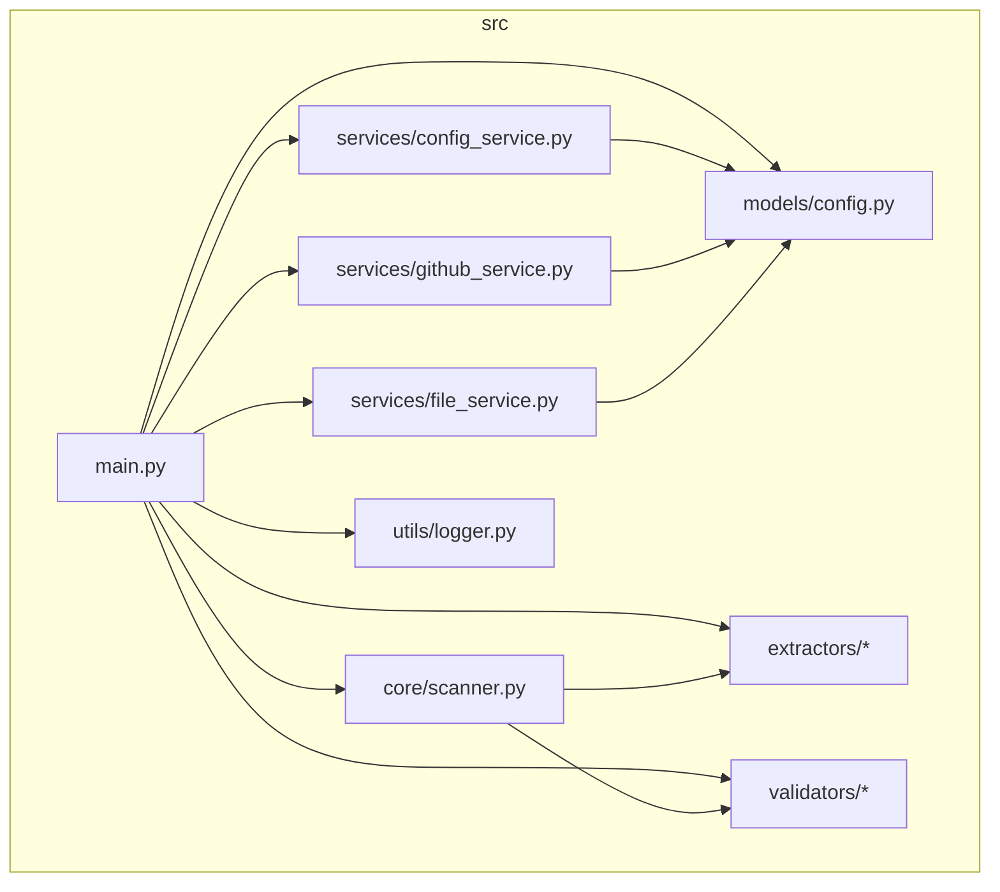

**图示来源**
- [main.py](file://src\main.py)
- [scanner.py](file://src\core\scanner.py)
- [config.py](file://src\models\config.py)
- [config_service.py](file://src\services\config_service.py)
- [github_service.py](file://src\services\github_service.py)
- [file_service.py](file://src\services\file_service.py)
- [extractors](file://src\extractors)
- [validators](file://src\validators)
- [logger.py](file://src\utils\logger.py)

**本节来源**
- [main.py](file://src\main.py)
- [config.py](file://src\models\config.py)
- [github_service.py](file://src\services\github_service.py)
- [file_service.py](file://src\services\file_service.py)

## 核心组件

项目由多个核心组件构成，共同完成API密钥扫描任务。

- **src/main.py**: 主程序入口，协调各组件工作流程，处理命令行参数和主循环
- **src/core/scanner.py**: 核心扫描器，协调提取器和验证器完成扫描任务
- **src/models/config.py**: 配置数据模型，使用dataclass定义应用配置结构
- **src/services/config_service.py**: 配置服务，负责加载和管理应用配置
- **src/services/github_service.py**: GitHub服务，封装GitHub API交互逻辑
- **src/services/file_service.py**: 文件服务，处理所有文件读写和状态管理
- **src/extractors**: 提取器模块，包含Gemini、ModelScope和OpenRouter密钥提取器
- **src/validators**: 验证器模块，包含各类型密钥的验证逻辑
- **src/utils/logger.py**: 日志工具，提供统一的日志输出接口

这些组件通过清晰的接口进行交互，实现了高内聚、低耦合的设计目标。

**本节来源**
- [main.py](file://src\main.py)
- [config.py](file://src\models\config.py)
- [scanner.py](file://src\core\scanner.py)
- [github_service.py](file://src\services\github_service.py)
- [file_service.py](file://src\services\file_service.py)
- [extractors](file://src\extractors)
- [validators](file://src\validators)
- [logger.py](file://src\utils\logger.py)

## 架构概览

系统采用主循环驱动的架构模式，通过增量扫描机制持续发现新的API密钥，支持多种密钥类型的提取与验证。

```mermaid
sequenceDiagram
participant Main as 主程序
participant Config as 配置服务
participant GitHub as GitHub服务
participant File as 文件服务
participant Scanner as 扫描器
Main->>Config : 加载配置
Main->>File : 加载检查点
Main->>Scanner : 初始化扫描器
loop 主循环
Main->>File : 加载查询
loop 每个查询
Main->>GitHub : 搜索代码
loop 每个搜索结果
Main->>Main : 检查是否跳过
alt 应跳过
Main->>Main : 记录跳过统计
else 不跳过
Main->>GitHub : 获取文件内容
Main->>Scanner : 扫描内容
Scanner->>Extractors : 执行提取
Extractors-->>Scanner : 返回提取结果
Scanner->>Validators : 执行验证
Validators-->>Scanner : 返回验证结果
Scanner-->>Main : 返回扫描结果
Main->>File : 保存扫描结果
Main->>File : 记录已扫描SHA
end
end
Main->>File : 保存检查点
end
```

**图示来源**
- [main.py](file://src\main.py#L1-L452)
- [github_service.py](file://src\services\github_service.py#L1-L256)
- [file_service.py](file://src\services\file_service.py#L1-L217)
- [scanner.py](file://src\core\scanner.py#L1-L79)

## 详细组件分析

### 主程序分析

`src/main.py` 是系统的核心控制器，负责协调各个组件完成扫描任务。

#### 主要功能流程

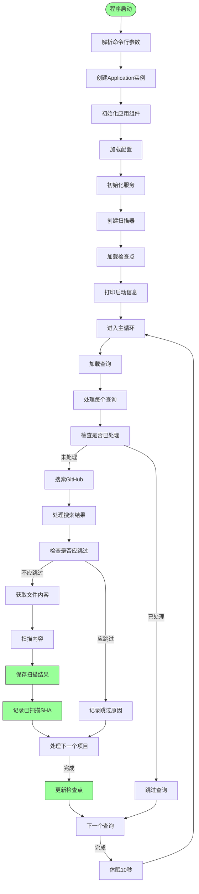

**图示来源**
- [main.py](file://src\main.py#L1-L452)

#### 核心方法说明

- **main()**: 程序入口点，解析命令行参数并启动应用
- **Application.run()**: 主循环执行方法，协调整个扫描流程
- **Application._scan_item()**: 扫描单个项目的文件内容，协调提取与验证
- **Application._should_skip_item()**: 判断是否应跳过处理某个项目的决策方法
- **Application._apply_scan_mode_config()**: 根据扫描模式应用配置覆盖
- **parse_args()**: 解析命令行参数，支持配置扫描模式和配置预设

**本节来源**
- [main.py](file://src\main.py#L1-L452)

### 核心扫描器分析

`src/core/scanner.py` 模块实现核心扫描逻辑，协调提取器和验证器完成扫描任务。

#### 类结构

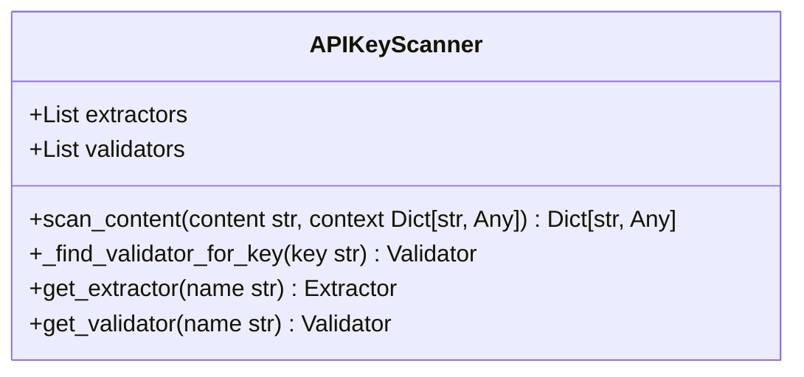

**图示来源**
- [scanner.py](file://src\core\scanner.py#L1-L79)

#### 扫描流程

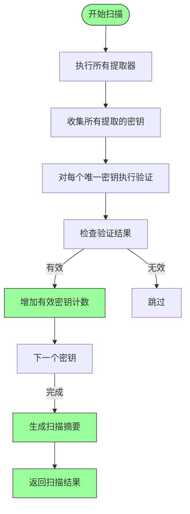

**图示来源**
- [scanner.py](file://src\core\scanner.py#L1-L79)

**本节来源**
- [scanner.py](file://src\core\scanner.py#L1-L79)

### 配置系统分析

配置系统重构为两个部分：配置模型和配置服务，提供类型安全的配置访问。

#### 配置模型结构

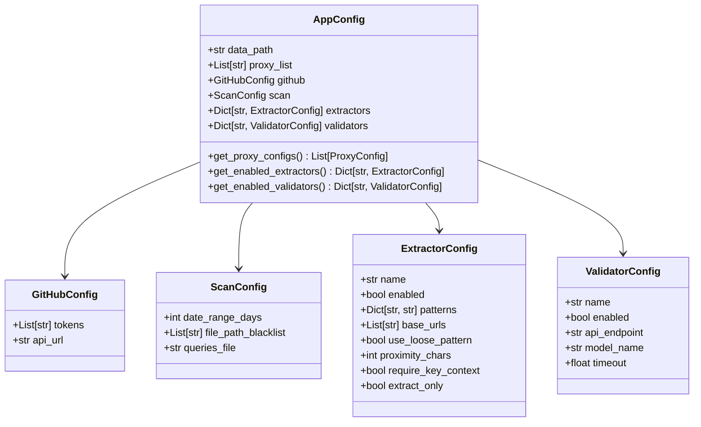

**图示来源**
- [config.py](file://src\models\config.py#L1-L112)

#### 配置加载流程

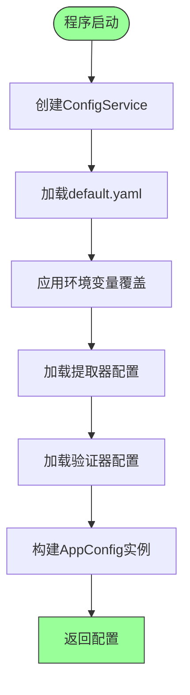

**图示来源**
- [config_service.py](file://src\services\config_service.py#L1-L216)

**本节来源**
- [config.py](file://src\models\config.py#L1-L112)
- [config_service.py](file://src\services\config_service.py#L1-L216)

### GitHub服务分析

`src/services/github_service.py` 模块封装了与GitHub API的交互逻辑。

#### 类结构

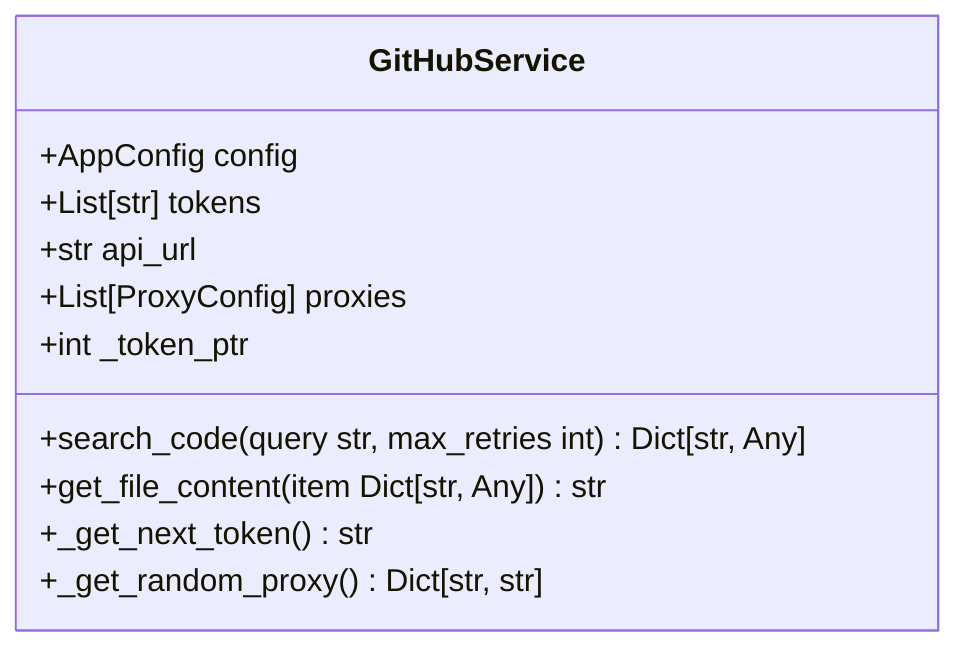

**图示来源**
- [github_service.py](file://src\services\github_service.py#L1-L256)

#### 搜索流程

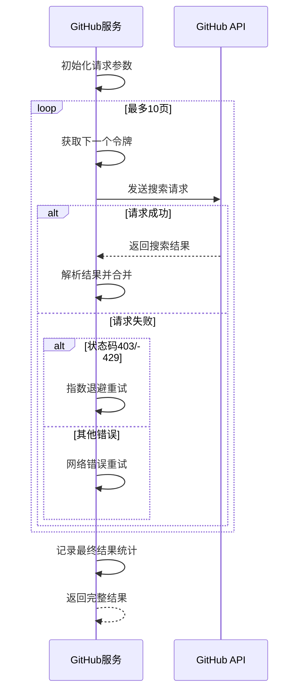

**图示来源**
- [github_service.py](file://src\services\github_service.py#L1-L256)

**本节来源**
- [github_service.py](file://src\services\github_service.py#L1-L256)

### 文件服务分析

`src/services/file_service.py` 模块负责所有文件操作和状态管理。

#### 类结构

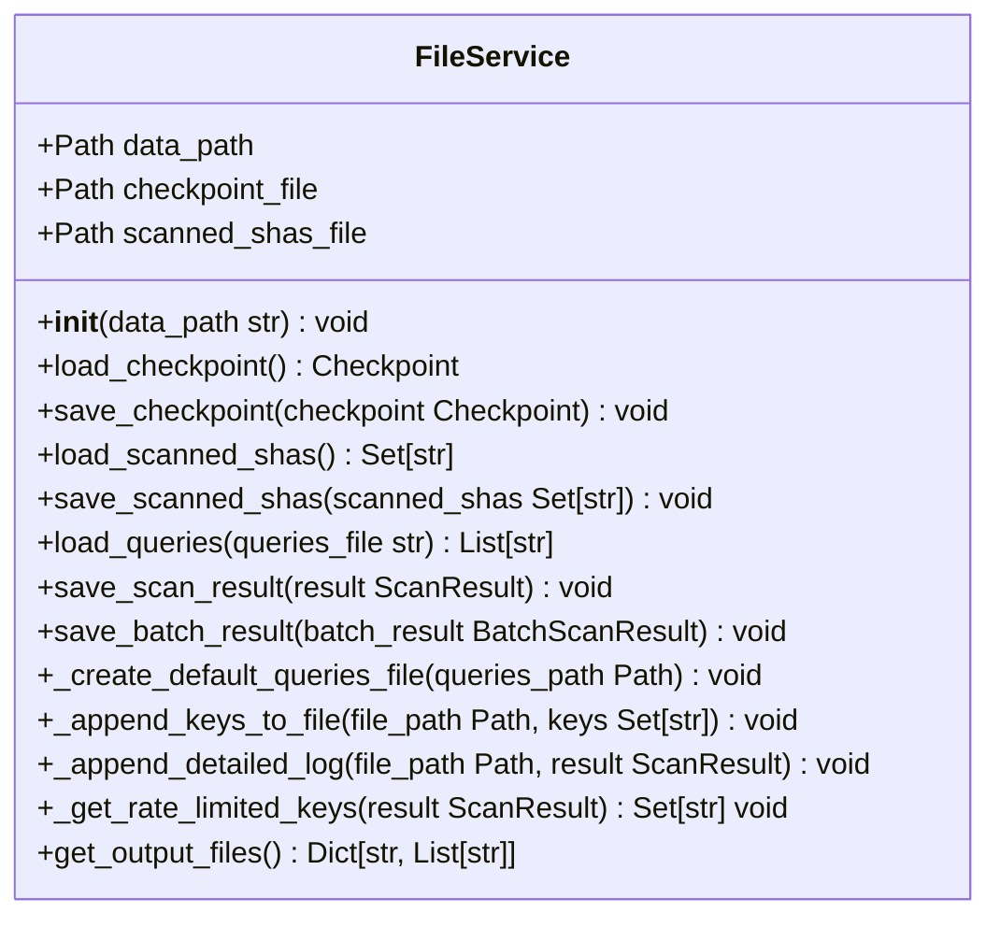

**图示来源**
- [file_service.py](file://src\services\file_service.py#L1-L217)

#### 检查点管理流程

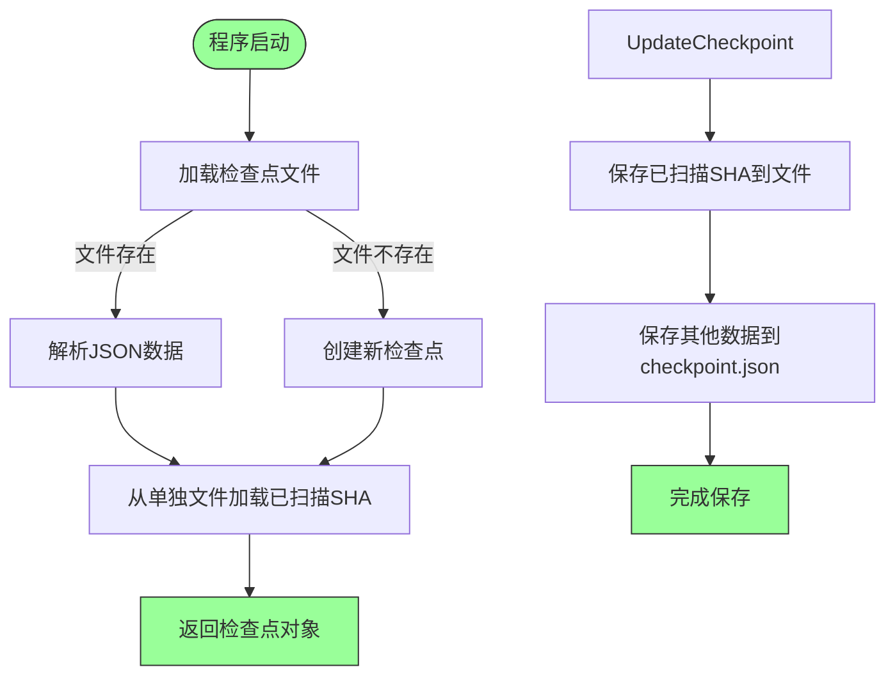

**图示来源**
- [file_service.py](file://src\services\file_service.py#L1-L217)

**本节来源**
- [file_service.py](file://src\services\file_service.py#L1-L217)

## 依赖分析

项目各组件之间的依赖关系清晰，形成了良好的分层架构。

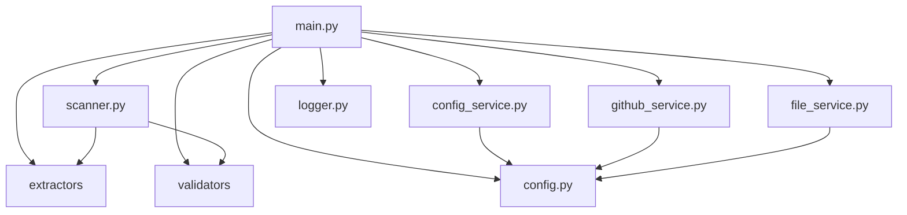

**图示来源**
- [main.py](file://src\main.py)
- [scanner.py](file://src\core\scanner.py)
- [config.py](file://src\models\config.py)
- [config_service.py](file://src\services\config_service.py)
- [github_service.py](file://src\services\github_service.py)
- [file_service.py](file://src\services\file_service.py)
- [extractors](file://src\extractors)
- [validators](file://src\validators)
- [logger.py](file://src\utils\logger.py)

**本节来源**
- [main.py](file://src\main.py)
- [config.py](file://src\models\config.py)
- [github_service.py](file://src\services\github_service.py)
- [file_service.py](file://src\services\file_service.py)

## 测试策略

项目提供了模块化的测试策略，支持单元测试和集成测试。

### 扩展新功能的测试方法

1. **添加新的密钥提取规则**:
   - 在`src/extractors`目录下创建新的提取器类
   - 在`config/extractors`目录下添加相应的YAML配置文件
   - 在`src/validators`目录下创建相应的验证器（可选）
   - 在`tests/unit`中添加单元测试
   - 运行测试验证功能正确性

2. **扩展搜索策略**:
   - 修改`src/services/github_service.py`中的搜索逻辑
   - 在`src/main.py`中调整查询处理流程
   - 使用单元测试验证修改后的行为

3. **添加新的密钥类型支持**:
   - 在`src/extractors`中实现新的提取器
   - 在`src/validators`中实现新的验证器
   - 在`config/extractors`中添加配置文件
   - 更新`src/main.py`中的应用初始化逻辑
   - 添加相应的测试用例

**本节来源**
- [main.py](file://src\main.py#L1-L452)
- [scanner.py](file://src\core\scanner.py#L1-L79)
- [config_service.py](file://src\services\config_service.py#L1-L216)

## 贡献流程

### 代码风格要求

1. **Python风格**: 遵循PEP 8规范
2. **类型注解**: 所有函数和方法必须包含类型注解
3. **日志输出**: 使用统一的`logger`实例进行日志记录
4. **异常处理**: 合理捕获和处理异常，避免程序崩溃
5. **配置管理**: 新功能的配置应通过`config.py`管理，避免硬编码
6. **模块化设计**: 遵循单一职责原则，保持模块职责清晰

### 提交规范

1. **提交信息格式**: `<类型>: <简要描述>`
   - 类型包括: `feat`, `fix`, `docs`, `style`, `refactor`, `test`, `chore`
2. **提交粒度**: 每次提交只包含一个逻辑变更
3. **代码审查**: 所有变更必须通过Pull Request进行审查

### Pull Request审查标准

1. **功能完整性**: 变更是否完整实现了预期功能
2. **代码质量**: 是否符合代码风格要求，是否有冗余代码
3. **测试覆盖**: 是否包含相应的测试用例
4. **文档更新**: 是否更新了相关文档
5. **向后兼容**: 是否破坏了现有功能
6. **配置一致性**: 新功能是否通过配置文件正确管理
7. **架构一致性**: 是否符合项目整体架构设计

**本节来源**
- [main.py](file://src\main.py)
- [config.py](file://src\models\config.py)
- [github_service.py](file://src\services\github_service.py)
- [file_service.py](file://src\services\file_service.py)