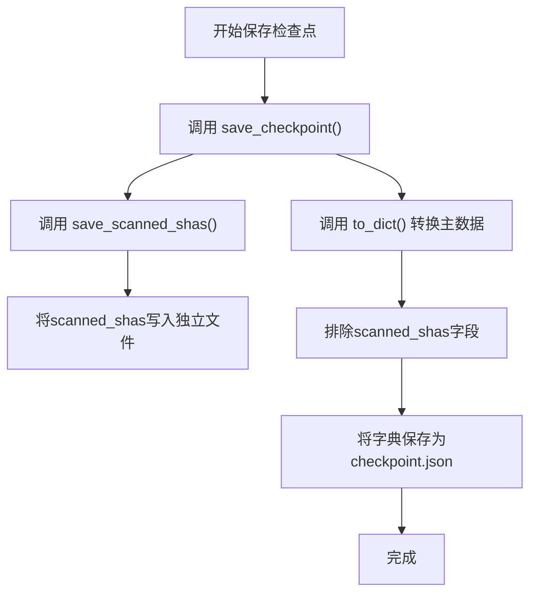
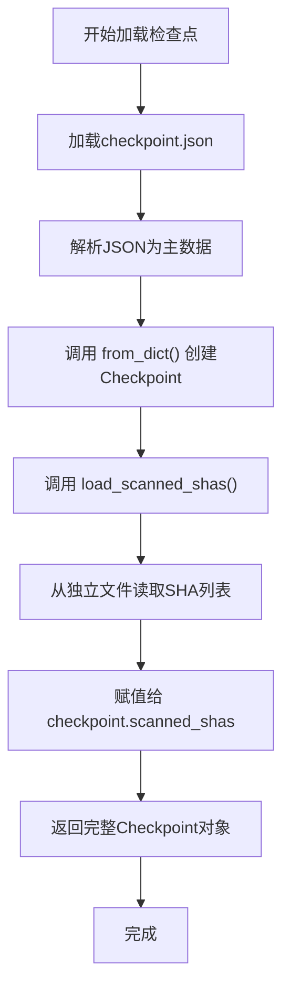
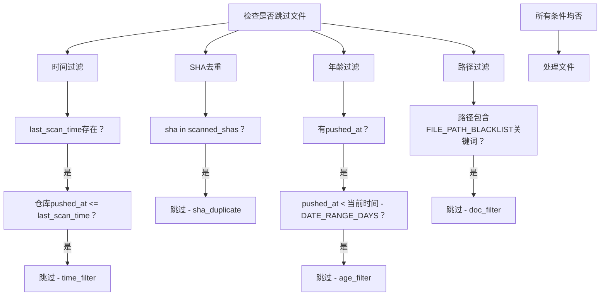
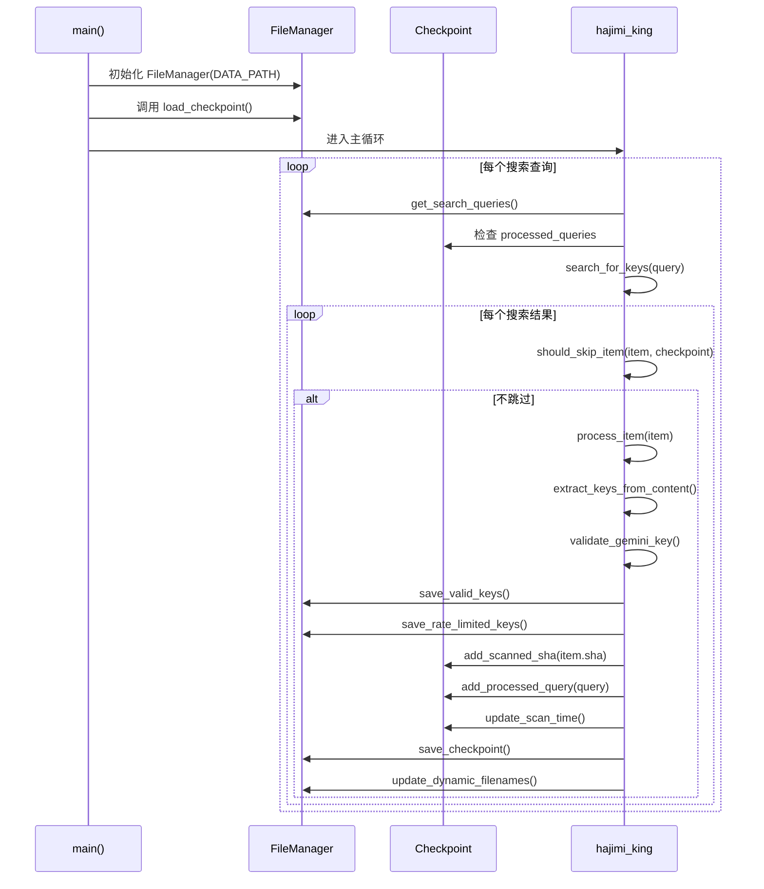
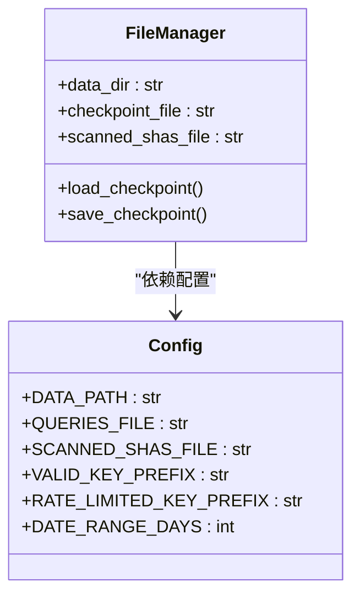
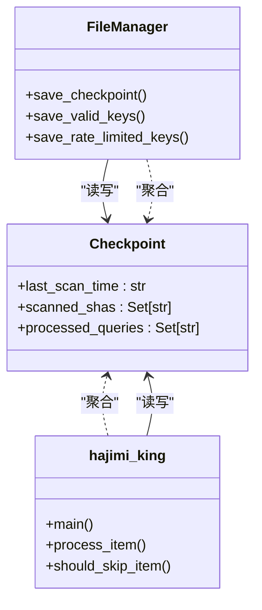
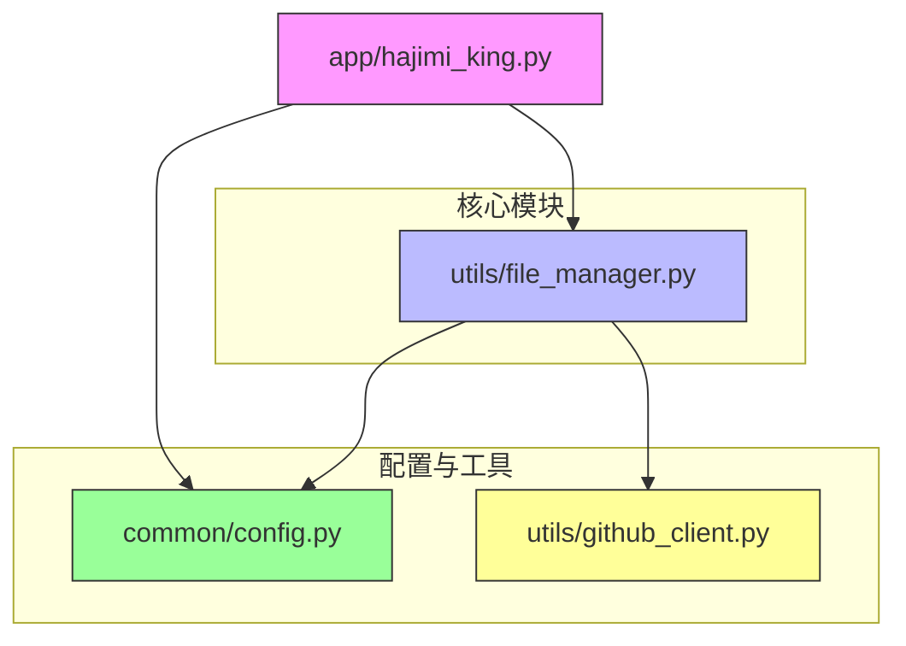

# 文件管理与检查点接口文档

<cite>
**本文档引用的文件**  
- [file_manager.py](file://utils/file_manager.py)
- [hajimi_king.py](file://app/hajimi_king.py)
- [config.py](file://common/config.py)
</cite>

## 更新摘要
**已更新内容**  
- 移除了与同步功能相关的所有方法、属性和文件管理逻辑
- 更新了`Checkpoint`类的数据结构，移除了`wait_send_balancer`和`wait_send_gpt_load`字段
- 修正了`FileManager`类的文件名管理，移除了与`KEYS_SEND`相关的文件名属性和方法
- 更新了配置文件`config.py`中与同步功能相关的配置项
- 修正了主应用`hajimi_king.py`中与同步功能相关的代码

**Section sources**  
- [file_manager.py](file://utils/file_manager.py)
- [hajimi_king.py](file://app/hajimi_king.py)
- [config.py](file://common/config.py)

## 目录
1. [项目结构分析](#项目结构分析)  
2. [核心组件分析](#核心组件分析)  
3. [Checkpoint类持久化机制](#checkpoint类持久化机制)  
4. [FileManager类公共接口](#filemanager类公共接口)  
5. [实际调用流程与使用示例](#实际调用流程与使用示例)  
6. [数据一致性与容错机制](#数据一致性与容错机制)  
7. [模块协作关系](#模块协作关系)  
8. [依赖关系图](#依赖关系图)

## 项目结构分析

本项目采用模块化分层结构，主要分为以下目录：

- `app/`：主应用入口（`hajimi_king.py`）
- `common/`：通用工具与配置（日志、配置）
- `utils/`：核心工具模块（文件管理、GitHub客户端）
- `scripts/`：脚本工具
- 根目录：部署与配置文件（Docker、pyproject等）

该结构清晰分离了业务逻辑、配置管理和工具功能，便于维护和扩展。

**Section sources**  
- [file_manager.py](file://utils/file_manager.py#L1-L431)
- [hajimi_king.py](file://app/hajimi_king.py#L1-L511)
- [config.py](file://common/config.py#L1-L169)

## 核心组件分析

系统核心由以下组件构成：

- **FileManager**：负责所有文件读写、检查点管理、结果存储
- **Checkpoint**：维护扫描状态，支持断点续传
- **hajimi_king**：主控制流程，执行搜索与密钥提取
- **config**：集中化配置管理

这些组件通过全局实例和依赖注入方式协同工作，形成完整的工作流。

**Section sources**  
- [file_manager.py](file://utils/file_manager.py#L1-L431)
- [hajimi_king.py](file://app/hajimi_king.py#L1-L511)
- [config.py](file://common/config.py#L1-L169)

## Checkpoint类持久化机制

### 持久化数据结构

`Checkpoint` 类使用 `dataclass` 定义扫描状态，包含以下字段：

- **last_scan_time**：上次扫描时间（ISO格式字符串）
- **scanned_shas**：已扫描文件的SHA集合
- **processed_queries**：已处理的搜索查询集合

```python
@dataclass
class Checkpoint:
    last_scan_time: Optional[str] = None
    scanned_shas: Set[str] = field(default_factory=set)
    processed_queries: Set[str] = field(default_factory=set)
```

### 序列化/反序列化实现

为优化性能和可维护性，`Checkpoint` 采用**分文件存储**策略：

- 主状态（`checkpoint.json`）：存储除 `scanned_shas` 外的所有数据
- SHA列表（独立文件）：单独存储 `scanned_shas` 集合

#### 序列化过程



**Diagram sources**  
- [file_manager.py](file://utils/file_manager.py#L100-L120)

#### 反序列化过程



**Diagram sources**  
- [file_manager.py](file://utils/file_manager.py#L60-L90)

### 增量扫描实现原理

通过 `should_skip_item()` 函数实现增量扫描，判断逻辑如下：



**Diagram sources**  
- [hajimi_king.py](file://app/hajimi_king.py#L200-L250)

**Section sources**  
- [file_manager.py](file://utils/file_manager.py#L60-L120)
- [hajimi_king.py](file://app/hajimi_king.py#L200-L250)

## FileManager类公共接口

### 构造函数

```python
def __init__(self, data_dir: str)
```

**参数说明**：
- **data_dir**：数据存储根目录

**功能**：
- 初始化所有文件路径
- 创建数据目录
- 加载搜索查询
- 初始化动态文件名（按日期）

**Section sources**  
- [file_manager.py](file://utils/file_manager.py#L20-L80)

### 检查点管理接口

#### `load_checkpoint() -> Checkpoint`

加载完整的检查点状态。

**调用顺序**：
1. 从 `checkpoint.json` 加载主数据
2. 调用 `load_scanned_shas()` 加载SHA列表
3. 合并为完整 `Checkpoint` 对象

#### `save_checkpoint(checkpoint: Checkpoint) -> None`

保存检查点状态。

**调用顺序**：
1. 调用 `save_scanned_shas()` 保存SHA列表
2. 调用 `to_dict()` 转换主数据
3. 保存为 `checkpoint.json`

#### `load_scanned_shas() -> Set[str]`

从独立文件加载已扫描的SHA集合。

**异常处理**：
- 文件不存在：返回空集合
- 读取失败：记录错误日志，返回空集合

#### `save_scanned_shas(scanned_shas: Set[str]) -> None`

将SHA集合保存到独立文件。

**文件格式**：
```
# 已扫描的文件SHA列表
# 每行一个SHA，用于避免重复扫描
# 最后更新时间: 2024-01-01 12:00:00

a1b2c3d4...
e5f6g7h8...
```

**Section sources**  
- [file_manager.py](file://utils/file_manager.py#L90-L150)

### 文件读写接口

#### `load_search_queries(queries_file_path: str) -> List[str]`

加载搜索查询列表。

**行为**：
- 文件不存在：创建默认查询文件
- 解析每行，忽略空行和注释行

#### `save_valid_keys(repo_name, file_path, file_url, valid_keys)`

保存有效密钥。

**写入两个文件**：
1. **详细日志**：包含时间、URL、密钥的详细记录
2. **密钥文件**：仅包含密钥列表（一行一个）

#### `save_rate_limited_keys(...)`

保存被限流的密钥，格式同上。

**Section sources**  
- [file_manager.py](file://utils/file_manager.py#L150-L250)

### 动态文件管理接口

#### `update_dynamic_filenames() -> None`

根据当前日期更新输出文件名，实现按日分割。

**触发条件**：
- 每处理5个查询
- 主循环每次迭代

#### 文件名属性（只读）

- **detail_log_filename**：详细日志文件路径
- **keys_valid_filename**：有效密钥文件路径
- **rate_limited_filename**：限流密钥文件路径
- **rate_limited_detail_filename**：限流密钥详细日志文件路径

**向后兼容属性**：
- **main_log_filename**：等同于 `detail_log_filename`
- **keys_only_filename**：等同于 `keys_valid_filename`

**Section sources**  
- [file_manager.py](file://utils/file_manager.py#L250-L350)

## 实际调用流程与使用示例

### 主流程调用顺序



**Diagram sources**  
- [hajimi_king.py](file://app/hajimi_king.py#L300-L500)
- [file_manager.py](file://utils/file_manager.py#L100-L120)

### 使用示例

```python
# 1. 初始化
file_manager = FileManager(Config.DATA_PATH)

# 2. 加载检查点
checkpoint = file_manager.load_checkpoint()

# 3. 处理文件时更新状态
checkpoint.add_scanned_sha("a1b2c3d4...")
checkpoint.add_processed_query("AIzaSy in:file")
checkpoint.update_scan_time()

# 4. 保存结果
file_manager.save_valid_keys(
    repo_name="user/repo",
    file_path="src/config.js",
    file_url="https://github.com/...",
    valid_keys=["AIzaSy..."]
)

# 5. 保存检查点
file_manager.save_checkpoint(checkpoint)
```

**Section sources**  
- [hajimi_king.py](file://app/hajimi_king.py#L300-L500)
- [file_manager.py](file://utils/file_manager.py#L100-L120)

## 数据一致性与容错机制

### 一致性保障

1. **原子性操作**：
   - `save_checkpoint()` 先保存 `scanned_shas` 再保存主文件
   - 每处理20个文件或完成一个查询后立即保存检查点

2. **状态同步**：
   - 程序异常退出时，`KeyboardInterrupt` 捕获后仍会保存检查点

### 容错能力

1. **异常处理**：
   - 文件读写失败：记录日志，不中断主流程
   - JSON解析失败：使用默认值或空集合

2. **降级策略**：
   - 无检查点：进入全量扫描模式
   - 配置缺失：使用默认值
   - 代理失败：随机选择其他代理

3. **恢复能力**：
   - 断点续传：基于 `last_scan_time` 和 `scanned_shas`

**Section sources**  
- [file_manager.py](file://utils/file_manager.py#L100-L150)
- [hajimi_king.py](file://app/hajimi_king.py#L400-L500)

## 模块协作关系

### 与config模块协作

`FileManager` 依赖 `config.py` 中的以下配置：

- **DATA_PATH**：数据目录
- **QUERIES_FILE**：查询文件路径
- **SCANNED_SHAS_FILE**：SHA文件路径
- **文件前缀配置**：各类输出文件的命名规则
- **DATE_RANGE_DAYS**：仓库年龄过滤阈值



**Diagram sources**  
- [file_manager.py](file://utils/file_manager.py#L20-L80)
- [config.py](file://common/config.py#L1-L50)

### 与hajimi_king模块协作

`FileManager` 与 `hajimi_king` 通过共享 `checkpoint` 对象协作：



**关键协作点**：
- `FileManager.save_checkpoint()` 持久化扫描状态
- `hajimi_king` 在处理文件时更新 `checkpoint` 状态
- `hajimi_king` 在主循环中定期保存检查点

**Diagram sources**  
- [file_manager.py](file://utils/file_manager.py#L100-L120)
- [hajimi_king.py](file://app/hajimi_king.py#L50-L100)

**Section sources**  
- [file_manager.py](file://utils/file_manager.py#L1-L431)
- [hajimi_king.py](file://app/hajimi_king.py#L1-L511)
- [config.py](file://common/config.py#L1-L169)

## 依赖关系图



**Diagram sources**  
- [file_manager.py](file://utils/file_manager.py#L1-L431)
- [hajimi_king.py](file://app/hajimi_king.py#L1-L511)
- [config.py](file://common/config.py#L1-L169)