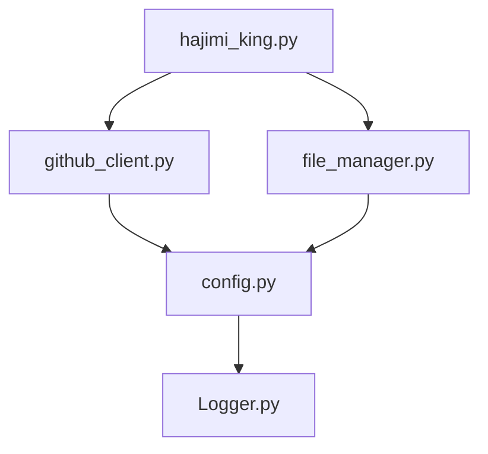
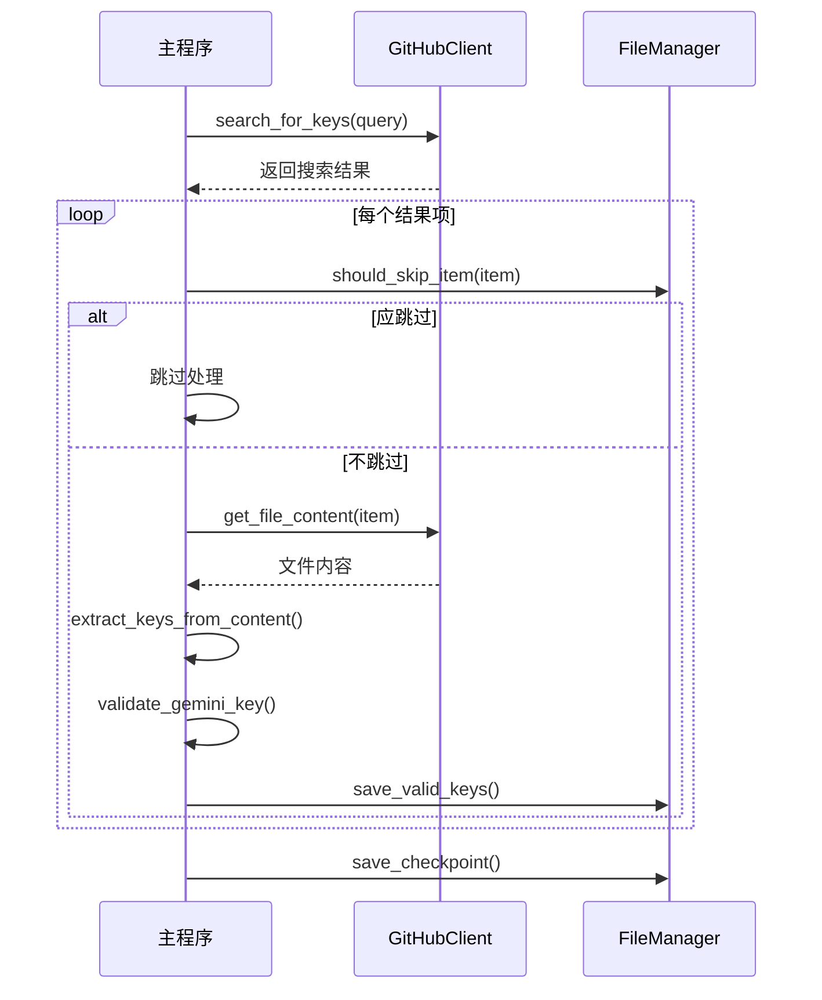
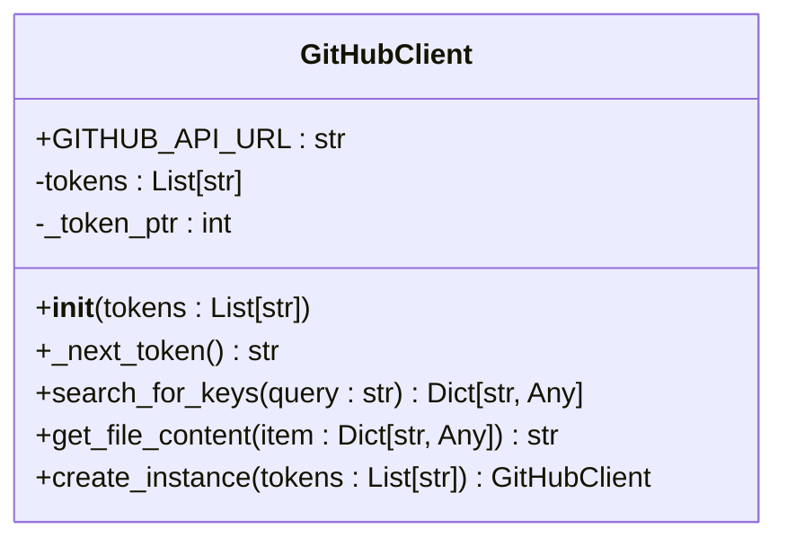
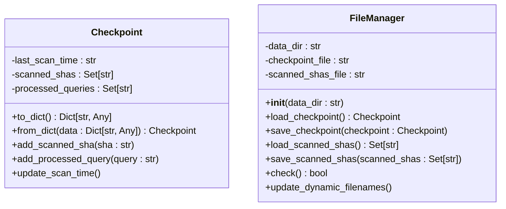
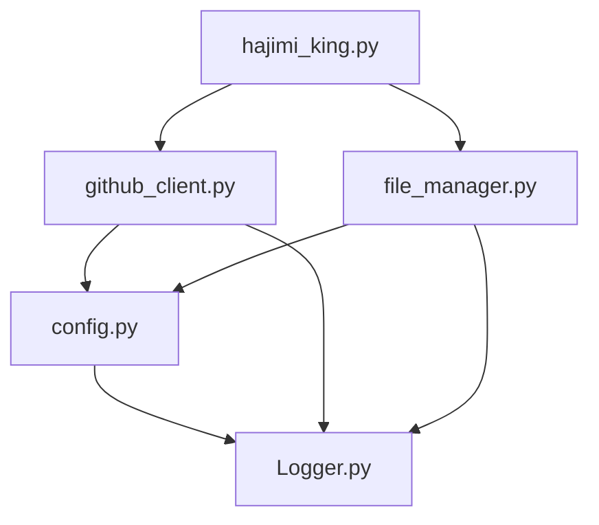

# 核心模块接口文档

<cite>
**本文档中引用的文件**   
- [github_client.py](file://utils/github_client.py)
- [file_manager.py](file://utils/file_manager.py)
- [config.py](file://common/config.py)
- [hajimi_king.py](file://app/hajimi_king.py)
- [Logger.py](file://common/Logger.py) - *在最近提交中更新*
</cite>

## 更新摘要
**变更内容**   
- 移除了与同步功能相关的所有模块和方法
- 更新了文件管理器中与同步相关的文件路径和属性
- 从配置文件中删除了同步服务相关配置项
- 重构了主程序中与同步功能相关的逻辑
- 更新了架构图和依赖关系图以反映最新代码结构
- **重构日志模块**：`Logger.py` 已扩展，新增多个专用日志方法，包括进度、网络、文件操作等专用日志输出

## 目录
1. [项目结构](#项目结构)
2. [核心组件](#核心组件)
3. [架构概述](#架构概述)
4. [详细组件分析](#详细组件分析)
5. [依赖分析](#依赖分析)
6. [性能考虑](#性能考虑)
7. [故障排除指南](#故障排除指南)
8. [结论](#结论)

## 项目结构

该项目采用模块化设计，主要分为以下几个目录：

- `app/`：主应用程序入口
- `common/`：通用工具类，如日志和配置
- `scripts/`：脚本文件
- `utils/`：核心功能工具模块
- 根目录：包含部署和配置文件（Dockerfile, pyproject.toml等）

核心功能集中在 `utils/` 目录下的两个模块：`github_client.py`（GitHub API客户端）和 `file_manager.py`（文件管理器）。`sync_utils.py` 模块已被移除。



**图示来源**
- [github_client.py](file://utils/github_client.py)
- [file_manager.py](file://utils/file_manager.py)
- [config.py](file://common/config.py)
- [hajimi_king.py](file://app/hajimi_king.py)

**本节来源**
- [github_client.py](file://utils/github_client.py)
- [file_manager.py](file://utils/file_manager.py)

## 核心组件

本项目包含两个核心工具模块：`GitHubClient` 负责与GitHub API交互，`FileManager` 管理本地文件和持久化状态。这些模块通过全局实例在 `hajimi_king.py` 主程序中协同工作，实现API密钥的搜索、验证和分发。

**本节来源**
- [github_client.py](file://utils/github_client.py#L1-L217)
- [file_manager.py](file://utils/file_manager.py#L1-L492)

## 架构概述

系统采用生产者-消费者模式，主循环作为生产者从GitHub搜索密钥，`FileManager` 作为消费者将验证后的密钥保存到本地文件。



**图示来源**
- [hajimi_king.py](file://app/hajimi_king.py#L100-L500)
- [github_client.py](file://utils/github_client.py#L50-L200)
- [file_manager.py](file://utils/file_manager.py#L200-L400)

## 详细组件分析

### GitHub客户端分析

`GitHubClient` 类实现了多令牌轮换的工厂模式，确保API调用的高可用性和稳定性。

#### 类图


**图示来源**
- [github_client.py](file://utils/github_client.py#L1-L217)

#### 工厂模式与多令牌轮换实现

`GitHubClient` 使用静态工厂方法 `create_instance` 创建实例，符合工厂模式设计原则。其核心是 `_next_token` 方法实现的令牌轮换机制：

```python
def _next_token(self) -> Optional[str]:
    if not self.tokens:
        return None
    token = self.tokens[self._token_ptr % len(self.tokens)]
    self._token_ptr += 1
    return token.strip() if isinstance(token, str) else token
```

该机制通过 `_token_ptr` 指针实现循环轮换，当请求遇到403/429错误时，自动重试并轮换到下一个令牌。`search_for_keys` 方法还集成了代理支持和指数退避重试策略，确保在高并发场景下的稳定性。

**使用示例：**
```python
from utils.github_client import GitHubClient
from common.config import Config

# 初始化客户端
client = GitHubClient.create_instance(Config.GITHUB_TOKENS)

# 搜索密钥
result = client.search_for_keys("AIzaSy in:file")
for item in result["items"]:
    content = client.get_file_content(item)
    if content:
        print(f"文件内容: {content[:100]}...")
```

**本节来源**
- [github_client.py](file://utils/github_client.py#L1-L217)

### 文件管理器分析

`FileManager` 模块负责持久化状态管理和文件操作，其核心是 `Checkpoint` 类的增量扫描机制。

#### 类图


**图示来源**
- [file_manager.py](file://utils/file_manager.py#L1-L50)

#### 持久化机制与增量扫描实现

`Checkpoint` 类使用数据类（dataclass）实现，将扫描状态持久化到两个文件：`checkpoint.json` 和 `scanned_shas.txt`。这种分离设计避免了单个大文件的读写瓶颈。

增量扫描通过 `last_scan_time` 和 `scanned_shas` 实现：
- `last_scan_time` 记录上次扫描时间，跳过在此时间前推送的仓库
- `scanned_shas` 记录已扫描文件的SHA值，避免重复处理

`FileManager` 在初始化时自动创建必要的目录和文件，并通过 `update_dynamic_filenames` 方法实现按日期分割的日志文件。

**使用示例：**
```python
from utils.file_manager import FileManager, Checkpoint
from common.config import Config

# 初始化文件管理器
fm = FileManager(Config.DATA_PATH)

# 加载检查点
cp = fm.load_checkpoint()

# 添加已扫描的文件
cp.add_scanned_sha("abc123def456")
cp.update_scan_time()

# 保存检查点
fm.save_checkpoint(cp)
```

**本节来源**
- [file_manager.py](file://utils/file_manager.py#L1-L492)

## 依赖分析

系统各组件间存在明确的依赖关系，形成清晰的调用链。



**图示来源**
- [github_client.py](file://utils/github_client.py)
- [file_manager.py](file://utils/file_manager.py)
- [config.py](file://common/config.py)
- [hajimi_king.py](file://app/hajimi_king.py)

**本节来源**
- [github_client.py](file://utils/github_client.py)
- [file_manager.py](file://utils/file_manager.py)

## 性能考虑

- **令牌轮换**：多令牌机制有效避免单个令牌的速率限制
- **增量扫描**：通过时间戳和SHA值过滤，大幅减少重复工作
- **缓存优化**：对GPT Load Balancer的group ID进行缓存，减少API调用
- **批量处理**：定期批量发送密钥，减少网络开销

## 故障排除指南

常见问题及解决方案：

1. **GitHub API 403/429错误**
   - 确保 `GITHUB_TOKENS` 环境变量配置了多个有效令牌
   - 检查令牌的权限是否包含 `repo` 范围
   - 考虑配置代理（`PROXY` 环境变量）

2. **密钥验证失败**
   - 检查 `HAJIMI_CHECK_MODEL` 配置的模型名称是否正确
   - 确认Gemini API已启用

3. **文件权限错误**
   - 确保 `DATA_PATH` 目录存在且程序有读写权限
   - 检查Docker容器的卷挂载配置

**本节来源**
- [github_client.py](file://utils/github_client.py#L100-L200)
- [config.py](file://common/config.py#L100-L200)

## 结论

本文档详细分析了 `APIKEY-king` 项目的核心模块，包括 `GitHubClient` 的多令牌轮换机制和 `FileManager` 的持久化状态管理。由于 `sync_utils` 模块已被移除，系统现在专注于本地密钥发现和存储。这些组件协同工作，实现了一个高效、稳定且可扩展的API密钥发现系统。开发者在集成时应重点关注配置的正确性、错误处理机制以及性能优化策略。