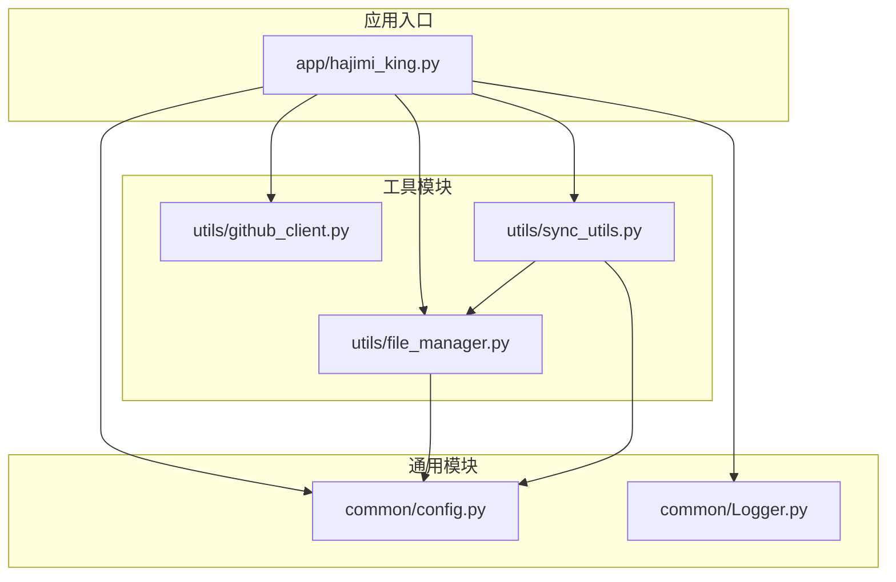
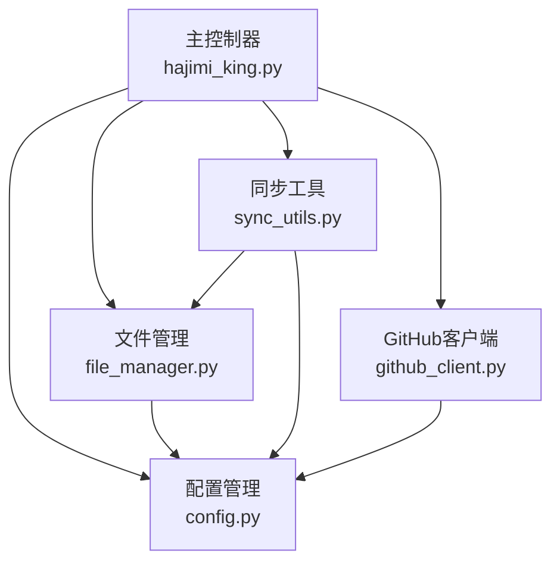
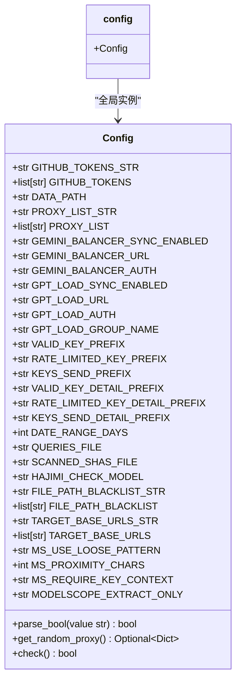
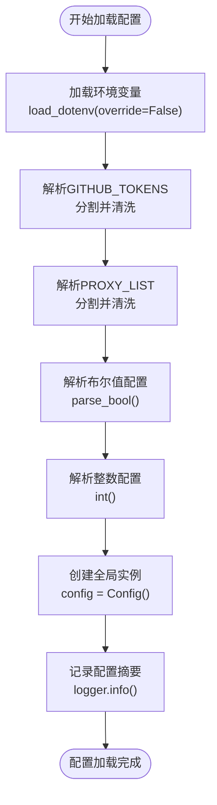
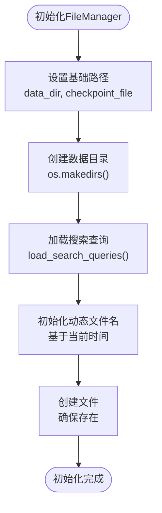
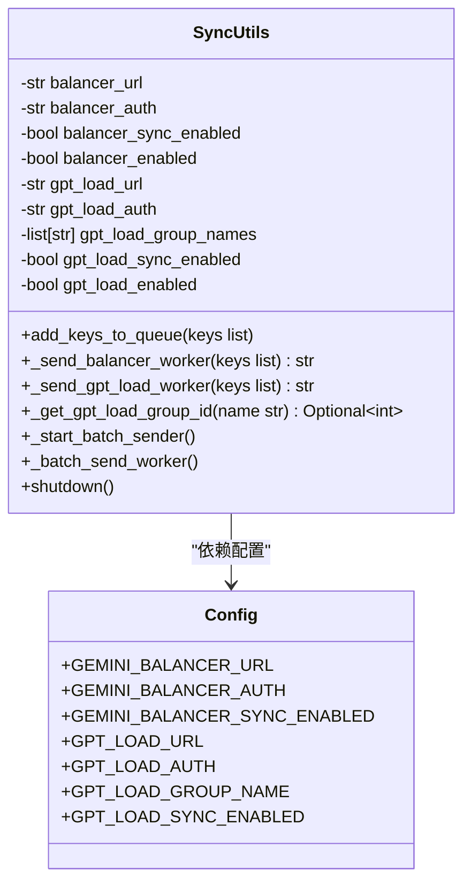
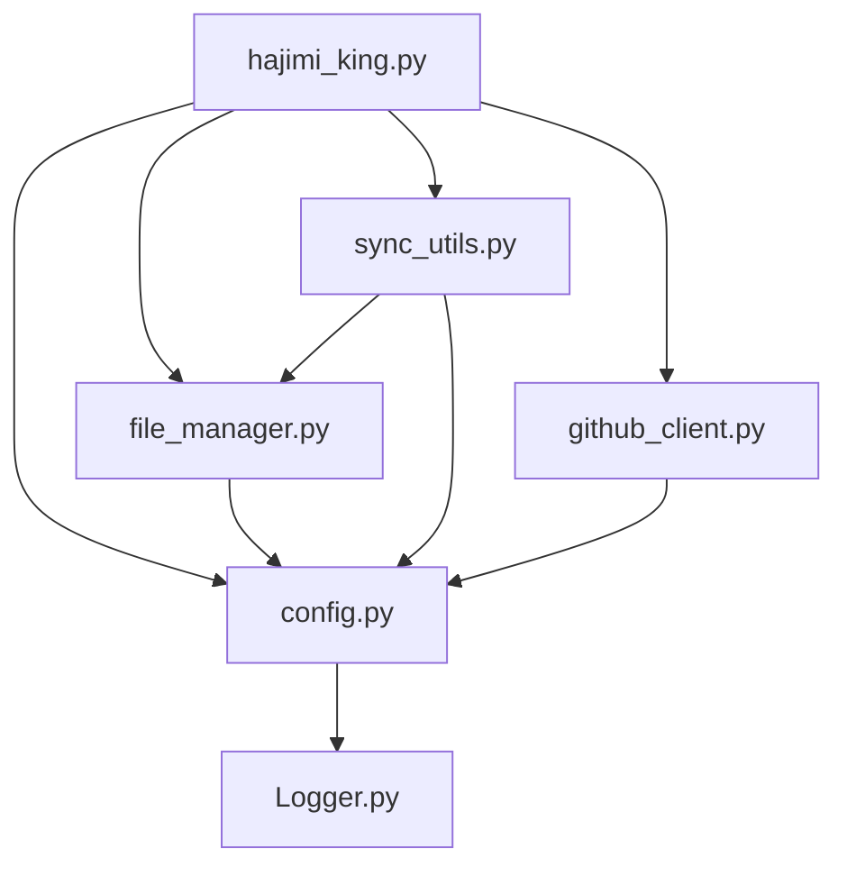

# 配置管理接口文档

<cite>
**本文档中引用的文件**   
- [config.py](file://common/config.py#L1-L203)
- [hajimi_king.py](file://app/hajimi_king.py#L1-L524)
- [file_manager.py](file://utils/file_manager.py#L1-L493)
- [sync_utils.py](file://utils/sync_utils.py#L1-L485)
</cite>

## 目录
1. [项目结构](#项目结构)
2. [核心组件](#核心组件)
3. [架构概览](#架构概览)
4. [详细组件分析](#详细组件分析)
5. [依赖分析](#依赖分析)
6. [性能考量](#性能考量)
7. [故障排除指南](#故障排除指南)
8. [结论](#结论)

## 项目结构

项目采用模块化分层设计，核心功能按职责分离到不同目录中，确保高内聚低耦合。



**图示来源**
- [config.py](file://common/config.py#L1-L203)
- [hajimi_king.py](file://app/hajimi_king.py#L1-L524)
- [file_manager.py](file://utils/file_manager.py#L1-L493)
- [sync_utils.py](file://utils/sync_utils.py#L1-L485)

**本节来源**
- [config.py](file://common/config.py#L1-L203)
- [hajimi_king.py](file://app/hajimi_king.py#L1-L524)

## 核心组件

`config.py` 模块实现了配置管理的核心功能，通过单例模式提供全局配置访问。该模块负责加载环境变量、解析配置项、执行类型验证，并为其他模块提供安全的配置访问接口。

主要功能包括：
- **环境变量加载**：使用 `python-dotenv` 从 `.env` 文件加载配置，仅在环境变量未设置时生效。
- **配置项解析**：对字符串格式的配置（如代理列表、GitHub令牌）进行分割与清洗。
- **类型转换**：将字符串配置转换为所需类型（如整数、布尔值）。
- **安全处理**：敏感信息（如令牌、认证密钥）在日志中脱敏显示。
- **运行时验证**：通过 `check()` 方法验证必要配置的完整性。

```python
# 创建全局配置实例
config = Config()
```

**本节来源**
- [config.py](file://common/config.py#L1-L203)

## 架构概览

系统采用主从式架构，`hajimi_king.py` 作为主控制器协调各模块工作。配置模块作为基础服务，被所有其他模块依赖。



**图示来源**
- [config.py](file://common/config.py#L1-L203)
- [hajimi_king.py](file://app/hajimi_king.py#L1-L524)
- [file_manager.py](file://utils/file_manager.py#L1-L493)
- [sync_utils.py](file://utils/sync_utils.py#L1-L485)

## 详细组件分析

### 配置管理模块分析

`Config` 类是配置管理的核心，采用类属性和类方法实现单例模式，无需实例化即可全局访问。

#### 类结构与关系



**图示来源**
- [config.py](file://common/config.py#L12-L169)

#### 配置加载与解析流程



**图示来源**
- [config.py](file://common/config.py#L1-L203)

**本节来源**
- [config.py](file://common/config.py#L1-L203)

### 文件管理模块分析

`file_manager.py` 模块负责所有文件操作，依赖 `config` 模块获取路径和前缀配置。

#### 初始化流程



**图示来源**
- [file_manager.py](file://utils/file_manager.py#L1-L493)

**本节来源**
- [file_manager.py](file://utils/file_manager.py#L1-L493)

### 同步工具模块分析

`sync_utils.py` 模块负责异步同步密钥到外部服务，其行为受 `config` 模块中的多个配置项控制。

#### 配置依赖关系



**图示来源**
- [sync_utils.py](file://utils/sync_utils.py#L1-L485)
- [config.py](file://common/config.py#L1-L203)

**本节来源**
- [sync_utils.py](file://utils/sync_utils.py#L1-L485)

## 依赖分析

系统各模块间的依赖关系清晰，`config.py` 作为基础模块被广泛依赖。



**图示来源**
- [config.py](file://common/config.py#L1-L203)
- [hajimi_king.py](file://app/hajimi_king.py#L1-L524)
- [file_manager.py](file://utils/file_manager.py#L1-L493)
- [sync_utils.py](file://utils/sync_utils.py#L1-L485)

**本节来源**
- [config.py](file://common/config.py#L1-L203)
- [hajimi_king.py](file://app/hajimi_king.py#L1-L524)
- [file_manager.py](file://utils/file_manager.py#L1-L493)
- [sync_utils.py](file://utils/sync_utils.py#L1-L485)

## 性能考量

- **配置加载**：`config.py` 在模块加载时一次性完成所有配置解析，避免重复计算。
- **随机代理**：`get_random_proxy()` 方法使用 `random.choice()` 实现O(1)时间复杂度的随机选择。
- **日志记录**：配置摘要在启动时集中输出，减少I/O操作频率。
- **内存使用**：配置项均为基本类型或小列表，内存占用低。

## 故障排除指南

### 配置检查失败

当 `Config.check()` 返回 `False` 时，系统将退出。常见原因及解决方法：

- **GitHub令牌缺失**：确保 `GITHUB_TOKENS` 环境变量已设置，多个令牌用逗号分隔。
- **Balancer配置不完整**：若启用 `GEMINI_BALANCER_SYNC_ENABLED`，需同时配置 `GEMINI_BALANCER_URL` 和 `GEMINI_BALANCER_AUTH`。
- **GPT Load Balancer配置不完整**：若启用 `GPT_LOAD_SYNC_ENABLED`，需同时配置 `GPT_LOAD_URL`、`GPT_LOAD_AUTH` 和 `GPT_LOAD_GROUP_NAME`。

### 文件管理器检查失败

`file_manager.check()` 失败通常由以下原因导致：
- **查询文件缺失**：检查 `QUERIES_FILE` 指定的文件是否存在，或确保 `data_dir` 目录可写以创建默认文件。
- **权限问题**：确保程序对 `DATA_PATH` 目录有读写权限。

### 同步队列积压

若 `wait_send_balancer` 或 `wait_send_gpt_load` 队列持续增长，可能原因：
- **网络问题**：检查与Balancer服务的网络连接。
- **认证失败**：验证 `GEMINI_BALANCER_AUTH` 或 `GPT_LOAD_AUTH` 是否正确。
- **服务不可用**：确认Balancer服务是否正常运行。

**本节来源**
- [config.py](file://common/config.py#L150-L169)
- [file_manager.py](file://utils/file_manager.py#L1-L493)
- [sync_utils.py](file://utils/sync_utils.py#L1-L485)

## 结论

`config.py` 模块通过简洁有效的设计，实现了配置管理的核心需求。其单例模式确保了配置的全局一致性，环境变量加载机制提供了灵活的部署配置方式，而类型验证和安全处理则保障了系统的稳定与安全。该模块作为系统的基础服务，被 `hajimi_king.py`、`file_manager.py` 和 `sync_utils.py` 等核心模块所依赖，是整个应用正常运行的关键。