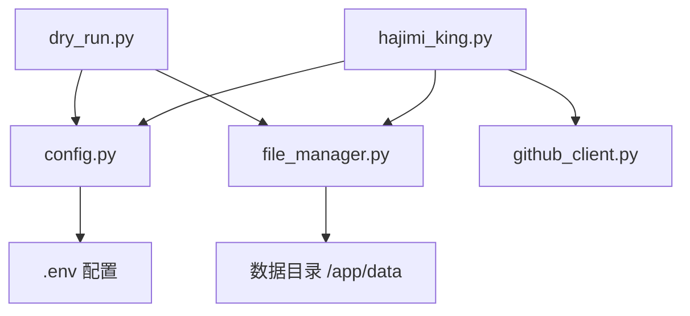
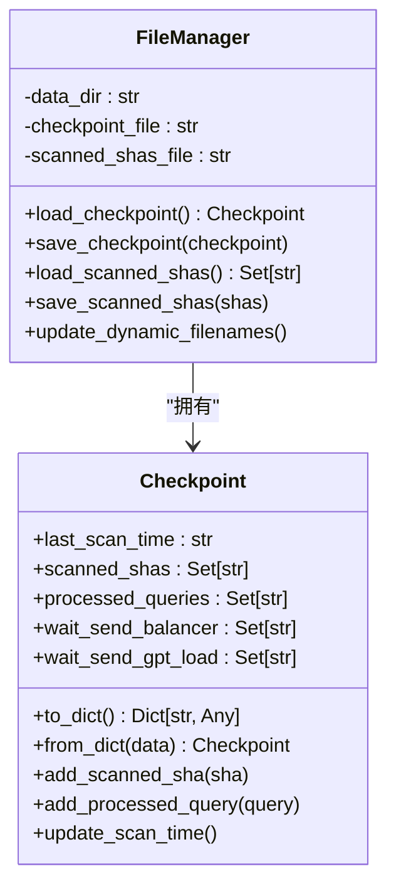
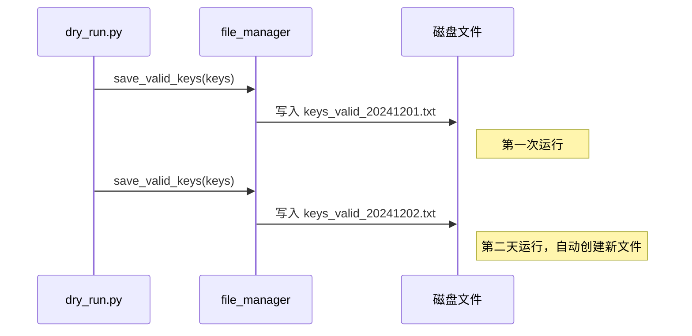

# 测试策略

<cite>
**本文档引用的文件**  
- [dry_run.py](file://scripts/dry_run.py)
- [hajimi_king.py](file://app/hajimi_king.py)
- [config.py](file://common/config.py)
- [file_manager.py](file://utils/file_manager.py)
</cite>

## 目录
1. [项目结构分析](#项目结构分析)  
2. [核心功能与测试目标](#核心功能与测试目标)  
3. [dry_run.py 实现机制详解](#dry_runpy-实现机制详解)  
4. [与主程序 hajimi_king.py 的调用关系](#与主程序-hajimi_kingpy-的调用关系)  
5. [检查点机制与可重复测试](#检查点机制与可重复测试)  
6. [使用示例](#使用示例)  
7. [在增量扫描与断点续传中的作用](#在增量扫描与断点续传中的作用)  
8. [优化测试覆盖率的建议](#优化测试覆盖率的建议)  
9. [常见问题与调试](#常见问题与调试)

## 项目结构分析

项目采用模块化分层架构，主要目录结构如下：

```
.
├── app
│   └── hajimi_king.py          # 主程序入口
├── common
│   ├── Logger.py               # 日志工具
│   └── config.py               # 全局配置管理
├── scripts
│   └── dry_run.py              # 非破坏性测试脚本
├── utils
│   ├── file_manager.py         # 文件与检查点管理
│   ├── github_client.py        # GitHub API 客户端
│   └── sync_utils.py           # 同步工具
├── CHANGELOG.md
├── Dockerfile
├── README.md
├── docker-compose.yml
├── first_deploy.sh
└── pyproject.toml
```

该结构清晰划分了核心逻辑、工具模块与测试脚本，便于维护与扩展。

**Section sources**  
- [project_structure](file://project_structure)

## 核心功能与测试目标

本项目核心功能为从 GitHub 代码仓库中扫描并提取特定格式的 API 密钥（如 `ms-uuid` 格式的 ModelScope 密钥）。测试策略的核心目标是：

- **非破坏性验证**：确保密钥提取逻辑正确，不触发实际 API 调用或网络请求。
- **逻辑隔离**：在不启动主程序完整流程的前提下，独立验证密钥提取算法。
- **配置驱动测试**：通过配置文件控制提取模式（严格/宽松）、上下文要求、距离阈值等。
- **可重复性**：利用检查点机制，支持断点续测与结果比对。

## dry_run.py 实现机制详解

`scripts/dry_run.py` 是一个独立的测试脚本，用于模拟主程序中密钥提取的核心逻辑。其工作机制如下：

### 模拟输入内容

脚本构造了一段包含 `base_url` 和多个 `ms-key` 的模拟代码内容，涵盖多种语法结构（如 `const`、`var`、字符串内嵌等），以测试不同上下文下的提取能力。

```python
content = f"""
    // demo code
    const BASE = "{base_url}";
    const MS_KEY_1 = "{sample_keys[0]}"; // token
    var secret = '{sample_keys[1]}';
    fetch('{base_url}infer', {{ headers: {{ Authorization: 'Bearer {sample_keys[2]}' }} }});
    """
```

### 提取逻辑实现

脚本内嵌了与主程序一致的密钥提取逻辑，避免导入主程序时触发不必要的线程或网络操作。

- **正则表达式**：
  - 严格模式：`r'(?i)\bms-[0-9a-f]{8}-[0-9a-f]{4}-[0-9a-f]{4}-[0-9a-f]{4}-[0-9a-f]{12}\b'`
  - 宽松模式：`r'(?i)\bms-[0-9a-f-]{30,}\b'`
- **base_url 检测**：检查内容中是否包含 `Config.TARGET_BASE_URLS` 中的任意 URL。
- **邻近性过滤**：当启用宽松模式时，要求密钥与 `base_url` 的距离在 `MS_PROXIMITY_CHARS` 字符范围内。
- **上下文关键词过滤**：当 `MS_REQUIRE_KEY_CONTEXT` 为 `true` 时，要求密钥附近（±80字符）出现 `key`、`token`、`secret` 等关键词。
- **占位符过滤**：排除 `ms-00000000-...` 这类明显无效的占位符。

### 结果输出与落盘

提取到的密钥通过 `file_manager.save_valid_keys()` 方法写入文件，路径与主程序一致，便于验证输出格式的正确性。

```python
file_manager.save_valid_keys(repo_name, file_path, file_url, found)
```

**Section sources**  
- [dry_run.py](file://scripts/dry_run.py#L0-L103)

## 与主程序 hajimi_king.py 的调用关系

`dry_run.py` 与 `app/hajimi_king.py` 通过共享核心模块实现逻辑一致性，而非直接调用。



**Diagram sources**  
- [dry_run.py](file://scripts/dry_run.py#L1-L103)
- [hajimi_king.py](file://app/hajimi_king.py#L1-L523)

**Section sources**  
- [dry_run.py](file://scripts/dry_run.py#L1-L103)
- [hajimi_king.py](file://app/hajimi_king.py#L1-L523)

### 关键共享组件

- **config.py**：提供统一的配置管理，`dry_run.py` 读取与主程序相同的 `TARGET_BASE_URLS`、`MS_USE_LOOSE_PATTERN` 等环境变量。
- **file_manager.py**：提供一致的文件落盘逻辑，确保测试输出与生产输出格式完全一致。
- **提取逻辑复用**：`dry_run.py` 中的提取逻辑是 `hajimi_king.py` 中 `extract_ms_keys_for_modelscope()` 函数的简化副本，保证行为一致。

## 检查点机制与可重复测试

虽然 `dry_run.py` 本身不涉及增量扫描，但它依赖的 `file_manager.py` 实现了完整的检查点（Checkpoint）机制，为可重复测试提供了基础。



**Diagram sources**  
- [file_manager.py](file://utils/file_manager.py#L0-L492)

**Section sources**  
- [file_manager.py](file://utils/file_manager.py#L0-L492)

### 可重复测试流程

1. **初始化**：`file_manager` 加载 `checkpoint.json` 和 `scanned_shas.txt`。
2. **执行 dry run**：脚本运行并调用 `file_manager.save_valid_keys()`。
3. **保存状态**：`file_manager` 自动更新检查点文件。
4. **重复执行**：再次运行 `dry_run.py`，可通过检查输出文件是否重复写入来验证幂等性。

## 使用示例

### 1. 准备测试环境

确保 `.env` 文件配置正确：

```env
TARGET_BASE_URLS=https://api-inference.modelscope.cn/v1/
MS_USE_LOOSE_PATTERN=false
MS_PROXIMITY_CHARS=50
MS_REQUIRE_KEY_CONTEXT=true
DATA_PATH=./test_data
```

### 2. 执行 Dry Run

```bash
cd scripts
python dry_run.py
```

预期输出：

```
[dry-run] 提取成功并已写入：
  keys: ['ms-30184ba8-077f-4abf-a40d-97e8d6fc7cb7', 'ms-74b8eedd-5f76-419a-a513-f421399093da', 'ms-680eeefa-cba1-44f5-ab9e-9098e7e6fc4c']
  keys 文件: ./test_data/keys/keys_valid_20241201.txt
  详细日志: ./test_data/logs/keys_valid_detail_20241201.log
```

### 3. 验证输出结果

检查生成的文件内容：

```bash
cat ./test_data/keys/keys_valid_20241201.txt
```

应包含提取到的三个密钥。

### 4. 调试常见问题

- **问题**：未提取到任何密钥  
  **排查**：检查 `TARGET_BASE_URLS` 是否与 `content` 中的 `base_url` 匹配；确认 `MS_USE_LOOSE_PATTERN` 和 `MS_REQUIRE_KEY_CONTEXT` 配置是否过于严格。

- **问题**：输出文件路径错误  
  **排查**：检查 `DATA_PATH` 环境变量是否设置正确，目录是否有写入权限。

- **问题**：提取到占位符密钥  
  **排查**：确认代码中是否包含对 `ms-00000000-...` 的过滤逻辑。

## 在增量扫描与断点续传中的作用

`dry_run.py` 虽然不直接执行增量扫描，但其验证的提取逻辑是增量扫描功能的核心组成部分。

### 增量扫描验证

通过修改 `dry_run.py` 的模拟内容，可以构造包含新旧文件的测试场景，验证 `should_skip_item()` 函数是否能正确跳过已扫描的 `sha`。

### 断点续传验证

`file_manager.update_dynamic_filenames()` 方法根据日期动态生成文件名。`dry_run.py` 可以在不同时间点运行，验证日志文件是否能正确按日期分割，确保断点续传后数据不会混乱。



**Diagram sources**  
- [file_manager.py](file://utils/file_manager.py#L0-L492)
- [dry_run.py](file://scripts/dry_run.py#L0-L103)

**Section sources**  
- [file_manager.py](file://utils/file_manager.py#L0-L492)
- [dry_run.py](file://scripts/dry_run.py#L0-L103)

## 优化测试覆盖率的建议

1. **参数化测试**：使用 `pytest` 对 `dry_run.py` 进行改造，针对不同配置组合（如 `loose_pattern=true/false`，`require_context=true/false`）进行参数化测试。
2. **边界用例覆盖**：增加测试用例，覆盖密钥位于文件开头/结尾、`base_url` 与密钥距离恰好等于阈值等边界情况。
3. **异常输入测试**：测试包含畸形 `ms-key`（如长度不足、格式错误）的输入，确保正则表达式能正确过滤。
4. **集成检查点测试**：编写测试脚本，模拟主程序的部分流程，调用 `file_manager` 的 `load_checkpoint` 和 `save_checkpoint`，验证检查点的完整性和一致性。
5. **性能测试**：对大文件（如 >1MB）进行提取性能测试，评估正则表达式和上下文搜索的效率。

## 常见问题与调试

| 问题现象 | 可能原因 | 解决方案 |
|--------|--------|--------|
| 未提取到任何密钥 | `TARGET_BASE_URLS` 不匹配 | 检查 `.env` 文件中的 `TARGET_BASE_URLS` 配置 |
| | `MS_USE_LOOSE_PATTERN` 设置为 `true` 但未设置 `MS_PROXIMITY_CHARS` | 确保在宽松模式下设置合理的距离阈值 |
| | `MS_REQUIRE_KEY_CONTEXT` 为 `true` 但密钥附近无关键词 | 在测试内容中添加 `token`、`key` 等关键词 |
| 输出文件为空 | `DATA_PATH` 目录无写入权限 | 检查目录权限或更换 `DATA_PATH` |
| | `file_manager` 初始化失败 | 检查 `FileManager.__init__()` 中的异常日志 |
| 提取到无效密钥 | 正则表达式过于宽松 | 使用严格模式或调整 `proximity_chars` |
| | 未过滤占位符 | 确认代码中包含对 `ms-00000000-...` 的过滤逻辑 |

**Section sources**  
- [dry_run.py](file://scripts/dry_run.py#L0-L103)
- [config.py](file://common/config.py#L0-L203)
- [file_manager.py](file://utils/file_manager.py#L0-L492)