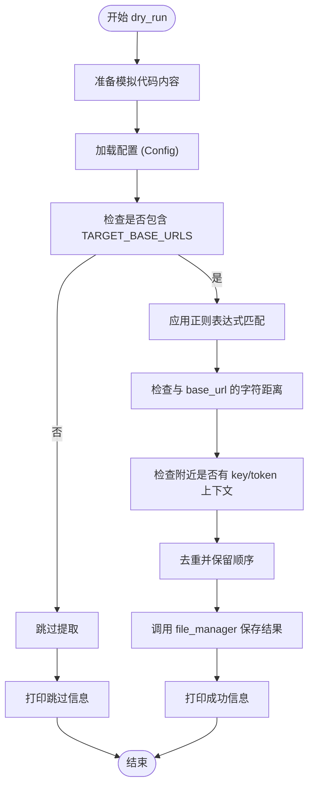

# 测试策略与贡献流程

<cite>
**本文档引用文件**  
- [app/hajimi_king.py](file://app/hajimi_king.py)
- [common/Logger.py](file://common/Logger.py)
- [common/config.py](file://common/config.py)
- [scripts/dry_run.py](file://scripts/dry_run.py)
- [utils/file_manager.py](file://utils/file_manager.py)
- [utils/github_client.py](file://utils/github_client.py)
- [utils/sync_utils.py](file://utils/sync_utils.py)
</cite>

## 目录
1. [测试策略与功能验证](#测试策略与功能验证)
2. [开发者贡献流程](#开发者贡献流程)
3. [本地开发环境配置](#本地开发环境配置)
4. [代码风格与提交规范](#代码风格与提交规范)
5. [分支管理与Pull Request审查](#分支管理与pull-request审查)
6. [从问题发现到修复提交](#从问题发现到提交修复)

## 测试策略与功能验证

本项目采用功能验证与调试脚本相结合的方式，确保新增功能不会破坏现有行为。核心验证机制通过 `scripts/dry_run.py` 实现，该脚本模拟真实环境下的密钥提取流程，用于快速验证配置变更和提取逻辑的正确性。

`dry_run.py` 脚本构建了一段包含 ModelScope 基础 URL 和示例密钥的模拟代码内容，然后应用与主程序 `app/hajimi_king.py` 中一致的正则表达式和上下文匹配逻辑进行密钥提取。该过程验证了 `TARGET_BASE_URLS`、`MS_USE_LOOSE_PATTERN`、`MS_PROXIMITY_CHARS` 和 `MS_REQUIRE_KEY_CONTEXT` 等关键配置项是否按预期工作。



**图示来源**
- [scripts/dry_run.py](file://scripts/dry_run.py#L20-L103)
- [common/config.py](file://common/config.py#L100-L150)
- [utils/file_manager.py](file://utils/file_manager.py#L300-L350)

**本节来源**
- [scripts/dry_run.py](file://scripts/dry_run.py#L1-L103)
- [common/config.py](file://common/config.py#L80-L150)

## 开发者贡献流程

开发者贡献流程旨在确保代码质量和项目稳定性。新贡献者应遵循以下步骤进行开发和提交：

1.  **问题识别**：通过运行程序、查看日志或分析代码发现潜在问题或改进点。
2.  **环境搭建**：按照本地开发环境配置指南设置开发环境。
3.  **分支创建**：基于 `main` 分支创建新的功能或修复分支。
4.  **代码修改**：实现功能或修复问题，确保遵循代码风格规范。
5.  **本地测试**：运行静态检查和基本测试用例，使用 `dry_run.py` 验证功能。
6.  **提交代码**：按照提交消息格式要求提交代码。
7.  **发起Pull Request**：在GitHub上发起PR，等待审查。

该流程确保了所有变更都经过审查和测试，降低了引入错误的风险。

**本节来源**
- [README.md](file://README.md#L1-L343)
- [scripts/dry_run.py](file://scripts/dry_run.py#L1-L103)

## 本地开发环境配置

配置本地开发环境是贡献代码的第一步。请遵循以下步骤：

1.  **克隆仓库**：
    ```bash
    git clone https://github.com/gakkinoone/APIKEY-king.git
    cd APIKEY-king
    ```

2.  **创建虚拟环境并安装依赖**：
    ```bash
    python -m venv venv
    source venv/bin/activate  # Linux/Mac
    # 或 venv\Scripts\activate  # Windows
    pip install -r pyproject.toml
    ```

3.  **配置环境变量**：
    复制示例配置文件并编辑：
    ```bash
    cp env.example .env
    ```
    在 `.env` 文件中至少配置 `GITHUB_TOKENS`。

4.  **创建数据目录**：
    ```bash
    mkdir -p data
    ```

5.  **验证配置**：
    运行 `python app/hajimi_king.py` 或 `python scripts/dry_run.py` 来验证环境是否配置成功。

完成以上步骤后，您就可以开始进行开发和调试了。

**本节来源**
- [README.md](file://README.md#L50-L100)
- [pyproject.toml](file://pyproject.toml#L1-L12)

## 代码风格与提交规范

本项目严格遵守 PEP8 代码风格规范。所有 Python 代码必须通过 `flake8` 或 `black` 等工具的检查。建议在提交前使用 `black` 格式化代码。

提交消息必须遵循以下格式：
```
<类型>: <简短描述>

<详细描述（可选）>

<关联的Issue（可选）>
```

其中 `<类型>` 可以是 `feat`（新功能）、`fix`（修复）、`docs`（文档）、`style`（代码格式）、`refactor`（重构）、`test`（测试）或 `chore`（构建过程或辅助工具的变动）。

例如：
```
fix: 修复 file_manager 中的文件名更新逻辑

在 _need_filename_update 函数中添加了对空字符串的边界检查，防止索引错误。

Closes #123
```

**本节来源**
- [app/hajimi_king.py](file://app/hajimi_king.py)
- [utils/file_manager.py](file://utils/file_manager.py)

## 分支管理与Pull Request审查

项目采用基于 `main` 分支的分支管理策略。所有开发工作应在独立的特性分支或修复分支上进行。

1.  **创建分支**：
    ```bash
    git checkout main
    git pull origin main
    git checkout -b feature/your-feature-name
    ```

2.  **推送分支**：
    ```bash
    git push origin feature/your-feature-name
    ```

3.  **发起Pull Request**：
    在 GitHub 上为您的分支创建 Pull Request，目标为 `main` 分支。

Pull Request 审查标准包括：
- 代码是否符合 PEP8 规范。
- 是否有适当的日志记录。
- 是否添加了必要的错误处理。
- 是否通过了 `dry_run.py` 的功能验证。
- 提交消息是否符合规范。
- 是否有潜在的性能问题。

只有满足所有审查标准的 PR 才会被合并。

**本节来源**
- [README.md](file://README.md#L1-L343)
- [scripts/dry_run.py](file://scripts/dry_run.py#L1-L103)

## 从问题发现到提交修复

以下是从发现一个问题到提交修复的完整路径示例：

1.  **问题发现**：在运行 `app/hajimi_king.py` 时，发现 `file_manager.py` 在处理某些特殊文件名时可能抛出异常。

2.  **本地复现**：修改 `scripts/dry_run.py` 的模拟内容，构造一个能触发该问题的场景。

3.  **代码调试**：在 `utils/file_manager.py` 中定位问题代码，添加日志或使用调试器进行分析。

4.  **编写修复**：在 `file_manager.py` 的 `_need_filename_update` 方法中添加对空字符串和异常格式的检查。

5.  **运行验证**：再次运行 `scripts/dry_run.py`，确认问题已修复且没有引入新问题。

6.  **静态检查**：运行 `black .` 和 `flake8` 确保代码风格正确。

7.  **提交代码**：
    ```bash
    git add utils/file_manager.py
    git commit -m "fix: 修复 file_manager 中的文件名解析边界问题

    在 _need_filename_update 函数中增加了对空字符串和无效格式的检查，
    防止因字符串分割失败而导致的索引错误。

    Closes #150"
    git push origin fix/filename-boundary-issue
    ```

8.  **发起PR**：在 GitHub 上创建 PR，等待维护者审查。

通过遵循此流程，新贡献者可以高效、规范地参与到项目开发中。

**本节来源**
- [scripts/dry_run.py](file://scripts/dry_run.py#L1-L103)
- [utils/file_manager.py](file://utils/file_manager.py#L400-L450)
- [app/hajimi_king.py](file://app/hajimi_king.py)