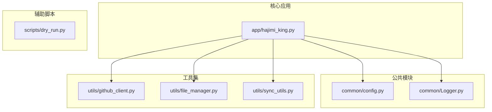
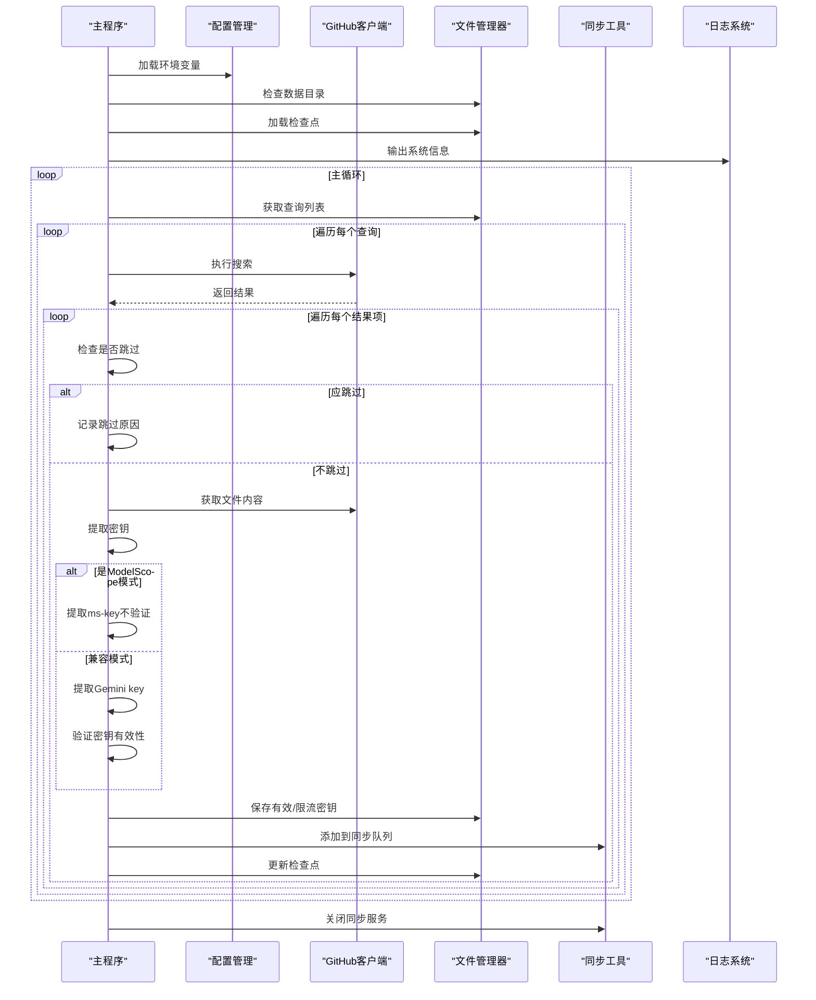
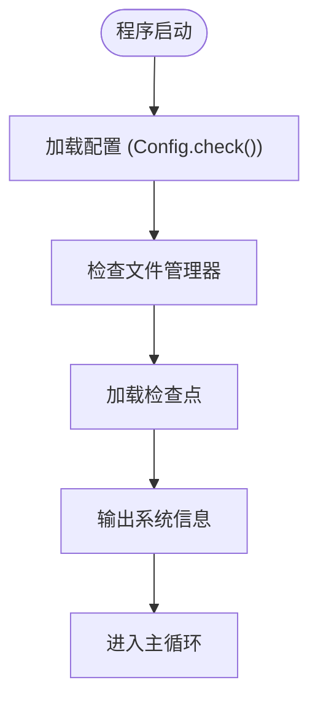
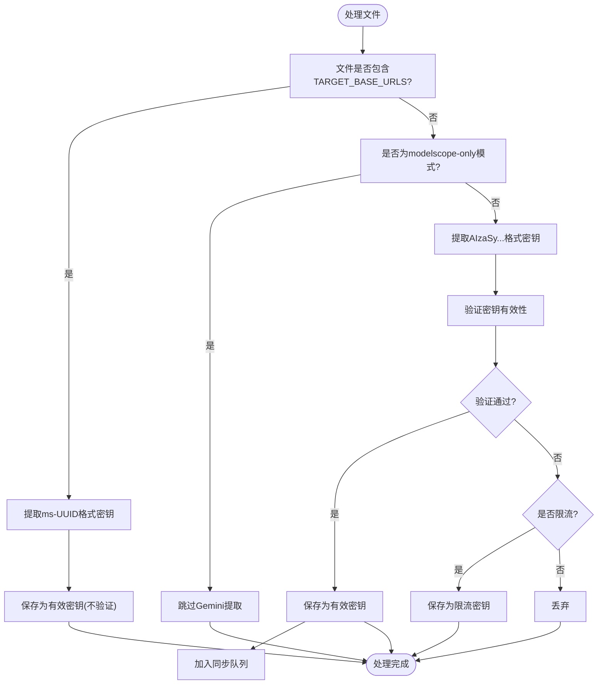
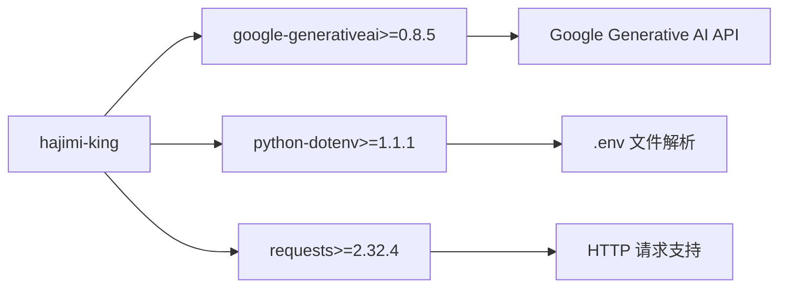

# 贡献者指南

<cite>
**本文档中引用的文件**  
- [pyproject.toml](file://pyproject.toml)
- [README.md](file://README.md)
- [app/hajimi_king.py](file://app/hajimi_king.py)
- [common/config.py](file://common/config.py)
- [common/Logger.py](file://common/Logger.py)
- [utils/github_client.py](file://utils/github_client.py)
- [utils/file_manager.py](file://utils/file_manager.py)
- [utils/sync_utils.py](file://utils/sync_utils.py)
</cite>

## 目录
1. [简介](#简介)
2. [项目结构](#项目结构)
3. [核心组件](#核心组件)
4. [架构概览](#架构概览)
5. [详细组件分析](#详细组件分析)
6. [依赖分析](#依赖分析)
7. [性能考量](#性能考量)
8. [故障排除指南](#故障排除指南)
9. [结论](#结论)

## 简介
本指南旨在为开发者提供清晰、完整的贡献流程说明。基于项目中的 `pyproject.toml` 和 `README.md` 文件，详细阐述如何搭建本地开发环境、遵循代码提交规范、创建 Pull Request 并与维护者协作。目标是帮助贡献者高效地复现问题、编写修复代码并验证变更，确保新功能或修复能够无缝集成到主代码库中。

## 项目结构
项目采用模块化设计，按功能划分目录，结构清晰，职责分明。主要包含应用逻辑、通用工具、配置管理与脚本支持。

**图示来源**  
- [app/hajimi_king.py](file://app/hajimi_king.py#L1-L524)
- [common/config.py](file://common/config.py)
- [utils/github_client.py](file://utils/github_client.py)
- [utils/file_manager.py](file://utils/file_manager.py)
- [utils/sync_utils.py](file://utils/sync_utils.py)

**本节来源**  
- [app/hajimi_king.py](file://app/hajimi_king.py#L1-L524)
- [common/config.py](file://common/config.py)
- [utils/github_client.py](file://utils/github_client.py)

## 核心组件
项目的核心功能围绕从 GitHub 代码中搜索并验证 API 密钥展开，主要由以下几个模块构成：

- **主程序入口** (`app/hajimi_king.py`)：负责协调整个流程，包括查询执行、文件处理、密钥提取与验证。
- **配置管理** (`common/config.py`)：集中管理所有环境变量和运行时配置。
- **日志系统** (`common/Logger.py`)：提供结构化日志输出，便于调试和监控。
- **GitHub 客户端** (`utils/github_client.py`)：封装 GitHub API 调用，支持多 Token 轮换和代理。
- **文件管理器** (`utils/file_manager.py`)：处理文件读写、检查点保存、结果输出等。
- **同步工具** (`utils/sync_utils.py`)：支持将发现的有效密钥异步同步到外部服务。

这些组件共同构成了一个高效、可扩展的密钥扫描系统。

**本节来源**  
- [app/hajimi_king.py](file://app/hajimi_king.py#L1-L524)
- [common/config.py](file://common/config.py)
- [common/Logger.py](file://common/Logger.py)
- [utils/github_client.py](file://utils/github_client.py)
- [utils/file_manager.py](file://utils/file_manager.py)
- [utils/sync_utils.py](file://utils/sync_utils.py)

## 架构概览
系统采用主循环驱动的架构，通过增量扫描和断点续传机制确保高效运行。整体流程如下：

**图示来源**  
- [app/hajimi_king.py](file://app/hajimi_king.py#L1-L524)
- [common/config.py](file://common/config.py#L1-L50)
- [utils/github_client.py](file://utils/github_client.py#L1-L100)
- [utils/file_manager.py](file://utils/file_manager.py#L1-L80)
- [utils/sync_utils.py](file://utils/sync_utils.py#L1-L60)

## 详细组件分析
### 主程序分析 (`app/hajimi_king.py`)
主程序是整个系统的控制中心，其核心逻辑位于 `main()` 函数中。它通过一个无限循环持续执行搜索任务，并在每次循环中处理多个查询。

#### 启动流程

**图示来源**  
- [app/hajimi_king.py](file://app/hajimi_king.py#L300-L350)

#### 密钥提取与验证逻辑
程序支持两种模式：仅 ModelScope 模式和兼容模式。其决策流程如下：

**图示来源**  
- [app/hajimi_king.py](file://app/hajimi_king.py#L150-L250)
- [app/hajimi_king.py](file://app/hajimi_king.py#L250-L300)

**本节来源**  
- [app/hajimi_king.py](file://app/hajimi_king.py#L1-L524)

### 配置管理分析 (`common/config.py`)
该模块负责解析 `.env` 文件中的环境变量，并提供类型转换和默认值支持。关键配置包括：

- **GITHUB_TOKENS**: 必填，用于访问 GitHub API。
- **PROXY**: 可选，支持多代理轮换。
- **DATA_PATH**: 数据存储路径，默认 `/app/data`。
- **MODELSCOPE_EXTRACT_ONLY**: 控制是否仅提取 ModelScope 密钥。
- **TARGET_BASE_URLS**: 定义 ModelScope 的目标 URL。

**本节来源**  
- [common/config.py](file://common/config.py)

### 文件管理器分析 (`utils/file_manager.py`)
该模块负责所有文件 I/O 操作，包括：

- 读取 `queries.txt` 中的搜索表达式。
- 管理检查点（`scanned_shas.txt`），实现增量扫描。
- 保存有效密钥、限流密钥和详细日志。
- 动态更新输出文件名（按日期）。

**本节来源**  
- [utils/file_manager.py](file://utils/file_manager.py)

## 依赖分析
项目依赖通过 `pyproject.toml` 进行管理，确保环境一致性。

**图示来源**  
- [pyproject.toml](file://pyproject.toml#L1-L11)

**本节来源**  
- [pyproject.toml](file://pyproject.toml#L1-L11)

## 性能考量
- **增量扫描**：通过 `scanned_shas.txt` 记录已处理文件，避免重复工作。
- **随机延迟**：在 `process_item` 和 `validate_gemini_key` 中引入随机延迟，降低被限流风险。
- **代理支持**：支持多代理轮换，提高请求成功率。
- **异步同步**：密钥同步操作在后台线程执行，不阻塞主流程。

## 故障排除指南
### 常见问题
- **无法获取文件内容**：检查 `GITHUB_TOKENS` 是否有效，或是否被限流。
- **未找到密钥**：检查 `queries.txt` 中的搜索表达式是否准确。
- **频繁429错误**：增加 `PROXY` 配置，或减少请求频率。
- **检查点损坏**：删除 `data/scanned_shas.txt` 以重新开始全量扫描。

### 日志分析
- 有效密钥保存路径：`data/keys/keys_valid_YYYYMMDD.txt`
- 详细日志路径：`data/logs/keys_valid_detailYYYYMMDD.log`
- 使用 `tail -f` 命令实时监控日志输出。

**本节来源**  
- [app/hajimi_king.py](file://app/hajimi_king.py#L1-L524)
- [README.md](file://README.md#L1-L344)

## 结论
本项目提供了一个功能强大且可扩展的 API 密钥扫描工具。通过遵循本文档的指导，贡献者可以快速搭建开发环境，理解代码结构，并高效地参与项目开发。建议在贡献前仔细阅读 `README.md` 和 `pyproject.toml`，确保遵循代码风格和提交规范。对于新功能的开发，建议先在 `scripts/dry_run.py` 中进行测试，再提交 Pull Request。