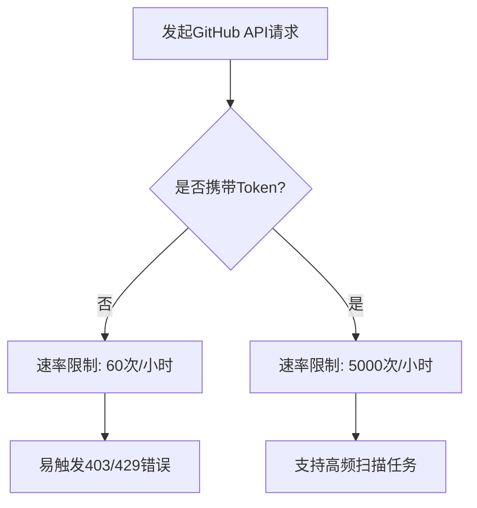
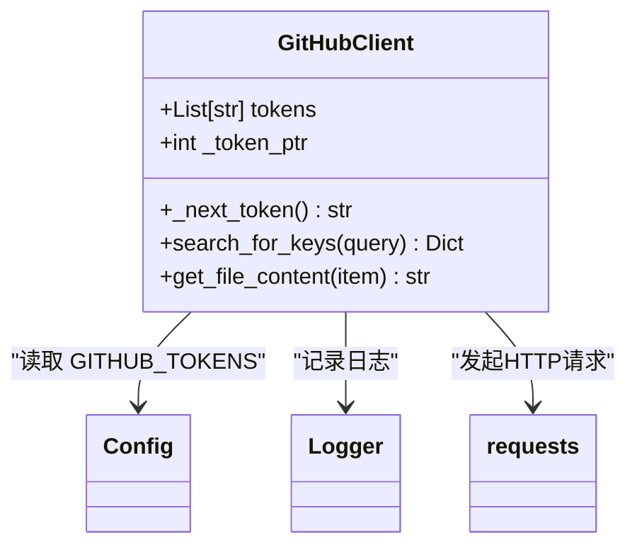
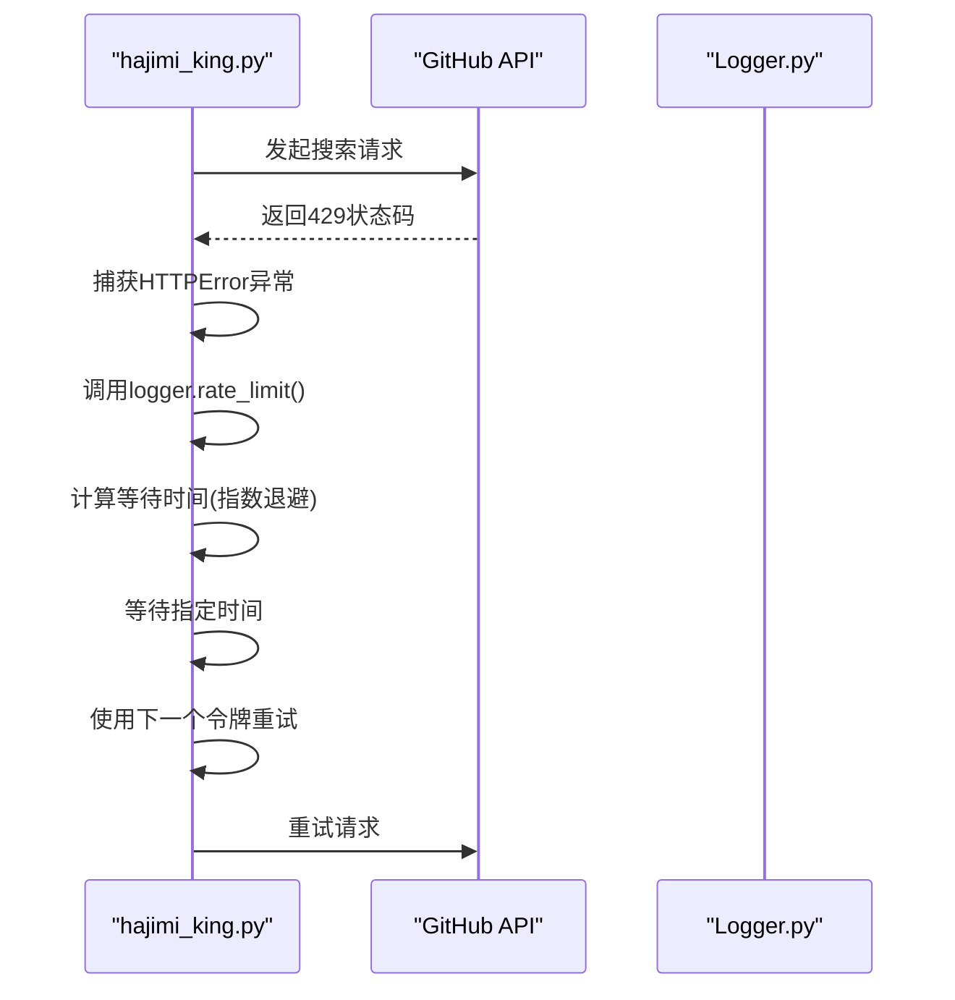
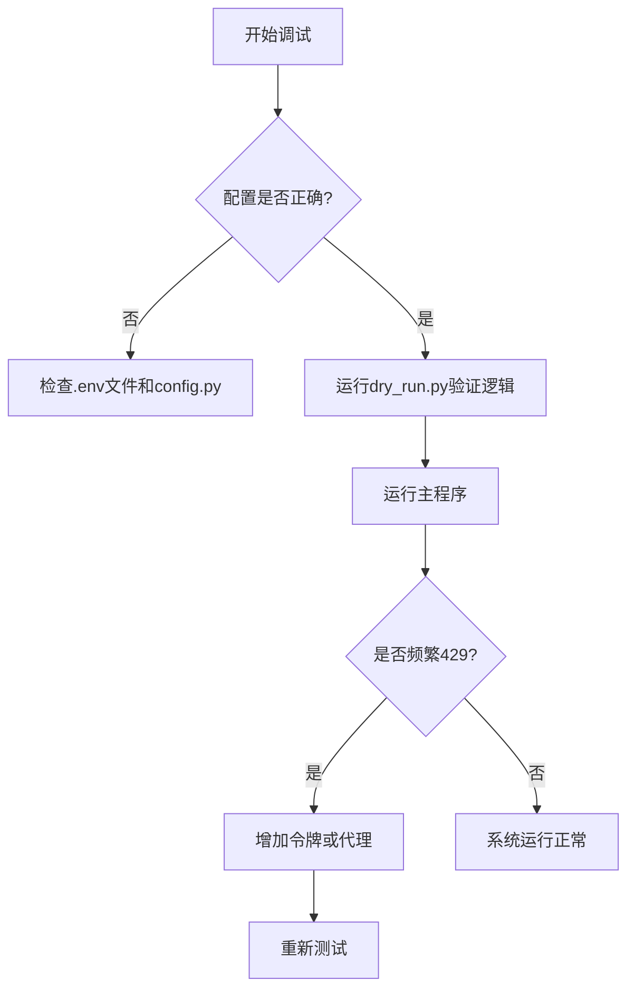

# GitHub API速率限制问题

<cite>
**本文档引用的文件**  
- [app/hajimi_king.py](file://app/hajimi_king.py) - *更新于最近提交*
- [common/Logger.py](file://common/Logger.py) - *在提交 edd314d 中重构*
- [common/config.py](file://common/config.py)
- [utils/github_client.py](file://utils/github_client.py)
- [scripts/dry_run.py](file://scripts/dry_run.py)
</cite>

## 更新摘要
**变更内容**  
- 更新“日志识别与错误处理”章节，反映 `Logger.py` 中新增的 `rate_limit()` 方法
- 在“多令牌轮换机制详解”和“应对429错误的解决方案”中更新日志输出示例，以匹配新的日志格式
- 修正“日志识别方法”中关于429错误日志的描述，使用新的图标和格式
- 更新“代码级调试与验证技巧”中的流程图，以反映日志模块的变更
- 所有受影响的章节均更新了来源注释，以反映代码变更

## 目录
1. [GitHub API速率限制概述](#github-api速率限制概述)
2. [未认证与认证请求限制](#未认证与认证请求限制)
3. [多令牌轮换机制详解](#多令牌轮换机制详解)
4. [GITHUB_TOKENS环境变量配置](#github_tokens环境变量配置)
5. [日志识别与错误处理](#日志识别与错误处理)
6. [应对429错误的解决方案](#应对429错误的解决方案)
7. [代码级调试与验证技巧](#代码级调试与验证技巧)

## GitHub API速率限制概述

<cite>
**本文档引用的文件**  
- [common/Logger.py](file://common/Logger.py) - *在提交 edd314d 中重构*
- [utils/github_client.py](file://utils/github_client.py#L1-L218)
</cite>

GitHub API对请求频率实施严格的速率限制策略，以防止滥用和确保服务稳定性。当客户端请求超出限制时，API将返回HTTP状态码403（禁止访问）或429（请求过于频繁），导致程序无法继续获取数据。本项目通过多令牌轮换、代理支持和智能重试机制来缓解该问题，确保扫描任务的持续性和稳定性。

**Section sources**
- [common/Logger.py](file://common/Logger.py#L1-L25)
- [utils/github_client.py](file://utils/github_client.py#L1-L218)

## 未认证与认证请求限制

GitHub API对不同类型的请求设置了不同的速率限制：

- **未认证请求**：每小时最多允许60次请求。此类请求基于客户端IP地址进行限制，适用于简单的公开数据查询，但在本项目中不适用，因为60次/小时的限制极易被突破。
- **认证请求**：通过提供有效的`GITHUB_TOKEN`进行身份验证后，速率限制提升至每小时5000次请求。这是本项目推荐的使用方式，能够显著提高数据抓取效率。

认证令牌需具备`public_repo`权限，仅允许读取公开仓库内容，符合最小权限原则，保障账户安全。



**Diagram sources**
- [common/config.py](file://common/config.py#L1-L204)
- [utils/github_client.py](file://utils/github_client.py#L1-L218)

## 多令牌轮换机制详解

为突破单个令牌5000次/小时的限制，本项目实现了多令牌轮换机制。通过配置多个GitHub令牌，程序在每次请求时自动轮换使用不同的令牌，从而将总请求配额线性扩展。

核心实现位于`github_client.py`中的`GitHubClient`类：

- `tokens`: 存储从环境变量`GITHUB_TOKENS`解析出的令牌列表。
- `_next_token()`: 实现令牌轮询调度，每次调用返回下一个令牌，并通过`_token_ptr`指针实现循环。
- 在`search_for_keys()`方法中，每次请求前调用`_next_token()`获取当前令牌并设置到请求头中。

该机制使得N个令牌可提供最高N×5000次/小时的请求能力，极大提升了扫描效率。



**Diagram sources**
- [utils/github_client.py](file://utils/github_client.py#L1-L218)
- [common/config.py](file://common/config.py#L1-L204)

**Section sources**
- [utils/github_client.py](file://utils/github_client.py#L1-L218)

## GITHUB_TOKENS环境变量配置

正确配置`GITHUB_TOKENS`环境变量是确保程序正常运行的关键步骤。配置方法如下：

1. **获取GitHub令牌**：
   - 登录GitHub，进入[Settings > Tokens](https://github.com/settings/tokens)。
   - 创建新令牌（Personal Access Token），选择`public_repo`权限。
   - 复制生成的令牌（形如`ghp_xxx123...`）。

2. **配置环境变量**：
   - 在`.env`文件中设置`GITHUB_TOKENS`变量，多个令牌用英文逗号分隔：
     ```
     GITHUB_TOKENS=ghp_token1,ghp_token2,ghp_token3
     ```
   - 确保`.env`文件不被提交到版本控制（已包含在`.gitignore`中）。

3. **代码加载逻辑**：
   - `config.py`中的`Config`类通过`os.getenv("GITHUB_TOKENS", "")`读取环境变量。
   - 使用`split(',')`分割字符串，并通过列表推导式去除空白字符，生成令牌列表。

```python
GITHUB_TOKENS_STR = os.getenv("GITHUB_TOKENS", "")
GITHUB_TOKENS = [token.strip() for token in GITHUB_TOKENS_STR.split(',') if token.strip()]
```

**Section sources**
- [common/config.py](file://common/config.py#L1-L204)
- [README.md](file://README.md#L1-L344)

## 日志识别与错误处理

当API调用频率超限时，系统会通过日志明确提示，便于用户及时发现和处理。

### 日志识别方法

- **关键日志信息**：`Logger.py`中定义了专用的`rate_limit()`方法来记录速率限制相关的日志，使用特定的图标和格式。
- **429错误标识**：当`github_client.py`捕获到HTTP状态码429时，会调用`logger.rate_limit()`输出警告日志。
- **示例日志**：
  ```
  ⏱️ Rate limit low: 2 remaining, token: ghp_xxx
  ⏱️ Rate limit hit, status:429 (attempt 3/5) - waiting 8.2s
  ⏱️ RATE LIMITED: AIzaSy..., check result: rate_limited
  ```

### 错误处理流程

在`github_client.py`的`search_for_keys()`方法中，实现了完善的错误重试机制：

1. 捕获`HTTPError`异常，判断状态码是否为403或429。
2. 若命中速率限制，采用指数退避策略等待：`wait = min(2 ** attempt + random.uniform(0, 1), 60)`。
3. 最多重试5次，每次使用下一个令牌。
4. 连续失败时，等待时间逐渐增加，避免持续冲击API。
5. **新增日志功能**：`Logger.py`的`rate_limit()`方法专门用于记录此类事件，使用⏱️图标，提升了日志的可读性和分类性。



**Diagram sources**
- [utils/github_client.py](file://utils/github_client.py#L1-L218)
- [common/Logger.py](file://common/Logger.py#L146-L155) - *新增的rate_limit方法*

**Section sources**
- [utils/github_client.py](file://utils/github_client.py#L1-L218)
- [common/Logger.py](file://common/Logger.py#L1-L25) - *重构的日志模块*

## 应对429错误的解决方案

当频繁出现429错误时，可采取以下措施优化：

### 1. 增加更多GitHub令牌
- 获取额外的GitHub账户或使用组织令牌。
- 在`.env`文件中添加更多令牌，用逗号分隔。
- 令牌数量越多，总配额越高，降低单个令牌的请求压力。

### 2. 配置代理轮换
- 在`.env`文件中设置`PROXY`变量，支持多个代理：
  ```
  PROXY=http://proxy1:port,http://proxy2:port
  ```
- 程序通过`Config.get_random_proxy()`随机选择代理，分散IP请求来源。
- 推荐使用可靠的代理服务（如WARP）避免IP被封禁。

### 3. 降低扫描并发度
- 虽然本项目未显式使用多线程，但可通过调整逻辑降低请求密度。
- 在`github_client.py`的`search_for_keys()`中，每次请求后有`random.uniform(0.5, 1.5)`秒的随机延迟。
- 可适当增加此延迟值，减少单位时间内的请求数。

```python
sleep_time = random.uniform(0.5, 1.5)  # 可调整为1.0-3.0以降低频率
time.sleep(sleep_time)
```

**Section sources**
- [common/config.py](file://common/config.py#L1-L204)
- [utils/github_client.py](file://utils/github_client.py#L1-L218)

## 代码级调试与验证技巧

为确保配置正确且系统正常运行，可使用以下调试和验证方法。

### 使用dry_run.py验证配置

`scripts/dry_run.py`脚本提供了一个轻量级的验证环境，无需连接真实API即可测试密钥提取逻辑。

1. **功能**：模拟ModelScope密钥提取流程，验证正则表达式、上下文匹配和距离约束是否生效。
2. **使用方法**：
   ```bash
   python scripts/dry_run.py
   ```
3. **输出示例**：
   ```
   [dry-run] 提取成功并已写入：
     keys: ['ms-30184ba8-077f-4abf-a40d-97e8d6fc7cb7', ...]
   ```

该脚本会根据`config.py`中的`TARGET_BASE_URLS`、`MS_USE_LOOSE_PATTERN`等配置，测试从模拟内容中提取ms-key的能力，是验证配置有效性的理想工具。

### 调试github_client.py

1. **检查令牌加载**：在`config.py`中确认`GITHUB_TOKENS`列表长度正确。
2. **观察日志输出**：运行主程序，关注`GitHub search complete`日志中的`total requests`和`rate limit`警告。注意，速率限制日志现在使用⏱️图标。
3. **模拟错误**：临时提供无效令牌，观察程序是否能正确处理403错误并轮换到下一个令牌。



**Diagram sources**
- [scripts/dry_run.py](file://scripts/dry_run.py#L1-L104)
- [utils/github_client.py](file://utils/github_client.py#L1-L218)

**Section sources**
- [scripts/dry_run.py](file://scripts/dry_run.py#L1-L104)
- [app/hajimi_king.py](file://app/hajimi_king.py#L1-L524)