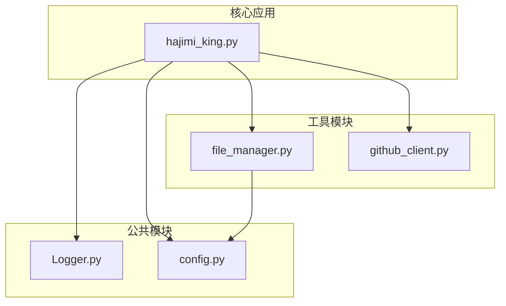
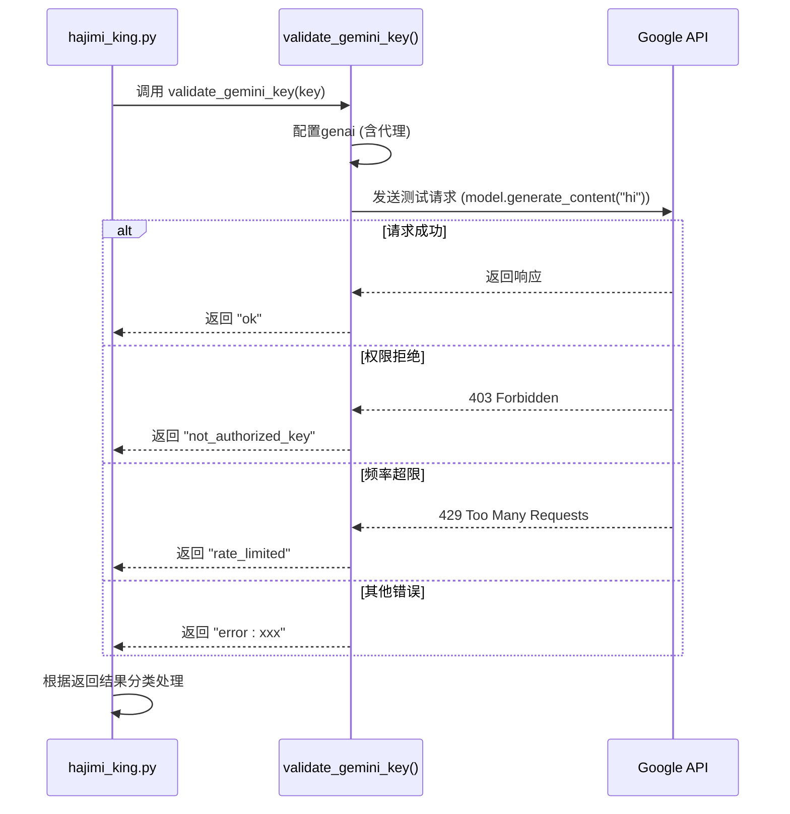

# 密钥验证失败

<cite>
**本文档引用的文件**  
- [hajimi_king.py](file://app/hajimi_king.py) - *同步功能已移除*
- [config.py](file://common/config.py) - *同步配置已移除*
- [Logger.py](file://common/Logger.py) - *日志模块更新*
- [file_manager.py](file://utils/file_manager.py) - *同步相关逻辑已移除*
</cite>

## 更新摘要
**变更内容**  
- 在 `Logger.py` 中新增 `success()` 方法，用于标记成功事件，并优化了所有日志级别的终端输出格式。
- 更新了日志记录方式，在密钥验证成功时使用 `logger.success()` 替代 `logger.info()`，提升日志可读性。
- 本文档已同步更新相关日志分析与问题定位章节，反映最新的日志输出行为。

## 目录
1. [引言](#引言)  
2. [项目结构分析](#项目结构分析)  
3. [核心组件分析](#核心组件分析)  
4. [密钥验证流程详解](#密钥验证流程详解)  
5. [日志分析与问题定位](#日志分析与问题定位)  
6. [常见验证失败原因](#常见验证失败原因)  
7. [解决方案与优化建议](#解决方案与优化建议)  
8. [结论](#结论)

## 引言
本项目旨在从GitHub公开代码中提取并验证Google Gemini API密钥。核心流程包括密钥提取、验证、保存。其中，密钥验证是确保密钥有效性的重要环节。然而，在实际运行中，密钥验证可能因多种原因失败。本文将深入分析密钥验证失败的可能原因、主流程中的验证逻辑，并提供问题定位与解决建议。值得注意的是，**同步功能已被移除**，因此不再涉及异步发送或外部服务同步。

## 项目结构分析



**图示来源**  
- [hajimi_king.py](file://app/hajimi_king.py)
- [config.py](file://common/config.py)
- [file_manager.py](file://utils/file_manager.py)

**本节来源**  
- [hajimi_king.py](file://app/hajimi_king.py)
- [project_structure](file://project_structure)

## 核心组件分析

### 主流程控制器：hajimi_king.py
该文件是程序的主入口，负责协调密钥提取、验证和保存流程。

**关键函数：**
- `main()`：主循环，遍历搜索查询，处理每个结果项。
- `process_item(item)`：处理单个GitHub搜索结果，提取并验证密钥。
- `validate_gemini_key(api_key)`：验证单个Gemini API密钥的有效性。

> **注意**：原 `sync_utils.py` 中的异步同步功能已完全移除，相关调用和队列管理逻辑已被删除。

### 配置管理：config.py
提供全局配置，包括GitHub令牌、代理、ModelScope提取规则等。

> **变更**：`PROXY_LIST`、`VALID_KEY_PREFIX` 等配置保留，但所有与同步服务相关的配置（如 `BALANCER_URL`）已被移除。

### 文件管理：file_manager.py
负责管理所有文件操作，包括日志记录、检查点保存、密钥文件写入等。

> **变更**：`save_keys_send_result` 方法已移除，`KEYS_SEND_PREFIX` 等配置不再存在。

**本节来源**  
- [hajimi_king.py](file://app/hajimi_king.py#L1-L511)
- [config.py](file://common/config.py#L1-L169)
- [file_manager.py](file://utils/file_manager.py#L1-L431)

## 密钥验证流程详解

### 验证执行逻辑
在 `hajimi_king.py` 的 `process_item` 函数中，密钥验证是核心步骤之一。其执行逻辑如下：

1. **提取密钥**：使用正则表达式 `r'(AIzaSy[A-Za-z0-9\-_]{33})'` 从文件内容中提取疑似密钥。
2. **过滤占位符**：检查密钥上下文，过滤掉如 `YOUR_API_KEY` 或包含 `...` 的占位符。
3. **逐个验证**：对每个有效密钥调用 `validate_gemini_key` 函数进行验证。
4. **结果处理**：
   - 验证成功：保存到有效密钥文件。
   - 验证失败：根据错误类型记录日志，可能保存到限流密钥文件。



**图示来源**  
- [hajimi_king.py](file://app/hajimi_king.py#L300-L350)

**本节来源**  
- [hajimi_king.py](file://app/hajimi_king.py#L300-L350)

## 日志分析与问题定位

### 定位验证失败
当密钥验证失败时，日志中会记录 `verification failed` 或类似信息。在本项目中，相关日志由 `Logger.py` 输出。

**关键日志记录点：**
- `logger.info(f"❌ INVALID: {key}, check result: {validation_result}")`：明确标记验证失败的密钥及其原因。
- `logger.warning(f"⚠️ RATE LIMITED: {key}, ...")`：标记被限流的密钥。
- `logger.success(f"VALID: {key}")`：**新增**，使用 `success()` 方法标记验证成功的密钥，提升可读性。

**定位步骤：**
1. 在日志文件（如 `logs/keys_valid_detail_*.log`）中搜索 `INVALID` 或 `RATE LIMITED`。
2. 找到对应的密钥和 `file_url`。
3. 检查该密钥的上下文环境：
   - **时间**：查看 `TIME` 字段，确认失败发生的时间。
   - **来源**：通过 `URL` 字段定位到具体的GitHub文件。
   - **配置**：检查当时的 `config.py` 配置，特别是代理和模型设置。

### 日志文件结构
- **详细日志**：`logs/keys_valid_detail_*.log` 记录每个有效密钥的完整信息（时间、URL、密钥）。
- **限流日志**：`logs/key_429_detail_*.log` 记录被限流的密钥信息。
- **检查点**：`checkpoint.json` 和 `scanned_shas.txt` 记录程序状态，用于增量扫描。

**本节来源**  
- [hajimi_king.py](file://app/hajimi_king.py#L340-L350)
- [file_manager.py](file://utils/file_manager.py#L200-L250)
- [Logger.py](file://common/Logger.py#L1-L25)

## 常见验证失败原因

### 1. 提取的密钥已失效
- **现象**：验证返回 `not_authorized_key` 或 `disabled`。
- **原因**：密钥已被创建者撤销或禁用，或API服务未启用。
- **日志特征**：`"❌ INVALID: AIzaSy... , check result: not_authorized_key"`

### 2. 目标API服务拒绝访问
- **现象**：验证返回 `403` 错误。
- **原因**：密钥权限不足，或目标API（如Gemini）未在Google Cloud项目中启用。
- **日志特征**：`"❌ INVALID: ... , check result: disabled"`

### 3. 网络阻断导致验证请求失败
- **现象**：验证抛出异常，如连接超时、DNS解析失败。
- **原因**：运行环境网络受限，或代理配置错误。
- **日志特征**：`"💥 Unexpected error: ..."`, `requests.exceptions.ConnectionError`

### 4. 请求频率超限（Rate Limited）
- **现象**：验证返回 `rate_limited`。
- **原因**：短时间内对同一密钥或IP地址发送了过多请求。
- **日志特征**：`"⚠️ RATE LIMITED: AIzaSy..."`

### 5. 代理配置问题
- **现象**：验证失败，但直接使用该密钥在其他网络环境下可能成功。
- **原因**：`PROXY_LIST` 配置的代理服务器不稳定或已被目标服务封禁。
- **日志特征**：网络连接错误，且 `Config.PROXY_LIST` 不为空。

**本节来源**  
- [hajimi_king.py](file://app/hajimi_king.py#L310-L350)
- [config.py](file://common/config.py#L1-L169)

## 解决方案与优化建议

### 1. 调整密钥提取正则表达式
- **问题**：当前正则 `r'(AIzaSy[A-Za-z0-9\-_]{33})'` 可能过于严格或宽松。
- **建议**：
  - 如果漏提，可放宽长度限制，如 `{30,35}`。
  - 如果误提，可增加上下文匹配，例如要求密钥前后有特定的单词（如 `api_key`, `secret`）。

### 2. 增加验证重试机制
- **问题**：网络波动或临时限流导致验证失败。
- **建议**：在 `validate_gemini_key` 函数中，对 `ConnectionError` 和 `Timeout` 等网络异常进行重试（例如最多3次，指数退避）。

```python
# 伪代码示例
for attempt in range(3):
    try:
        # 执行验证请求
        return "ok"
    except (ConnectionError, Timeout):
        if attempt < 2:
            time.sleep(2 ** attempt) # 指数退避
            continue
        else:
            return "network_error"
```

### 3. 检查目标服务状态
- **建议**：在验证前，先通过 `curl` 或简单HTTP请求检查 `generativelanguage.googleapis.com` 是否可达。
- **自动化**：可在 `main()` 函数启动时添加一个简单的连通性测试。

### 4. 人工复核的重要性
- **关键提醒**：验证失败的密钥**仍可能有效**。
  - **原因**：验证过程本身可能因网络、代理、临时限流等问题失败，但这不代表密钥本身无效。
  - **建议**：对于高价值或可疑的密钥，应进行人工复核。可以手动使用 `google-generativeai` 库进行测试，或在隔离环境中验证。

### 5. 优化代理策略
- **建议**：实现更智能的代理轮询和健康检查。当某个代理连续失败时，暂时将其移出轮询池。

**本节来源**  
- [hajimi_king.py](file://app/hajimi_king.py#L310-L350)
- [config.py](file://common/config.py#L1-L169)

## 结论
密钥验证失败是一个复杂的问题，可能由密钥本身、API服务、网络环境或程序配置等多种因素引起。通过分析 `hajimi_king.py` 的主流程，我们可以清晰地理解验证的执行逻辑和数据流。利用详细的日志记录，可以有效地定位问题密钥及其上下文。最终的解决方案应结合技术调整（如优化正则、增加重试）和人工复核，以确保既能高效筛选有效密钥，又不会因验证过程的缺陷而遗漏真正可用的密钥。**请注意，同步功能已被移除，所有与 `sync_utils.py` 相关的逻辑和配置均已失效**。