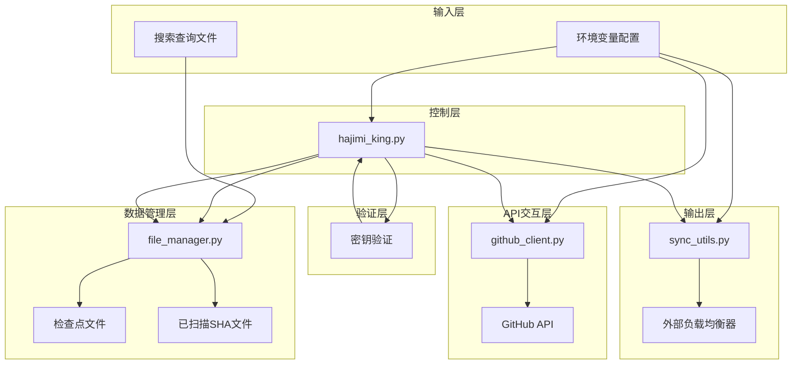
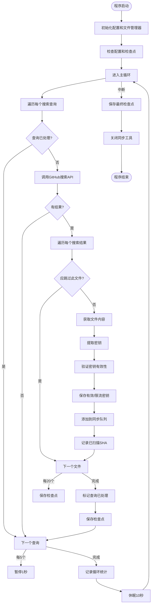
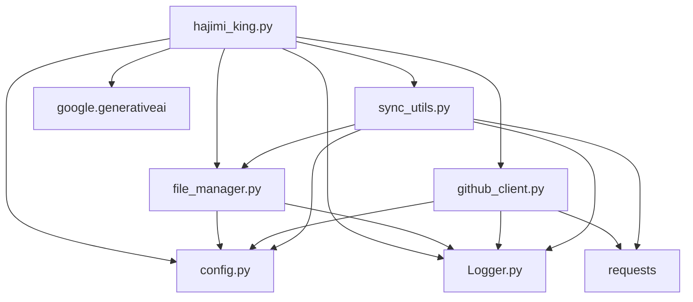

# 性能问题处理

<cite>
**本文档中引用的文件**  
- [hajimi_king.py](file://app/hajimi_king.py)
- [file_manager.py](file://utils/file_manager.py)
- [config.py](file://common/config.py)
- [github_client.py](file://utils/github_client.py)
- [Logger.py](file://common/Logger.py) - *在提交 edd314d 中更新*
</cite>

## 更新摘要
**已做更改**  
- 在“性能考虑”和“故障排除指南”部分更新了日志输出行为，以反映 `Logger.py` 中新增的 `progress()` 和 `file_op()` 方法。
- 添加了对新日志方法 `progress()` 和 `file_op()` 的说明，解释其在性能监控中的作用。
- 更新了相关部分的源文件引用，以包含 `Logger.py` 的变更。
- 保持原有文档结构不变，仅针对代码变更进行精准更新。

## 目录
1. [简介](#简介)
2. [项目结构](#项目结构)
3. [核心组件](#核心组件)
4. [架构概述](#架构概述)
5. [详细组件分析](#详细组件分析)
6. [依赖分析](#依赖分析)
7. [性能考虑](#性能考虑)
8. [故障排除指南](#故障排除指南)
9. [结论](#结论)

## 简介
本文档旨在系统性分析 `APIKEY-king` 项目的性能瓶颈，包括扫描速度缓慢、内存占用过高、检查点更新延迟等问题。通过深入分析 `hajimi_king.py` 的主工作流与 `file_manager.py` 的增量扫描机制，揭示影响性能的关键因素，如查询复杂度、文件过滤效率、并发线程数等。文档将提供一系列优化策略，并指导用户如何通过日志中的处理耗时统计来识别瓶颈环节，最终实现系统性能的全面提升。

## 项目结构
项目采用模块化设计，各目录职责明确，便于维护与扩展。主要结构如下：

```
.
├── app
│   └── hajimi_king.py          # 主程序入口，核心工作流
├── common
│   ├── Logger.py               # 日志工具
│   └── config.py               # 全局配置管理
├── scripts
│   └── dry_run.py              # 脚本工具
├── utils
│   ├── file_manager.py         # 文件与检查点管理
│   ├── github_client.py        # GitHub API 客户端
│   └── sync_utils.py           # 外部同步工具
├── CHANGELOG.md
├── Dockerfile
├── README.md
├── docker-compose.yml
├── first_deploy.sh
└── pyproject.toml
```

**Section sources**
- [hajimi_king.py](file://app/hajimi_king.py#L1-L524)
- [file_manager.py](file://utils/file_manager.py#L1-L493)
- [config.py](file://common/config.py#L1-L204)

## 核心组件
本项目的核心组件围绕密钥扫描、验证与同步三大功能构建。

- **`hajimi_king.py`**: 主控制器，负责协调整个扫描流程，包括查询执行、结果处理、密钥验证和统计。
- **`file_manager.py`**: 数据管家，管理搜索查询、检查点（checkpoint）、已扫描文件记录（SHA）及结果文件的读写。
- **`github_client.py`**: API 交互层，封装了对 GitHub 搜索 API 和内容 API 的调用，支持多 Token 轮询和代理。
- **`sync_utils.py`**: 异步同步器，通过线程池将验证通过的密钥异步发送到外部负载均衡服务。
- **`config.py`**: 配置中心，集中管理所有环境变量和运行时配置。

这些组件协同工作，形成了一个从发现到验证再到分发的完整自动化流水线。

**Section sources**
- [hajimi_king.py](file://app/hajimi_king.py#L1-L524)
- [file_manager.py](file://utils/file_manager.py#L1-L493)
- [github_client.py](file://utils/github_client.py#L1-L218)
- [sync_utils.py](file://utils/sync_utils.py#L1-L485)
- [config.py](file://common/config.py#L1-L204)

## 架构概述
系统采用分层架构，各组件职责清晰，通过配置和事件进行松耦合通信。



**Diagram sources**
- [hajimi_king.py](file://app/hajimi_king.py#L1-L524)
- [file_manager.py](file://utils/file_manager.py#L1-L493)
- [github_client.py](file://utils/github_client.py#L1-L218)
- [sync_utils.py](file://utils/sync_utils.py#L1-L485)

## 详细组件分析

### 主工作流分析
`hajimi_king.py` 的 `main()` 函数是整个系统的入口，其工作流决定了整体性能。



**Diagram sources**
- [hajimi_king.py](file://app/hajimi_king.py#L1-L524)

**Section sources**
- [hajimi_king.py](file://app/hajimi_king.py#L1-L524)

### 增量扫描机制分析
`file_manager.py` 实现的增量扫描机制是性能优化的关键，它避免了重复扫描，但其效率受多种因素影响。

```mermaid
classDiagram
class Checkpoint {
+last_scan_time : str
+scanned_shas : Set[str]
+processed_queries : Set[str]
+wait_send_balancer : Set[str]
+wait_send_gpt_load : Set[str]
+to_dict() Dict[str, Any]
+from_dict(data) Checkpoint
+add_scanned_sha(sha)
+add_processed_query(query)
+update_scan_time()
}
class FileManager {
-data_dir : str
-checkpoint_file : str
-scanned_shas_file : str
-_search_queries : List[str]
+check() bool
+load_checkpoint() Checkpoint
+load_scanned_shas() Set[str]
+save_checkpoint(cp)
+save_scanned_shas(shas)
+save_valid_keys(repo, path, url, keys)
+update_dynamic_filenames()
}
FileManager --> Checkpoint : "拥有"
FileManager --> "scanned_shas.txt" : "读写"
FileManager --> "checkpoint.json" : "读写"
```

**Diagram sources**
- [file_manager.py](file://utils/file_manager.py#L1-L493)

**Section sources**
- [file_manager.py](file://utils/file_manager.py#L1-L493)

## 依赖分析
系统内部组件间存在明确的依赖关系，外部依赖则主要为 GitHub API 和可选的外部负载均衡服务。



**Diagram sources**
- [hajimi_king.py](file://app/hajimi_king.py#L1-L524)
- [file_manager.py](file://utils/file_manager.py#L1-L493)
- [github_client.py](file://utils/github_client.py#L1-L218)
- [sync_utils.py](file://utils/sync_utils.py#L1-L485)

**Section sources**
- [hajimi_king.py](file://app/hajimi_king.py#L1-L524)
- [file_manager.py](file://utils/file_manager.py#L1-L493)
- [github_client.py](file://utils/github_client.py#L1-L218)
- [sync_utils.py](file://utils/sync_utils.py#L1-L485)

## 性能考虑
### 性能瓶颈分析
系统性能主要受以下因素影响：

1.  **查询复杂度 (Query Complexity)**:
    *   **问题**: 复杂的搜索查询（如包含多个 `filename:` 或 `path:` 过滤器）可能导致 GitHub API 响应缓慢或返回不完整结果。
    *   **证据**: `github_client.py` 中的 `search_for_keys` 函数会记录 `incomplete_results`，并发出数据丢失警告。
    *   **优化**: 精简搜索查询，避免过度复杂的过滤条件。优先使用 `in:file` 和 `language:` 等高效过滤器。

2.  **文件过滤效率 (File Filtering Efficiency)**:
    *   **问题**: `should_skip_item` 函数在处理每个搜索结果前进行多项检查（时间、SHA、年龄、路径黑名单）。虽然这些检查是必要的，但其执行效率直接影响主循环速度。
    *   **证据**: `skip_stats` 全局变量统计了各类跳过情况，可通过日志分析哪类过滤最频繁。
    *   **优化**: 确保 `FILE_PATH_BLACKLIST` 配置合理，能有效过滤大量无关文件。`DATE_RANGE_DAYS` 不宜设置过长，避免扫描陈旧仓库。

3.  **并发与速率限制 (Concurrency and Rate Limiting)**:
    *   **问题**: GitHub API 有严格的速率限制（Rate Limit）。`github_client.py` 使用多 Token 轮询和指数退避来应对，但这会导致请求延迟。
    *   **证据**: 日志中频繁出现 `Rate limit low` 和 `Rate limit hit` 警告。
    *   **优化**: 增加 `GITHUB_TOKENS` 的数量是提升扫描速度最直接有效的方法。同时，合理配置 `PROXY_LIST` 可以进一步绕过 IP 限制。

4.  **检查点更新延迟 (Checkpoint Update Delay)**:
    *   **问题**: `sync_utils.py` 在批量发送密钥时会锁定 `saving_checkpoint`，此时 `hajimi_king.py` 添加新密钥到队列的操作会被阻塞，导致主流程暂停。
    *   **证据**: `sync_utils.py` 中的 `add_keys_to_queue` 方法有 `while self.saving_checkpoint` 的等待逻辑。
    *   **优化**: 该机制为保证数据一致性所必需，但可通过减少 `batch_interval`（批量发送间隔）来降低单次锁定时间，或优化外部服务的响应速度。

5.  **代理响应速度 (Proxy Response Speed)**:
    *   **问题**: 如果配置了代理，代理服务器的质量会直接影响 `github_client.py` 和 `sync_utils.py` 的网络请求耗时。
    *   **优化**: 选择低延迟、高可用的代理服务。在 `config.py` 中配置多个代理，系统会随机选择，实现负载均衡。

### 优化策略
1.  **精简搜索查询**: 审查 `queries.txt` 文件，合并相似查询，移除低效或冗余的过滤条件。
2.  **合理设置时间范围**: 根据业务需求调整 `DATE_RANGE_DAYS`，避免扫描超过两年的陈旧仓库。
3.  **增加并发资源**: 尽可能增加 `GITHUB_TOKENS` 的数量，并配置高质量的 `PROXY_LIST`。
4.  **调整同步频率**: 如果外部服务响应较慢，可适当增加 `sync_utils.py` 中的 `batch_interval`，减少发送频率，但会增加密钥同步延迟。
5.  **定期清理检查点**: 手动清理 `scanned_shas.txt` 文件可以重置增量扫描状态，适用于需要重新全面扫描的场景，但会显著增加后续扫描的耗时。

**Section sources**
- [hajimi_king.py](file://app/hajimi_king.py#L1-L524)
- [file_manager.py](file://utils/file_manager.py#L1-L493)
- [github_client.py](file://utils/github_client.py#L1-L218)
- [sync_utils.py](file://utils/sync_utils.py#L1-L485)
- [config.py](file://common/config.py#L1-L204)

## 故障排除指南
用户可通过分析日志快速定位性能瓶颈：

1.  **扫描速度慢**:
    *   检查日志中 `Rate limit hit` 的频率。若频繁出现，说明需要增加 `GITHUB_TOKENS` 或优化代理。
    *   查看 `📊 Skipped X items` 统计。如果 `doc_filter` 数量巨大，说明 `FILE_PATH_BLACKLIST` 配置有效；如果 `time_filter` 或 `age_filter` 占比高，说明增量扫描在正常工作。
    *   **新增**: 观察 `📈 Processing query: ...` 进度日志，可直观判断单个查询的处理进度和耗时，帮助识别卡顿环节。

2.  **内存占用过高**:
    *   主要原因是 `checkpoint` 对象在内存中缓存了所有已扫描的 SHA (`scanned_shas`) 和待发送的密钥队列。长期运行后，`scanned_shas` 可能变得非常庞大。
    *   **解决方案**: 定期重启服务或手动清理 `scanned_shas.txt` 文件以释放内存。

3.  **检查点更新延迟**:
    *   观察日志中是否出现 `📥 Checkpoint is currently being saving, waiting before...` 的提示。这表明 `sync_utils` 的批量发送任务耗时过长。
    *   **解决方案**: 检查外部负载均衡服务（如 Gemini Balancer）的响应时间和可用性。

4.  **日志输出不清晰**:
    *   **新增**: `Logger.py` 已重构，新增 `progress()` 和 `file_op()` 方法，用于更清晰地标识进度和文件操作。
    *   **证据**: `hajimi_king.py` 中使用 `logger.progress()` 显示查询处理进度，使用 `logger.file_op()` 记录密钥保存操作。
    *   **优化**: 用户应关注 `📈` 和 `📁` 图标开头的日志，它们分别代表处理进度和文件操作，有助于更精细地监控系统行为。

**Section sources**
- [hajimi_king.py](file://app/hajimi_king.py#L1-L524)
- [file_manager.py](file://utils/file_manager.py#L1-L493)
- [sync_utils.py](file://utils/sync_utils.py#L1-L485)
- [Logger.py](file://common/Logger.py#L1-L182) - *在提交 edd314d 中更新*

## 结论
`APIKEY-king` 项目通过增量扫描和异步同步机制实现了高效的密钥发现与分发。其性能瓶颈主要集中在外部 API 的速率限制和内部检查点的并发访问上。通过增加 GitHub Token、优化搜索查询、合理配置代理和定期维护检查点文件，可以显著提升系统的整体扫描效率和稳定性。用户应密切关注日志中的统计信息和警告，以便及时发现并解决潜在的性能问题。**特别地，利用 `Logger.py` 中新增的 `progress()` 和 `file_op()` 方法，可以更直观地监控扫描进度和文件操作，为性能分析提供更丰富的数据支持。**

**Section sources**
- [hajimi_king.py](file://app/hajimi_king.py#L1-L524)
- [file_manager.py](file://utils/file_manager.py#L1-L493)
- [github_client.py](file://utils/github_client.py#L1-L218)
- [sync_utils.py](file://utils/sync_utils.py#L1-L485)
- [config.py](file://common/config.py#L1-L204)
- [Logger.py](file://common/Logger.py#L1-L182) - *在提交 edd314d 中更新*