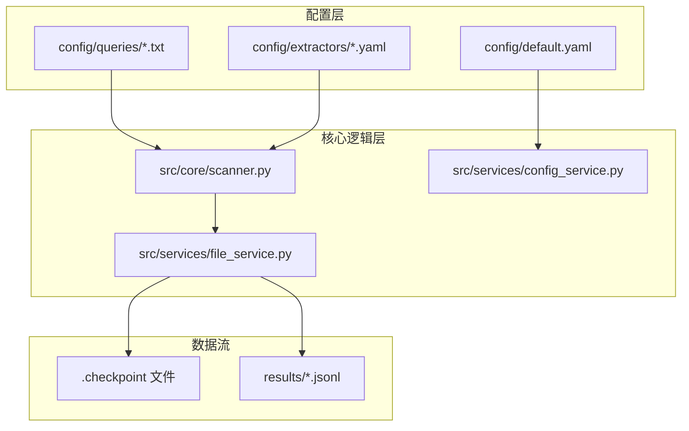
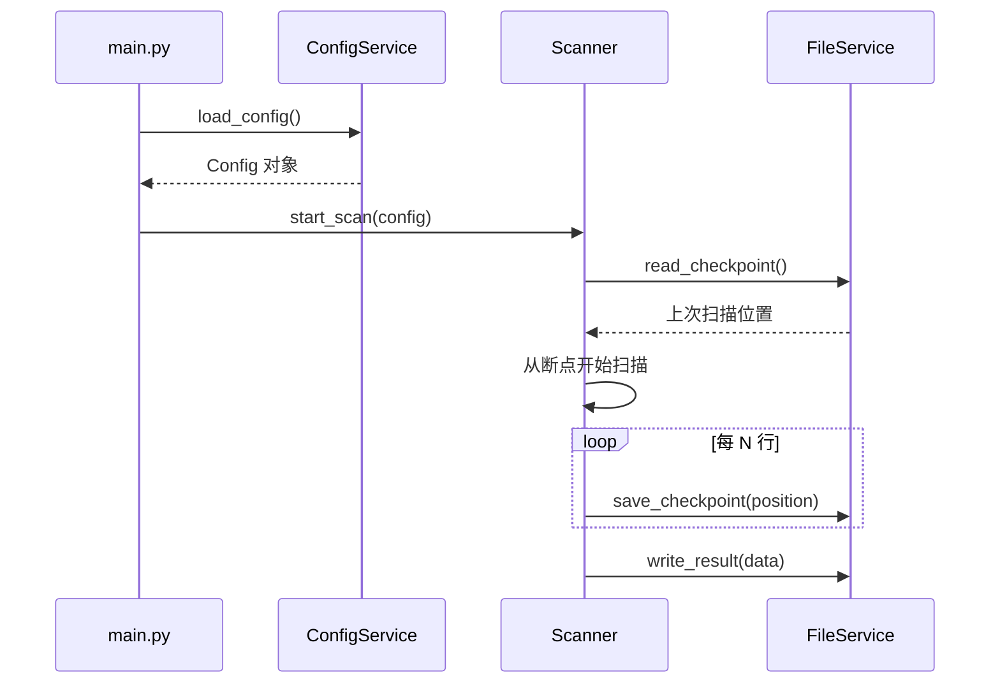
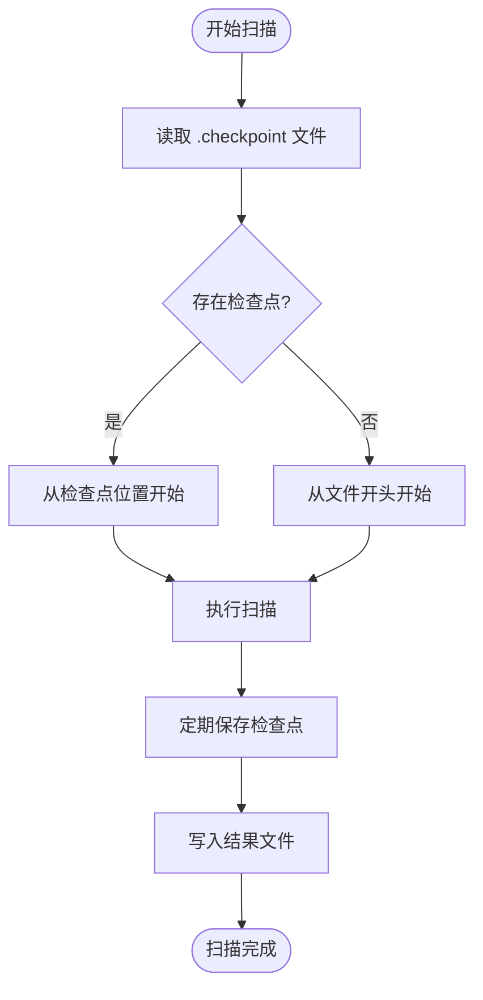
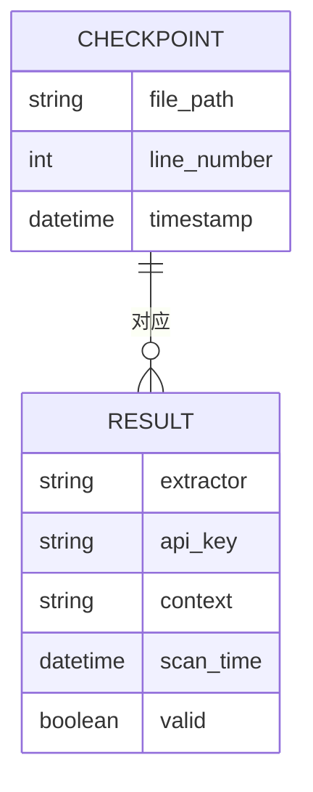
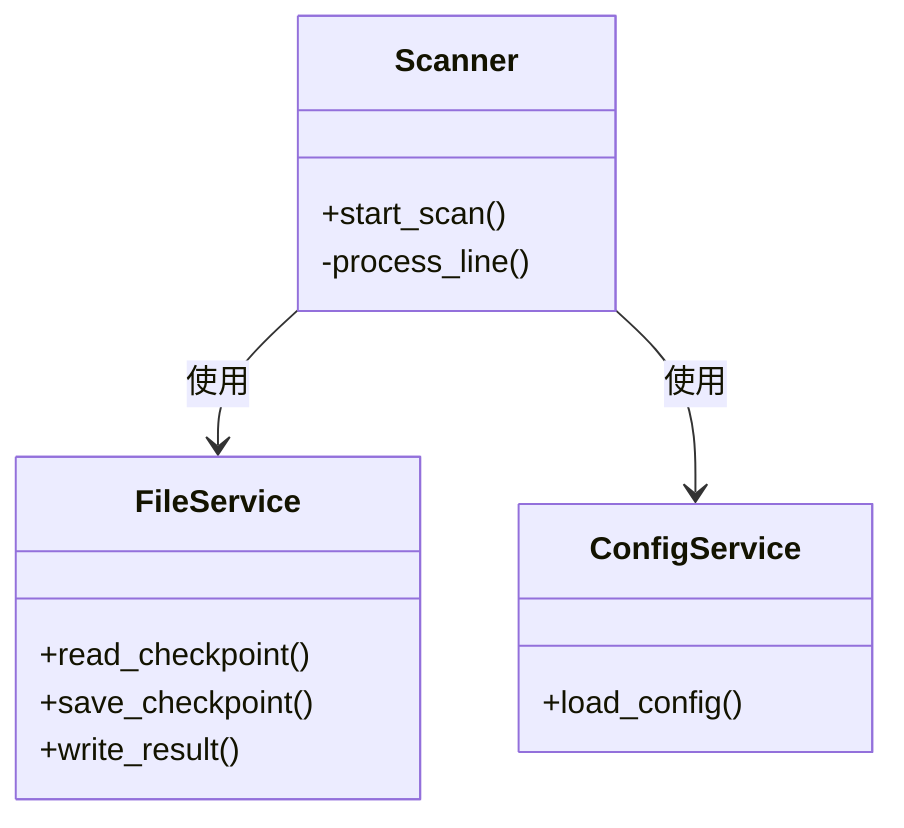

# 数据持久化策略

<cite>
**本文档引用文件**  
- [scanner.py](file://src/core/scanner.py#L1-L200)
- [file_service.py](file://src/services/file_service.py#L1-L150)
- [config_service.py](file://src/services/config_service.py#L1-L100)
- [default.yaml](file://config/default.yaml#L1-L50)
- [main.py](file://src/main.py#L1-L80)
</cite>

## 目录
1. [引言](#引言)
2. [项目结构](#项目结构)
3. [核心组件](#核心组件)
4. [架构概述](#架构概述)
5. [详细组件分析](#详细组件分析)
6. [依赖分析](#依赖分析)
7. [性能考虑](#性能考虑)
8. [故障排除指南](#故障排除指南)
9. [结论](#结论)

## 引言
本文档详细阐述了系统中数据持久化的核心机制，包括检查点（checkpoint）机制的实现原理、增量扫描的技术细节以及数据文件的管理策略。该策略确保在大规模密钥扫描过程中，系统具备断点续传能力、高效的数据处理性能和可靠的持久化保障。

## 项目结构
项目采用模块化设计，数据持久化相关逻辑主要分布在 `src/core` 和 `src/services` 目录下。配置文件集中于 `config` 目录，支持灵活的扫描行为定义。

**图示来源**  
- [default.yaml](file://config/default.yaml#L1-L20)
- [scanner.py](file://src/core/scanner.py#L10-L40)
- [file_service.py](file://src/services/file_service.py#L5-L25)

**本节来源**  
- [config](file://config)
- [src/core](file://src/core)
- [src/services](file://src/services)

## 核心组件
系统通过 `scanner.py` 实现扫描逻辑，`file_service.py` 负责文件读写与检查点管理，`config_service.py` 加载并解析配置。三者协同完成持久化任务。

**本节来源**  
- [scanner.py](file://src/core/scanner.py#L25-L100)
- [file_service.py](file://src/services/file_service.py#L15-L60)
- [config_service.py](file://src/services/config_service.py#L10-L40)

## 架构概述
系统采用“配置驱动 + 增量扫描 + 检查点持久化”的架构模式。启动时加载配置，扫描过程中定期记录进度至检查点文件，支持异常中断后从断点恢复。

**图示来源**  
- [main.py](file://src/main.py#L20-L50)
- [config_service.py](file://src/services/config_service.py#L15-L35)
- [scanner.py](file://src/core/scanner.py#L50-L120)
- [file_service.py](file://src/services/file_service.py#L30-L90)

## 详细组件分析

### 检查点机制分析
系统通过 `.checkpoint` 文件记录扫描进度，包含文件路径、行号和时间戳。每次扫描前读取该文件，决定起始位置；扫描过程中定期写入，确保进度不丢失。

**图示来源**  
- [file_service.py](file://src/services/file_service.py#L40-L120)
- [scanner.py](file://src/core/scanner.py#L60-L100)

**本节来源**  
- [file_service.py](file://src/services/file_service.py#L1-L150)
- [scanner.py](file://src/core/scanner.py#L1-L200)

### 增量扫描实现原理
增量扫描通过逐行读取目标文件并记录已处理行号实现。系统避免重复扫描已处理内容，显著提升效率，尤其适用于大文件或频繁扫描场景。

**本节来源**  
- [scanner.py](file://src/core/scanner.py#L80-L150)
- [file_service.py](file://src/services/file_service.py#L60-L100)

### 数据文件管理
结果数据以 JSONL 格式存储于 `results/` 目录，每行一个独立 JSON 对象，便于流式处理和后续分析。检查点文件位于项目根目录，命名规范为 `.checkpoint`。

**图示来源**  
- [file_service.py](file://src/services/file_service.py#L100-L140)
- [scanner.py](file://src/core/scanner.py#L130-L180)

**本节来源**  
- [file_service.py](file://src/services/file_service.py#L1-L150)
- [scanner.py](file://src/core/scanner.py#L1-L200)

## 依赖分析
核心组件依赖关系清晰，低耦合高内聚。`Scanner` 依赖 `FileService` 进行持久化操作，`FileService` 无外部服务依赖，确保数据操作的可靠性。

**图示来源**  
- [scanner.py](file://src/core/scanner.py#L1-L200)
- [file_service.py](file://src/services/file_service.py#L1-L150)
- [config_service.py](file://src/services/config_service.py#L1-L100)

**本节来源**  
- [src/core/scanner.py](file://src/core/scanner.py)
- [src/services/file_service.py](file://src/services/file_service.py)
- [src/services/config_service.py](file://src/services/config_service.py)

## 性能考虑
- 检查点写入频率可配置，平衡I/O开销与恢复精度
- 流式读取避免内存溢出
- JSONL格式支持高效追加写入和并行处理

## 故障排除指南
- 若扫描未从断点恢复，请检查 `.checkpoint` 文件权限及格式完整性
- 结果文件缺失时，确认 `results/` 目录可写
- 配置加载失败需验证 YAML 语法正确性

**本节来源**  
- [file_service.py](file://src/services/file_service.py#L10-L20)
- [config_service.py](file://src/services/config_service.py#L5-L15)
- [logger.py](file://src/utils/logger.py#L1-L10)

## 结论
本系统通过检查点机制、增量扫描和结构化数据管理，实现了高效、可靠的数据持久化策略，为密钥扫描任务提供了坚实的底层支持。