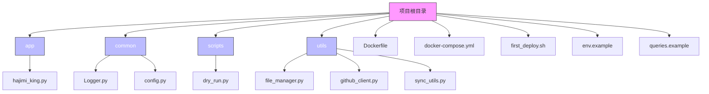
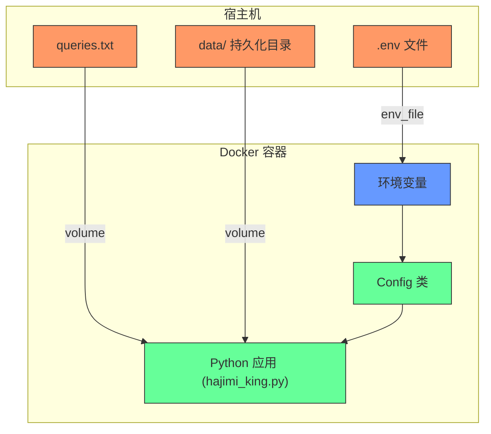
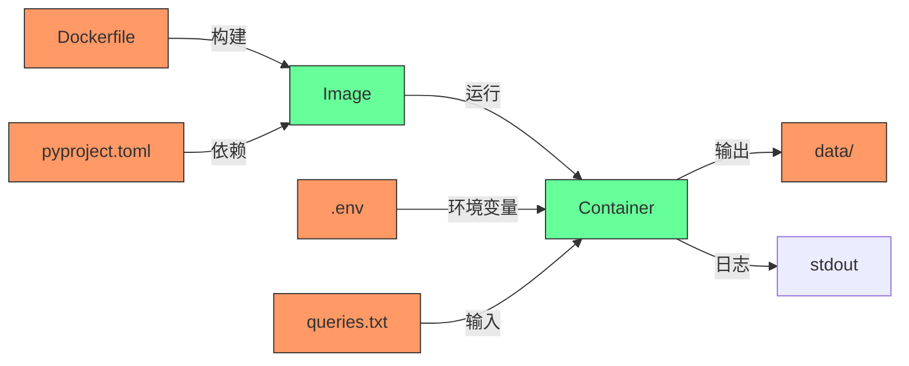

# Docker 配置

<cite>
**本文档引用的文件**  
- [Dockerfile](file://Dockerfile#L1-L26)
- [docker-compose.yml](file://docker-compose.yml#L1-L14)
- [common/config.py](file://common/config.py#L1-L203)
- [first_deploy.sh](file://first_deploy.sh#L1-L275)
- [env.example](file://env.example#L1-L48)
- [queries.example](file://queries.example#L1-L6)
</cite>

## 更新摘要
**已更新内容**  
- 移除了与同步功能相关的配置说明，包括`KEYS_SEND_PREFIX`、`KEYS_SEND_DETAIL_PREFIX`等环境变量
- 更新了`common/config.py`中关于同步功能的代码注释和日志输出说明
- 从`app/hajimi_king.py`中移除了对同步功能的调用和相关逻辑
- 调整了故障排除指南中与同步功能相关的条目
- 更新了核心组件和详细组件分析部分，以反映最新的代码状态

## 目录
1. [简介](#简介)
2. [项目结构](#项目结构)
3. [核心组件](#核心组件)
4. [架构概览](#架构概览)
5. [详细组件分析](#详细组件分析)
6. [依赖分析](#依赖分析)
7. [性能考量](#性能考量)
8. [故障排除指南](#故障排除指南)
9. [结论](#结论)

## 简介
本文档提供了一个完整的Docker环境配置指南，涵盖从构建参数定义、环境变量注入、敏感信息管理到容器编排的全流程。重点解析了`Dockerfile`中的`ARG`指令与`ENV`变量的使用方式，`docker-compose.yml`中多行环境变量配置、`.env`文件引用、数据卷挂载及服务健康检查等关键配置。同时，结合项目实际代码，说明如何通过外部化配置实现动态更新，避免镜像重建，适用于Swarm或Kubernetes等编排环境。

## 项目结构
本项目采用模块化分层结构，主要分为应用逻辑、通用工具、脚本和配置文件四大部分。整体结构清晰，职责分离明确。



**图示来源**  
- [Dockerfile](file://Dockerfile#L1-L26)
- [docker-compose.yml](file://docker-compose.yml#L1-L14)

**本节来源**  
- [Dockerfile](file://Dockerfile#L1-L26)
- [docker-compose.yml](file://docker-compose.yml#L1-L14)

## 核心组件
项目的核心配置逻辑集中在`common/config.py`中，通过`Config`类集中管理所有环境变量。该类利用`os.getenv()`从环境读取配置，并提供类型转换、列表解析和布尔值判断等辅助方法。配置项涵盖GitHub令牌、代理设置、数据路径、查询文件、黑名单过滤、模型配置等。

关键特性包括：
- **环境变量驱动**：所有配置均可通过环境变量覆盖
- **默认值机制**：未设置时提供安全默认值
- **类型安全解析**：自动将字符串转换为布尔、整数或列表
- **运行时校验**：`check()`方法验证必要配置完整性

```python
class Config:
    GITHUB_TOKENS_STR = os.getenv("GITHUB_TOKENS", "")
    GITHUB_TOKENS = [token.strip() for token in GITHUB_TOKENS_STR.split(',') if token.strip()]
    DATA_PATH = os.getenv('DATA_PATH', '/app/data')
    PROXY_LIST_STR = os.getenv("PROXY", "")
    PROXY_LIST = [p.strip() for p in PROXY_LIST_STR.split(',') if p.strip()]
    
    @classmethod
    def parse_bool(cls, value: str) -> bool:
        return value.strip().lower() in ('true', '1', 'yes', 'on', 'enabled')
```

**本节来源**  
- [common/config.py](file://common/config.py#L1-L203)

## 架构概览
系统采用微服务式单容器架构，通过Docker封装Python应用，利用Docker Compose进行生命周期管理。外部通过`.env`文件注入敏感配置，数据通过volume持久化，支持动态扩展。



**图示来源**  
- [docker-compose.yml](file://docker-compose.yml#L1-L14)
- [common/config.py](file://common/config.py#L1-L203)

## 详细组件分析

### Dockerfile 配置分析
`Dockerfile`定义了镜像构建流程，使用`python:3.11-slim`作为基础镜像，确保轻量化和安全性。

#### 构建参数与环境变量
虽然当前`Dockerfile`未使用`ARG`，但可通过以下方式添加构建时参数：

```dockerfile
ARG BUILD_VERSION=0.0.1
ARG PYTHON_VERSION=3.11

FROM registry-1.docker.io/library/python:${PYTHON_VERSION}-slim
ENV APP_VERSION=${BUILD_VERSION}
```

现有`ENV`指令设置`PYTHONPATH`和`PYTHONUNBUFFERED`，确保模块导入和日志实时输出。

#### 依赖安装优化
采用`uv`包管理器替代`pip`，提升依赖安装速度。通过分层复制`pyproject.toml`和`uv.lock`，利用Docker缓存机制，仅当依赖变更时重新安装。

```dockerfile
COPY pyproject.toml uv.lock ./
RUN pip install uv && uv pip install --system --no-cache -r pyproject.toml
```

**本节来源**  
- [Dockerfile](file://Dockerfile#L1-L26)

### docker-compose.yml 配置详解
`docker-compose.yml`定义了服务部署配置，支持多环境变量注入和数据持久化。

#### 环境变量配置
使用`env_file`字段从`.env`文件加载环境变量，实现敏感信息外部化：

```yaml
services:
  hajimi-king:
    env_file:
      - .env
```

`.env`文件示例（来自`env.example`）：
```
GITHUB_TOKENS=ghp_token1,ghp_token2
PROXY=http://proxy1:8080,socks5://proxy2:1080
DATA_PATH=/app/data
```

#### 多行环境变量语法（扩展建议）
对于复杂配置，YAML支持多行字符串：

```yaml
environment:
  QUERIES: |
    AIzaSy in:file
    "https://api-inference.modelscope.cn/v1/" in:file
```

#### 数据卷挂载
通过`volumes`实现数据持久化和外部文件共享：

```yaml
volumes:
  - ./data:/app/data
```

此配置将宿主机`./data`目录挂载到容器`/app/data`，用于存储：
- `queries.txt`：搜索查询文件
- `scanned_shas.txt`：已扫描的SHA记录
- 输出结果文件（有效密钥、限流密钥等）

#### 资源限制（扩展建议）
在生产环境中应设置资源限制：

```yaml
deploy:
  resources:
    limits:
      cpus: '2'
      memory: 4G
    reservations:
      memory: 1G
```

#### 服务依赖与健康检查（扩展建议）
可添加健康检查确保服务就绪：

```yaml
healthcheck:
  test: ["CMD", "python", "-c", "import requests; assert requests.get('http://localhost:8080/health').status_code == 200"]
  interval: 30s
  timeout: 10s
  retries: 3
```

#### 完整 docker-compose.yml 示例
```yaml
version: '3.8'

services:
  hajimi-king:
    image: hajimi-king:0.0.1
    container_name: hajimi-king
    restart: unless-stopped
    network_mode: host
    env_file:
      - .env
    volumes:
      - ./data:/app/data
    healthcheck:
      test: ["CMD", "pgrep", "python"]
      interval: 30s
      timeout: 10s
      retries: 3
    deploy:
      resources:
        limits:
          cpus: '2'
          memory: 4G
```

**本节来源**  
- [docker-compose.yml](file://docker-compose.yml#L1-L14)
- [env.example](file://env.example#L1-L48)
- [common/config.py](file://common/config.py#L1-L203)

### 部署脚本分析
`first_deploy.sh`是一个自动化部署脚本，简化了初次部署流程。

#### 脚本功能
- 检查源码和Docker环境
- 创建`data`目录和`.env`配置文件
- 复制`queries.txt`
- 交互式配置GitHub Token
- 构建镜像并启动服务

#### 敏感信息处理
脚本会检测`.env`中是否为默认值，若未配置则提示用户输入，并自动更新文件，确保安全性。

#### 使用方式
```bash
chmod +x first_deploy.sh
./first_deploy.sh
```

**本节来源**  
- [first_deploy.sh](file://first_deploy.sh#L1-L275)

## 依赖分析
项目依赖关系清晰，分为构建依赖和运行时依赖。



**图示来源**  
- [Dockerfile](file://Dockerfile#L1-L26)
- [pyproject.toml](file://pyproject.toml)
- [docker-compose.yml](file://docker-compose.yml#L1-L14)

**本节来源**  
- [Dockerfile](file://Dockerfile#L1-L26)
- [docker-compose.yml](file://docker-compose.yml#L1-L14)

## 性能考量
- **镜像大小**：使用`slim`基础镜像和`uv`包管理器，减小镜像体积
- **缓存优化**：Docker层缓存依赖安装，加速重建
- **代理支持**：通过`PROXY`配置支持代理，提升外部请求速度
- **并发处理**：GitHub Token支持多令牌轮询，提高API调用速率

## 故障排除指南
常见问题及解决方案：

| 问题现象 | 可能原因 | 解决方案 |
|--------|--------|--------|
| 容器启动失败 | `.env`中未配置GITHUB_TOKENS | 运行`first_deploy.sh`或手动编辑`.env` |
| 无法访问网络 | 代理配置错误或未配置 | 检查`PROXY`环境变量格式 |
| 查询无结果 | `queries.txt`为空或语法错误 | 检查`data/queries.txt`内容 |
| 日志无输出 | `PYTHONUNBUFFERED`未设置 | 确保`Dockerfile`中已设置 |
| 数据未持久化 | volume挂载路径错误 | 检查`docker-compose.yml`中volumes配置 |

**本节来源**  
- [common/config.py](file://common/config.py#L1-L203)
- [first_deploy.sh](file://first_deploy.sh#L1-L275)

## 结论
本项目提供了完整的Docker化部署方案，通过环境变量、`.env`文件、数据卷挂载和自动化脚本，实现了配置的灵活管理与敏感信息的安全隔离。建议在生产环境中：
1. 使用Kubernetes ConfigMap/Secret管理配置
2. 启用资源限制和健康检查
3. 定期轮换GitHub Token
4. 监控容器资源使用情况

该架构设计良好，易于扩展至Swarm或Kubernetes集群，支持配置动态更新而无需重建镜像。