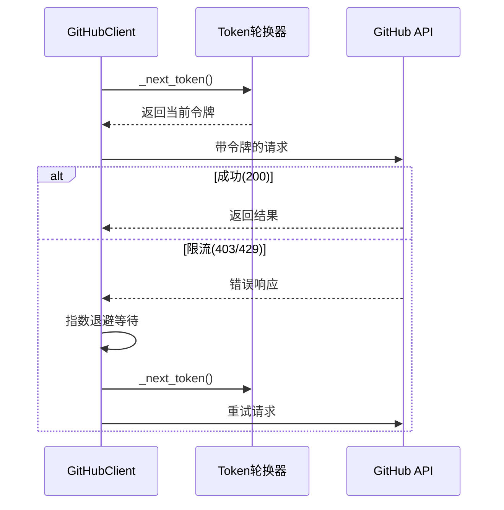
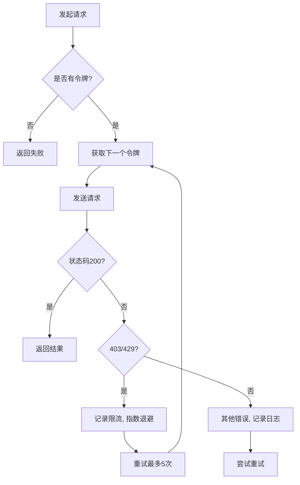

# GitHub 配置

<cite>
**本文档引用的文件**  
- [config.py](file://common/config.py#L1-L203)
- [github_client.py](file://utils/github_client.py#L1-L217)
- [hajimi_king.py](file://app/hajimi_king.py#L1-L523)
- [queries.txt](file://data/queries.txt#L1-L4)
</cite>

## 目录
1. [GitHub 配置](#github-配置)
2. [核心配置项详解](#核心配置项详解)
   - [GITHUB_TOKENS（多令牌轮换机制）](#github_tokens多令牌轮换机制)
   - [SEARCH_QUERIES_FILE（自定义搜索查询文件路径）](#search_queries_file自定义搜索查询文件路径)
   - [GITHUB_API_URL（支持GitHub Enterprise）](#github_api_url支持github-enterprise)
   - [SINCE_DAYS（时间范围过滤）](#since_days时间范围过滤)
3. [配置加载与单例模式](#配置加载与单例模式)
4. [令牌轮换逻辑实现](#令牌轮换逻辑实现)
5. [查询文件结构与搜索语法](#查询文件结构与搜索语法)
6. [API速率限制与错误处理](#api速率限制与错误处理)
7. [常见问题与最佳实践](#常见问题与最佳实践)

## 核心配置项详解

### GITHUB_TOKENS（多令牌轮换机制）

**作用**  
`GITHUB_TOKENS` 环境变量用于配置多个 GitHub Personal Access Token（PAT），以实现请求轮换，避免单个令牌因频繁调用而触发速率限制（rate limit）。

**格式要求**  
- 多个令牌使用英文逗号 `,` 分隔
- 支持空格，系统会自动去除前后空格
- 示例：`GITHUB_TOKENS=token1, token2, token3`

**代码实现**  
在 `common/config.py` 中，通过以下方式解析：

```python
GITHUB_TOKENS_STR = os.getenv("GITHUB_TOKENS", "")
GITHUB_TOKENS = [token.strip() for token in GITHUB_TOKENS_STR.split(',') if token.strip()]
```

**最佳实践**  
- 建议配置 3-5 个不同账户的令牌以提高扫描效率
- 定期轮换令牌，避免长期使用导致被封禁
- 每个令牌应具有 `repo` 和 `search` 权限

**Section sources**
- [config.py](file://common/config.py#L1-L203)

### SEARCH_QUERIES_FILE（自定义搜索查询文件路径）

**作用**  
指定自定义搜索查询语句的文件路径，用于定义在 GitHub 上搜索密钥的关键字和条件。

**默认值**  
`queries.txt`

**格式要求**  
- 每行一个搜索查询语句
- 支持 GitHub 代码搜索语法（如 `in:file`, `language:`, `filename:` 等）
- 文件需为 UTF-8 编码

**示例内容**  
```text
"https://api-inference.modelscope.cn/v1/" in:file
api-inference.modelscope.cn in:file
```

**代码加载逻辑**  
在 `app/hajimi_king.py` 中通过 `file_manager.get_search_queries()` 加载：

```python
search_queries = file_manager.get_search_queries()
```

**最佳实践**  
- 使用精确的 base URL 匹配以减少误报
- 结合 `in:file` 限制搜索范围为文件内容
- 可添加 `language:python` 或 `filename:.env` 等条件进一步过滤

**Section sources**
- [hajimi_king.py](file://app/hajimi_king.py#L1-L523)
- [queries.txt](file://data/queries.txt#L1-L4)

### GITHUB_API_URL（支持GitHub Enterprise）

**作用**  
允许配置自定义 GitHub API 地址，以支持 GitHub Enterprise（私有部署实例）。

**默认值**  
`https://api.github.com/search/code`

**扩展能力**  
虽然当前代码中未直接暴露该配置为环境变量，但可通过修改 `GitHubClient` 类中的 `GITHUB_API_URL` 静态变量实现自定义。

```python
class GitHubClient:
    GITHUB_API_URL = "https://api.github.com/search/code"  # 可修改为 GHE 地址
```

**推荐做法**  
若需支持 GitHub Enterprise，建议在 `config.py` 中新增：

```python
GITHUB_API_URL = os.getenv("GITHUB_API_URL", "https://api.github.com/search/code")
```

并在 `github_client.py` 中引用该配置。

**Section sources**
- [github_client.py](file://utils/github_client.py#L1-L217)

### SINCE_DAYS（时间范围过滤）

**作用**  
实现增量扫描，仅处理指定天数内更新的仓库，避免重复扫描历史数据。

**对应配置项**  
`DATE_RANGE_DAYS`（单位：天）

**默认值**  
730 天（约 2 年）

**实现逻辑**  
在 `app/hajimi_king.py` 中通过 `should_skip_item` 函数实现：

```python
if repo_pushed_dt < datetime.utcnow() - timedelta(days=Config.DATE_RANGE_DAYS):
    skip_stats["age_filter"] += 1
    return True, "age_filter"
```

**增量扫描机制**  
- 系统通过 `checkpoint.last_scan_time` 记录上次扫描时间
- 结合 `repo.pushed_at` 字段判断是否为新更新的仓库
- 仅处理更新时间晚于 `last_scan_time` 的文件

**最佳实践**  
- 初始扫描建议设置为 `730` 天以覆盖大部分活跃仓库
- 日常运行可设置为 `7` 天实现高效增量扫描
- 配合 `SCANNED_SHAS_FILE` 防止重复处理同一文件

**Section sources**
- [hajimi_king.py](file://app/hajimi_king.py#L1-L523)
- [config.py](file://common/config.py#L1-L203)

## 配置加载与单例模式

**实现方式**  
`config.py` 使用类变量和模块级实例实现单例模式：

```python
class Config:
    # 所有配置作为类变量
    GITHUB_TOKENS = [...]
    DATA_PATH = ...

# 创建全局实例
config = Config()
```

**优点**  
- 无需实例化即可访问配置：`Config.GITHUB_TOKENS`
- 模块导入时自动加载 `.env` 文件
- 环境变量优先，`.env` 文件作为后备

**配置验证**  
`Config.check()` 方法用于验证必要配置：

```python
def check(cls) -> bool:
    errors = []
    if not cls.GITHUB_TOKENS:
        errors.append("GitHub tokens not found.")
    # ... 其他检查
    return len(errors) == 0
```

**Section sources**
- [config.py](file://common/config.py#L1-L203)

## 令牌轮换逻辑实现

**核心类**  
`GitHubClient`（位于 `utils/github_client.py`）

**轮换机制**  
使用指针 `_token_ptr` 实现循环轮换：

```python
def _next_token(self) -> Optional[str]:
    if not self.tokens:
        return None
    token = self.tokens[self._token_ptr % len(self.tokens)]
    self._token_ptr += 1
    return token.strip()
```

**请求流程**  
1. 每次请求前调用 `_next_token()` 获取下一个令牌
2. 将令牌放入 `Authorization` 头部
3. 发送请求并处理响应

**错误重试机制**  
- 遇到 403/429 错误时自动重试（最多 5 次）
- 指数退避策略：`wait = min(2 ** attempt + random.uniform(0, 1), 60)`
- 自动切换到下一个令牌



**Diagram sources**
- [github_client.py](file://utils/github_client.py#L1-L217)

**Section sources**
- [github_client.py](file://utils/github_client.py#L1-L217)

## 查询文件结构与搜索语法

### 查询文件结构

**文件路径**  
由 `QUERIES_FILE` 环境变量指定，默认为 `queries.txt`

**JSON 结构（推荐扩展格式）**  
虽然当前为纯文本，但可扩展为 JSON 格式以支持元数据：

```json
[
  {
    "query": "\"https://api-inference.modelscope.cn/v1/\" in:file",
    "type": "modelscope",
    "enabled": true
  },
  {
    "query": "gemini apikey in:file",
    "type": "gemini",
    "enabled": true
  }
]
```

### 推荐搜索语法

| 目标 | 搜索语句 |
|------|---------|
| ModelScope 密钥 | `"https://api-inference.modelscope.cn/v1/" in:file` |
| Gemini 密钥 | `AIzaSy[A-Za-z0-9\-_]{33} in:file` |
| 特定文件类型 | `filename:.env AIzaSy in:file` |
| 特定语言 | `language:python "api_key" in:file` |

**正则提取逻辑**  
在 `hajimi_king.py` 中实现：

```python
def extract_keys_from_content(content: str) -> List[str]:
    pattern = r'(AIzaSy[A-Za-z0-9\-_]{33})'
    return re.findall(pattern, content)
```

**ModelScope 专用提取**  
```python
def extract_ms_keys_for_modelscope(content: str) -> List[str]:
    # 先检查是否包含目标base_url
    # 再提取 ms-UUID 格式的密钥
    # 可选上下文验证
```

**Section sources**
- [hajimi_king.py](file://app/hajimi_king.py#L1-L523)
- [queries.txt](file://data/queries.txt#L1-L4)

## API速率限制与错误处理

### 速率限制处理

**检测机制**  
通过响应头 `X-RateLimit-Remaining` 监控剩余配额：

```python
rate_limit_remaining = response.headers.get('X-RateLimit-Remaining')
if int(rate_limit_remaining) < 3:
    logger.warning(f"⚠️ Rate limit low: {rate_limit_remaining} remaining")
```

**自动切换**  
- 每次请求后自动轮换到下一个令牌
- 遇到 403/429 错误时立即重试并切换令牌
- 指数退避避免暴力请求

### 无效令牌检测

**检测时机**  
- 每次 API 请求失败时
- 特别是 401、403 状态码

**处理机制**  
当前系统通过轮换自动规避，但未持久化标记无效令牌。可改进：

```python
# 建议添加无效令牌记录
INVALID_TOKENS = set()

def _next_token(self):
    while True:
        token = self.tokens[self._token_ptr % len(self.tokens)]
        self._token_ptr += 1
        if token not in INVALID_TOKENS:
            return token
```

### 自动切换机制

**完整流程**  


**Diagram sources**
- [github_client.py](file://utils/github_client.py#L1-L217)

**Section sources**
- [github_client.py](file://utils/github_client.py#L1-L217)

## 常见问题与最佳实践

### 常见问题

**Q: 为什么扫描速度变慢？**  
A: 可能原因：
- 单个令牌达到速率限制
- 网络延迟或代理问题
- GitHub API 响应变慢

**Q: 如何避免重复扫描？**  
A: 系统已实现三重去重：
1. `SCANNED_SHAS_FILE` 记录已处理文件 SHA
2. `DATE_RANGE_DAYS` 过滤旧仓库
3. `checkpoint` 记录已处理查询

**Q: 如何提高密钥检出率？**  
A: 建议：
- 增加高质量搜索查询语句
- 配置更多 GitHub 令牌
- 使用代理避免 IP 限制

### 最佳实践

**配置建议**  
```env
# 至少3个令牌
GITHUB_TOKENS=token1,token2,token3

# 启用增量扫描
DATE_RANGE_DAYS=7

# 自定义查询文件
QUERIES_FILE=queries.txt

# 文件路径黑名单
FILE_PATH_BLACKLIST=readme,docs,sample,example,test
```

**运行建议**  
- 首次运行使用 `DATE_RANGE_DAYS=730` 进行全量扫描
- 日常运行设置为 `7` 天增量扫描
- 定期更新 `queries.txt` 以发现新型密钥模式
- 监控日志中的 `Rate limit` 警告，及时补充令牌

**Section sources**
- [config.py](file://common/config.py#L1-L203)
- [github_client.py](file://utils/github_client.py#L1-L217)
- [hajimi_king.py](file://app/hajimi_king.py#L1-L523)