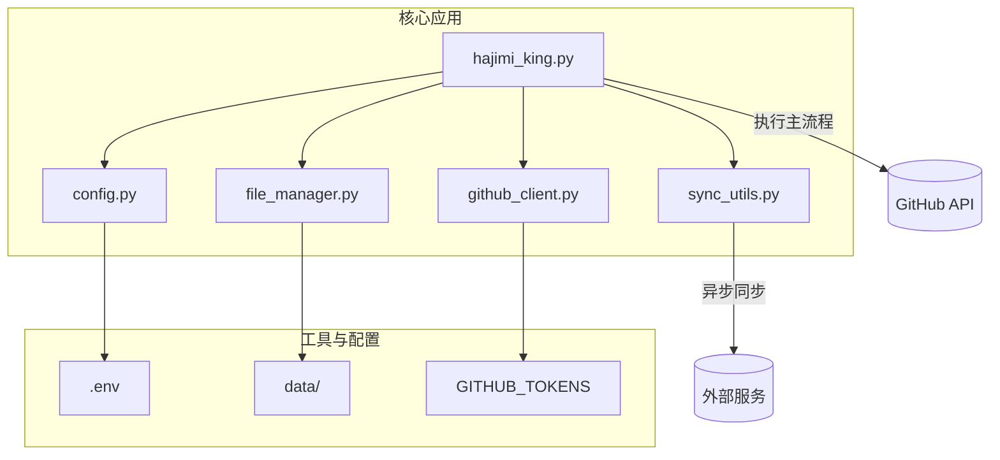
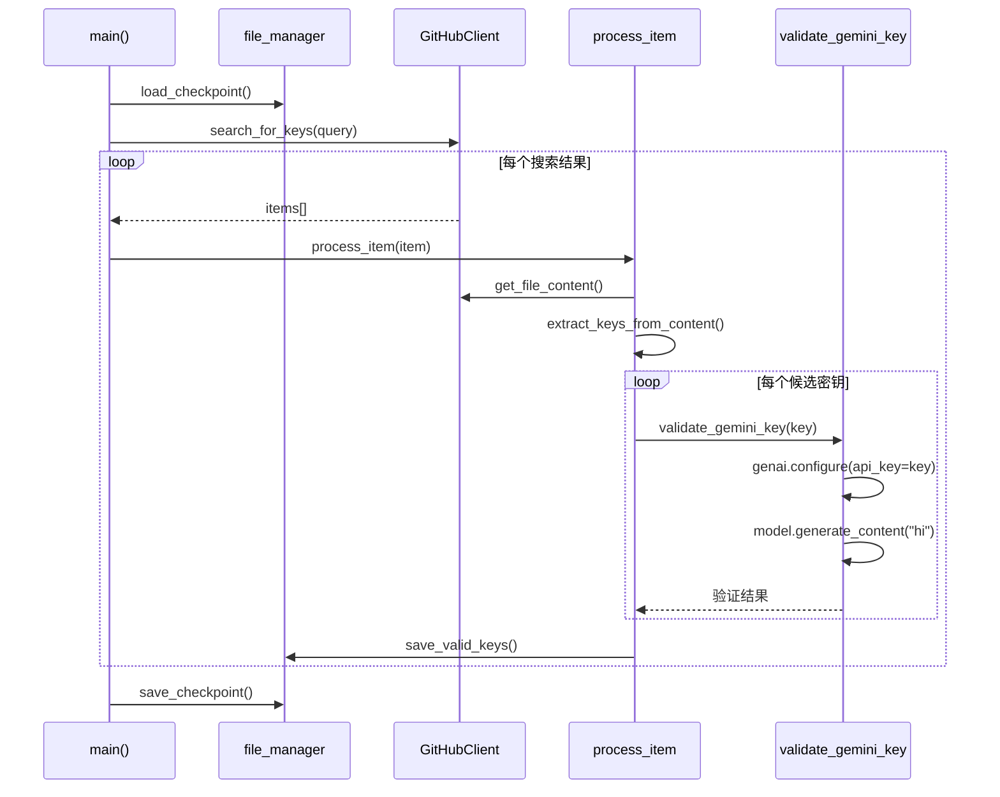
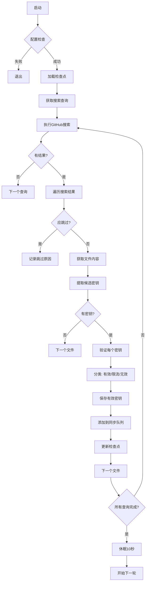

# Gemini密钥提取

<cite>
**本文档中引用的文件**  
- [hajimi_king.py](file://app/hajimi_king.py)
- [file_manager.py](file://utils/file_manager.py)
- [config.py](file://common/config.py)
- [github_client.py](file://utils/github_client.py)
</cite>

## 目录
1. [项目结构分析](#项目结构分析)
2. [核心组件分析](#核心组件分析)
3. [Gemini密钥提取流程详解](#gemini密钥提取流程详解)
4. [正则表达式与密钥匹配机制](#正则表达式与密钥匹配机制)
5. [上下文语义验证机制](#上下文语义验证机制)
6. [性能优化策略](#性能优化策略)
7. [配置管理与扩展指南](#配置管理与扩展指南)

## 项目结构分析

本项目 `APIKEY-king` 是一个用于从GitHub代码库中提取Google Gemini平台API密钥的自动化工具。其整体结构清晰，采用模块化设计，各组件职责分明。



**图示来源**  
- [hajimi_king.py](file://app/hajimi_king.py)
- [config.py](file://common/config.py)
- [file_manager.py](file://utils/file_manager.py)

**本节来源**  
- [hajimi_king.py](file://app/hajimi_king.py)
- [config.py](file://common/config.py)

## 核心组件分析

### 主控制器：hajimi_king.py

`hajimi_king.py` 是整个系统的入口和控制中心，负责协调各个模块完成密钥的搜索、提取、验证和保存。

#### 主要功能：
- **初始化系统**：加载配置、检查依赖、初始化文件管理器。
- **循环执行扫描任务**：通过GitHub API搜索包含密钥的文件。
- **处理搜索结果**：对每个搜索到的文件进行内容分析。
- **密钥提取与验证**：调用正则表达式提取候选密钥，并通过API调用验证其有效性。
- **结果持久化**：将有效密钥保存到文件系统，并支持同步到外部服务。



**图示来源**  
- [hajimi_king.py](file://app/hajimi_king.py#L400-L523)
- [file_manager.py](file://utils/file_manager.py#L100-L200)
- [github_client.py](file://utils/github_client.py#L20-L50)

**本节来源**  
- [hajimi_king.py](file://app/hajimi_king.py)

### 文件管理器：file_manager.py

`file_manager.py` 负责所有与文件系统交互的操作，包括：
- 加载和保存搜索查询（`queries.txt`）
- 管理检查点（`checkpoint.json`），实现增量扫描
- 记录已扫描文件的SHA值，避免重复处理
- 动态生成和更新日志及密钥输出文件名

该模块通过 `Checkpoint` 数据类维护扫描状态，确保程序在中断后能从断点继续执行。

**本节来源**  
- [file_manager.py](file://utils/file_manager.py)

### 配置管理：config.py

`config.py` 使用 `dotenv` 库从环境变量中加载配置，集中管理所有可配置参数，包括：
- `GITHUB_TOKENS`：用于访问GitHub API的身份令牌
- `PROXY_LIST`：代理服务器列表，用于绕过网络限制
- `DATE_RANGE_DAYS`：仓库活跃时间过滤阈值
- `FILE_PATH_BLACKLIST`：路径黑名单，用于跳过文档、示例等无关文件
- 各种文件前缀和路径配置

**本节来源**  
- [config.py](file://common/config.py)

## Gemini密钥提取流程详解

密钥提取流程是一个多阶段的自动化过程，从搜索到验证再到保存，形成一个完整的闭环。

### 整体流程



**图示来源**  
- [hajimi_king.py](file://app/hajimi_king.py#L400-L523)

**本节来源**  
- [hajimi_king.py](file://app/hajimi_king.py)

### 详细步骤

1. **初始化与检查**：
   - 调用 `Config.check()` 验证必要配置（如 `GITHUB_TOKENS`）是否存在。
   - 调用 `file_manager.check()` 确保文件系统准备就绪。
   - 加载 `checkpoint`，决定是进行全量扫描还是增量扫描。

2. **执行搜索**：
   - 从 `queries.txt` 中读取预定义的搜索查询（如 `AIzaSy in:file`）。
   - 使用 `GitHubClient.search_for_keys()` 方法调用GitHub搜索API。

3. **结果处理**：
   - 对每个搜索结果调用 `should_skip_item()` 进行过滤。
   - 调用 `process_item()` 处理单个文件。

4. **密钥提取与验证**：
   - 调用 `extract_keys_from_content()` 使用正则表达式提取候选密钥。
   - 对每个候选密钥调用 `validate_gemini_key()` 进行实际验证。

5. **结果保存与同步**：
   - 有效密钥通过 `file_manager.save_valid_keys()` 保存。
   - 同时调用 `sync_utils.add_keys_to_queue()` 将密钥加入异步同步队列。

## 正则表达式与密钥匹配机制

### Gemini密钥正则表达式分析

用于匹配Gemini API密钥的核心正则表达式定义在 `hajimi_king.py` 的 `extract_keys_from_content` 函数中：

```python
pattern = r'(AIzaSy[A-Za-z0-9\-_]{33})'
```

该正则表达式的结构和含义如下：

| 正则部分 | 匹配规则 | 说明 |
|---------|--------|------|
| `AIzaSy` | 字面量 | 所有Google API密钥的固定前缀 |
| `[A-Za-z0-9\-_]` | 字符集 | 匹配大小写字母、数字、连字符 `-` 和下划线 `_` |
| `{33}` | 量词 | 精确匹配前面的字符集33次 |
| `( ... )` | 捕获组 | 提取匹配到的完整密钥字符串 |

**总长度**：前缀 `AIzaSy` (7字符) + 后缀33字符 = **40字符**。

**本节来源**  
- [hajimi_king.py](file://app/hajimi_king.py#L83-L85)

### 匹配过程示例

假设文件内容如下：
```javascript
// config.js
const config = {
  geminiApiKey: "AIzaSyBx1Yz3mNpQrStUvWxYz1234567890AbCdEfG",
  otherKey: "invalid_key"
};
```

执行 `re.findall(pattern, content)` 的过程：
1. 在文本中搜索 `AIzaSy`。
2. 找到后，检查其后是否紧跟33个属于 `[A-Za-z0-9\-_]` 集合的字符。
3. 如果满足，则将整个40字符的字符串（`AIzaSyBx1Yz3mNpQrStUvWxYz1234567890AbCdEfG`）作为一个匹配结果返回。

## 上下文语义验证机制

提取到候选密钥后，系统不会立即认定其有效，而是进行上下文语义分析和实际API验证，以减少误报。

### 上下文过滤

在 `process_item` 函数中，对提取到的密钥进行了初步的上下文过滤：

```python
for key in keys:
    context_index = content.find(key)
    if context_index != -1:
        snippet = content[context_index:context_index + 45]
        if "..." in snippet or "YOUR_" in snippet.upper():
            continue # 跳过占位符
    filtered_keys.append(key)
```

**过滤规则**：
- **占位符检测**：检查密钥前后45个字符内是否包含 `...` 或 `YOUR_`（不区分大小写）。
- **示例**：`api_key: "YOUR_API_KEY"` 或 `key: "..."` 会被识别为占位符并被过滤。

**本节来源**  
- [hajimi_king.py](file://app/hajimi_king.py#L260-L270)

### API实际验证

最核心的验证逻辑在 `validate_gemini_key` 函数中：

```python
def validate_gemini_key(api_key: str) -> Union[bool, str]:
    try:
        # 配置Google Generative AI客户端
        genai.configure(api_key=api_key, client_options=client_options)
        # 创建模型实例
        model = genai.GenerativeModel(Config.HAJIMI_CHECK_MODEL)
        # 发起一次简单的生成请求
        response = model.generate_content("hi")
        return "ok"
    except (google_exceptions.PermissionDenied, google_exceptions.Unauthenticated) as e:
        return "not_authorized_key"
    except google_exceptions.TooManyRequests as e:
        return "rate_limited"
    # ... 其他异常处理
```

**验证流程**：
1. 使用候选密钥配置 `google.generativeai` 客户端。
2. 创建一个 `GenerativeModel` 实例（使用配置中的 `HAJIMI_CHECK_MODEL`，默认为 `gemini-2.5-flash`）。
3. 调用 `generate_content("hi")` 发起一次实际的API请求。
4. 根据响应或抛出的异常判断密钥状态：
   - **成功**：返回 `"ok"`，密钥有效。
   - **权限拒绝**：返回 `"not_authorized_key"`，密钥无效。
   - **请求过多**：返回 `"rate_limited"`，密钥有效但已被限流。
   - **其他错误**：根据错误信息返回相应状态。

## 性能优化策略

系统在设计时考虑了多种性能和效率优化策略，以应对大规模的GitHub搜索和处理任务。

### 短路匹配与早期过滤

系统在多个环节实现了“短路”逻辑，避免不必要的计算：

1. **查询去重**：通过 `checkpoint.processed_queries` 记录已处理的查询，避免重复搜索。
2. **文件去重**：通过 `checkpoint.scanned_shas` 记录已扫描文件的SHA值，实现增量扫描。
3. **时间过滤**：通过 `DATE_RANGE_DAYS` 配置，跳过长时间未更新的陈旧仓库。
4. **路径过滤**：通过 `FILE_PATH_BLACKLIST` 快速跳过 `readme`、`docs`、`sample` 等明显无关的文件路径。

### 批量处理与状态持久化

- **批量保存检查点**：在处理搜索结果时，每处理20个文件就调用一次 `file_manager.save_checkpoint(checkpoint)`，平衡了数据安全和I/O性能。
- **动态文件名更新**：`file_manager.update_dynamic_filenames()` 根据日期动态更新输出文件名，便于按天归档和管理。

### 资源管理与稳定性

- **随机延迟**：在 `process_item` 和主循环中引入 `time.sleep(random.uniform(1, 4))` 和 `time.sleep(10)`，有效避免对GitHub API的过于频繁的请求，防止被封禁。
- **代理支持**：通过 `Config.get_random_proxy()` 随机轮换代理，提高请求成功率和稳定性。
- **异常处理**：在 `main()` 函数的主循环中捕获 `Exception`，确保单个文件处理失败不会导致整个程序崩溃，实现“出错继续”（fail-fast but continue）。

**本节来源**  
- [hajimi_king.py](file://app/hajimi_king.py)
- [file_manager.py](file://utils/file_manager.py)

## 配置管理与扩展指南

### 配置文件详解

系统主要通过环境变量进行配置，核心配置位于 `.env` 文件或环境变量中：

| 配置项 | 说明 | 示例值 |
|-------|------|-------|
| `GITHUB_TOKENS` | 一个或多个GitHub Personal Access Token，用逗号分隔 | `ghp_abc123,ghp_def456` |
| `DATA_PATH` | 数据存储根目录 | `/app/data` |
| `PROXY` | 代理服务器列表，用逗号分隔 | `http://proxy1:8080,socks5://proxy2:1080` |
| `DATE_RANGE_DAYS` | 只搜索最近活跃的仓库（天） | `730` (2年) |
| `FILE_PATH_BLACKLIST` | 路径黑名单，跳过这些路径的文件 | `readme,docs,sample` |
| `MODELSCOPE_EXTRACT_ONLY` | 是否仅提取ModelScope密钥 | `true`/`false` |

### 扩展指南：应对Gemini API密钥格式变更

如果Google未来更改了Gemini API密钥的格式，开发者需要修改 `hajimi_king.py` 中的正则表达式。

**修改步骤**：

1. **定位函数**：找到 `extract_keys_from_content` 函数。
2. **更新正则表达式**：根据新的密钥格式调整 `pattern` 变量。
    - **示例1：前缀变更**：如果前缀从 `AIzaSy` 变为 `GEMINI-`，则修改为：
      ```python
      pattern = r'(GEMINI-[A-Za-z0-9\-_]{36})' # 总长37字符
      ```
    - **示例2：长度变更**：如果密钥总长变为64字符，则修改为：
      ```python
      pattern = r'(AIzaSy[A-Za-z0-9\-_]{57})' # 7 + 57 = 64
      ```
3. **测试验证**：使用包含新格式密钥的测试文件运行程序，确保提取和验证功能正常。
4. **更新配置**：如果新格式需要不同的验证模型，更新 `HAJIMI_CHECK_MODEL` 环境变量。

通过这种方式，系统可以快速适应API密钥格式的变化，保持其提取能力的有效性。

**本节来源**  
- [hajimi_king.py](file://app/hajimi_king.py#L83)
- [config.py](file://common/config.py)