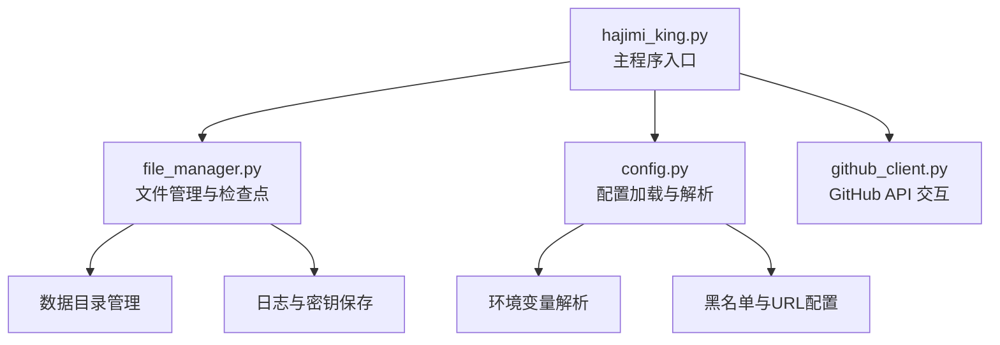
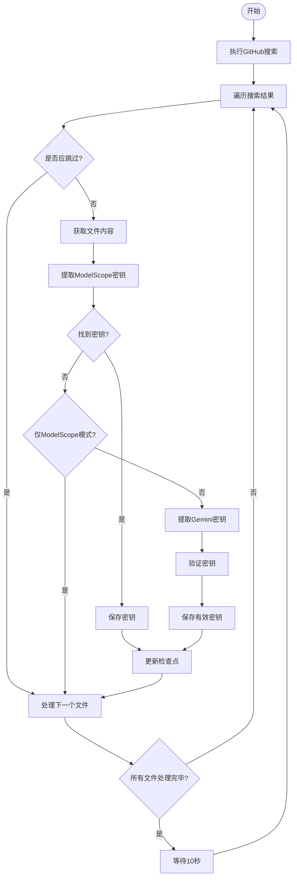
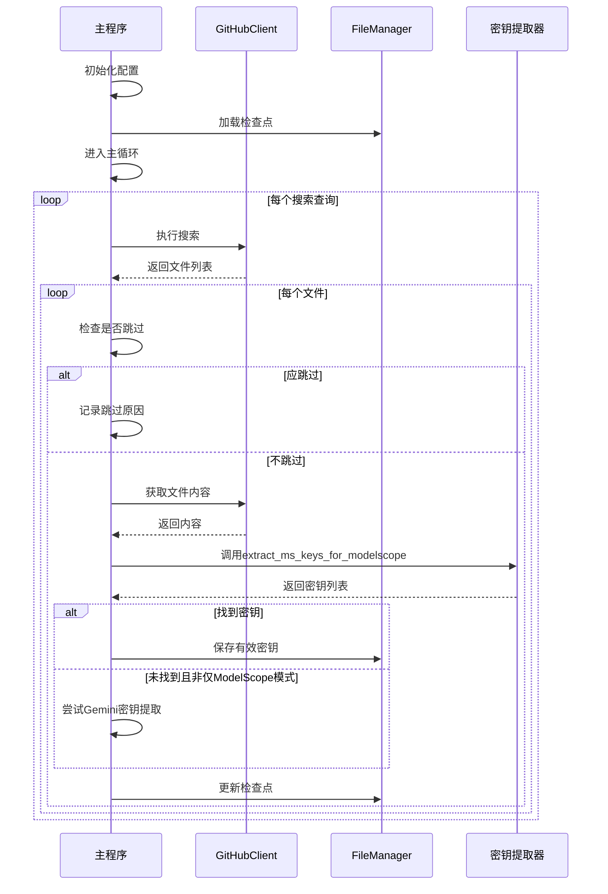

# ModelScope密钥提取

<cite>
**本文档引用的文件**  
- [hajimi_king.py](file://app/hajimi_king.py)
- [file_manager.py](file://utils/file_manager.py)
- [config.py](file://common/config.py)
</cite>

## 目录
1. [项目结构分析](#项目结构分析)  
2. [核心功能解析](#核心功能解析)  
3. [ModelScope密钥提取机制](#modelscope密钥提取机制)  
4. [正则表达式与上下文验证](#正则表达式与上下文验证)  
5. [文件读取与内容处理流程](#文件读取与内容处理流程)  
6. [配置项详解](#配置项详解)  
7. [代码执行流程图](#代码执行流程图)  
8. [实际代码片段展示](#实际代码片段展示)  
9. [开发者指导与更新建议](#开发者指导与更新建议)

## 项目结构分析

APIKEY-king 是一个用于从 GitHub 文件中提取 API 密钥的工具，其主要功能包括搜索、提取、验证和保存密钥。项目采用模块化设计，各组件职责清晰。



**图示来源**  
- [hajimi_king.py](file://app/hajimi_king.py#L1-L523)
- [file_manager.py](file://utils/file_manager.py#L1-L492)
- [config.py](file://common/config.py#L1-L203)

**本节来源**  
- [hajimi_king.py](file://app/hajimi_king.py#L1-L523)
- [file_manager.py](file://utils/file_manager.py#L1-L492)
- [config.py](file://common/config.py#L1-L203)

## 核心功能解析

该工具的核心目标是从公开的 GitHub 仓库文件中识别并提取潜在的 API 密钥，特别是针对 Google Gemini 和 ModelScope 平台的密钥。

主要功能模块包括：
- **密钥搜索**：通过 GitHub 搜索 API 查找包含特定关键词的文件。
- **内容提取**：下载文件内容并进行文本分析。
- **密钥识别**：使用正则表达式匹配密钥模式。
- **上下文验证**：结合上下文判断密钥有效性。
- **结果保存**：将提取到的密钥分类存储至本地文件系统。

**本节来源**  
- [hajimi_king.py](file://app/hajimi_king.py#L1-L523)

## ModelScope密钥提取机制

ModelScope 密钥的提取由 `extract_ms_keys_for_modelscope` 函数实现，位于 `hajimi_king.py` 中。该函数专门用于识别符合 ModelScope 平台规范的 API 密钥。

### 提取逻辑流程
1. **检查目标URL存在性**：首先确认文件内容中是否包含 `Config.TARGET_BASE_URLS` 中定义的任一 API 地址（如 `https://api-inference.modelscope.cn/v1/`）。
2. **正则匹配密钥**：若存在目标 URL，则在文件内容中搜索以 `ms-` 开头的字符串。
3. **模式选择**：根据配置决定使用严格模式或宽松模式进行匹配。
4. **附加过滤**：可选地启用邻近字符距离检查和上下文关键词验证。
5. **去重输出**：对结果进行去重并保持原始顺序返回。

```python
def extract_ms_keys_for_modelscope(content: str) -> List[str]:
    base_urls = Config.TARGET_BASE_URLS
    has_base, base_positions = _contains_base_url(content, base_urls)
    if not has_base:
        return []
    # ... 后续匹配逻辑
```

**本节来源**  
- [hajimi_king.py](file://app/hajimi_king.py#L100-L150)

## 正则表达式与上下文验证

### 正则表达式规则

ModelScope 密钥的识别依赖于以下两种正则模式：

| 配置项 | 正则表达式 | 说明 |
|--------|-----------|------|
| 严格模式 | `r'(?i)\bms-[0-9a-f]{8}-[0-9a-f]{4}-[0-9a-f]{4}-[0-9a-f]{4}-[0-9a-f]{12}\b'` | 匹配标准 UUID 格式的密钥（共36字符） |
| 宽松模式 | `r'(?i)\bms-[0-9a-f-]{30,}\b'` | 匹配长度至少为30的 `ms-` 开头字符串 |

- **前缀要求**：必须以 `ms-` 开头（不区分大小写）。
- **字符集**：仅允许小写字母 `a-f` 和数字 `0-9`，以及连字符 `-`。
- **长度要求**：严格模式下总长为40字符（含 `ms-`），宽松模式下不少于30字符。

### 上下文验证机制

为提高提取准确性，系统支持以下上下文验证：

1. **邻近性检查（Proximity Check）**  
   当启用宽松模式时，可通过 `MS_PROXIMITY_CHARS` 设置密钥与目标 URL 的最大字符距离。例如设置为 `50` 表示密钥必须出现在目标 URL 前后50个字符范围内。

2. **关键词上下文检查（Key Context Check）**  
   启用 `MS_REQUIRE_KEY_CONTEXT` 后，系统会检查密钥附近80字符内是否包含如下关键词：
   - `key`
   - `token`
   - `secret`
   - `authorization`
   - `api_key` 或 `api-key`

   使用正则表达式 `r"(key|token|secret|authorization|api[-_ ]?key)"` 进行不区分大小写的匹配。

3. **占位符过滤**  
   自动排除形如 `ms-00000000-0000-0000-0000-000000000000` 的默认占位符。

```python
ctx_re = re.compile(r"(key|token|secret|authorization|api[-_ ]?key)", re.IGNORECASE)
if require_ctx:
    start = max(0, m.start() - 80)
    end = min(len(content), m.end() + 80)
    snippet = content[start:end]
    if not ctx_re.search(snippet):
        continue
```

**本节来源**  
- [hajimi_king.py](file://app/hajimi_king.py#L100-L150)

## 文件读取与内容处理流程

密钥提取的整体流程如下：

1. **初始化组件**：
   - 加载配置 `Config`
   - 创建 `GitHubClient` 实例
   - 初始化 `FileManager` 和检查点 `checkpoint`

2. **获取文件列表**：
   - 使用 `github_utils.search_for_keys(q)` 执行 GitHub 搜索
   - 获取包含密钥线索的文件列表

3. **逐个处理文件**：
   - 调用 `should_skip_item()` 判断是否跳过（基于时间、SHA、路径等）
   - 调用 `github_utils.get_file_content(item)` 下载文件内容

4. **执行ModelScope密钥提取**：
   - 调用 `extract_ms_keys_for_modelscope(content)`
   - 若找到密钥，则调用 `file_manager.save_valid_keys()` 保存

5. **回退至Gemini密钥提取（可选）**：
   - 若未启用 `MODELSCOPE_EXTRACT_ONLY` 模式，则继续尝试提取 Gemini 密钥

6. **保存结果与更新检查点**：
   - 将有效密钥写入日志文件
   - 更新 `checkpoint` 并持久化



**图示来源**  
- [hajimi_king.py](file://app/hajimi_king.py#L300-L523)

**本节来源**  
- [hajimi_king.py](file://app/hajimi_king.py#L300-L523)
- [file_manager.py](file://utils/file_manager.py#L1-L492)

## 配置项详解

ModelScope 密钥提取行为受多个环境变量控制，定义于 `common/config.py`。

| 配置项 | 默认值 | 说明 |
|--------|--------|------|
| `TARGET_BASE_URLS` | `"https://api-inference.modelscope.cn/v1/"` | 必须出现在文件中的目标API地址，用于触发密钥提取 |
| `MS_USE_LOOSE_PATTERN` | `"false"` | 是否启用宽松正则模式（匹配更长的 `ms-xxx` 字符串） |
| `MS_PROXIMITY_CHARS` | `0` | 密钥与目标URL之间的最大字符距离（仅宽松模式有效） |
| `MS_REQUIRE_KEY_CONTEXT` | `"false"` | 是否要求密钥附近出现 `key`, `token` 等关键词 |
| `MODELSCOPE_EXTRACT_ONLY` | `"true"` | 是否仅提取ModelScope密钥，不回退到Gemini提取逻辑 |

这些配置通过 `os.getenv()` 读取，并提供默认值以确保程序健壮性。

```python
class Config:
    TARGET_BASE_URLS_STR = os.getenv("TARGET_BASE_URLS", "https://api-inference.modelscope.cn/v1/")
    TARGET_BASE_URLS = [u.strip() for u in TARGET_BASE_URLS_STR.split(',') if u.strip()]
    MS_USE_LOOSE_PATTERN = os.getenv("MS_USE_LOOSE_PATTERN", "false")
    # ... 其他配置
```

**本节来源**  
- [config.py](file://common/config.py#L1-L203)

## 代码执行流程图



**图示来源**  
- [hajimi_king.py](file://app/hajimi_king.py#L300-L523)

## 实际代码片段展示

以下是 `hajimi_king.py` 中 ModelScope 密钥提取的核心代码片段：

```python
def extract_ms_keys_for_modelscope(content: str) -> List[str]:
    """
    当同一文件中包含 Config.TARGET_BASE_URLS 任一值时，提取形态为 ms-UUID 的key。
    不做外部验证，仅基于形态与上下文（可选）筛选。
    """
    base_urls = Config.TARGET_BASE_URLS
    has_base, base_positions = _contains_base_url(content, base_urls)
    if not has_base:
        return []

    strict_pat = r'(?i)\bms-[0-9a-f]{8}-[0-9a-f]{4}-[0-9a-f]{4}-[0-9a-f]{4}-[0-9a-f]{12}\b'
    loose_pat = r'(?i)\bms-[0-9a-f-]{30,}\b'
    use_loose = Config.parse_bool(Config.MS_USE_LOOSE_PATTERN)
    pattern = loose_pat if use_loose else strict_pat

    proximity_chars = Config.MS_PROXIMITY_CHARS if use_loose else 0
    require_ctx = Config.parse_bool(Config.MS_REQUIRE_KEY_CONTEXT)
    ctx_re = re.compile(r"(key|token|secret|authorization|api[-_ ]?key)", re.IGNORECASE)

    results: List[str] = []
    for m in re.finditer(pattern, content):
        k = m.group(0)
        if k.lower() == "ms-00000000-0000-0000-0000-000000000000":
            continue

        if proximity_chars and base_positions:
            pos = m.start()
            near = any(abs(pos - bp) <= proximity_chars for bp in base_positions)
            if not near:
                continue

        if require_ctx:
            start = max(0, m.start() - 80)
            end = min(len(content), m.end() + 80)
            snippet = content[start:end]
            if not ctx_re.search(snippet):
                continue

        results.append(k)

    seen = set()
    deduped = [x for x in results if not (x in seen or seen.add(x))]
    return deduped
```

**本节来源**  
- [hajimi_king.py](file://app/hajimi_king.py#L100-L150)

## 开发者指导与更新建议

### 如何更新密钥格式规则

随着 ModelScope 平台可能调整其 API 密钥格式，开发者应定期检查官方文档并更新正则表达式。

#### 更新步骤：

1. **查阅官方文档**  
   访问 [ModelScope 官方文档](https://modelscope.cn/docs) 确认最新密钥格式。

2. **修改正则表达式**  
   在 `hajimi_king.py` 中调整 `strict_pat` 或 `loose_pat` 的正则模式。

   ```python
   # 示例：若新格式为 ms-v2- 开头
   strict_pat = r'(?i)\bms-v2-[0-9a-f]{32}\b'
   ```

3. **测试提取效果**  
   使用 `dry_run.py` 脚本在小范围数据上测试新规则。

4. **更新配置说明**  
   修改 `config.py` 中的注释，说明新规则的适用场景。

5. **提交更改**  
   推送更新至仓库，并通知团队成员同步配置。

### 最佳实践建议

- **保持配置灵活性**：尽量通过环境变量控制行为，避免硬编码。
- **日志记录完整**：确保所有提取过程都有详细日志，便于调试。
- **防止误报**：合理设置 `MS_PROXIMITY_CHARS` 和 `MS_REQUIRE_KEY_CONTEXT` 以减少噪声。
- **定期维护**：每月审查一次提取准确率，及时调整策略。

**本节来源**  
- [hajimi_king.py](file://app/hajimi_king.py#L100-L150)
- [config.py](file://common/config.py#L1-L203)