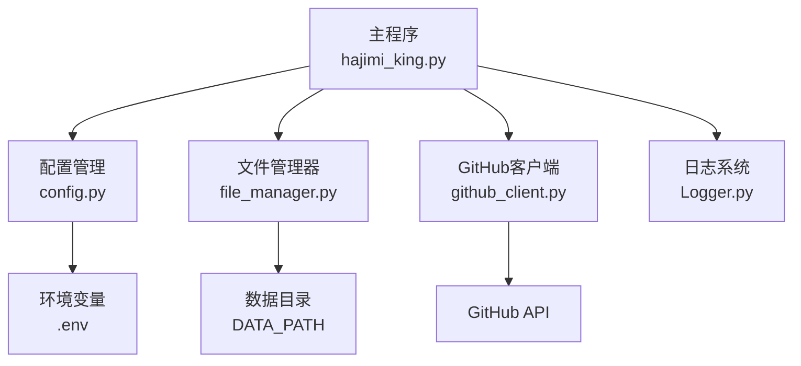
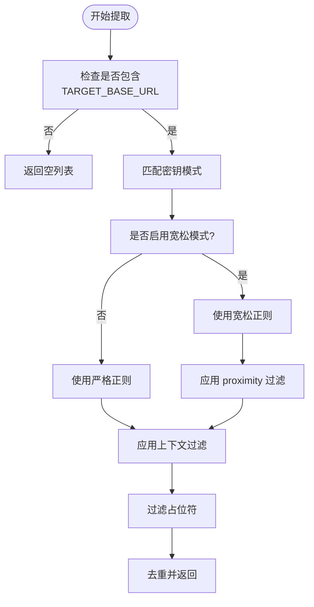
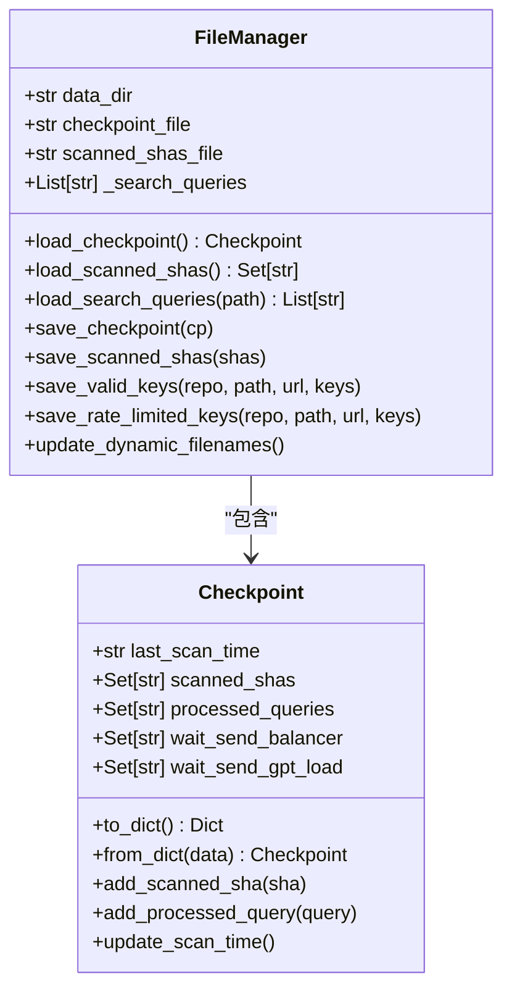
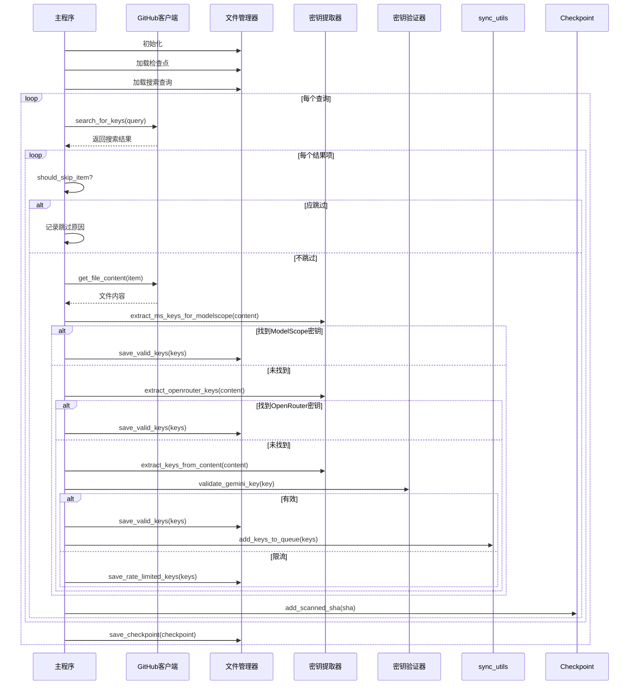

# 密钥提取机制

<cite>
**本文档引用的文件**  
- [app/hajimi_king.py](file://app/hajimi_king.py) - *新增 OpenRouter 密钥提取功能*
- [common/config.py](file://common/config.py) - *新增 OpenRouter 相关配置项*
- [utils/file_manager.py](file://utils/file_manager.py)
- [utils/github_client.py](file://utils/github_client.py)
- [OPENROUTER_USAGE.md](file://OPENROUTER_USAGE.md) - *新增 OpenRouter 使用说明文档*
</cite>

## 更新摘要
**变更内容**  
- 新增 OpenRouter 平台密钥提取功能，支持 `sk-or-v1-` 格式密钥识别
- 扩展正则表达式设计与应用章节，增加 OpenRouter 正则模式说明
- 更新上下文验证机制，增加 OpenRouter 上下文关键词匹配
- 增加配置管理与可扩展性中的 OpenRouter 配置项
- 新增 OpenRouter 专用扫描模式说明

## 目录
1. [项目结构分析](#项目结构分析)  
2. [核心功能概述](#核心功能概述)  
3. [密钥提取逻辑详解](#密钥提取逻辑详解)  
4. [正则表达式设计与应用](#正则表达式设计与应用)  
5. [上下文验证机制](#上下文验证机制)  
6. [文件管理与持久化](#文件管理与持久化)  
7. [数据流与处理流程](#数据流与处理流程)  
8. [配置管理与可扩展性](#配置管理与可扩展性)  
9. [错误处理与日志记录](#错误处理与日志记录)  
10. [总结与建议](#总结与建议)

## 项目结构分析

本项目采用模块化设计，主要分为以下几个目录：

- `app/`：主应用入口，包含核心逻辑 `hajimi_king.py`
- `common/`：通用组件，如日志和配置管理
- `scripts/`：脚本工具，如干运行测试
- `utils/`：工具类模块，包括文件管理、GitHub客户端、同步工具等

核心文件包括：
- `app/hajimi_king.py`：主程序，负责密钥搜索、提取、验证和保存
- `common/config.py`：配置管理，加载环境变量并提供全局配置
- `utils/file_manager.py`：文件操作管理器，负责读写查询、检查点、密钥文件等
- `utils/github_client.py`：GitHub API 客户端，用于搜索和获取文件内容



**图示来源**  
- [app/hajimi_king.py](file://app/hajimi_king.py#L1-L523)
- [common/config.py](file://common/config.py#L1-L203)
- [utils/file_manager.py](file://utils/file_manager.py#L1-L492)
- [utils/github_client.py](file://utils/github_client.py)

## 核心功能概述

`APIKEY-king` 是一个自动化密钥提取工具，主要功能包括：

- 从 GitHub 公开代码中搜索潜在的 API 密钥
- 支持多种平台密钥模式识别（Gemini、ModelScope、OpenRouter）
- 对提取的密钥进行有效性验证
- 将有效密钥持久化存储并支持外部同步
- 支持增量扫描与断点续传

其核心流程如下：
1. 加载配置与搜索查询
2. 通过 GitHub API 搜索匹配文件
3. 下载文件内容并提取候选密钥
4. 验证密钥有效性
5. 保存结果并更新检查点

**本节来源**  
- [app/hajimi_king.py](file://app/hajimi_king.py#L1-L523)
- [common/config.py](file://common/config.py#L1-L203)

## 密钥提取逻辑详解

### Gemini 密钥提取

Gemini 平台的密钥采用固定前缀 `AIzaSy`，后接 33 位 Base64 编码字符（含 `-` 和 `_`）。

```python
def extract_keys_from_content(content: str) -> List[str]:
    pattern = r'(AIzaSy[A-Za-z0-9\-_]{33})'
    return re.findall(pattern, content)
```

该函数通过正则表达式从文本中提取所有符合模式的密钥。

### ModelScope 密钥提取

ModelScope 密钥格式为 `ms-` 后接 UUID 格式字符串（严格模式）或更长的连字符分隔字符串（宽松模式）。

```python
def extract_ms_keys_for_modelscope(content: str) -> List[str]:
    base_urls = Config.TARGET_BASE_URLS
    has_base, base_positions = _contains_base_url(content, base_urls)
    if not has_base:
        return []
    # ... 其他逻辑
```

提取逻辑受以下配置控制：
- `TARGET_BASE_URLS`：必须出现在文件中的 API 地址
- `MS_USE_LOOSE_PATTERN`：是否启用宽松模式
- `MS_PROXIMITY_CHARS`：密钥与 base_url 的最大字符距离
- `MS_REQUIRE_KEY_CONTEXT`：是否要求上下文关键词（如 key、token）

### OpenRouter 密钥提取

OpenRouter 密钥格式为 `sk-or-v1-` 后接 64 位十六进制字符串（严格模式）或至少 40 位十六进制字符（宽松模式）。

```python
def extract_openrouter_keys(content: str) -> List[str]:
    """
    当同一文件中包含 Config.OPENROUTER_BASE_URLS 任一值时，提取 OpenRouter API keys。
    OpenRouter key 格式: sk-or-v1-[64位十六进制字符串]
    受控于以下配置：
      - OPENROUTER_BASE_URLS
      - OPENROUTER_USE_LOOSE_PATTERN (bool)
      - OPENROUTER_PROXIMITY_CHARS (int, 当使用宽松模式时建议>0)
      - OPENROUTER_REQUIRE_KEY_CONTEXT (bool)
    """
    base_urls = Config.OPENROUTER_BASE_URLS
    has_base, base_positions = _contains_base_url(content, base_urls)
    if not has_base:
        return []

    # OpenRouter key 正则模式
    # 严格模式：sk-or-v1-[64位十六进制]
    strict_pat = r'\bsk-or-v1-[0-9a-f]{64}\b'
    # 宽松模式：sk-or-v1-[至少40位字符]
    loose_pat = r'\bsk-or-v1-[0-9a-f]{40,}\b'
    
    use_loose = Config.parse_bool(Config.OPENROUTER_USE_LOOSE_PATTERN)
    pattern = loose_pat if use_loose else strict_pat

    proximity_chars = Config.OPENROUTER_PROXIMITY_CHARS if use_loose else 0
    require_ctx = Config.parse_bool(Config.OPENROUTER_REQUIRE_KEY_CONTEXT)
    ctx_re = re.compile(r"(key|token|secret|authorization|api[-_ ]?key|openrouter)", re.IGNORECASE)

    results: List[str] = []
    for m in re.finditer(pattern, content, re.IGNORECASE):
        k = m.group(0)
        
        # 过滤明显的占位符
        if "0000000000000000" in k.lower() or "your_key" in k.lower() or "example" in k.lower():
            continue

        # 邻近性检查（当使用宽松模式时）
        if proximity_chars and base_positions:
            pos = m.start()
            near = any(abs(pos - bp) <= proximity_chars for bp in base_positions)
            if not near:
                continue

        # 上下文检查（当启用时）
        if require_ctx:
            start = max(0, m.start() - 80)
            end = min(len(content), m.end() + 80)
            snippet = content[start:end]
            if not ctx_re.search(snippet):
                continue

        results.append(k)

    # 去重且保序
    seen = set()
    deduped = [x for x in results if not (x in seen or seen.add(x))]
    return deduped
```

**本节来源**  
- [app/hajimi_king.py](file://app/hajimi_king.py#L162-L218)

## 正则表达式设计与应用

### Gemini 密钥正则

```regex
AIzaSy[A-Za-z0-9\-_]{33}
```

- 前缀：`AIzaSy`
- 字符集：大小写字母、数字、连字符、下划线
- 长度：33 位
- 示例：`AIzaSyBx1y2z3A4b5c6D7e8F9g0H1i2J3k4L5m6N7o8P`

### ModelScope 密钥正则

#### 严格模式
```regex
(?i)\bms-[0-9a-f]{8}-[0-9a-f]{4}-[0-9a-f]{4}-[0-9a-f]{4}-[0-9a-f]{12}\b
```

- 前缀：`ms-`
- 格式：标准 UUID v4
- 不区分大小写

#### 宽松模式
```regex
(?i)\bms-[0-9a-f-]{30,}\b
```

- 前缀：`ms-`
- 字符集：十六进制字符和连字符
- 最小长度：30 位
- 用于匹配非标准格式的密钥

### OpenRouter 密钥正则

#### 严格模式
```regex
\bsk-or-v1-[0-9a-f]{64}\b
```

- 前缀：`sk-or-v1-`
- 字符集：十六进制字符（0-9, a-f）
- 长度：64 位
- 不区分大小写
- 示例：`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`

#### 宽松模式
```regex
\bsk-or-v1-[0-9a-f]{40,}\b
```

- 前缀：`sk-or-v1-`
- 字符集：十六进制字符
- 最小长度：40 位
- 用于匹配长度不足64位但可能有效的密钥



**图示来源**  
- [app/hajimi_king.py](file://app/hajimi_king.py#L104-L149)

## 上下文验证机制

为降低误报率，系统采用多层上下文验证：

### 1. 基础 URL 共现验证

只有当文件内容中包含 `TARGET_BASE_URLS` 中的任意 URL 时，才进行 ModelScope 密钥提取。

```python
def _contains_base_url(content: str, base_urls: List[str]) -> Tuple[bool, List[int]]:
    lc = content.lower()
    positions = []
    for url in base_urls:
        start = 0
        while True:
            idx = lc.find(url.lower(), start)
            if idx == -1:
                break
            positions.append(idx)
            start = idx + 1
    return (len(positions) > 0), positions
```

### 2. 邻近性过滤（Proximity Filter）

当启用宽松模式时，要求密钥与 base_url 的出现位置在指定字符范围内。

```python
if proximity_chars and base_positions:
    pos = m.start()
    near = any(abs(pos - bp) <= proximity_chars for bp in base_positions)
    if not near:
        continue
```

### 3. 上下文关键词过滤

检查密钥周围 80 个字符内是否包含 `key`, `token`, `secret`, `authorization`, `api[-_ ]?key`, `openrouter` 等关键词。

```python
ctx_re = re.compile(r"(key|token|secret|authorization|api[-_ ]?key|openrouter)", re.IGNORECASE)
snippet = content[start:end]
if not ctx_re.search(snippet):
    continue
```

### 4. 占位符过滤

排除明显无效的占位符密钥，如：
- `sk-or-v1-0000000000000000...`
- `YOUR_API_KEY`
- 包含 "example" 的密钥

**本节来源**  
- [app/hajimi_king.py](file://app/hajimi_king.py#L115-L148)

## 文件管理与持久化

`file_manager.py` 负责所有文件操作，包括：

- 加载搜索查询
- 管理检查点（checkpoint）
- 保存密钥结果
- 动态文件名更新

### 检查点机制

使用 `Checkpoint` 数据类管理扫描状态：

```python
@dataclass
class Checkpoint:
    last_scan_time: Optional[str] = None
    scanned_shas: Set[str] = field(default_factory=set)
    processed_queries: Set[str] = field(default_factory=set)
    wait_send_balancer: Set[str] = field(default_factory=set)
    wait_send_gpt_load: Set[str] = field(default_factory=set)
```

支持增量扫描，避免重复处理已扫描的文件（通过 SHA）和查询。

### 结果持久化

- 有效密钥：保存到 `keys/keys_valid_YYYYMMDD.txt`
- 限流密钥：保存到 `keys/key_429_YYYYMMDD.txt`
- 详细日志：包含时间、URL、密钥的 `.log` 文件
- 发送结果：记录同步状态



**图示来源**  
- [utils/file_manager.py](file://utils/file_manager.py#L1-L492)

## 数据流与处理流程



**图示来源**  
- [app/hajimi_king.py](file://app/hajimi_king.py#L250-L523)
- [utils/file_manager.py](file://utils/file_manager.py#L1-L492)

## 配置管理与可扩展性

### 配置项说明

| 配置项 | 说明 |
|-------|------|
| `GITHUB_TOKENS` | GitHub API 访问令牌 |
| `TARGET_BASE_URLS` | ModelScope API 地址 |
| `MS_USE_LOOSE_PATTERN` | 是否启用宽松密钥模式 |
| `MS_PROXIMITY_CHARS` | 密钥与 base_url 的最大距离 |
| `MS_REQUIRE_KEY_CONTEXT` | 是否要求上下文关键词 |
| `MODELSCOPE_EXTRACT_ONLY` | 是否仅提取 ModelScope 密钥 |
| `OPENROUTER_BASE_URLS` | OpenRouter API 地址 |
| `OPENROUTER_USE_LOOSE_PATTERN` | 是否启用 OpenRouter 宽松模式 |
| `OPENROUTER_PROXIMITY_CHARS` | OpenRouter 密钥与 base_url 的最大距离 |
| `OPENROUTER_REQUIRE_KEY_CONTEXT` | 是否要求 OpenRouter 上下文关键词 |
| `OPENROUTER_EXTRACT_ONLY` | 是否仅提取 OpenRouter 密钥 |

### 可扩展性设计

系统支持通过修改正则表达式和配置来添加新平台支持。例如，添加阿里云密钥支持：

```python
def extract_aliyun_keys(content: str) -> List[str]:
    pattern = r'LTAI[A-Za-z0-9]{20}'
    return re.findall(pattern, content)
```

然后在 `process_item` 中调用即可。

**本节来源**  
- [common/config.py](file://common/config.py#L1-L203)
- [app/hajimi_king.py](file://app/hajimi_king.py#L1-L523)

## 错误处理与日志记录

系统采用分层错误处理：

- `try-except` 捕获网络请求、文件读写异常
- 使用 `Logger` 统一输出日志
- 统计跳过项原因（时间、重复、年龄、文档）

日志级别：
- `INFO`：关键流程、统计信息
- `WARNING`：可恢复错误（如获取内容失败）
- `ERROR`：严重错误（如配置缺失）

跳过统计示例：
```
📊 Skipped 123 items - Time: 50, Duplicate: 30, Age: 40, Docs: 3
```

**本节来源**  
- [app/hajimi_king.py](file://app/hajimi_king.py#L200-L240)
- [common/Logger.py](file://common/Logger.py)

## 总结与建议

`APIKEY-king` 实现了一个高效、可配置的密钥提取系统，其核心优势在于：

1. **精准提取**：结合正则表达式与上下文验证，降低误报率
2. **灵活配置**：通过环境变量控制行为，无需修改代码
3. **持久化可靠**：支持断点续传与增量扫描
4. **易于扩展**：模块化设计便于添加新平台支持

### 改进建议

1. **增加密钥指纹识别**：对密钥进行哈希存储，避免重复报告
2. **支持更多平台**：如阿里云、腾讯云、AWS 等
3. **增强上下文分析**：使用 NLP 技术判断密钥真实性
4. **提供 Web 界面**：可视化扫描结果与统计信息

该系统可广泛应用于安全审计、密钥泄露监控等场景。

**本节来源**  
- [app/hajimi_king.py](file://app/hajimi_king.py)
- [common/config.py](file://common/config.py)
- [utils/file_manager.py](file://utils/file_manager.py)