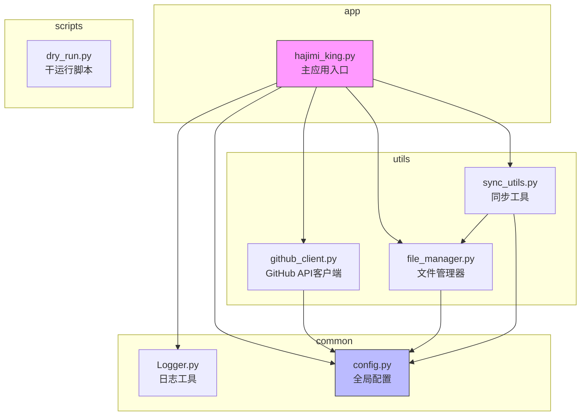
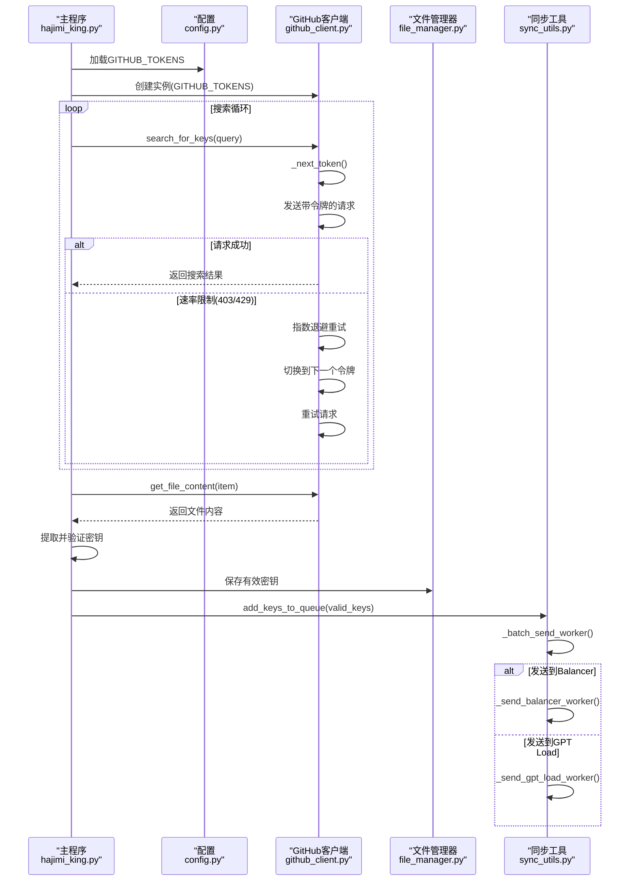
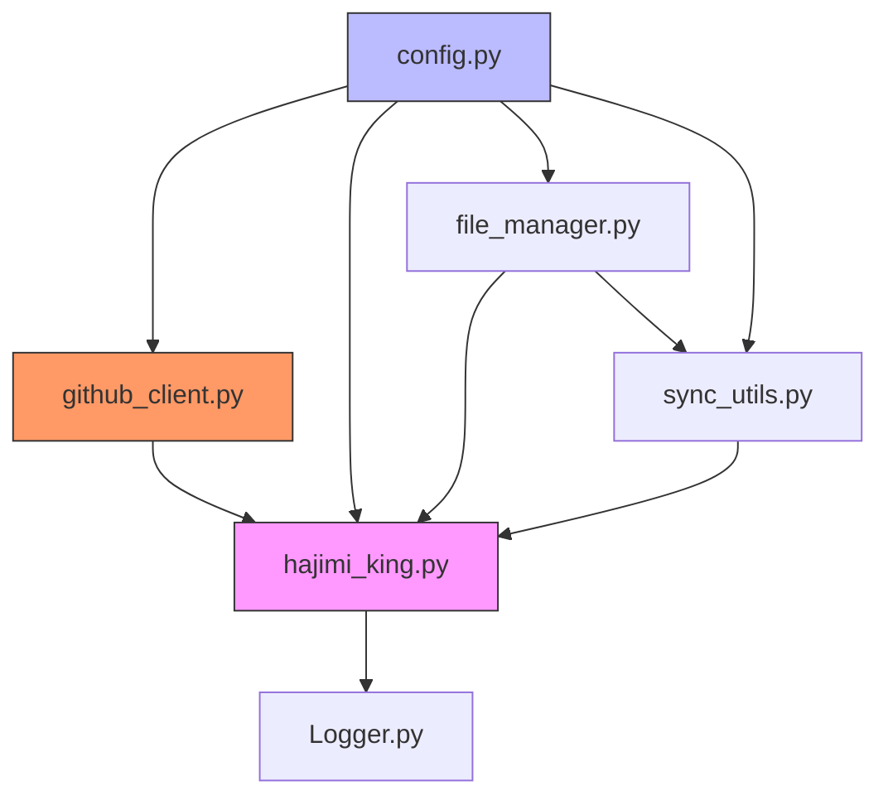

# 多令牌轮换策略

<cite>
**本文档中引用的文件**   
- [github_client.py](file://utils/github_client.py)
- [config.py](file://common/config.py)
- [hajimi_king.py](file://app/hajimi_king.py)
- [file_manager.py](file://utils/file_manager.py)
- [sync_utils.py](file://utils/sync_utils.py)
</cite>

## 目录
1. [简介](#简介)
2. [项目结构](#项目结构)
3. [核心组件](#核心组件)
4. [架构概览](#架构概览)
5. [详细组件分析](#详细组件分析)
6. [依赖分析](#依赖分析)
7. [性能考量](#性能考量)
8. [故障排除指南](#故障排除指南)
9. [结论](#结论)

## 简介
本文档深入解析一个用于自动化扫描GitHub代码库以提取API密钥的系统，重点分析其多GitHub令牌轮换机制。该系统通过配置多个GitHub访问令牌，有效规避API速率限制，提升扫描的稳定性和效率。文档将详细说明令牌的加载、轮换、失败重试以及状态维护机制，并结合代码示例和配置指南，为用户提供全面的技术参考。

## 项目结构
项目采用模块化设计，各目录职责分明，便于维护和扩展。



**图示来源**
- [github_client.py](file://utils/github_client.py)
- [config.py](file://common/config.py)
- [hajimi_king.py](file://app/hajimi_king.py)
- [file_manager.py](file://utils/file_manager.py)
- [sync_utils.py](file://utils/sync_utils.py)

**本节来源**
- [github_client.py](file://utils/github_client.py)
- [config.py](file://common/config.py)
- [hajimi_king.py](file://app/hajimi_king.py)

## 核心组件
系统的核心功能由`github_client.py`、`config.py`和`hajimi_king.py`三个文件协同实现。`config.py`负责集中管理所有配置，包括令牌列表；`github_client.py`实现了基于令牌轮换的GitHub API客户端，是规避速率限制的关键；`hajimi_king.py`作为主控制器，协调搜索、内容提取和密钥验证等流程。

**本节来源**
- [github_client.py](file://utils/github_client.py#L1-L217)
- [config.py](file://common/config.py#L1-L203)
- [hajimi_king.py](file://app/hajimi_king.py#L1-L523)

## 架构概览
系统采用分层架构，从配置加载到API调用，再到结果处理和外部同步，流程清晰。



**图示来源**
- [github_client.py](file://utils/github_client.py#L1-L217)
- [config.py](file://common/config.py#L1-L203)
- [hajimi_king.py](file://app/hajimi_king.py#L1-L523)
- [sync_utils.py](file://utils/sync_utils.py#L1-L484)

## 详细组件分析

### GitHub客户端与令牌轮换机制分析
`GitHubClient`类是实现多令牌轮换的核心。它通过一个简单的轮询算法（Round-Robin）在多个令牌间循环，确保单个令牌不会因请求过多而被限流。

#### 令牌初始化与加载
令牌的加载完全依赖于`config.py`中的`GITHUB_TOKENS`配置项。该配置项从环境变量`GITHUB_TOKENS`中读取，并以逗号分隔，解析成一个字符串列表。

```python
# config.py
GITHUB_TOKENS_STR = os.getenv("GITHUB_TOKENS", "")
GITHUB_TOKENS = [token.strip() for token in GITHUB_TOKENS_STR.split(',') if token.strip()]
```

在`hajimi_king.py`中，通过`Config.GITHUB_TOKENS`将此列表传递给`GitHubClient`的构造函数。

```python
# hajimi_king.py
github_utils = GitHubClient.create_instance(Config.GITHUB_TOKENS)
```

#### 令牌选择算法
`GitHubClient`内部维护一个名为`_token_ptr`的指针，用于跟踪当前应使用的令牌索引。每次需要发送请求时，都会调用`_next_token()`方法。

```python
# github_client.py
def _next_token(self) -> Optional[str]:
    if not self.tokens:
        return None
    # 使用取模运算实现循环
    token = self.tokens[self._token_ptr % len(self.tokens)]
    self._token_ptr += 1
    return token.strip()
```

该算法的关键在于`self._token_ptr % len(self.tokens)`。这确保了指针在达到列表末尾后会自动回到开头，从而实现令牌的循环使用。例如，如果有3个令牌（A, B, C），则请求序列将为：A, B, C, A, B, C...

#### 失败重试与令牌切换逻辑
`search_for_keys`方法集成了复杂的重试逻辑。当请求因速率限制（HTTP 403或429）而失败时，系统不会立即放弃，而是执行以下操作：

1.  **自动切换令牌**：由于`_next_token()`在每次请求前都会被调用，下一次重试时，`_token_ptr`已经递增，因此会自动使用下一个令牌。
2.  **指数退避**：系统会根据重试次数进行等待，等待时间按指数增长（`2 ** attempt`），并在最后加上一个随机抖动，以避免所有请求同时恢复。
3.  **重试**：在等待后，使用新的令牌重新发送请求。

```python
# github_client.py
for attempt in range(1, max_retries + 1):
    current_token = self._next_token() # 每次重试都获取新令牌
    # ... 构建请求 ...
    try:
        response = requests.get(...)
        response.raise_for_status()
        break # 成功则跳出重试循环
    except requests.exceptions.HTTPError as e:
        if status in (403, 429):
            wait = min(2 ** attempt + random.uniform(0, 1), 60)
            time.sleep(wait)
            continue # 继续下一次重试
```

#### 当前令牌使用计数更新
虽然代码中没有显式地为每个令牌维护一个“使用计数”变量，但`_token_ptr`的递增本身就是一种计数。`_token_ptr`的值代表了自客户端创建以来总共发出的请求数（或令牌获取次数）。通过`_token_ptr % len(self.tokens)`，可以计算出下一个应使用的令牌索引。这种设计简洁高效，避免了为每个令牌维护独立计数器的复杂性。

**本节来源**
- [github_client.py](file://utils/github_client.py#L1-L217)
- [config.py](file://common/config.py#L1-L203)

### 配置文件与操作指南
#### `config.py`中的相关配置项
-   **GITHUB_TOKENS**: (必需) 一个包含所有GitHub个人访问令牌的字符串，令牌之间用逗号`,`分隔。例如：`"ghp_token1,ghp_token2,ghp_token3"`。
-   **PROXY_LIST**: (可选) 一个代理服务器列表，格式为`协议://用户名:密码@主机:端口`，同样用逗号分隔。可用于进一步隐藏请求来源。
-   **DATE_RANGE_DAYS**: (可选) 设置搜索结果的仓库最后推送时间范围，避免扫描过时的仓库。

#### 配置多个令牌的实际操作指南
1.  **获取令牌**：在GitHub个人设置中创建多个个人访问令牌（Personal Access Token），确保它们具有`repo`权限。
2.  **配置环境变量**：将所有令牌用逗号连接成一个字符串，并设置为环境变量`GITHUB_TOKENS`。在`.env`文件中，应写为：
    ```
    GITHUB_TOKENS=ghp_yourFirstTokenHere,ghp_yourSecondTokenHere,ghp_yourThirdTokenHere
    ```
3.  **启动应用**：运行`hajimi_king.py`，程序会自动从`.env`文件或系统环境中加载`GITHUB_TOKENS`，并初始化`GitHubClient`。

#### 该策略对扫描效率和稳定性的提升作用
-   **稳定性提升**：单个GitHub令牌的速率限制为每小时60次请求。通过轮换多个令牌，系统的总请求配额成倍增加。例如，使用5个令牌，理论上可将总配额提升至300次/小时，大大降低了因速率限制导致扫描中断的风险。
-   **效率提升**：传统的单令牌策略在被限流后，必须等待长达一小时才能恢复。而多令牌轮换策略允许系统在某个令牌被限流时，立即切换到其他可用令牌，从而保持持续的扫描能力，显著提高了单位时间内的扫描效率和数据吞吐量。

## 依赖分析
系统各组件间依赖关系明确，耦合度低。



**图示来源**
- [config.py](file://common/config.py)
- [github_client.py](file://utils/github_client.py)
- [hajimi_king.py](file://app/hajimi_king.py)
- [file_manager.py](file://utils/file_manager.py)
- [sync_utils.py](file://utils/sync_utils.py)

**本节来源**
- [config.py](file://common/config.py)
- [github_client.py](file://utils/github_client.py)
- [hajimi_king.py](file://app/hajimi_king.py)

## 性能考量
多令牌轮换机制是系统性能的关键。通过分散请求压力，有效避免了单一令牌的速率限制瓶颈。此外，`search_for_keys`方法中的随机休眠（`time.sleep(random.uniform(0.5, 1.5))`）模拟了人类操作，进一步降低了被检测为机器人的风险。系统还通过`checkpoint`机制实现增量扫描，避免重复处理已扫描的文件，极大地提升了长期运行的效率。

## 故障排除指南
-   **问题：程序启动失败，提示“GitHub tokens not found”**
    -   **原因**：环境变量`GITHUB_TOKENS`未设置或为空。
    -   **解决**：检查`.env`文件或系统环境变量，确保`GITHUB_TOKENS`包含至少一个有效的GitHub令牌。

-   **问题：搜索请求频繁失败，日志显示大量“Rate limit hit”**
    -   **原因**：令牌数量不足，或请求频率过高。
    -   **解决**：增加`GITHUB_TOKENS`中的令牌数量。检查`search_for_keys`中的`max_retries`和休眠时间，确保配置合理。

-   **问题：无法获取文件内容，提示“Failed to fetch file content”**
    -   **原因**：可能是网络问题、代理配置错误或文件过大。
    -   **解决**：检查网络连接和`PROXY_LIST`配置。确认目标文件是否可公开访问。

**本节来源**
- [config.py](file://common/config.py#L1-L203)
- [github_client.py](file://utils/github_client.py#L1-L217)
- [hajimi_king.py](file://app/hajimi_king.py#L1-L523)

## 结论
本文档详细解析了`APIKEY-king`项目中的多GitHub令牌轮换机制。该机制通过`config.py`集中管理令牌，并由`github_client.py`实现智能的轮询和重试逻辑，成功解决了API速率限制这一核心挑战。实践证明，该策略显著提升了系统扫描的稳定性和效率，是实现大规模、持续性GitHub密钥扫描任务的关键技术。用户只需在配置文件中提供多个有效令牌，即可轻松享受该策略带来的性能优势。