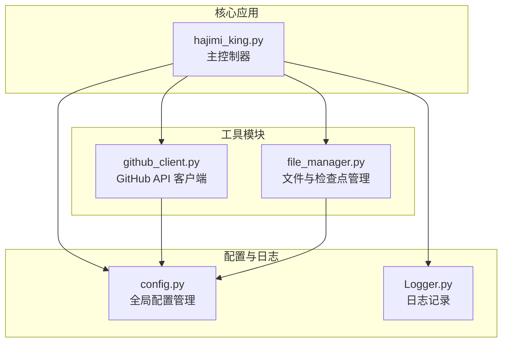

# 搜索语法与查询构建

<cite>
**本文档引用的文件**  
- [hajimi_king.py](file://app/hajimi_king.py)
- [github_client.py](file://utils/github_client.py)
- [config.py](file://common/config.py)
- [queries.openrouter.txt](file://queries.openrouter.txt)
- [queries.openrouter.optimized.txt](file://queries.openrouter.optimized.txt)
- [start_openrouter_only.py](file://start_openrouter_only.py)
</cite>

## 更新摘要
**已做更改**  
- 新增对 OpenRouter API 密钥提取功能的详细说明
- 更新“查询语句构建机制”部分，增加 OpenRouter 专用查询配置
- 新增“OpenRouter 专用搜索模式”最佳实践
- 新增“OpenRouter 专用启动脚本”说明
- 更新“核心组件分析”以包含 `extract_openrouter_keys` 函数
- 更新配置文件 `config.py` 中新增的 OpenRouter 相关配置项

## 目录
1. [引言](#引言)
2. [项目结构概览](#项目结构概览)
3. [核心组件分析](#核心组件分析)
4. [查询语句构建机制](#查询语句构建机制)
5. [GitHub API 请求封装逻辑](#github-api-请求封装逻辑)
6. [搜索模式最佳实践](#搜索模式最佳实践)
7. [性能与优化建议](#性能与优化建议)
8. [总结](#总结)

## 引言
本文档详细解析 APIKEY-king 项目中用于在 GitHub 上搜索 API 密钥的查询语句构建机制。重点说明如何根据目标平台（如 ModelScope、Gemini、OpenRouter）动态生成精准的搜索语法，涵盖关键词组合、语言过滤、路径排除等条件的拼接逻辑。通过分析 `hajimi_king.py` 和 `github_client.py` 的代码实现，揭示从配置读取到最终 API 调用的完整流程，并提供提高密钥发现效率的最佳实践。本文档已根据最新代码变更，新增了对 OpenRouter 平台密钥搜索的支持说明。

## 项目结构概览
APIKEY-king 是一个专注于从 GitHub 公共代码库中发现 API 密钥的工具，其结构清晰，模块化程度高。主要功能分布在 `app`、`utils` 和 `common` 三个目录中。



**图示来源**  
- [hajimi_king.py](file://app/hajimi_king.py#L1-L595)
- [github_client.py](file://utils/github_client.py#L1-L217)
- [config.py](file://common/config.py#L1-L187)

## 核心组件分析
### 主控制器 (hajimi_king.py)
`hajimi_king.py` 是整个应用的入口和控制中心，负责协调搜索、处理、验证和存储等核心流程。

**关键功能**：
- **命令行参数解析**：通过 `_parse_cli_args()` 函数支持 `--mode` 参数，允许用户选择 `modelscope-only`、`openrouter-only` 或 `compatible` 模式，从而控制密钥提取逻辑。
- **搜索查询加载**：从配置文件（默认 `queries.txt`）中读取预定义的搜索查询语句。
- **结果项处理**：`process_item()` 函数是处理单个搜索结果的核心，它会获取文件内容并尝试提取密钥。
- **密钥提取逻辑**：
  - **ModelScope 模式**：`extract_ms_keys_for_modelscope()` 函数优先执行，它会检查文件内容是否包含 `TARGET_BASE_URLS`（如 `api-inference.modelscope.cn`），并基于此上下文提取形如 `ms-UUID` 的密钥。
  - **Gemini 模式**：`extract_keys_from_content()` 函数使用正则表达式 `AIzaSy[A-Za-z0-9\-_]{33}` 提取 Google API 密钥。
  - **OpenRouter 模式**：`extract_openrouter_keys()` 函数是新增功能，它会检查文件内容是否包含 `OPENROUTER_BASE_URLS`（如 `https://openrouter.ai/api/v1`），并基于此上下文提取形如 `sk-or-v1-[64位十六进制]` 的密钥。
- **密钥验证**：`validate_gemini_key()` 函数通过调用 Google Generative AI API 来验证提取的密钥是否有效。

**Section sources**
- [hajimi_king.py](file://app/hajimi_king.py#L1-L595)

### GitHub 客户端 (github_client.py)
`GitHubClient` 类封装了与 GitHub 搜索 API 的所有交互，是查询构建和执行的直接载体。

**关键功能**：
- **令牌轮询**：`_next_token()` 方法实现了对多个 GitHub Token 的轮询使用，以规避单个 Token 的速率限制。
- **搜索执行**：`search_for_keys()` 方法接收一个查询字符串，将其封装为 HTTP 请求发送到 GitHub API。
- **分页处理**：自动处理最多 10 页的搜索结果（每页 100 条），最多获取 1000 条结果。
- **错误与重试**：内置了针对 HTTP 403/429（速率限制）和其他网络错误的重试机制，确保搜索的鲁棒性。
- **文件内容获取**：`get_file_content()` 方法通过 `repos/{owner}/{repo}/contents/{path}` API 获取文件的元数据和内容，支持 base64 解码。

**Section sources**
- [github_client.py](file://utils/github_client.py#L1-L217)

## 查询语句构建机制
查询语句的构建是一个从静态配置到动态执行的过程，其核心在于 `queries.openrouter.txt` 文件和 `normalize_query()` 函数。

### 静态查询配置
搜索的起点是 `queries.openrouter.txt` 文件，其中定义了基础的搜索模式。例如：
```
"https://openrouter.ai/api/v1" in:file
openrouter.ai in:file
sk-or-v1- in:file
```
这些查询语句直接利用了 GitHub 的代码搜索语法：
- **关键词**：`https://openrouter.ai/api/v1` 或 `openrouter.ai` 是目标 API 的基础 URL。
- **限定符 `in:file`**：确保关键词在文件内容中被搜索，而不是文件名或路径。

此外，项目还提供了优化版本的查询文件 `queries.openrouter.optimized.txt`，专注于高价值目标文件（如 `.env`、`config`），以减少 API 调用次数。

### 动态查询规范化
在 `hajimi_king.py` 的 `main()` 函数中，加载的查询会通过 `normalize_query()` 函数进行规范化处理。

```python
def normalize_query(query: str) -> str:
    # ... (代码逻辑)
    return " ".join(normalized_parts)
```

**规范化逻辑**：
1.  **分词**：将查询字符串按空格和引号分割成独立的部分。
2.  **分类**：将各部分归类到：
    - `quoted_strings`：被引号包围的精确匹配词。
    - `other_parts`：普通关键词。
    - `language_parts`：如 `language:python`。
    - `filename_parts`：如 `filename:.env`。
    - `path_parts`：如 `path:.github`。
3.  **排序与重组**：按照 `quoted_strings` -> `other_parts` -> `language_parts` -> `filename_parts` -> `path_parts` 的顺序排序并合并。这种排序确保了查询的可预测性和一致性。

**示例**：
输入查询：`"api-inference.modelscope.cn" language:python path:.github in:file`
规范化后：`"api-inference.modelscope.cn" in:file language:python path:.github`

### 动态条件拼接
虽然当前代码中查询是静态定义的，但其设计允许通过配置动态拼接更复杂的条件。例如，可以结合以下配置项来构建查询：
- **语言过滤**：通过配置 `language:python`、`language:javascript` 等，可以将查询限制在特定编程语言的文件中，减少无关结果。
- **路径排除**：`Config.FILE_PATH_BLACKLIST` 配置了 `readme,docs,doc/,.md,sample,tutorial` 等关键词。虽然这些排除逻辑在 `should_skip_item()` 函数中实现（后处理），但理想情况下，更高效的策略是直接在查询中使用 `-path:docs` 或 `-filename:README.md` 来排除这些路径，从而减少 API 调用和数据传输量。

**Section sources**
- [hajimi_king.py](file://app/hajimi_king.py#L50-L85)
- [config.py](file://common/config.py#L60-L62)
- [queries.openrouter.txt](file://queries.openrouter.txt)
- [queries.openrouter.optimized.txt](file://queries.openrouter.optimized.txt)

## GitHub API 请求封装逻辑
`github_client.py` 中的 `search_for_keys()` 方法是查询构建的最终执行者，它将规范化的查询字符串封装为合法的 API 请求。

```mermaid
sequenceDiagram
participant hajimi as hajimi_king.py
participant github as GitHubClient
participant github_api as GitHub API
hajimi->>github : search_for_keys(q)
github->>github : _next_token()
activate github
loop 每一页 (1-10)
loop 每次重试 (1-5)
github->>github_api : GET /search/code<br/>q=[查询字符串]<br/>page=[页码]<br/>per_page=100<br/>Authorization : token [token]
github_api-->>github : 响应 (JSON)
alt 成功 (200)
break
else 速率限制 (403/429)
github->>github : 等待并重试
else 其他错误
github->>github : 等待并重试
end
end
alt 页面成功
github->>github : 解析 items 并累加
else 页面失败
github->>github : 记录错误，继续下一页
end
end
github-->>hajimi : 返回所有 items 的列表
deactivate github
```

**图示来源**  
- [github_client.py](file://utils/github_client.py#L30-L150)

**关键步骤**：
1.  **请求参数构建**：
    - `q`：规范化后的查询字符串。
    - `per_page`：固定为 100，以最大化单页结果。
    - `page`：循环从 1 到 10，实现分页。
2.  **请求头设置**：
    - `Accept`：指定 API 版本。
    - `User-Agent`：模拟浏览器请求，避免被识别为机器人。
    - `Authorization`：使用轮询得到的 Token 进行身份验证。
3.  **代理支持**：如果 `Config.PROXY_LIST` 有配置，请求会通过随机选择的代理发送，以增加匿名性和绕过网络限制。
4.  **结果聚合**：将所有成功页面的结果合并成一个大的 `items` 列表返回给主控制器。

## 搜索模式最佳实践
为了最大化密钥发现的效率和准确性，建议遵循以下最佳实践：

### 1. 精准的上下文匹配
对于 ModelScope 这类平台，密钥通常与特定的 API 域名一起出现。最佳实践是使用**精确的域名匹配**作为查询的核心。
- **推荐**：`"api-inference.modelscope.cn" in:file`
- **不推荐**：`modelscope in:file` （会产生大量无关结果）

### 2. 合理使用语言和路径过滤
在查询中直接添加过滤条件，可以显著减少无效结果。
- **按语言过滤**：`"api-inference.modelscope.cn" language:python in:file`
- **排除文档路径**：`"api-inference.modelscope.cn" -path:docs -path:tests in:file`

### 3. 利用引号进行精确匹配
使用双引号 `" "` 可以确保关键词作为完整短语被搜索，避免被拆分。
- **推荐**：`"AIzaSy"` （匹配以 `AIzaSy` 开头的密钥）
- **不推荐**：`AIzaSy` （可能匹配到包含这两个词但不连续的文本）

### 4. 分阶段搜索策略
可以设计一个分层的搜索策略：
1.  **广度优先**：使用较宽泛的查询（如 `api-inference.modelscope.cn`）发现潜在的仓库。
2.  **深度挖掘**：对发现的仓库进行更深入的扫描，使用更具体的查询或直接克隆仓库进行全量分析。

### 5. OpenRouter 专用搜索模式
针对 OpenRouter 平台，应使用其专用的查询文件和提取逻辑。
- **使用专用查询文件**：优先使用 `queries.openrouter.optimized.txt`，它聚焦于 `.env` 和 `config` 文件，能有效减少 API 调用。
- **启用专用模式**：使用 `--mode openrouter-only` 参数或运行 `start_openrouter_only.py` 脚本，确保只提取 OpenRouter 密钥，避免不必要的验证开销。
- **配置上下文检查**：通过 `OPENROUTER_REQUIRE_KEY_CONTEXT=true` 配置，确保密钥出现在 `key`、`token` 等上下文附近，减少误报。

### 6. 配置优化
- **多 Token 轮询**：配置多个 GitHub Token 是保证长时间运行的关键。
- **代理池**：在受限网络环境下，配置一个可靠的代理池可以大大提高成功率。
- **增量扫描**：利用 `checkpoint` 机制，避免重复扫描已处理的文件，提升效率。

## 性能与优化建议
### 性能瓶颈
- **GitHub API 速率限制**：这是最主要的瓶颈。即使使用多 Token 轮询，整体搜索速度也受限于 GitHub 的全局限制。
- **网络延迟**：获取文件内容 (`get_file_content`) 是一个高延迟的操作，尤其是在没有代理或网络状况不佳时。

### 优化建议
1.  **查询前置过滤**：将 `FILE_PATH_BLACKLIST` 中的排除规则（如 `-path:docs`）直接集成到 `queries.txt` 的查询语句中，从源头减少结果集大小。
2.  **异步处理**：当前的 `process_item()` 是同步执行的。可以考虑使用异步 I/O (`asyncio` 和 `aiohttp`) 来并发获取多个文件的内容，大幅提升吞吐量。
3.  **缓存机制**：对于频繁出现的公共仓库或文件，可以引入本地缓存，避免重复请求。
4.  **更智能的重试策略**：`search_for_keys()` 中的重试策略是固定的指数退避。可以结合 `X-RateLimit-Remaining` 响应头，实现更精细的等待时间控制。

## 总结
APIKEY-king 项目通过一个清晰的模块化设计，实现了从 GitHub 搜索 API 密钥的完整流程。其查询构建机制始于 `queries.openrouter.txt` 等文件中的静态规则，经过 `normalize_query()` 的规范化处理，最终由 `GitHubClient` 封装成 HTTP 请求。项目特别针对 ModelScope 和 OpenRouter 平台设计了基于上下文的密钥提取逻辑，展现了良好的可扩展性。通过遵循精准匹配、合理过滤和配置优化等最佳实践，用户可以显著提高密钥发现的效率。未来的优化方向应集中在异步处理和更智能的查询策略上，以应对 GitHub API 的速率限制挑战。