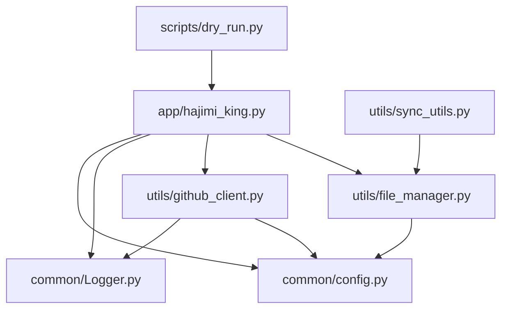

# 增量扫描机制

<cite>
**本文档中引用的文件**  
- [app/hajimi_king.py](file://app/hajimi_king.py)
- [utils/file_manager.py](file://utils/file_manager.py)
- [common/config.py](file://common/config.py)
</cite>

## 目录
1. [引言](#引言)  
2. [项目结构](#项目结构)  
3. [核心组件](#核心组件)  
4. [增量扫描机制详解](#增量扫描机制详解)  
5. [主循环与文件处理逻辑](#主循环与文件处理逻辑)  
6. [性能优化建议](#性能优化建议)  
7. [结论](#结论)

## 引言
本项目旨在通过自动化方式从GitHub上扫描并提取潜在的API密钥，特别是针对Gemini和ModelScope平台的密钥。为提升扫描效率并避免重复处理，系统引入了**增量扫描机制**，利用检查点（Checkpoint）记录上次扫描状态，仅处理新增或更新的内容。该机制显著减少了网络请求和计算资源的浪费，提高了整体运行效率。

## 项目结构
项目采用模块化设计，各组件职责清晰，便于维护和扩展。



**图示来源**  
- [app/hajimi_king.py](file://app/hajimi_king.py)
- [utils/file_manager.py](file://utils/file_manager.py)
- [utils/github_client.py](file://utils/github_client.py)

## 核心组件
系统由多个核心模块构成，协同完成扫描任务：

- **hajimi_king.py**：主程序入口，控制扫描流程。
- **file_manager.py**：负责文件管理、检查点持久化及搜索查询加载。
- **github_client.py**：封装GitHub API调用，实现搜索与文件内容获取。
- **config.py**：集中管理所有配置项，支持环境变量注入。
- **Logger.py**：提供统一的日志输出接口。

## 增量扫描机制详解
增量扫描的核心在于**检查点机制**，通过记录上次扫描的时间戳和已处理文件的SHA值，实现对新增或变更内容的精准识别。

### 检查点数据结构
`Checkpoint` 类定义了扫描状态的持久化结构，包含以下关键字段：

- `last_scan_time`：上一次扫描完成的时间（ISO格式字符串）。
- `scanned_shas`：已扫描文件的SHA集合，用于去重。
- `processed_queries`：已执行的搜索查询语句集合。
- `wait_send_balancer` / `wait_send_gpt_load`：待同步的密钥队列。

```python
@dataclass
class Checkpoint:
    last_scan_time: Optional[str] = None
    scanned_shas: Set[str] = field(default_factory=set)
    processed_queries: Set[str] = field(default_factory=set)
    wait_send_balancer: Set[str] = field(default_factory=set)
    wait_send_gpt_load: Set[str] = field(default_factory=set)
```

**来源**  
- [utils/file_manager.py](file://utils/file_manager.py#L12-L48)

### 时间戳比对逻辑
在每次处理搜索结果项时，系统会调用 `should_skip_item` 函数判断是否跳过：

1. 若 `checkpoint.last_scan_time` 存在，则将其转换为 `datetime` 对象。
2. 获取当前仓库的 `pushed_at` 时间（即最后一次推送时间）。
3. 若 `pushed_at <= last_scan_time`，说明该仓库在上次扫描后未更新，直接跳过。

```python
if checkpoint.last_scan_time:
    last_scan_dt = datetime.fromisoformat(checkpoint.last_scan_time)
    repo_pushed_at = item["repository"].get("pushed_at")
    if repo_pushed_at:
        repo_pushed_dt = datetime.strptime(repo_pushed_at, "%Y-%m-%dT%H:%M:%SZ")
        if repo_pushed_dt <= last_scan_dt:
            return True, "time_filter"
```

此逻辑确保了只有在上次扫描之后发生过更新的仓库才会被处理，从而避免了对静态内容的重复扫描。

### SHA值去重机制
每个搜索结果项包含一个 `sha` 字段，代表该文件在Git中的唯一哈希值。系统通过维护 `scanned_shas` 集合，确保同一文件不会被重复处理：

```python
if item.get("sha") in checkpoint.scanned_shas:
    return True, "sha_duplicate"
```

一旦处理完一个文件，其SHA值会被添加到检查点中，并在下次扫描时持久化保存。

**来源**  
- [app/hajimi_king.py](file://app/hajimi_king.py#L170-L180)
- [utils/file_manager.py](file://utils/file_manager.py#L45-L48)

## 主循环与文件处理逻辑
`hajimi_king.py` 中的 `main()` 函数是整个扫描任务的控制中心，其主循环逻辑如下：

### 启动阶段
1. 初始化 `FileManager` 实例并加载检查点。
2. 输出系统信息，包括是否进入“增量扫描模式”或“全量扫描模式”。
3. 若存在 `last_scan_time`，则进入增量模式。

```python
checkpoint = file_manager.load_checkpoint()
if checkpoint.last_scan_time:
    logger.info(f"💾 Checkpoint found - Incremental scan mode")
else:
    logger.info(f"💾 No checkpoint - Full scan mode")
```

### 扫描循环
主循环按以下步骤执行：

1. 遍历所有搜索查询。
2. 对每个查询结果中的 `item` 调用 `should_skip_item(item, checkpoint)` 判断是否跳过。
3. 若未跳过，则调用 `process_item(item)` 处理文件内容。
4. 处理完成后，将该文件的 `sha` 添加至 `checkpoint.scanned_shas`。
5. 定期更新检查点文件，防止程序中断导致状态丢失。

```python
for item_index, item in enumerate(items, 1):
    should_skip, skip_reason = should_skip_item(item, checkpoint)
    if should_skip:
        continue
    valid_count, rate_limited_count = process_item(item)
    checkpoint.add_scanned_sha(item.get("sha"))
```

其中，`is_new_content()` 功能由 `should_skip_item()` 实现，它综合了时间戳和SHA值双重判断，确保仅处理真正的新内容。

**来源**  
- [app/hajimi_king.py](file://app/hajimi_king.py#L300-L400)

## 性能优化建议
为最大化增量扫描的效率，建议从以下几个方面进行优化：

### 合理设置时间窗口
通过 `Config.DATE_RANGE_DAYS` 配置项（默认730天），系统可过滤掉过于陈旧的仓库。适当缩短该值（如30或90天）可大幅减少搜索结果数量，提升扫描速度，但可能遗漏历史项目中的密钥。需根据实际需求权衡覆盖率与执行效率。

### 优化查询语句
在 `queries.txt` 中使用更精确的搜索语法（如限定文件类型、路径等），可减少无效结果。例如：
```
AIzaSy in:file filename:.env path:/config/
```

### 控制扫描频率
当前主循环末尾有10秒休眠（`time.sleep(10)`），可根据GitHub API配额和网络状况动态调整，避免触发速率限制。

### 分布式与并行化
对于大规模扫描任务，可考虑将不同查询分配至多个实例并行执行，共享同一检查点存储（如Redis），进一步提升吞吐量。

## 结论
本系统的增量扫描机制通过**时间戳比对**和**SHA值去重**双重策略，有效识别并处理新增或更新的代码内容，显著降低了重复扫描带来的资源开销。结合 `file_manager.py` 的检查点持久化和 `hajimi_king.py` 的主循环控制，实现了高效、稳定的密钥扫描能力。未来可通过引入更智能的变更检测算法（如基于文件内容哈希）进一步提升精度。