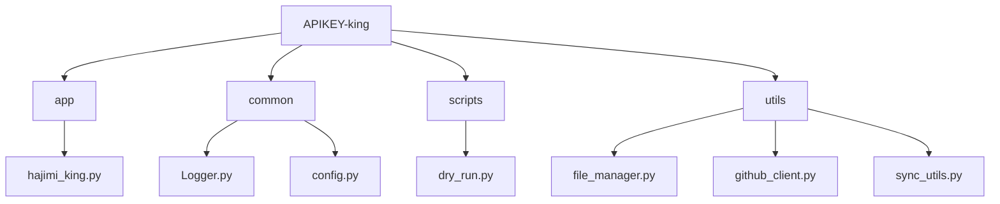
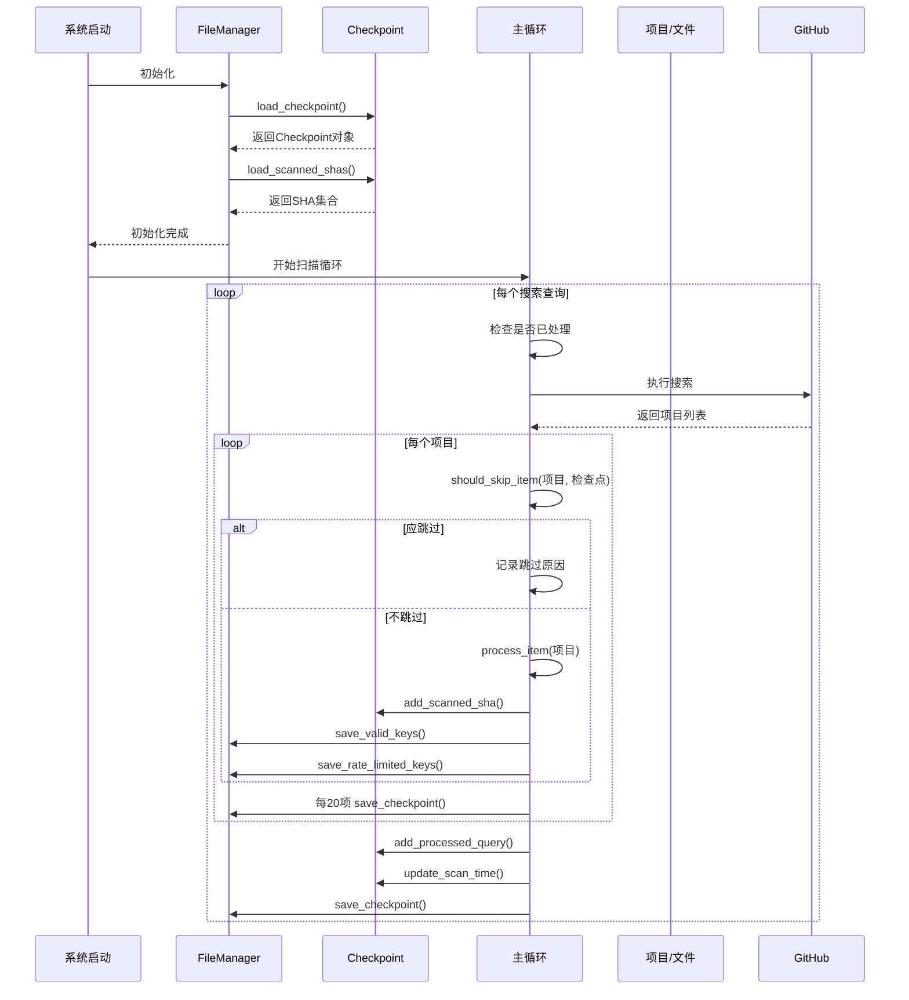
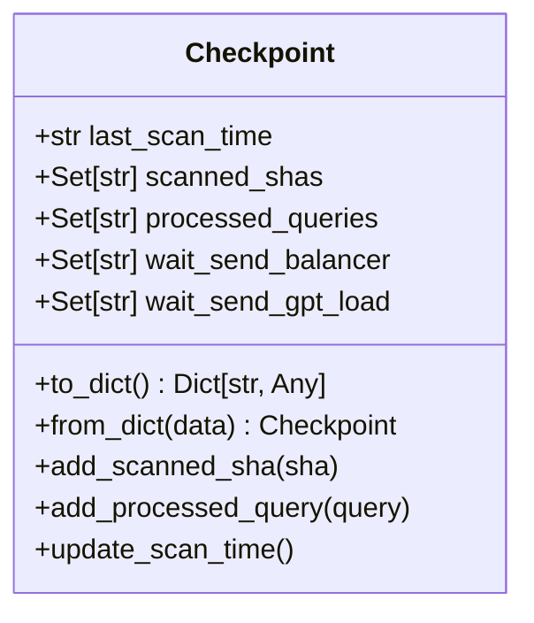
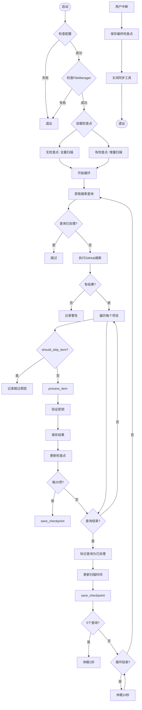
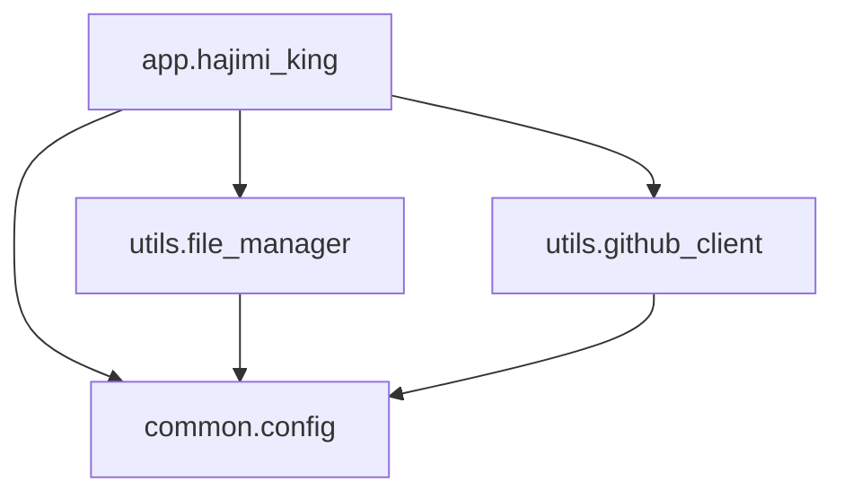

# 扫描管理功能

<cite>
**本文档引用的文件**  
- [hajimi_king.py](file://app/hajimi_king.py)
- [file_manager.py](file://utils/file_manager.py)
- [config.py](file://common/config.py)
</cite>

## 目录
1. [引言](#引言)  
2. [项目结构](#项目结构)  
3. [核心组件](#核心组件)  
4. [架构概览](#架构概览)  
5. [详细组件分析](#详细组件分析)  
6. [依赖分析](#依赖分析)  
7. [性能考量](#性能考量)  
8. [故障排查指南](#故障排查指南)  
9. [结论](#结论)

## 引言
APIKEY-king 是一个用于扫描 GitHub 上潜在 API 密钥泄露的工具。其扫描管理架构设计旨在高效、可靠地执行增量扫描任务，避免重复工作，并支持任务的暂停与恢复。本文档将系统阐述其扫描管理机制，重点聚焦于增量扫描与检查点（Checkpoint）持久化策略，详细说明 `file_manager.py` 中 `Checkpoint` 类的设计与实现，解释智能文件过滤机制，并结合 `hajimi_king.py` 的主控逻辑，为用户提供操作与维护指南。

## 项目结构
APIKEY-king 的项目结构清晰，遵循模块化设计原则，将不同功能分离到独立的目录中。



**Diagram sources**  
- [hajimi_king.py](file://app/hajimi_king.py)
- [config.py](file://common/config.py)
- [file_manager.py](file://utils/file_manager.py)

**Section sources**
- [hajimi_king.py](file://app/hajimi_king.py)
- [config.py](file://common/config.py)
- [file_manager.py](file://utils/file_manager.py)

## 核心组件
本系统的核心组件包括：
- **`FileManager`**：负责所有文件的读写操作，特别是检查点和扫描状态的持久化。
- **`Checkpoint`**：一个数据类，用于封装扫描过程中的关键状态信息。
- **`hajimi_king.main`**：主控制逻辑，驱动整个扫描流程。
- **`should_skip_item`**：核心过滤函数，决定是否跳过某个扫描项。

这些组件协同工作，实现了高效、可恢复的扫描功能。

**Section sources**
- [file_manager.py](file://utils/file_manager.py#L12-L48)
- [hajimi_king.py](file://app/hajimi_king.py#L171-L189)

## 架构概览
APIKEY-king 的扫描管理架构围绕“检查点驱动的增量扫描”模式构建。系统启动时从持久化文件中恢复状态，然后根据时间戳和文件哈希值决定处理哪些新内容，处理完成后立即更新并保存检查点。



**Diagram sources**  
- [file_manager.py](file://utils/file_manager.py)
- [hajimi_king.py](file://app/hajimi_king.py)

## 详细组件分析

### Checkpoint 类设计与持久化策略
`Checkpoint` 类是实现增量扫描的核心，它定义了扫描过程中的所有可恢复状态。

#### 类结构与字段


**Diagram sources**  
- [file_manager.py](file://utils/file_manager.py#L12-L48)

该类包含以下关键字段：
- **`last_scan_time`**：记录上一次扫描完成的 UTC 时间戳（ISO 8601 格式）。这是实现时间增量扫描的基础。
- **`scanned_shas`**：一个字符串集合，存储所有已扫描过的文件的 SHA 值。通过文件哈希来避免重复扫描同一文件。
- **`processed_queries`**：一个字符串集合，存储所有已完成处理的搜索查询。防止重复执行相同的查询。
- **`wait_send_balancer` 和 `wait_send_gpt_load`**：用于同步功能的待发送密钥队列。

#### 序列化与反序列化流程
为了实现持久化，`Checkpoint` 类实现了 `to_dict()` 和 `from_dict()` 方法。
- **序列化 (`to_dict`)**：将 `Checkpoint` 对象转换为字典，但**不包含** `scanned_shas` 集合。这是出于性能考虑，因为 `scanned_shas` 可能非常大，频繁的全量读写会影响效率。
- **反序列化 (`from_dict`)**：从字典创建 `Checkpoint` 对象，但 `scanned_shas` 字段被初始化为空集合，需要通过 `FileManager` 的 `load_scanned_shas()` 方法单独加载。

这种分离存储的策略优化了 I/O 操作，确保了系统的响应速度。

### 增量扫描机制
增量扫描是提升扫描效率的关键，它通过 `should_skip_item` 函数实现。

#### 时间戳比对
```python
def should_skip_item(item: Dict[str, Any], checkpoint: Checkpoint) -> tuple[bool, str]:
    if checkpoint.last_scan_time:
        last_scan_dt = datetime.fromisoformat(checkpoint.last_scan_time)
        repo_pushed_at = item["repository"].get("pushed_at")
        repo_pushed_dt = datetime.strptime(repo_pushed_at, "%Y-%m-%dT%H:%M:%SZ")
        if repo_pushed_dt <= last_scan_dt:
            return True, "time_filter"
```
系统比较仓库的 `pushed_at` 时间与检查点中的 `last_scan_time`。如果仓库的推送时间早于或等于上次扫描时间，则跳过该仓库，因为它在上次扫描后没有更新。

#### 文件哈希去重
```python
if item.get("sha") in checkpoint.scanned_shas:
    return True, "sha_duplicate"
```
系统检查当前文件的 SHA 值是否已存在于 `scanned_shas` 集合中。如果存在，则说明该文件已被处理过，直接跳过。

通过这两种机制，系统能够精准地只处理新更新的仓库和新出现的文件，极大地减少了无效的网络请求和计算，显著提升了整体扫描效率。

**Section sources**
- [hajimi_king.py](file://app/hajimi_king.py#L171-L189)
- [file_manager.py](file://utils/file_manager.py#L12-L48)

### 智能文件过滤机制
系统通过配置文件路径黑名单来智能过滤掉常见的非敏感文件，避免在文档、示例代码中浪费资源。

#### 规则配置
该规则由 `common/config.py` 中的 `FILE_PATH_BLACKLIST` 配置项定义：
```python
FILE_PATH_BLACKLIST_STR = os.getenv("FILE_PATH_BLACKLIST", "readme,docs,doc/,.md,sample,tutorial")
FILE_PATH_BLACKLIST = [token.strip().lower() for token in FILE_PATH_BLACKLIST_STR.split(',') if token.strip()]
```
默认值包含 `readme`, `docs`, `doc/`, `.md`, `sample`, `tutorial` 等关键词。

#### 实现逻辑
在 `should_skip_item` 函数中，系统会将文件路径转换为小写，并检查是否包含黑名单中的任意一个关键词：
```python
lowercase_path = item["path"].lower()
if any(token in lowercase_path for token in Config.FILE_PATH_BLACKLIST):
    return True, "doc_filter"
```
用户可以通过修改环境变量 `FILE_PATH_BLACKLIST` 来自定义过滤规则，例如添加 `test`, `example` 等目录。

### 扫描任务的启动、暂停与恢复流程
主控逻辑 `hajimi_king.py` 中的 `main()` 函数完整地实现了任务的生命周期管理。



**Diagram sources**  
- [hajimi_king.py](file://app/hajimi_king.py#L250-L520)

**Section sources**
- [hajimi_king.py](file://app/hajimi_king.py#L250-L520)

- **启动**：系统初始化 `FileManager` 和 `Checkpoint`，加载所有配置和状态。
- **暂停**：用户可以通过 `Ctrl+C` 发送 `KeyboardInterrupt` 信号来中断程序。
- **恢复**：当程序再次启动时，会自动从 `checkpoint.json` 和 `scanned_shas.txt` 文件中加载上次的扫描状态，从断点处继续执行。

## 依赖分析
系统各组件之间的依赖关系清晰。



**Diagram sources**  
- [hajimi_king.py](file://app/hajimi_king.py)
- [file_manager.py](file://utils/file_manager.py)
- [github_client.py](file://utils/github_client.py)
- [config.py](file://common/config.py)

`hajimi_king.py` 是主模块，依赖于 `file_manager.py` 进行状态管理，依赖于 `github_client.py` 进行API调用，并依赖于 `config.py` 获取配置。`file_manager.py` 和 `github_client.py` 都依赖于 `config.py` 来获取数据路径和认证信息。

## 性能考量
- **I/O 优化**：`scanned_shas` 集合的单独存储避免了大文件的频繁读写。
- **内存使用**：`Checkpoint` 中的集合（`scanned_shas`, `processed_queries`）会随着扫描的进行而增长，需注意内存占用。
- **网络请求**：通过增量扫描和智能过滤，最大限度地减少了对 GitHub API 的无效调用。

## 故障排查指南
### 检查点文件维护
- **位置**：检查点文件默认位于 `DATA_PATH` 目录下。
  - 主检查点：`checkpoint.json`
  - 已扫描SHA：`scanned_shas.txt` (文件名由 `SCANNED_SHAS_FILE` 配置)
- **手动清理**：如果需要从头开始全量扫描，可以安全地删除这两个文件。下次启动时，系统将创建新的检查点。

### 故障恢复
- **程序意外崩溃**：由于系统在处理每20个项目后以及每个查询结束后都会调用 `save_checkpoint()`，因此崩溃后重启通常只会丢失少量未保存的进度，可以安全恢复。
- **数据目录损坏**：如果 `DATA_PATH` 目录损坏，首先停止程序，然后从备份中恢复数据目录，再重启程序。
- **检查点文件损坏**：如果 `checkpoint.json` 损坏，程序会发出警告并创建新的检查点，但会丢失 `last_scan_time` 和 `processed_queries` 的状态，可能导致部分重复扫描。`scanned_shas.txt` 损坏的影响较小，只会导致文件级别的重复扫描。

**Section sources**
- [file_manager.py](file://utils/file_manager.py)
- [hajimi_king.py](file://app/hajimi_king.py)

## 结论
APIKEY-king 的扫描管理架构设计精良，通过 `Checkpoint` 机制和 `FileManager` 的持久化策略，实现了可靠的增量扫描和任务恢复功能。`should_skip_item` 函数结合时间戳和文件哈希，有效避免了重复工作。智能的文件过滤机制进一步提升了扫描效率。整个系统具备良好的健壮性和可维护性，为用户提供了高效、稳定的密钥扫描服务。