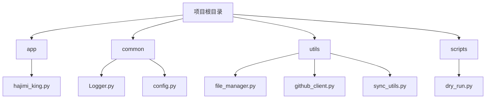
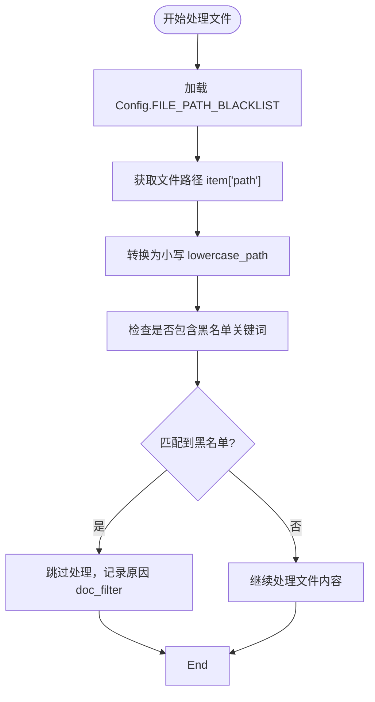
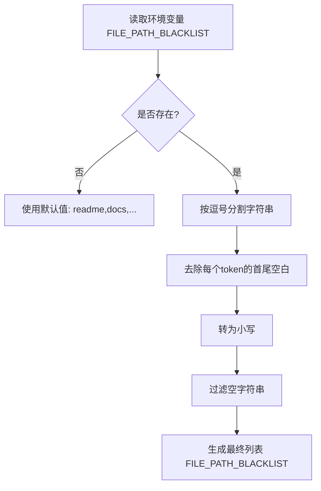
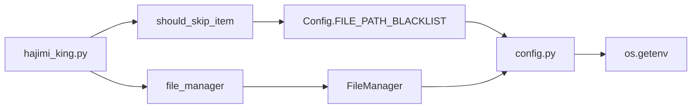

# 智能文件过滤

<cite>
**本文档引用文件**  
- [file_manager.py](file://utils/file_manager.py)
- [config.py](file://common/config.py)
- [hajimi_king.py](file://app/hajimi_king.py)
</cite>

## 目录
1. [简介](#简介)
2. [项目结构](#项目结构)
3. [核心组件](#核心组件)
4. [架构概览](#架构概览)
5. [详细组件分析](#详细组件分析)
6. [依赖分析](#依赖分析)
7. [性能考量](#性能考量)
8. [故障排除指南](#故障排除指南)
9. [结论](#结论)

## 简介
本文档系统阐述了智能文件过滤功能的实现机制，重点分析了如何通过配置项排除特定路径（如 `test`、`example`、`docs`、`demo` 等）以避免误判生产代码。文档详细说明了 `file_manager.py` 中的过滤逻辑、`config.py` 中的自定义配置方式、文件路径匹配流程（包括通配符支持与大小写处理），并提供典型使用场景示例。

## 项目结构
项目采用模块化分层结构，主要分为 `app`、`common`、`utils` 和 `scripts` 四个目录，职责清晰，便于维护。



**图示来源**  
- [file_manager.py](file://utils/file_manager.py)
- [config.py](file://common/config.py)

## 核心组件
智能文件过滤功能由三个核心文件协同实现：
- `config.py`：定义路径黑名单配置 `FILE_PATH_BLACKLIST`
- `file_manager.py`：提供文件管理与路径处理能力
- `hajimi_king.py`：执行过滤判断逻辑

该机制通过环境变量驱动，支持动态扩展，确保系统灵活性与可维护性。

**本节来源**  
- [config.py](file://common/config.py#L61-L62)
- [file_manager.py](file://utils/file_manager.py)
- [hajimi_king.py](file://app/hajimi_king.py#L171)

## 架构概览
整个过滤流程遵循“配置加载 → 路径判断 → 决策跳过”的控制流，集成于主扫描循环中。



**图示来源**  
- [hajimi_king.py](file://app/hajimi_king.py#L171)
- [config.py](file://common/config.py#L61-L62)

## 详细组件分析

### 过滤规则配置分析
路径过滤规则由 `config.py` 中的 `FILE_PATH_BLACKLIST` 配置项定义，其初始化逻辑如下：

```python
FILE_PATH_BLACKLIST_STR = os.getenv("FILE_PATH_BLACKLIST", "readme,docs,doc/,.md,sample,tutorial")
FILE_PATH_BLACKLIST = [token.strip().lower() for token in FILE_PATH_BLACKLIST_STR.split(',') if token.strip()]
```

该配置从环境变量 `FILE_PATH_BLACKLIST` 读取逗号分隔的关键词列表，若未设置则使用默认值。所有关键词自动转为小写并去除空白字符，确保匹配一致性。

**关键特性**：
- **不区分大小写**：路径统一转为小写后进行匹配
- **子串匹配**：使用 `in` 操作符，只要路径包含任意关键词即触发过滤
- **可扩展性**：通过环境变量动态修改，无需修改代码

#### 配置加载流程图


**图示来源**  
- [config.py](file://common/config.py#L61-L62)

### 过滤执行逻辑分析
实际过滤判断在 `hajimi_king.py` 的 `should_skip_item` 函数中完成：

```python
def should_skip_item(item: Dict[str, Any], checkpoint: Checkpoint) -> tuple[bool, str]:
    # ... 其他判断 ...
    
    # 检查文档和示例文件
    lowercase_path = item["path"].lower()
    if any(token in lowercase_path for token in Config.FILE_PATH_BLACKLIST):
        skip_stats["doc_filter"] += 1
        return True, "doc_filter"

    return False, ""
```

该函数接收 GitHub 搜索结果项 `item` 和检查点 `checkpoint`，返回是否跳过及原因。

#### 执行流程说明
1. 获取文件路径 `item["path"]`
2. 转换为小写 `lowercase_path`
3. 遍历 `Config.FILE_PATH_BLACKLIST` 中每个关键词
4. 使用 `in` 操作符检查关键词是否出现在路径中
5. 若任意关键词匹配成功，返回 `True` 并记录跳过原因

#### 执行逻辑序列图
```mermaid
sequenceDiagram
participant Main as 主循环
participant Filter as should_skip_item
participant Config as Config.FILE_PATH_BLACKLIST
Main->>Filter : 调用 should_skip_item(item, checkpoint)
Filter->>Filter : 获取 item["path"]
Filter->>Filter : 转为小写 lowercase_path
Filter->>Config : 获取 FILE_PATH_BLACKLIST 列表
loop 遍历每个黑名单关键词
Filter->>Filter : 检查 token in lowercase_path?
alt 匹配成功
Filter->>Filter : 统计跳过次数
Filter->>Main : 返回 (True, "doc_filter")
break
end
end
alt 无匹配
Filter->>Main : 返回 (False, "")
end
```

**图示来源**  
- [hajimi_king.py](file://app/hajimi_king.py#L171-L206)

### 匹配机制深度解析
系统采用**子字符串包含匹配**而非正则或通配符模式，具有以下特点：

| 特性 | 说明 |
|------|------|
| **匹配类型** | 子字符串包含（Substring Inclusion） |
| **大小写敏感性** | 不敏感（路径与关键词均转为小写） |
| **匹配粒度** | 路径任意位置包含关键词即匹配 |
| **性能表现** | O(n*m)，n为黑名单长度，m为路径长度，效率较高 |

#### 典型匹配示例
假设 `FILE_PATH_BLACKLIST = ["test", "docs", "demo", "example"]`

| 文件路径 | 是否过滤 | 匹配关键词 |
|---------|----------|-----------|
| `/src/main.py` | 否 | 无 |
| `/docs/api.md` | 是 | `docs` |
| `/tests/unit/test_user.py` | 是 | `test` |
| `/examples/chatbot.py` | 是 | `example` |
| `/demo/frontend/index.html` | 是 | `demo` |
| `/src/production_code.py` | 否 | 无 |

> **注意**：该机制目前不支持通配符（如 `*`、`?`），但可通过配置完整路径片段实现类似效果，例如添加 `node_modules` 可过滤所有相关路径。

## 依赖分析
智能文件过滤功能涉及多个模块间的协作，其依赖关系如下：



**图示来源**  
- [hajimi_king.py](file://app/hajimi_king.py#L171)
- [config.py](file://common/config.py)
- [file_manager.py](file://utils/file_manager.py)

## 性能考量
- **内存占用**：`FILE_PATH_BLACKLIST` 为静态列表，内存开销极小
- **时间复杂度**：每次判断为 O(k×p)，k为黑名单长度，p为路径平均长度，实际性能良好
- **优化建议**：对于超长黑名单，可考虑转换为 `set` 并使用更高效的字符串匹配算法（如 Aho-Corasick）

## 故障排除指南
### 常见问题
1. **问题**：新增的黑名单路径未生效  
   **原因**：未重启应用或环境变量未正确加载  
   **解决**：确保 `FILE_PATH_BLACKLIST` 环境变量已设置，并重启服务

2. **问题**：生产路径被误过滤  
   **原因**：黑名单关键词过于宽泛（如仅用 `src`）  
   **解决**：使用更精确的路径片段，如 `test_src` 或 `mock_src`

3. **问题**：日志中 `doc_filter` 计数异常高  
   **原因**：黑名单包含通用词（如 `read`）导致误匹配  
   **解决**：审查并精简黑名单，避免使用歧义词

### 调试方法
- 查看启动日志中 `FILE_PATH_BLACKLIST` 的实际加载数量：
  ```log
  FILE_PATH_BLACKLIST: 6 items
  ```
- 在 `should_skip_item` 中添加调试日志，输出 `lowercase_path` 与匹配过程

**本节来源**  
- [hajimi_king.py](file://app/hajimi_king.py#L171)
- [config.py](file://common/config.py#L61-L62)

## 结论
智能文件过滤功能通过 `config.py` 中的 `FILE_PATH_BLACKLIST` 配置与 `hajimi_king.py` 中的 `should_skip_item` 逻辑协同实现，采用不区分大小写的子字符串匹配机制，有效排除 `test`、`docs`、`example`、`demo` 等非生产路径。该设计简洁高效，支持通过环境变量灵活扩展，适用于大规模代码扫描场景。建议在使用时避免设置过于宽泛的关键词，以防误过滤重要生产文件。