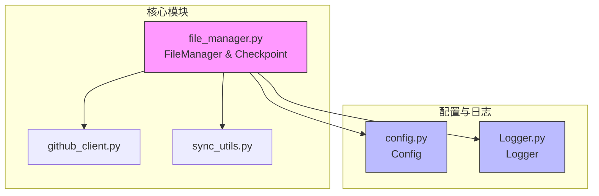
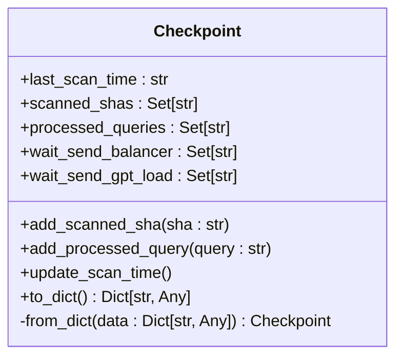
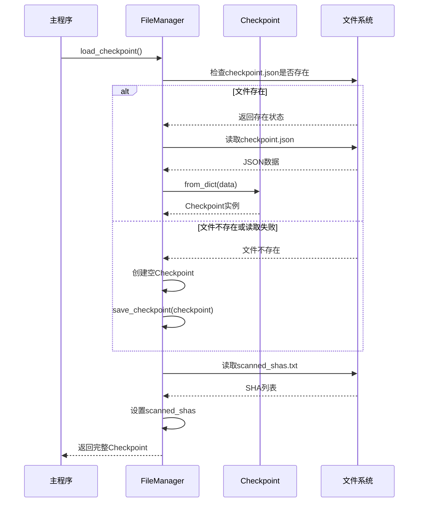
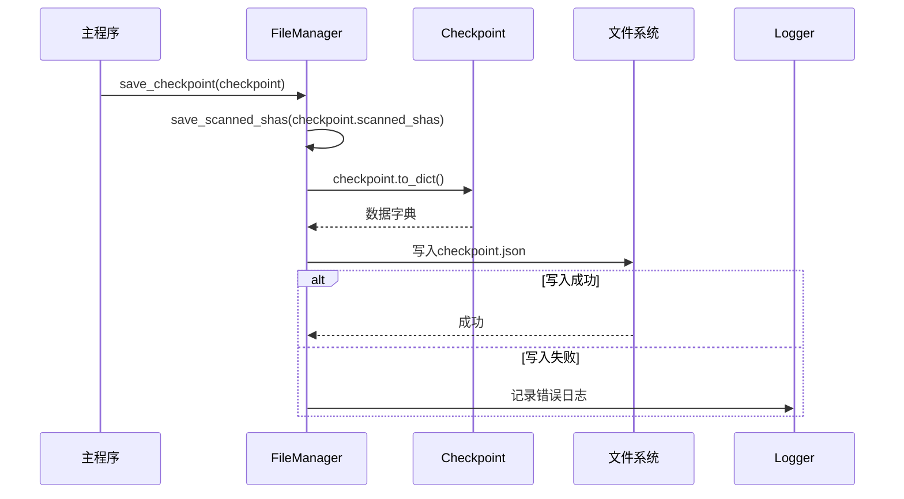

# 检查点机制

<cite>
**本文档引用的文件**  
- [file_manager.py](file://utils/file_manager.py)
- [config.py](file://common/config.py)
- [Logger.py](file://common/Logger.py)
</cite>

## 目录
1. [简介](#简介)  
2. [项目结构](#项目结构)  
3. [核心组件分析](#核心组件分析)  
4. [检查点类结构详解](#检查点类结构详解)  
5. [序列化与持久化机制](#序列化与持久化机制)  
6. [配置联动与文件路径管理](#配置联动与文件路径管理)  
7. [日志记录与错误处理](#日志记录与错误处理)  
8. [恢复策略与容错建议](#恢复策略与容错建议)  
9. [调用流程示例](#调用流程示例)  
10. [总结](#总结)

## 简介
本项目旨在通过自动化扫描GitHub代码库来发现潜在泄露的API密钥。为确保程序在中断后能从中断点恢复，系统引入了**检查点机制（Checkpoint Mechanism）**，用于持久化记录扫描进度。该机制由`utils/file_manager.py`中的`Checkpoint`类实现，结合`common/config.py`的路径配置和`common/Logger.py`的日志支持，实现了高可靠的状态管理。

## 项目结构
项目采用模块化设计，主要分为以下几个目录：
- `app/`：主应用入口
- `common/`：通用工具，如日志和配置
- `scripts/`：辅助脚本
- `utils/`：核心工具模块，包含文件管理、GitHub客户端等

检查点机制的核心实现位于`utils/file_manager.py`，依赖`common/config.py`进行路径配置，并通过`common/Logger.py`输出运行日志。



**图示来源**  
- [file_manager.py](file://utils/file_manager.py)
- [config.py](file://common/config.py)
- [Logger.py](file://common/Logger.py)

## 核心组件分析
检查点机制由三个核心组件协同工作：
1. **Checkpoint类**：定义检查点数据结构
2. **FileManager类**：负责检查点的加载与保存
3. **Config类**：提供检查点文件路径配置
4. **Logger类**：记录检查点操作日志

这些组件共同确保系统状态可持久化、可恢复。

**本节来源**  
- [file_manager.py](file://utils/file_manager.py#L12-L48)
- [config.py](file://common/config.py)
- [Logger.py](file://common/Logger.py)

## 检查点类结构详解
`Checkpoint`类使用Python的`dataclass`装饰器定义，包含以下属性：

<details>
<summary>属性结构</summary>

- **last_scan_time**: `Optional[str]`  
  上次扫描的时间戳，使用ISO 8601格式（UTC时区），用于记录最近一次扫描完成时间。

- **scanned_shas**: `Set[str]`  
  已扫描文件的SHA哈希集合，用于避免重复扫描同一文件。

- **processed_queries**: `Set[str]`  
  已处理的搜索查询语句集合，防止重复执行相同查询。

- **wait_send_balancer**: `Set[str]`  
  等待发送至Gemini Balancer的API密钥集合。

- **wait_send_gpt_load**: `Set[str]`  
  等待发送至GPT Load Balancer的API密钥集合。

</details>

该类提供了以下方法：
- `add_scanned_sha(sha)`: 添加已扫描文件的SHA
- `add_processed_query(query)`: 添加已处理的查询
- `update_scan_time()`: 更新扫描时间戳为当前UTC时间



**图示来源**  
- [file_manager.py](file://utils/file_manager.py#L12-L48)

**本节来源**  
- [file_manager.py](file://utils/file_manager.py#L12-L48)

## 序列化与持久化机制
检查点数据通过JSON格式持久化存储，但采用**分文件存储策略**以提高性能和可维护性：

### 主检查点文件（checkpoint.json）
存储除`scanned_shas`外的所有数据，结构如下：
```json
{
  "last_scan_time": "2024-01-01T12:00:00Z",
  "processed_queries": ["query1", "query2"],
  "wait_send_balancer": ["key1", "key2"],
  "wait_send_gpt_load": ["key3", "key4"]
}
```

### 已扫描SHA文件（scanned_shas.txt）
单独存储所有已扫描文件的SHA值，每行一个，支持注释：
```
# 已扫描的文件SHA列表
# 每行一个SHA，用于避免重复扫描
# 最后更新时间: 2024-01-01 12:00:00

a1b2c3d4e5f6...
b2c3d4e5f6a1...
```

### 序列化方法
- `to_dict()`: 将对象转换为字典，`scanned_shas`不包含在内
- `from_dict()`: 从字典重建对象，`scanned_shas`留空由FileManager单独加载

**本节来源**  
- [file_manager.py](file://utils/file_manager.py#L27-L48)
- [file_manager.py](file://utils/file_manager.py#L237-L247)

## 配置联动与文件路径管理
检查点机制与`config.py`中的配置项紧密联动：

### 关键配置项
- **DATA_PATH**: 数据根目录，默认`/app/data`
- **SCANNED_SHAS_FILE**: 已扫描SHA文件名，默认`scanned_shas.txt`
- **QUERIES_FILE**: 搜索查询文件名，默认`queries.txt`

### 文件路径构建
`FileManager`在初始化时构建检查点文件路径：
```python
self.checkpoint_file = os.path.join(data_dir, "checkpoint.json")
self.scanned_shas_file = os.path.join(data_dir, Config.SCANNED_SHAS_FILE)
```

这确保了文件路径的灵活性和可配置性。

**本节来源**  
- [file_manager.py](file://utils/file_manager.py#L65)
- [config.py](file://common/config.py#L30-L35)

## 日志记录与错误处理
`Logger.py`在检查点操作中发挥重要作用，提供结构化日志输出：

### 日志级别使用
- **info**: 记录正常操作，如"Loading checkpoint..."
- **warning**: 记录非致命问题，如文件不存在或读取失败
- **error**: 记录严重错误，如保存失败

### 典型日志场景
```python
# 文件不存在时创建新检查点
logger.warning(f"{self.checkpoint_file} not found. Will create new checkpoint.")

# 读取失败时使用默认值
logger.warning(f"Cannot read {self.checkpoint_file}: {e}. Will create new checkpoint.")

# 保存失败记录错误
logger.error(f"Failed to save {self.checkpoint_file}: {e}")
```

日志帮助开发者监控检查点状态，快速定位问题。

**本节来源**  
- [file_manager.py](file://utils/file_manager.py#L185)
- [file_manager.py](file://utils/file_manager.py#L247)
- [Logger.py](file://common/Logger.py)

## 恢复策略与容错建议
当检查点文件损坏或丢失时，系统具备自动恢复能力：

### 自动恢复机制
1. 若`checkpoint.json`不存在或损坏，自动创建新`Checkpoint`实例
2. 若`scanned_shas.txt`不存在，返回空集合
3. 所有缺失数据均以默认值（空集合）处理，保证程序继续运行

### 恢复策略建议
1. **定期备份**：建议每日备份`data/`目录
2. **文件校验**：可添加SHA256校验和文件完整性验证
3. **多副本存储**：关键环境可考虑将检查点同步至远程存储
4. **监控告警**：监控日志中的`warning`和`error`信息，及时发现文件问题

### 潜在风险
- `scanned_shas`丢失可能导致重复扫描，增加GitHub API消耗
- `processed_queries`丢失可能导致重复查询，影响效率

**本节来源**  
- [file_manager.py](file://utils/file_manager.py#L173-L191)
- [file_manager.py](file://utils/file_manager.py#L113-L118)

## 调用流程示例
以下是检查点加载与保存的完整调用流程：

### 加载流程


**图示来源**  
- [file_manager.py](file://utils/file_manager.py#L173-L191)

### 保存流程


**图示来源**  
- [file_manager.py](file://utils/file_manager.py#L237-L247)

## 总结
检查点机制是本项目可靠运行的核心保障。通过`Checkpoint`类的结构化设计、分文件持久化策略、与`Config`的灵活配置联动以及`Logger`的完善日志记录，系统实现了：
- **状态持久化**：关键进度数据安全存储
- **断点续传**：程序重启后自动恢复
- **容错恢复**：文件损坏时优雅降级
- **可维护性**：清晰的日志和模块化设计

该机制确保了长时间运行任务的稳定性，是自动化扫描系统不可或缺的组成部分。