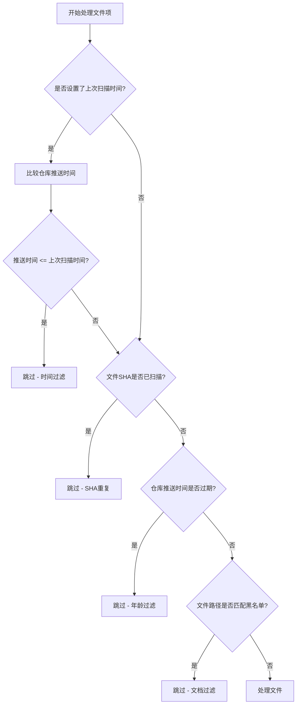
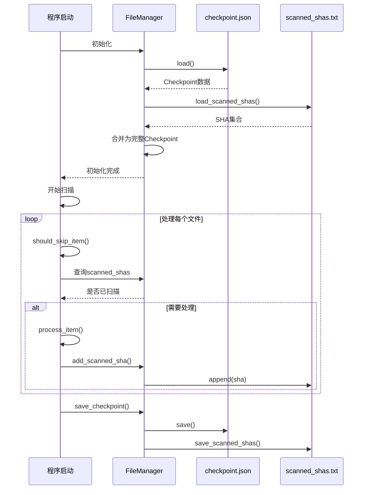

# 扫描行为配置

<cite>
**本文档引用的文件**   
- [config.py](file://common\config.py) - *在最近提交中更新，新增OpenRouter配置*
- [file_manager.py](file://utils\file_manager.py) - *在提交 383c253 中更新*
- [hajimi_king.py](file://app\hajimi_king.py) - *主扫描逻辑文件*
</cite>

## 更新摘要
**已更新内容**
- 根据提交 `21a2b1b` 的代码变更，新增了关于 OpenRouter API Key 提取功能的配置说明。
- 在“配置项详解”部分新增了 `OPENROUTER_BASE_URLS`、`OPENROUTER_USE_LOOSE_PATTERN`、`OPENROUTER_PROXIMITY_CHARS`、`OPENROUTER_REQUIRE_KEY_CONTEXT` 和 `OPENROUTER_EXTRACT_ONLY` 五个与 OpenRouter 相关的配置项。
- 更新了“典型配置组合示例”部分，补充了针对 OpenRouter 密钥提取的配置建议。
- 调整了文档引用文件列表，准确反映当前涉及的源码文件。

## 目录
1. [扫描行为配置](#扫描行为配置)
2. [配置项详解](#配置项详解)
3. [文件过滤机制](#文件过滤机制)
4. [检查点与增量扫描](#检查点与增量扫描)
5. [典型配置组合示例](#典型配置组合示例)
6. [性能影响与优化建议](#性能影响与优化建议)

## 配置项详解

本节详细说明影响扫描过程的核心行为控制参数，这些参数定义在 `common/config.py` 文件中，并通过 `Config` 类进行管理。

### 扫描间隔时间 (SCAN_INTERVAL)
项目中未直接定义 `SCAN_INTERVAL` 配置项，但通过主循环中的 `time.sleep(10)` 实现了每轮扫描之间的固定间隔（10秒）。该机制确保扫描过程不会过于频繁地请求GitHub API，从而避免触发速率限制。

```python
logger.info("💤 Sleeping for 10 seconds...")
time.sleep(10)
```

**Section sources**
- [hajimi_king.py](file://app\hajimi_king.py#L500-L501)

### 文件大小上限 (MAX_FILE_SIZE)
项目未实现基于文件大小的过滤逻辑。`file_manager.py` 和 `hajimi_king.py` 中均未发现对文件大小的检查或限制代码。因此，所有匹配搜索查询的文件，无论其大小，都会被下载和处理。

**Section sources**
- [file_manager.py](file://utils\file_manager.py#L1-L432)
- [hajimi_king.py](file://app\hajimi_king.py#L1-L512)

### 允许扫描的文件扩展名 (ALLOWED_EXTENSIONS)
项目未采用“允许列表”（白名单）模式，而是采用了“排除列表”（黑名单）模式来过滤文件。通过 `FILE_PATH_BLACKLIST` 配置项，系统会跳过路径中包含特定关键词的文件。

```python
# 在 config.py 中定义
FILE_PATH_BLACKLIST_STR = os.getenv("FILE_PATH_BLACKLIST", "readme,docs,doc/,.md,sample,tutorial")
FILE_PATH_BLACKLIST = [token.strip().lower() for token in FILE_PATH_BLACKLIST_STR.split(',') if token.strip()]
```

在 `hajimi_king.py` 的 `should_skip_item` 函数中，使用此黑名单进行过滤：
```python
lowercase_path = item["path"].lower()
if any(token in lowercase_path for token in Config.FILE_PATH_BLACKLIST):
    skip_stats["doc_filter"] += 1
    return True, "doc_filter"
```

**Section sources**
- [config.py](file://common\config.py#L65-L68)
- [hajimi_king.py](file://app\hajimi_king.py#L380-L385)

### 排除路径模式 (EXCLUDED_PATHS)
`EXCLUDED_PATHS` 的功能由 `FILE_PATH_BLACKLIST` 配置项完全实现。它是一个逗号分隔的字符串，包含了一系列用于匹配文件路径的关键词。任何文件路径（转换为小写后）中包含这些关键词的文件都会被跳过。常见的排除模式包括文档（`readme`, `.md`）、示例（`sample`）和教程（`tutorial`）等。

**Section sources**
- [config.py](file://common\config.py#L65-L68)
- [hajimi_king.py](file://app\hajimi_king.py#L380-L385)

### OpenRouter 密钥提取配置
为支持 OpenRouter API Key 的提取和处理，系统新增了以下配置项，均在 `common/config.py` 中定义。

#### OPENROUTER_BASE_URLS
指定用于识别 OpenRouter 密钥的 API 基础 URL 列表。系统会在文件内容中搜索这些 URL，以定位可能的密钥。
```python
OPENROUTER_BASE_URLS_STR = os.getenv("OPENROUTER_BASE_URLS", "https://openrouter.ai/api/v1")
OPENROUTER_BASE_URLS = [u.strip() for u in OPENROUTER_BASE_URLS_STR.split(',') if u.strip()]
```

#### OPENROUTER_USE_LOOSE_PATTERN
是否启用宽松的密钥匹配模式。当设置为 `true` 时，系统会使用更广泛的正则表达式模式来匹配密钥，可能增加误报率但提高召回率。
```python
OPENROUTER_USE_LOOSE_PATTERN = os.getenv("OPENROUTER_USE_LOOSE_PATTERN", "false")
```

#### OPENROUTER_PROXIMITY_CHARS
在使用宽松模式时，此配置项定义了基础 URL 与密钥匹配项之间的最大字符距离。只有当两者距离在此阈值内时，才认为是有效匹配。
```python
OPENROUTER_PROXIMITY_CHARS = int(os.getenv("OPENROUTER_PROXIMITY_CHARS", "0"))
```

#### OPENROUTER_REQUIRE_KEY_CONTEXT
是否要求密钥周围存在上下文关键词（如 "key", "token", "authorization"）。启用此选项可减少噪声，提高提取准确性。
```python
OPENROUTER_REQUIRE_KEY_CONTEXT = os.getenv("OPENROUTER_REQUIRE_KEY_CONTEXT", "false")
```

#### OPENROUTER_EXTRACT_ONLY
如果为 `true`，则在提取 OpenRouter 密钥时跳过验证步骤，直接保存。适用于需要快速收集密钥的场景。
```python
OPENROUTER_EXTRACT_ONLY = os.getenv("OPENROUTER_EXTRACT_ONLY", "true")
```

**Section sources**
- [config.py](file://common\config.py#L77-L83)

## 文件过滤机制

`file_manager.py` 本身不直接负责文件过滤，而是提供文件操作支持。真正的过滤逻辑在 `hajimi_king.py` 的 `should_skip_item` 函数中实现，该函数利用 `config.py` 中的配置项进行多维度的智能过滤。



**Diagram sources**
- [hajimi_king.py](file://app\hajimi_king.py#L350-L385)

### 过滤维度说明
1.  **时间过滤 (Time Filter)**：在增量扫描模式下，如果文件所属仓库的最后推送时间早于上次扫描时间，则跳过该文件。
2.  **SHA重复过滤 (SHA Duplicate Filter)**：通过 `CHECKPOINT_FILE` 记录已扫描文件的SHA值，避免重复处理同一文件。
3.  **年龄过滤 (Age Filter)**：通过 `DATE_RANGE_DAYS` 配置项（默认730天）过滤掉过于陈旧的仓库，以提高扫描效率。
4.  **文档过滤 (Doc Filter)**：利用 `FILE_PATH_BLACKLIST` 排除已知的文档、示例和测试文件。

**Section sources**
- [hajimi_king.py](file://app\hajimi_king.py#L350-L385)

## 检查点与增量扫描

检查点机制是实现高效增量扫描的核心，由 `utils/file_manager.py` 中的 `FileManager` 和 `Checkpoint` 类实现。

### 工作原理
1.  **状态持久化**：`Checkpoint` 类定义了需要持久化的状态，包括 `last_scan_time`（上次扫描时间）、`scanned_shas`（已扫描文件的SHA集合）、`processed_queries`（已处理的搜索查询）等。
2.  **文件存储**：`FileManager` 将 `Checkpoint` 的主要状态（除 `scanned_shas` 外）保存在 `checkpoint.json` 文件中。而 `scanned_shas` 集合则单独保存在 `scanned_shas.txt` 文件中，每一行一个SHA值。
3.  **加载与初始化**：程序启动时，`FileManager` 会尝试加载 `checkpoint.json` 和 `scanned_shas.txt` 文件，重建 `Checkpoint` 对象。
4.  **增量扫描**：主程序 `hajimi_king.py` 在每次处理文件前，会调用 `should_skip_item` 函数，利用 `Checkpoint` 中的 `last_scan_time` 和 `scanned_shas` 来判断是否跳过该文件，从而实现只扫描新文件或未处理过的文件。



**Diagram sources**
- [file_manager.py](file://utils\file_manager.py#L1-L432)
- [hajimi_king.py](file://app\hajimi_king.py#L350-L400)

### 与增量扫描的协同
检查点机制与增量扫描是紧密协同的：
-   **`last_scan_time`**：决定了扫描的时间起点，是增量扫描的“时间锚点”。
-   **`scanned_shas`**：提供了精确的文件级去重，确保即使文件内容发生变化（SHA改变），也能被重新扫描，避免了基于文件名的简单去重可能带来的遗漏。
-   **`processed_queries`**：记录了已执行的搜索查询，避免在每次重启时重复执行所有查询。

**Section sources**
- [file_manager.py](file://utils\file_manager.py#L1-L432)
- [hajimi_king.py](file://app\hajimi_king.py#L350-L360)

## 典型配置组合示例

根据不同的扫描需求，可以调整配置以实现不同的扫描策略。

### 高频率轻量扫描
此模式适用于需要快速发现最新泄露密钥的场景，牺牲全面性以换取速度和低资源消耗。

```env
# .env 配置示例
DATE_RANGE_DAYS=30
FILE_PATH_BLACKLIST=readme,docs,doc/,.md,sample,tutorial,test,example
PROXY=http://proxy1:port,http://proxy2:port
MAX_CONCURRENT_REQUESTS=1
```

-   **`DATE_RANGE_DAYS=30`**：仅扫描最近30天内有更新的仓库，大幅缩小搜索范围。
-   **扩展的 `FILE_PATH_BLACKLIST`**：增加了 `test` 和 `example`，更严格地过滤非生产代码。
-   **使用代理 `PROXY`**：通过轮换代理降低单个IP的请求频率，有助于实现更高频率的扫描。
-   **隐含的低并发**：虽然代码中未显式定义 `MAX_CONCURRENT_REQUESTS`，但主循环的 `time.sleep(10)` 和 `time.sleep(random.uniform(1, 4))` 保证了低并发。

### 深度全面扫描
此模式适用于定期进行全面审计，追求发现所有可能的密钥，不介意较长的执行时间和较高的资源消耗。

```env
# .env 配置示例
DATE_RANGE_DAYS=1825 # 5年
FILE_PATH_BLACKLIST= # 留空或仅保留核心项
MODELSCOPE_EXTRACT_ONLY=false
```

-   **`DATE_RANGE_DAYS=1825`**：将扫描范围扩大到5年，覆盖更广的历史仓库。
-   **空的 `FILE_PATH_BLACKLIST`**：不进行路径过滤，扫描所有匹配查询的文件，包括文档和示例。
-   **禁用 `MODELSCOPE_EXTRACT_ONLY`**：启用Gemini密钥验证，确保发现的密钥是有效的。

### OpenRouter 密钥专项扫描
此模式专注于高效提取 OpenRouter API 密钥，适用于特定目标的渗透测试或安全审计。

```env
# .env 配置示例
OPENROUTER_BASE_URLS=https://openrouter.ai/api/v1,https://api.openrouter.ai/v1
OPENROUTER_USE_LOOSE_PATTERN=true
OPENROUTER_PROXIMITY_CHARS=100
OPENROUTER_REQUIRE_KEY_CONTEXT=true
OPENROUTER_EXTRACT_ONLY=false
```

-   **`OPENROUTER_BASE_URLS`**：明确指定多个 OpenRouter API 端点以提高匹配率。
-   **启用宽松模式**：增加密钥的召回率。
-   **设置上下文要求**：通过关键词上下文减少误报。
-   **禁用仅提取**：对提取的密钥进行有效性验证，确保结果质量。

## 性能影响与优化建议

### 大文件阈值与内存消耗
如前所述，项目目前没有 `MAX_FILE_SIZE` 限制。这意味着下载和处理超大文件（如大型数据集、二进制文件）会显著增加内存消耗和处理时间。一个极端的文件可能会耗尽系统内存，导致程序崩溃。

**优化建议**：
在 `github_client.py` 的 `get_file_content` 方法或 `hajimi_king.py` 的 `process_item` 函数中，增加对文件大小的检查。可以在获取文件元数据时先检查 `size` 字段，如果超过预设阈值（如10MB），则直接跳过并记录日志。

### 并发请求数与网络带宽
项目通过 `time.sleep()` 实现了请求节流，但并未直接控制并发连接数。实际的并发度由 `GitHubClient` 的实现和 `time.sleep()` 的延迟共同决定。

-   **`time.sleep(random.uniform(1, 4))`**：在验证每个密钥前，有1到4秒的随机延迟，这是主要的节流机制。
-   **`time.sleep(delay)`**：在处理每个文件前，有1到4秒的延迟。
-   **`time.sleep(10)`**：每轮扫描结束后，有10秒的休眠。

**网络带宽影响**：较低的延迟（如设置 `random.uniform(0.1, 0.5)`）会增加单位时间内的请求数，从而提高网络带宽利用率。但过度增加并发和降低延迟会极大增加被GitHub API封禁的风险。

**优化建议**：
引入一个显式的 `MAX_CONCURRENT_REQUESTS` 配置项，并使用 `asyncio` 或线程池来管理并发请求，可以更精细地控制资源使用。同时，应根据实际的网络带宽和API速率限制来调整 `time.sleep()` 的延迟值，以达到性能和稳定性的平衡。

**Section sources**
- [hajimi_king.py](file://app\hajimi_king.py#L280-L285)
- [hajimi_king.py](file://app\hajimi_king.py#L400-L405)