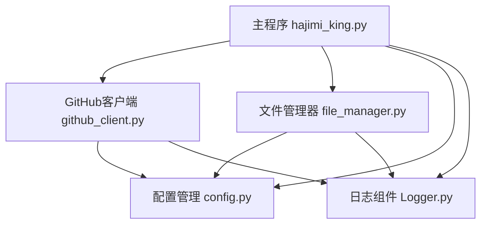
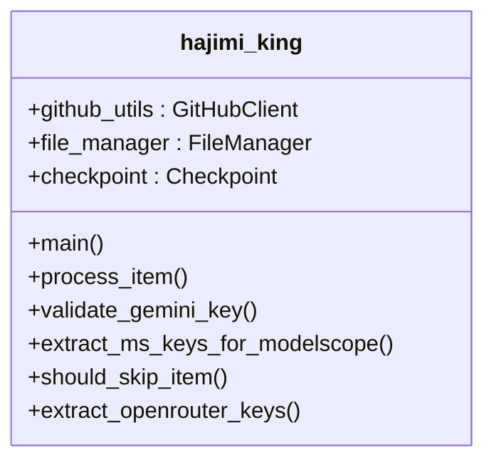
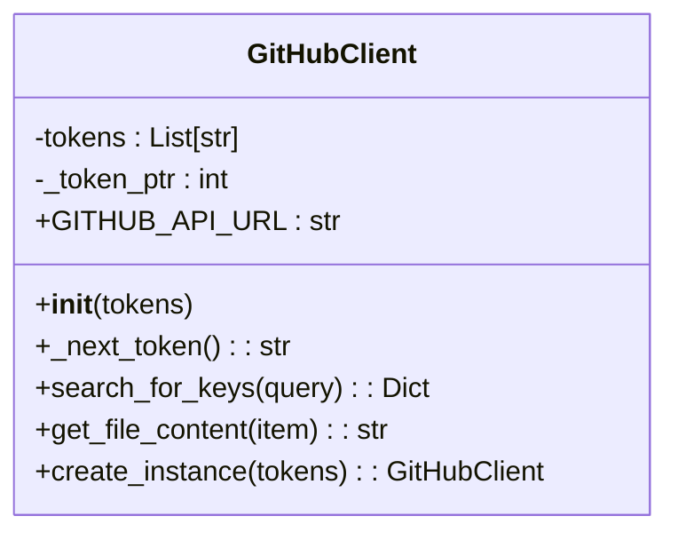
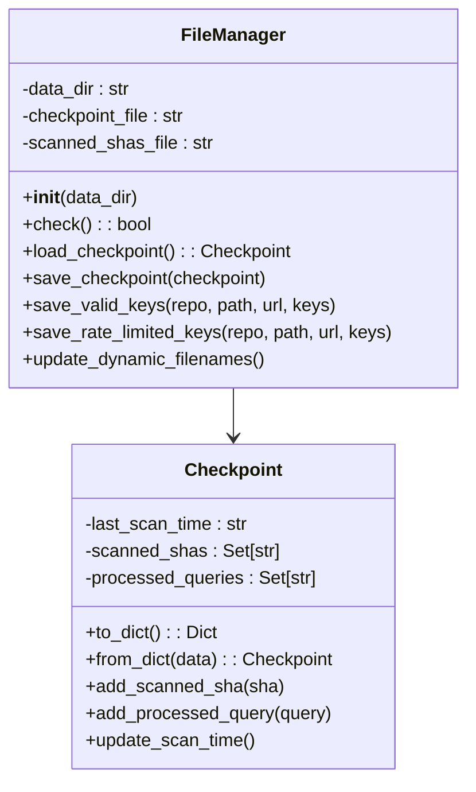
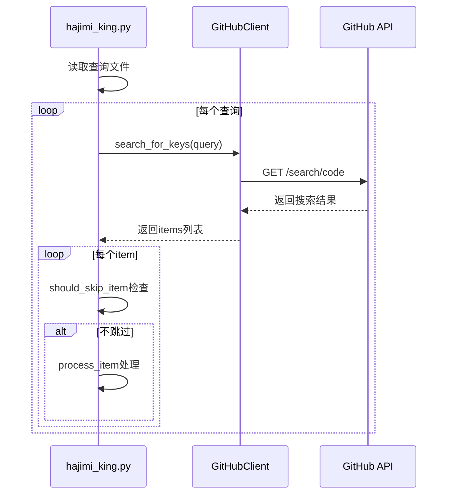
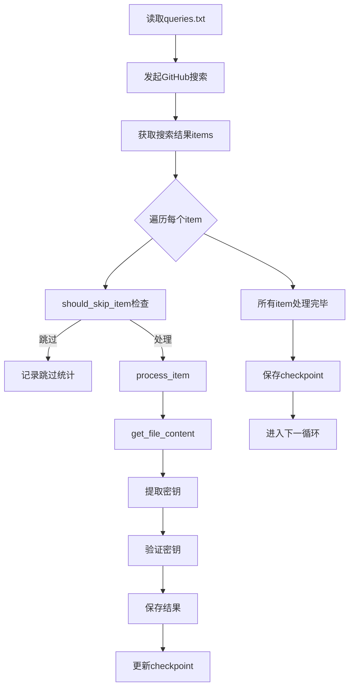
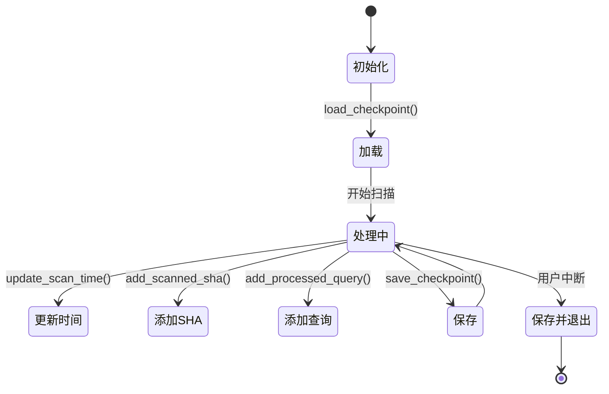

# 核心功能详解

<cite>
**本文档中引用的文件**  
- [hajimi_king.py](file://app/hajimi_king.py)
- [github_client.py](file://utils/github_client.py)
- [file_manager.py](file://utils/file_manager.py)
- [config.py](file://common/config.py)
- [Logger.py](file://common/Logger.py) - *在提交 edd314dab04a8b79c67ce8761837a874cbbf0b3c 中更新*
- [start_openrouter_only.py](file://start_openrouter_only.py) - *新增于提交 21a2b1b3f753f0bb5854ba70d35dd21ab11b16e9*
- [OPENROUTER_USAGE.md](file://OPENROUTER_USAGE.md) - *新增于提交 21a2b1b3f753f0bb5854ba70d35dd21ab11b16e9*
- [queries.openrouter.txt](file://queries.openrouter.txt) - *新增于提交 21a2b1b3f753f0bb5854ba70d35dd21ab11b16e9*
- [queries.openrouter.optimized.txt](file://queries.openrouter.optimized.txt) - *新增于提交 21a2b1b3f753f0bb5854ba70d35dd21ab11b16e9*
</cite>

## 更新摘要
**已做更改**   
- 新增“OpenRouter密钥提取机制”章节，详细说明OpenRouter密钥的提取逻辑与配置
- 在“密钥提取机制”章节中补充OpenRouter密钥的正则表达式与上下文验证逻辑
- 更新“核心组件解析”章节，说明`hajimi_king.py`中新增的`extract_openrouter_keys`函数
- 在“扫描管理与增量扫描”章节中说明`--mode openrouter-only`命令行参数的实现机制
- 添加“OpenRouter专用扫描模式”章节，介绍专用启动脚本和使用指南
- 更新文档来源以反映新增的文件和功能
- 保持其他所有部分不变，因为相关提交主要涉及OpenRouter功能的添加

## 目录
1. [项目结构分析](#项目结构分析)
2. [核心组件解析](#核心组件解析)
3. [密钥搜索流程](#密钥搜索流程)
4. [密钥提取机制](#密钥提取机制)
5. [扫描管理与增量扫描](#扫描管理与增量扫描)
6. [数据流与状态管理](#数据流与状态管理)
7. [错误处理与性能优化](#错误处理与性能优化)
8. [OpenRouter密钥提取机制](#openrouter密钥提取机制)
9. [OpenRouter专用扫描模式](#openrouter专用扫描模式)

## 项目结构分析

本项目采用模块化分层架构，主要分为四个功能目录：

- **app**: 主程序入口 `hajimi_king.py`
- **utils**: 工具模块，包含 `github_client.py`、`file_manager.py` 和 `sync_utils.py`
- **common**: 公共组件，包含 `config.py` 和 `Logger.py`
- **scripts**: 脚本文件，如 `dry_run.py`



**图示来源**
- [hajimi_king.py](file://app/hajimi_king.py)
- [github_client.py](file://utils/github_client.py)
- [file_manager.py](file://utils/file_manager.py)
- [config.py](file://common/config.py)
- [Logger.py](file://common/Logger.py)

**本节来源**
- [hajimi_king.py](file://app/hajimi_king.py)
- [github_client.py](file://utils/github_client.py)
- [file_manager.py](file://utils/file_manager.py)

## 核心组件解析

### 主控制器：hajimi_king.py

`hajimi_king.py` 是系统的核心控制模块，负责协调各个组件完成密钥扫描任务。



**图示来源**
- [hajimi_king.py](file://app/hajimi_king.py#L1-L524)

**本节来源**
- [hajimi_king.py](file://app/hajimi_king.py#L1-L524)

### GitHub客户端：github_client.py

`GitHubClient` 类封装了与GitHub API的交互逻辑，支持多令牌轮换和代理配置。



**图示来源**
- [github_client.py](file://utils/github_client.py#L11-L216)

**本节来源**
- [github_client.py](file://utils/github_client.py#L11-L216)

### 文件管理器：file_manager.py

`FileManager` 和 `Checkpoint` 类负责管理扫描状态和文件操作。



**图示来源**
- [file_manager.py](file://utils/file_manager.py#L12-L48)
- [file_manager.py](file://utils/file_manager.py#L50-L492)

**本节来源**
- [file_manager.py](file://utils/file_manager.py#L12-L492)

## 密钥搜索流程

密钥搜索流程由 `hajimi_king.py` 中的 `main()` 函数驱动，通过 `GitHubClient` 发起搜索请求。



**图示来源**
- [hajimi_king.py](file://app/hajimi_king.py#L343-L524)
- [github_client.py](file://utils/github_client.py#L50-L150)

**本节来源**
- [hajimi_king.py](file://app/hajimi_king.py#L343-L524)
- [github_client.py](file://utils/github_client.py#L50-L150)

## 密钥提取机制

### ModelScope密钥提取

系统通过正则表达式提取符合特定模式的ModelScope密钥，并结合上下文验证减少误报。

```python
def extract_ms_keys_for_modelscope(content: str) -> List[str]:
    # 检查是否包含目标base_url
    has_base, base_positions = _contains_base_url(content, Config.TARGET_BASE_URLS)
    if not has_base:
        return []

    # 定义正则模式
    strict_pat = r'(?i)\bms-[0-9a-f]{8}-[0-9a-f]{4}-[0-9a-f]{4}-[0-9a-f]{4}-[0-9a-f]{12}\b'
    loose_pat = r'(?i)\bms-[0-9a-f-]{30,}\b'
    pattern = loose_pat if Config.parse_bool(Config.MS_USE_LOOSE_PATTERN) else strict_pat

    # 上下文验证
    ctx_re = re.compile(r"(key|token|secret|authorization|api[-_ ]?key)", re.IGNORECASE)
    
    results = []
    for m in re.finditer(pattern, content):
        k = m.group(0)
        if k.lower() == "ms-00000000-0000-0000-0000-000000000000":
            continue
            
        # 距离验证
        if Config.MS_PROXIMITY_CHARS > 0 and base_positions:
            pos = m.start()
            near = any(abs(pos - bp) <= Config.MS_PROXIMITY_CHARS for bp in base_positions)
            if not near:
                continue
                
        # 上下文词验证
        if Config.parse_bool(Config.MS_REQUIRE_KEY_CONTEXT):
            start = max(0, m.start() - 80)
            end = min(len(content), m.end() + 80)
            snippet = content[start:end]
            if not ctx_re.search(snippet):
                continue
                
        results.append(k)
        
    return list(dict.fromkeys(results))  # 去重保序
```

**本节来源**
- [hajimi_king.py](file://app/hajimi_king.py#L108-L158)

### Gemini密钥提取

通过正则表达式 `r'(AIzaSy[A-Za-z0-9\-_]{33})'` 提取Gemini密钥，并进行有效性验证。

```python
def extract_keys_from_content(content: str) -> List[str]:
    pattern = r'(AIzaSy[A-Za-z0-9\-_]{33})'
    return re.findall(pattern, content)
```

**本节来源**
- [hajimi_king.py](file://app/hajimi_king.py#L103-L106)

## 扫描管理与增量扫描

### 跳过策略

系统通过 `should_skip_item()` 函数实现多种跳过策略：

```python
def should_skip_item(item: Dict[str, Any], checkpoint: Checkpoint) -> tuple[bool, str]:
    # 时间过滤：跳过已扫描时间之前的仓库
    if checkpoint.last_scan_time:
        last_scan_dt = datetime.fromisoformat(checkpoint.last_scan_time)
        repo_pushed_at = item["repository"].get("pushed_at")
        if repo_pushed_at:
            repo_pushed_dt = datetime.strptime(repo_pushed_at, "%Y-%m-%dT%H:%M:%SZ")
            if repo_pushed_dt <= last_scan_dt:
                return True, "time_filter"

    # SHA重复过滤
    if item.get("sha") in checkpoint.scanned_shas:
        return True, "sha_duplicate"

    # 仓库年龄过滤
    repo_pushed_at = item["repository"].get("pushed_at")
    if repo_pushed_at:
        repo_pushed_dt = datetime.strptime(repo_pushed_at, "%Y-%m-%dT%H:%M:%SZ")
        if repo_pushed_dt < datetime.utcnow() - timedelta(days=Config.DATE_RANGE_DAYS):
            return True, "age_filter"

    # 文件路径黑名单过滤
    lowercase_path = item["path"].lower()
    if any(token in lowercase_path for token in Config.FILE_PATH_BLACKLIST):
        return True, "doc_filter"

    return False, ""
```

### 多令牌轮换策略

`GitHubClient` 实现了多令牌轮换机制，避免单个令牌的速率限制：

```python
def _next_token(self) -> Optional[str]:
    if not self.tokens:
        return None
    token = self.tokens[self._token_ptr % len(self.tokens)]
    self._token_ptr += 1
    return token.strip() if isinstance(token, str) else token
```

**本节来源**
- [hajimi_king.py](file://app/hajimi_king.py#L171-L210)
- [github_client.py](file://utils/github_client.py#L20-L30)

## 数据流与状态管理

### 数据流路径

从查询执行到结果存储的完整数据流：



**图示来源**
- [hajimi_king.py](file://app/hajimi_king.py#L343-L524)

**本节来源**
- [hajimi_king.py](file://app/hajimi_king.py#L343-L524)

### Checkpoint状态变迁

`Checkpoint` 对象的状态在扫描过程中不断更新：



**图示来源**
- [file_manager.py](file://utils/file_manager.py#L12-L48)

**本节来源**
- [file_manager.py](file://utils/file_manager.py#L12-L48)

## 错误处理与性能优化

### 密钥验证机制

`validate_gemini_key()` 函数实现了健壮的密钥验证逻辑：

```python
def validate_gemini_key(api_key: str) -> Union[bool, str]:
    try:
        # 随机延迟避免突发请求
        time.sleep(random.uniform(0.5, 1.5))

        # 支持代理配置
        proxy_config = Config.get_random_proxy()
        if proxy_config:
            os.environ['grpc_proxy'] = proxy_config.get('http')

        genai.configure(api_key=api_key)
        model = genai.GenerativeModel(Config.HAJIMI_CHECK_MODEL)
        response = model.generate_content("hi")
        return "ok"
    except google_exceptions.TooManyRequests as e:
        return "rate_limited"
    except (google_exceptions.PermissionDenied, google_exceptions.Unauthenticated) as e:
        return "not_authorized_key"
    except Exception as e:
        if "429" in str(e) or "rate limit" in str(e).lower():
            return "rate_limited:429"
        elif "403" in str(e) or "SERVICE_DISABLED" in str(e):
            return "disabled"
        else:
            return f"error:{e.__class__.__name__}"
```

### 性能优化措施

1. **随机延迟**: 在请求间添加随机延迟，避免触发速率限制
2. **多令牌轮换**: 使用多个GitHub令牌分散请求
3. **代理支持**: 支持配置代理服务器
4. **增量扫描**: 通过checkpoint实现断点续传
5. **智能过滤**: 通过多种策略减少无效处理

### 日志模块重构

根据提交 `edd314dab04a8b79c67ce8761837a874cbbf0b3c` 的更改，日志模块已重构以提升日志输出体验和功能。主要变更包括：

- **日志文件按天归档**: 日志文件现在按天归档，文件名格式为 `app_YYYYMMDD.log`，便于管理和检索特定日期的日志。
- **增强的日志格式**: 添加了颜色编码和图标以提高可读性，不同日志级别使用不同的颜色和图标。
- **丰富的日志方法**: 新增了特定用途的日志方法，如 `success()`、`progress()`、`network()`、`file_op()`、`security()` 和 `rate_limit()`，使日志更具语义性。
- **进度条支持**: `progress()` 方法支持显示进度条，便于监控长时间运行的任务。
- **分隔线支持**: `separator()` 方法可用于在日志中创建分隔线，提高日志的可读性。

**更新** 日志模块的重构提升了系统的可观测性和调试效率。

**本节来源**
- [hajimi_king.py](file://app/hajimi_king.py#L308-L341)
- [github_client.py](file://utils/github_client.py#L50-L150)
- [Logger.py](file://common/Logger.py) - *在提交 edd314dab04a8b79c67ce8761837a874cbbf0b3c 中更新*

## OpenRouter密钥提取机制

### OpenRouter密钥提取

系统通过正则表达式提取符合特定模式的OpenRouter密钥，并结合上下文验证减少误报。

```python
def extract_openrouter_keys(content: str) -> List[str]:
    """
    当同一文件中包含 Config.OPENROUTER_BASE_URLS 任一值时，提取 OpenRouter API keys。
    OpenRouter key 格式: sk-or-v1-[64位十六进制字符串]
    受控于以下配置：
      - OPENROUTER_BASE_URLS
      - OPENROUTER_USE_LOOSE_PATTERN (bool)
      - OPENROUTER_PROXIMITY_CHARS (int, 当使用宽松模式时建议>0)
      - OPENROUTER_REQUIRE_KEY_CONTEXT (bool)
    """
    base_urls = Config.OPENROUTER_BASE_URLS
    has_base, base_positions = _contains_base_url(content, base_urls)
    if not has_base:
        return []

    # OpenRouter key 正则模式
    # 严格模式：sk-or-v1-[64位十六进制]
    strict_pat = r'\bsk-or-v1-[0-9a-f]{64}\b'
    # 宽松模式：sk-or-v1-[至少40位字符]
    loose_pat = r'\bsk-or-v1-[0-9a-f]{40,}\b'
    
    use_loose = Config.parse_bool(Config.OPENROUTER_USE_LOOSE_PATTERN)
    pattern = loose_pat if use_loose else strict_pat

    proximity_chars = Config.OPENROUTER_PROXIMITY_CHARS if use_loose else 0
    require_ctx = Config.parse_bool(Config.OPENROUTER_REQUIRE_KEY_CONTEXT)
    ctx_re = re.compile(r"(key|token|secret|authorization|api[-_ ]?key|openrouter)", re.IGNORECASE)

    results: List[str] = []
    for m in re.finditer(pattern, content, re.IGNORECASE):
        k = m.group(0)
        
        # 过滤明显的占位符
        if "0000000000000000" in k.lower() or "your_key" in k.lower() or "example" in k.lower():
            continue

        # 邻近性检查（当使用宽松模式时）
        if proximity_chars and base_positions:
            pos = m.start()
            near = any(abs(pos - bp) <= proximity_chars for bp in base_positions)
            if not near:
                continue

        # 上下文检查（当启用时）
        if require_ctx:
            start = max(0, m.start() - 80)
            end = min(len(content), m.end() + 80)
            snippet = content[start:end]
            if not ctx_re.search(snippet):
                continue

        results.append(k)

    # 去重且保序
    seen = set()
    deduped = [x for x in results if not (x in seen or seen.add(x))]
    return deduped
```

**本节来源**
- [hajimi_king.py](file://app/hajimi_king.py#L160-L210)

## OpenRouter专用扫描模式

### 专用启动脚本

系统提供了专用的启动脚本 `start_openrouter_only.py`，用于专门扫描和提取OpenRouter API密钥。

```python
def main():
    """启动 OpenRouter 专用扫描"""
    logger.info("🔥 启动 OpenRouter 专用扫描模式")
    logger.info("📋 配置说明：")
    logger.info("   - 只扫描 OpenRouter API 密钥")
    logger.info("   - 不扫描 ModelScope 或 Gemini 密钥")
    logger.info("   - 不进行密钥验证，仅提取和保存")
    logger.separator()
    
    # 设置 OpenRouter 专用环境变量
    os.environ['OPENROUTER_EXTRACT_ONLY'] = 'true'
    os.environ['MODELSCOPE_EXTRACT_ONLY'] = 'false'
    os.environ['TARGET_BASE_URLS'] = ''  # 禁用 ModelScope
    
    # 确保有 OpenRouter 配置
    if not os.environ.get('OPENROUTER_BASE_URLS'):
        os.environ['OPENROUTER_BASE_URLS'] = 'https://openrouter.ai/api/v1,openrouter.ai'
        logger.info("✅ 自动设置 OpenRouter base URLs")
    
    # 导入并运行主程序
    try:
        from app.hajimi_king import main as hajimi_main
        # 通过 sys.argv 传递命令行参数
        sys.argv.extend(['--mode', 'openrouter-only'])
        hajimi_main()
    except ImportError as e:
        logger.error(f"❌ 导入错误: {e}")
        logger.info("请确保所有依赖已安装：pip install -r requirements.txt")
    except Exception as e:
        logger.error(f"❌ 运行错误: {e}")
```

### 命令行参数支持

`hajimi_king.py` 支持 `--mode` 命令行参数，实现不同的提取模式：

```python
def _parse_cli_args() -> argparse.Namespace:
    parser = argparse.ArgumentParser(description="Hajimi King")
    parser.add_argument(
        "--mode",
        choices=["modelscope-only", "openrouter-only", "compatible"],
        help="modelscope-only: 仅提取 ms-key，不回退到 Gemini；openrouter-only: 仅提取 OpenRouter key；compatible: 未命中时回退到原有逻辑",
    )
    return parser.parse_args()
```

当使用 `--mode openrouter-only` 时，系统会：
1. 启用 `OPENROUTER_EXTRACT_ONLY` 模式
2. 禁用 `MODELSCOPE_EXTRACT_ONLY` 模式
3. 清空 `TARGET_BASE_URLS` 以确保不提取ModelScope密钥
4. 仅提取OpenRouter密钥，不进行任何验证

**本节来源**
- [start_openrouter_only.py](file://start_openrouter_only.py)
- [hajimi_king.py](file://app/hajimi_king.py#L426-L590)
- [OPENROUTER_USAGE.md](file://OPENROUTER_USAGE.md)