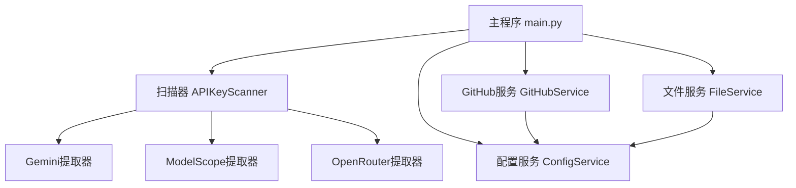
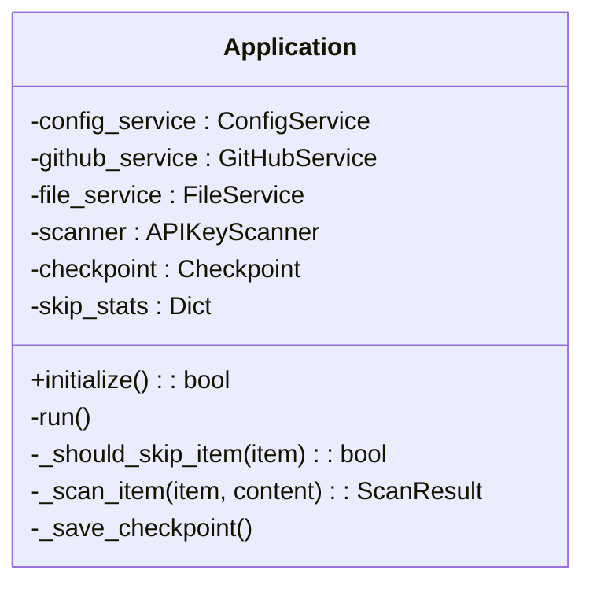
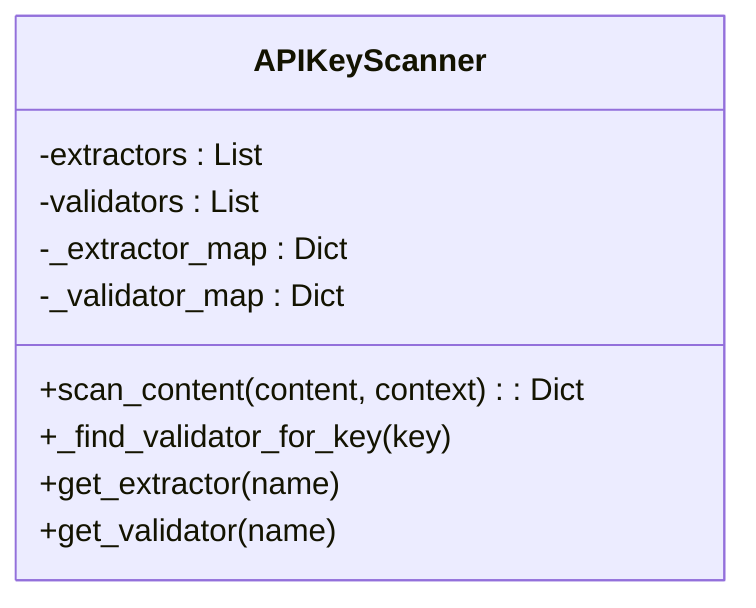
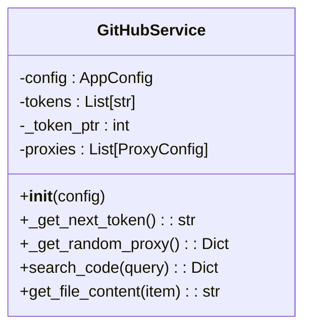
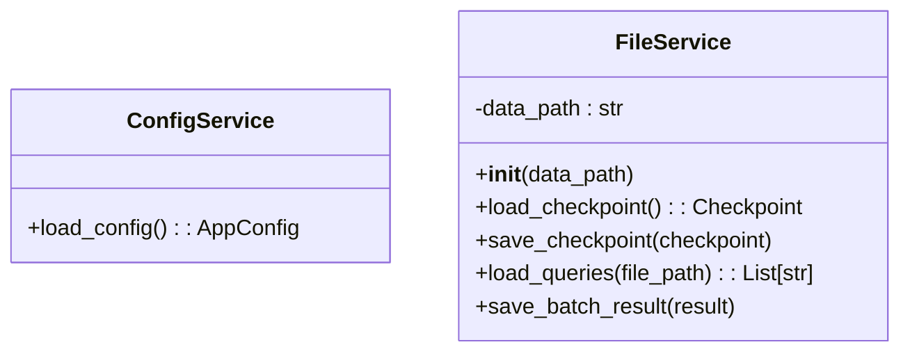
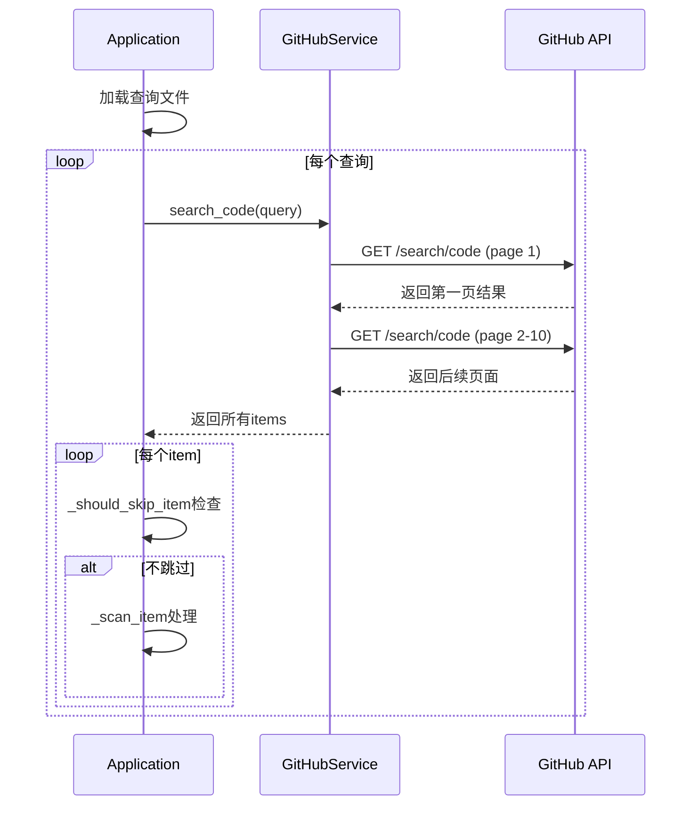
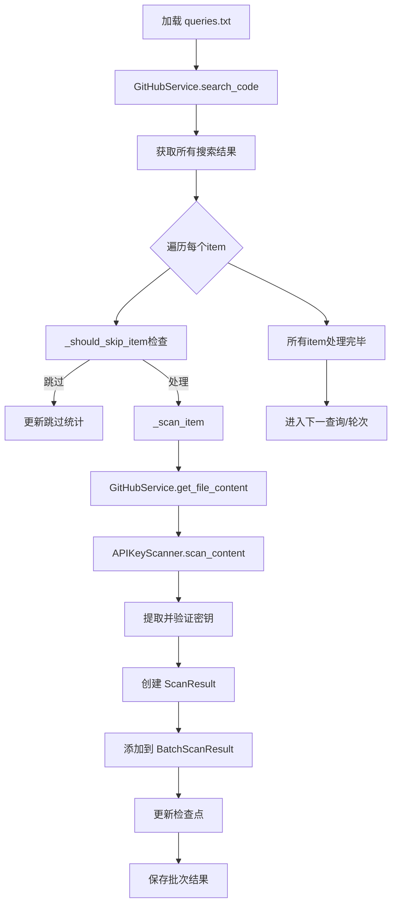
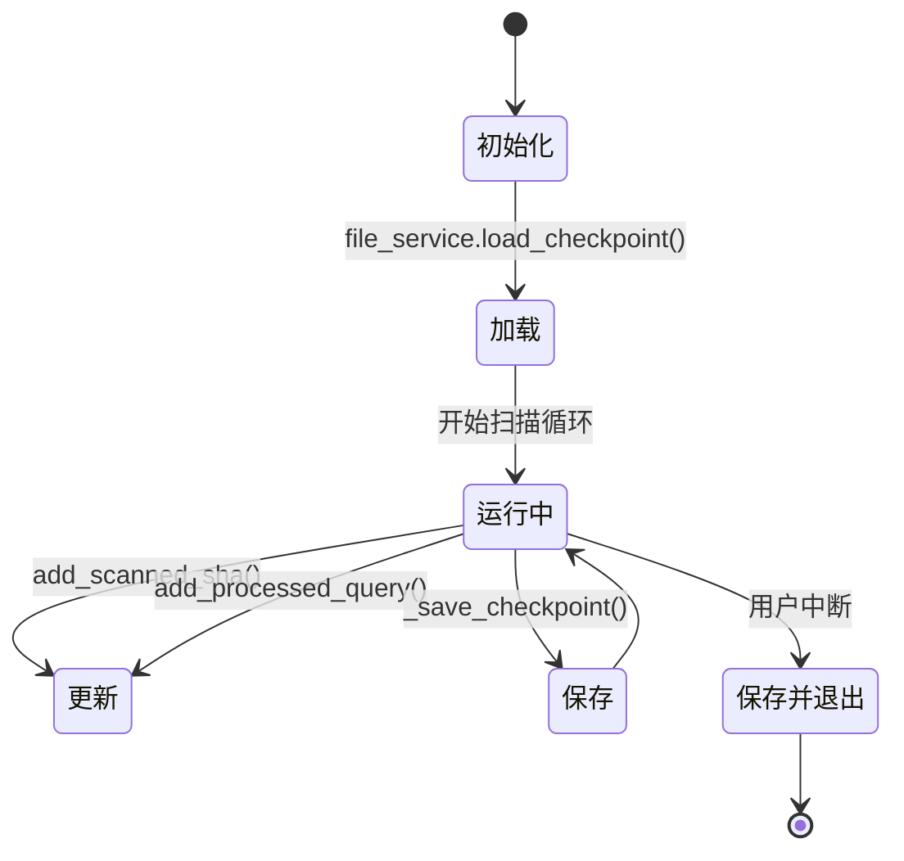

# 核心功能详解

<cite>
**本文档中引用的文件**  
- [main.py](file://src\main.py) - *重构后的新主程序入口*
- [scanner.py](file://src\core\scanner.py) - *核心扫描器实现*
- [github_service.py](file://src\services\github_service.py) - *GitHub API服务封装*
- [config_service.py](file://src\services\config_service.py) - *配置管理服务*
- [file_service.py](file://src\services\file_service.py) - *文件与检查点管理*
- [gemini.py](file://src\extractors\gemini.py) - *Gemini密钥提取器*
- [modelscope.py](file://src\extractors\modelscope.py) - *ModelScope密钥提取器*
- [openrouter.py](file://src\extractors\openrouter.py) - *OpenRouter密钥提取器*
- [gemini.yaml](file://config\extractors\gemini.yaml) - *Gemini提取配置*
- [modelscope.yaml](file://config\extractors\modelscope.yaml) - *ModelScope提取配置*
- [openrouter.yaml](file://config\extractors\openrouter.yaml) - *OpenRouter提取配置*
</cite>

## 更新摘要
**已做更改**   
- 全面重构文档以反映项目结构变更，旧文件 `hajimi_king.py`、`github_client.py`、`file_manager.py` 已移除
- 新增 `src` 目录下模块化组件说明，包括 `main.py`、`core/scanner.py` 和 `services/` 系列服务
- 更新“核心组件解析”章节，替换为基于 `Application` 类和 `APIKeyScanner` 的新架构
- 重写“密钥搜索流程”，基于 `GitHubService.search_code()` 方法实现多页结果处理与重试机制
- 更新“密钥提取机制”，说明提取器（Extractor）与验证器（Validator）的插件式架构
- 重构“扫描管理与增量扫描”，基于 `Checkpoint` 和 `FileService` 实现状态管理
- 更新“数据流与状态管理”，反映从查询加载到结果保存的完整新流程
- 移除过时的 `Logger.py` 相关内容，更新为 `utils.logger` 模块的使用
- 所有文件路径和引用均已更新为新项目结构

## 目录
1. [项目结构分析](#项目结构分析)
2. [核心组件解析](#核心组件解析)
3. [密钥搜索流程](#密钥搜索流程)
4. [密钥提取机制](#密钥提取机制)
5. [扫描管理与增量扫描](#扫描管理与增量扫描)
6. [数据流与状态管理](#数据流与状态管理)
7. [错误处理与性能优化](#错误处理与性能优化)

## 项目结构分析

项目已完成模块化重构，采用清晰的分层架构，主要功能模块位于 `src` 目录下：

- **src/core**: 核心扫描逻辑，包含 `scanner.py`
- **src/extractors**: 各类密钥提取器实现
- **src/models**: 数据模型定义，如 `Config`、`Checkpoint`
- **src/services**: 服务层，封装GitHub、文件、配置等操作
- **src/utils**: 工具模块，如日志
- **config**: 配置文件，分离提取器、查询等配置
- **scripts**: 启动脚本



**图示来源**
- [main.py](file://src\main.py)
- [scanner.py](file://src\core\scanner.py)
- [github_service.py](file://src\services\github_service.py)
- [file_service.py](file://src\services\file_service.py)
- [config_service.py](file://src\services\config_service.py)

**本节来源**
- [main.py](file://src\main.py)
- [repository_catalogue](#repository_catalogue)

## 核心组件解析

### 主控制器：main.py

`main.py` 是系统的新入口点，`Application` 类负责协调所有组件。



**图示来源**
- [main.py](file://src\main.py#L15-L452)

**本节来源**
- [main.py](file://src\main.py#L15-L452)

### 核心扫描器：scanner.py

`APIKeyScanner` 类协调所有提取器和验证器，实现密钥扫描的核心逻辑。



**图示来源**
- [scanner.py](file://src\core\scanner.py#L1-L79)

**本节来源**
- [scanner.py](file://src\core\scanner.py#L1-L79)

### GitHub服务：github_service.py

`GitHubService` 封装了与GitHub API的交互，支持多令牌轮换和代理。



**图示来源**
- [github_service.py](file://src\services\github_service.py#L1-L256)

**本节来源**
- [github_service.py](file://src\services\github_service.py#L1-L256)

### 配置与文件服务

`ConfigService` 负责加载 `config/` 目录下的YAML配置，`FileService` 管理检查点和查询文件。



**图示来源**
- [config_service.py](file://src\services\config_service.py)
- [file_service.py](file://src\services\file_service.py)

**本节来源**
- [config_service.py](file://src\services\config_service.py)
- [file_service.py](file://src\services\file_service.py)

## 密钥搜索流程

搜索流程由 `Application.run()` 驱动，通过 `GitHubService.search_code()` 发起分页请求。



**图示来源**
- [main.py](file://src\main.py#L200-L350)
- [github_service.py](file://src\services\github_service.py#L50-L200)

**本节来源**
- [main.py](file://src\main.py#L200-L350)
- [github_service.py](file://src\services\github_service.py#L50-L200)

## 密钥提取机制

### 提取器架构

系统采用插件式提取器架构，`GeminiExtractor`、`ModelScopeExtractor`、`OpenRouterExtractor` 均继承自 `BaseExtractor`。

```python
class ModelScopeExtractor(BaseExtractor):
    def should_process(self, content: str, context: dict) -> bool:
        # 检查是否包含目标base_url
        return any(base_url in content for base_url in self.config.base_urls)
    
    def extract(self, content: str, context: dict) -> ExtractionResult:
        # 使用正则表达式提取
        pattern = self._get_pattern()
        keys = re.findall(pattern, content)
        # 上下文验证
        valid_keys = [k for k in keys if self._is_valid_context(k, content)]
        return ExtractionResult(keys=valid_keys, metadata={"extractor": "modelscope"})
```

**本节来源**
- [modelscope.py](file://src\extractors\modelscope.py)
- [patterns.py](file://src\utils\patterns.py)

### 验证器实现

验证器负责验证提取出的密钥有效性，如 `GeminiValidator` 使用 `google-generativeai` 库进行测试。

```python
class GeminiValidator(BaseValidator):
    def validate(self, key: str, context: dict) -> ValidationResult:
        try:
            genai.configure(api_key=key)
            model = genai.GenerativeModel('gemini-pro')
            model.generate_content("hello")
            return ValidationResult(is_valid=True, status="ok")
        except Exception as e:
            return ValidationResult(is_valid=False, status="error", error_message=str(e))
```

**本节来源**
- [gemini.py](file://src\validators\gemini.py)
- [openrouter.py](file://src\validators\openrouter.py)

## 扫描管理与增量扫描

### 跳过策略

系统通过 `_should_skip_item()` 实现跳过策略，主要基于SHA和文件路径黑名单。

```python
def _should_skip_item(self, item: Dict[str, Any]) -> bool:
    # SHA重复过滤
    if item.get("sha") in self.checkpoint.scanned_shas:
        self.skip_stats["sha_duplicate"] += 1
        return True
        
    # 文件路径黑名单过滤
    file_path = item.get("path", "").lower()
    if any(blocked in file_path for blocked in self.config.scan.file_path_blacklist):
        self.skip_stats["doc_filter"] += 1
        return True
        
    return False
```

### 多令牌轮换策略

`GitHubService` 实现了令牌轮换，避免速率限制。

```python
def _get_next_token(self) -> Optional[str]:
    if not self.tokens:
        return None
    token = self.tokens[self._token_ptr % len(self.tokens)]
    self._token_ptr += 1
    return token.strip()
```

**本节来源**
- [main.py](file://src\main.py#L350-L370)
- [github_service.py](file://src\services\github_service.py#L30-L40)

## 数据流与状态管理

### 数据流路径

从查询执行到结果存储的完整数据流：



**图示来源**
- [main.py](file://src\main.py#L200-L400)

**本节来源**
- [main.py](file://src\main.py#L200-L400)

### Checkpoint状态管理

`Checkpoint` 对象通过 `FileService` 进行持久化。



**图示来源**
- [file_service.py](file://src\services\file_service.py#L50-L100)
- [main.py](file://src\main.py#L380-L390)

**本节来源**
- [file_service.py](file://src\services\file_service.py#L50-L100)

## 错误处理与性能优化

### 错误处理机制

`GitHubService.search_code()` 实现了重试机制，处理HTTP 403/429错误。

```python
for attempt in range(1, max_retries + 1):
    try:
        response = requests.get(...)
        response.raise_for_status()
        break
    except requests.exceptions.HTTPError as e:
        if status in (403, 429):
            wait = min(2 ** attempt + random.uniform(0, 1), 120)
            time.sleep(wait)
            continue
```

### 性能优化措施

1. **分页处理**: 最多获取10页（1000条）搜索结果
2. **随机延迟**: 在页面间添加0.5-1.5秒延迟
3. **多令牌轮换**: 分散请求到多个令牌
4. **代理支持**: 可配置HTTP/HTTPS代理
5. **增量扫描**: 基于 `Checkpoint` 避免重复扫描
6. **文件过滤**: 排除 `test`、`example` 等目录

**本节来源**
- [github_service.py](file://src\services\github_service.py#L100-L200)
- [main.py](file://src\main.py#L350-L370)
- [utils\logger.py](file://src\utils\logger.py)