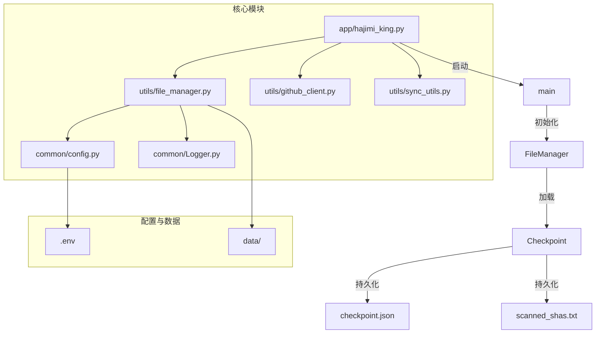
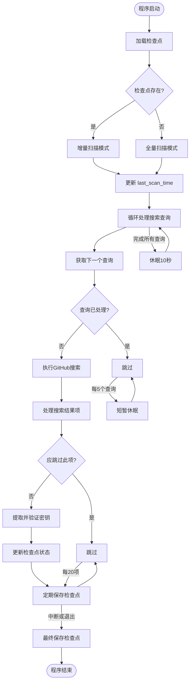
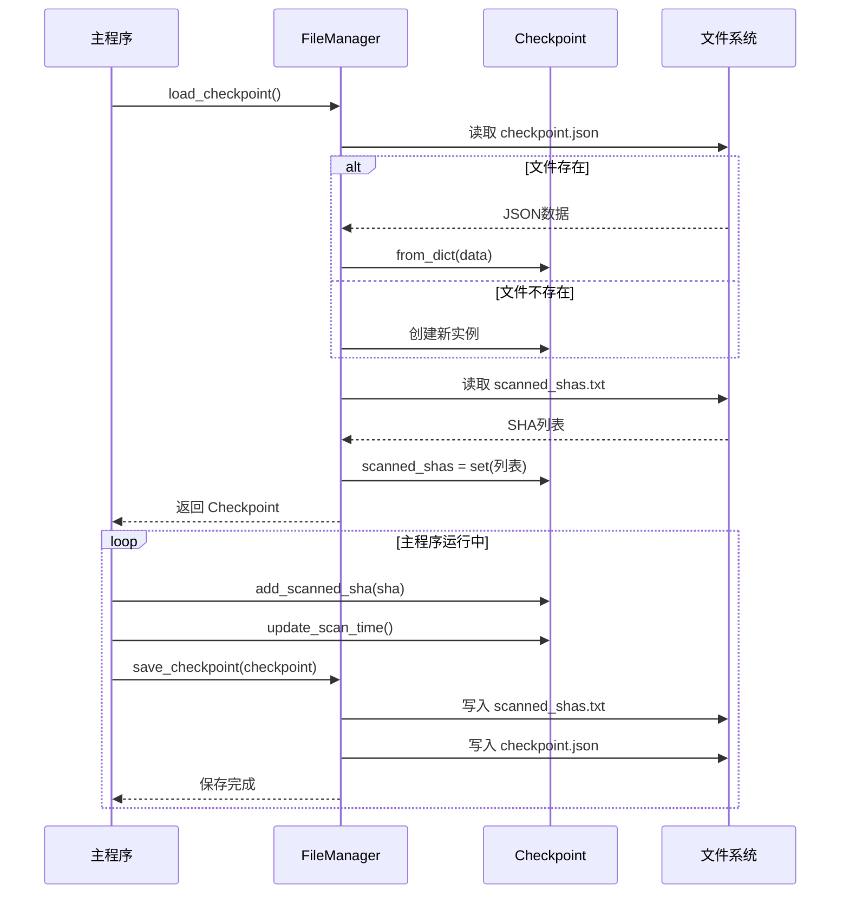

# 检查点持久化与断点续传

<cite>
**本文档中引用的文件**  
- [file_manager.py](file://utils/file_manager.py)
- [config.py](file://common/config.py)
- [hajimi_king.py](file://app/hajimi_king.py)
- [sync_utils.py](file://utils/sync_utils.py)
</cite>

## 目录
1. [简介](#简介)  
2. [项目结构分析](#项目结构分析)  
3. [核心组件分析](#核心组件分析)  
4. [检查点类设计与数据结构](#检查点类设计与数据结构)  
5. [检查点的加载与保存机制](#检查点的加载与保存机制)  
6. [断点续传与增量扫描协同机制](#断点续传与增量扫描协同机制)  
7. [并发访问控制与文件锁策略](#并发访问控制与文件锁策略)  
8. [扩展建议与优化方向](#扩展建议与优化方向)  
9. [附录：关键流程图](#附录关键流程图)

## 简介

本项目是一个用于在GitHub上搜索API密钥（如Gemini、ModelScope等）的自动化工具，具备密钥提取、验证、持久化存储和同步到外部负载均衡器的功能。其核心机制之一是**检查点（Checkpoint）持久化系统**，该机制确保长时间运行的任务在中断后能够从上次执行的位置恢复，实现“断点续传”。

通过`file_manager.py`中的`Checkpoint`类和`FileManager`类，系统实现了对扫描状态的完整记录，包括最后扫描时间、已处理的仓库、已扫描的文件哈希（SHA）等。这些状态信息被序列化并保存至本地文件系统，从而支持任务的中断与恢复。

本文档将深入剖析该检查点机制的设计原理、实现细节、协同工作方式以及潜在的优化方向。

## 项目结构分析

项目采用模块化设计，主要分为以下几个目录：

- `app/`：主应用入口，包含核心逻辑`hajimi_king.py`
- `common/`：通用组件，如日志`Logger.py`和配置`config.py`
- `scripts/`：脚本文件，如`dry_run.py`
- `utils/`：工具模块，包含文件管理、GitHub客户端、同步工具等
- 根目录：包含配置文件、Docker配置、部署脚本等

其中，检查点机制的核心实现在`utils/file_manager.py`中，依赖于`common/config.py`中的路径配置，并由`app/hajimi_king.py`主程序调用。



**图示来源**  
- [file_manager.py](file://utils/file_manager.py#L1-L493)
- [config.py](file://common/config.py#L1-L204)
- [hajimi_king.py](file://app/hajimi_king.py#L1-L524)

## 核心组件分析

### Checkpoint 类

`Checkpoint` 类是整个持久化机制的核心数据结构，使用 Python 的 `dataclass` 实现，定义了任务运行时需要持久化的所有状态。

#### 数据字段说明

- **last_scan_time**：`str` 类型，记录最后一次扫描的时间戳（ISO格式），用于增量扫描的时间过滤。
- **scanned_shas**：`Set[str]` 类型，存储已扫描文件的SHA哈希值，避免重复处理。
- **processed_queries**：`Set[str]` 类型，记录已处理的搜索查询语句，防止重复查询。
- **wait_send_balancer**：`Set[str]` 类型，待发送至Gemini负载均衡器的密钥队列。
- **wait_send_gpt_load**：`Set[str]` 类型，待发送至GPT Load负载均衡器的密钥队列。

#### 序列化与反序列化

由于 `Set` 类型无法直接被 JSON 序列化，`Checkpoint` 类实现了 `to_dict()` 和 `from_dict()` 方法进行转换：

```python
def to_dict(self) -> Dict[str, Any]:
    return {
        "last_scan_time": self.last_scan_time,
        "processed_queries": list(self.processed_queries),
        "wait_send_balancer": list(self.wait_send_balancer),
        "wait_send_gpt_load": list(self.wait_send_gpt_load)
    }
```

注意：`scanned_shas` 被单独存储在 `scanned_shas.txt` 文件中，以避免主检查点文件过大。

**本节来源**  
- [file_manager.py](file://utils/file_manager.py#L6-L35)

### FileManager 类

`FileManager` 是文件操作的统一入口，负责检查点的加载、保存、文件名管理等。

#### 初始化流程

1. 设置数据目录和检查点文件路径
2. 创建数据目录（如不存在）
3. 加载搜索查询列表
4. 初始化动态文件名（按日期生成）
5. 创建必要的日志和输出文件

#### 检查点操作方法

- `load_checkpoint()`：从 `checkpoint.json` 和 `scanned_shas.txt` 加载完整状态
- `save_checkpoint()`：先保存 `scanned_shas` 到独立文件，再保存其余状态到 `checkpoint.json`
- `load_scanned_shas()` / `save_scanned_shas()`：专门处理SHA集合的I/O

```mermaid
classDiagram
class Checkpoint {
+str last_scan_time
+Set[str] scanned_shas
+Set[str] processed_queries
+Set[str] wait_send_balancer
+Set[str] wait_send_gpt_load
+to_dict() Dict[str, Any]
+from_dict(data) Checkpoint
+add_scanned_sha(sha)
+add_processed_query(query)
+update_scan_time()
}
class FileManager {
-str data_dir
-str checkpoint_file
-str scanned_shas_file
+load_checkpoint() Checkpoint
+save_checkpoint(checkpoint)
+load_scanned_shas() Set[str]
+save_scanned_shas(shas)
+load_search_queries(path) List[str]
+save_valid_keys(...)
+update_dynamic_filenames()
}
Checkpoint <-- FileManager : "被使用"
FileManager --> "checkpoint.json" : 读写
FileManager --> "scanned_shas.txt" : 读写
```

**图示来源**  
- [file_manager.py](file://utils/file_manager.py#L37-L493)

## 检查点类设计与数据结构

`Checkpoint` 类的设计体现了**关注点分离**和**性能优化**的思想。

### 分离存储策略

将 `scanned_shas` 单独存储在 `scanned_shas.txt` 文件中，主要原因如下：

1. **性能考虑**：`scanned_shas` 集合可能非常大（成千上万个SHA），频繁读写整个JSON文件会导致I/O性能瓶颈。
2. **增量更新**：系统提供了 `append_scanned_sha()` 方法，允许以追加模式高效地写入单个SHA，而无需重写整个文件。
3. **可读性**：`scanned_shas.txt` 是纯文本文件，便于人工查看和调试。

### 数据结构选择

- **Set（集合）**：用于 `scanned_shas`、`processed_queries` 等字段，确保元素唯一性，避免重复处理。
- **Optional[str]**：`last_scan_time` 使用可选字符串，便于判断是否为首次运行（全量扫描）。

### 时间戳管理

`update_scan_time()` 方法使用 `datetime.utcnow().isoformat()` 生成UTC时间戳，保证时间记录的准确性和一致性，避免本地时区带来的混乱。

```python
def update_scan_time(self) -> None:
    self.last_scan_time = datetime.utcnow().isoformat()
```

**本节来源**  
- [file_manager.py](file://utils/file_manager.py#L6-L35)

## 检查点的加载与保存机制

### 加载流程

1. **初始化**：`FileManager` 在构造时调用 `load_checkpoint()`。
2. **主检查点**：尝试从 `checkpoint.json` 读取基础状态（`last_scan_time` 等）。
3. **SHA集合**：调用 `load_scanned_shas()` 从 `scanned_shas.txt` 逐行读取并构建集合。
4. **合并状态**：将加载的SHA集合赋值给 `Checkpoint` 实例。

```python
def load_checkpoint(self) -> Checkpoint:
    checkpoint = Checkpoint()
    if os.path.exists(self.checkpoint_file):
        with open(self.checkpoint_file, "r") as f:
            data = json.load(f)
            checkpoint = Checkpoint.from_dict(data)
    checkpoint.scanned_shas = self.load_scanned_shas()
    return checkpoint
```

### 保存流程

1. **原子性操作**：每次保存都先写入 `scanned_shas.txt`，再写入 `checkpoint.json`。
2. **触发时机**：
   - 每处理20个文件后自动保存
   - 每完成一个搜索查询后保存
   - 程序被中断（`KeyboardInterrupt`）时保存
   - 程序正常退出前保存

```python
def save_checkpoint(self, checkpoint: Checkpoint) -> None:
    self.save_scanned_shas(checkpoint.scanned_shas)
    with open(self.checkpoint_file, "w", encoding="utf-8") as f:
        json.dump(checkpoint.to_dict(), f, ensure_ascii=False, indent=2)
```

### 错误处理

- **加载失败**：如果文件不存在或读取失败，会创建一个新的空 `Checkpoint` 并记录警告日志。
- **保存失败**：捕获异常并记录错误日志，但不会中断主程序流程，保证系统健壮性。

**本节来源**  
- [file_manager.py](file://utils/file_manager.py#L173-L218)

## 断点续传与增量扫描协同机制

检查点机制与主程序的增量扫描逻辑紧密结合，共同实现高效的断点续传。

### 增量扫描逻辑

在 `hajimi_king.py` 的 `should_skip_item()` 函数中，利用检查点状态进行过滤：

```python
def should_skip_item(item: Dict[str, Any], checkpoint: Checkpoint) -> tuple[bool, str]:
    # 1. 时间过滤：仓库最后推送时间早于上次扫描时间
    if checkpoint.last_scan_time:
        repo_pushed_dt = ... 
        if repo_pushed_dt <= last_scan_dt:
            return True, "time_filter"

    # 2. SHA过滤：文件已扫描过
    if item.get("sha") in checkpoint.scanned_shas:
        return True, "sha_duplicate"

    # 3. 年龄过滤：仓库太老
    if repo_pushed_dt < datetime.utcnow() - timedelta(days=Config.DATE_RANGE_DAYS):
        return True, "age_filter"

    # 4. 路径过滤：文档、示例文件等
    if any(token in lowercase_path for token in Config.FILE_PATH_BLACKLIST):
        return True, "doc_filter"

    return False, ""
```

### 协同工作流程



**图示来源**  
- [hajimi_king.py](file://app/hajimi_king.py#L171-L524)
- [file_manager.py](file://utils/file_manager.py#L173-L218)

## 并发访问控制与文件锁策略

尽管当前实现未使用显式的文件锁（如 `fcntl`），但通过以下策略确保了数据一致性：

### 内存状态与文件同步

- **单一进程**：整个应用是单进程运行，`checkpoint` 对象在内存中是唯一的。
- **串行化访问**：所有对 `checkpoint` 的修改都发生在主线程，`FileManager.save_checkpoint()` 是串行调用的。

### 异步同步的并发控制

`sync_utils.py` 中的 `SyncUtils` 类使用线程池异步发送密钥，为避免与主线程同时写入检查点，采用了**锁机制**：

```python
class SyncUtils:
    def __init__(self):
        self.saving_checkpoint = False  # 锁标志

    def add_keys_to_queue(self, keys):
        while self.saving_checkpoint:  # 等待
            time.sleep(0.5)
        self.saving_checkpoint = True
        try:
            # 更新 checkpoint.wait_send_balancer
            checkpoint.wait_send_balancer.update(keys)
            file_manager.save_checkpoint(checkpoint)
        finally:
            self.saving_checkpoint = False

    def _batch_send_worker(self):
        while self.saving_checkpoint:
            time.sleep(0.5)
        self.saving_checkpoint = True
        try:
            # 发送密钥并清空队列
            balancer_keys = list(checkpoint.wait_send_balancer)
            # ... 发送逻辑 ...
            checkpoint.wait_send_balancer.clear()
            file_manager.save_checkpoint(checkpoint)
        finally:
            self.saving_checkpoint = False
```

这种基于布尔标志的简单锁机制，有效防止了主线程和异步线程同时修改和保存检查点，避免了数据竞争。

**本节来源**  
- [sync_utils.py](file://utils/sync_utils.py#L1-L485)
- [file_manager.py](file://utils/file_manager.py#L173-L218)

## 扩展建议与优化方向

### 支持数据库后端

当前检查点存储依赖文件系统，可扩展为支持数据库（如SQLite、Redis）：

- **优势**：
  - 更好的并发支持
  - 更快的查询速度（如查找特定SHA）
  - 易于实现分布式部署
- **实现**：
  - 抽象出 `CheckpointStorage` 接口
  - 提供 `FileCheckpointStorage` 和 `SQLiteCheckpointStorage` 实现
  - 通过配置切换后端

### 支持云存储

将检查点文件同步到云存储（如S3、Google Cloud Storage）：

- **优势**：
  - 实现跨机器的检查点共享
  - 防止本地数据丢失
  - 便于在Kubernetes等环境中部署
- **实现**：
  - 使用 `boto3` 或 `google-cloud-storage` SDK
  - 在 `save_checkpoint()` 后自动上传
  - 在 `load_checkpoint()` 前尝试从云端下载

### 增量压缩与归档

对于长期运行的实例，`scanned_shas.txt` 文件可能变得巨大：

- **建议**：
  - 定期将旧的SHA记录归档并压缩
  - 使用布隆过滤器（Bloom Filter）替代部分SHA集合，以节省内存和磁盘空间
  - 实现SHA集合的分片存储

### 增强的错误恢复

- **检查点校验**：在加载时计算文件哈希或使用校验和，确保文件未被损坏。
- **多副本**：保存检查点时同时写入多个副本，提高容错能力。

**本节来源**  
- [file_manager.py](file://utils/file_manager.py#L173-L218)
- [config.py](file://common/config.py#L1-L204)

## 附录：关键流程图

### 检查点加载与保存完整流程



**图示来源**  
- [file_manager.py](file://utils/file_manager.py#L173-L218)
- [hajimi_king.py](file://app/hajimi_king.py#L470-L494)