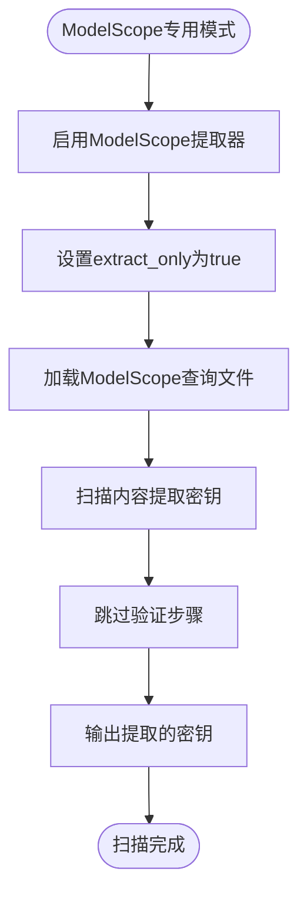

# 模式切换指南

<cite>
**本文档中引用的文件**
- [MODE_SWITCHING_GUIDE.md](file://MODE_SWITCHING_GUIDE.md)
- [main.py](file://src/main.py)
- [default.yaml](file://config/default.yaml)
- [gemini.yaml](file://config/extractors/gemini.yaml)
- [openrouter.yaml](file://config/extractors/openrouter.yaml)
- [modelscope.yaml](file://config/extractors/modelscope.yaml)
- [scanner.py](file://src/core/scanner.py)
</cite>

## 目录
1. [简介](#简介)
2. [兼容模式](#兼容模式)
3. [Gemini专用模式](#gemini专用模式)
4. [OpenRouter专用模式](#openrouter专用模式)
5. [ModelScope专用模式](#modelscope专用模式)
6. [模式切换方式](#模式切换方式)
7. [配置差异对比](#配置差异对比)
8. [验证功能说明](#验证功能说明)
9. [使用建议与最佳实践](#使用建议与最佳实践)

## 简介
本指南详细说明了APIKEY-king项目中四种扫描模式的使用方法和配置差异，包括兼容模式、Gemini专用模式、OpenRouter专用模式和ModelScope专用模式。每种模式针对不同类型的API密钥进行优化，支持灵活切换以满足不同的扫描需求。

**Section sources**
- [MODE_SWITCHING_GUIDE.md](file://MODE_SWITCHING_GUIDE.md#L1-L189)

## 兼容模式
兼容模式（`compatible`）是默认的全类型扫描模式，能够同时检测和验证所有支持的API密钥类型。该模式适用于需要全面覆盖的场景，确保不会遗漏任何潜在的密钥泄露。

在兼容模式下，系统会启用所有提取器和验证器，并使用通用查询文件进行扫描。此模式适合初次使用或不确定目标密钥类型的用户。


**Diagram sources**
- [main.py](file://src/main.py#L150-L180)
- [default.yaml](file://config/default.yaml#L1-L18)

**Section sources**
- [main.py](file://src/main.py#L150-L180)
- [default.yaml](file://config/default.yaml#L1-L18)

## Gemini专用模式
Gemini专用模式（`gemini-only`）专注于检测和验证Google AI平台的Gemini API密钥（格式：AIzaSy*）。该模式通过启用Gemini专用的提取器和验证器，提高扫描效率和准确性。

在Gemini专用模式下，系统仅启用Gemini相关的组件，并使用专门的查询文件`gemini.txt`进行搜索。此模式适合明确需要查找Gemini密钥的场景。


**Diagram sources**
- [gemini.yaml](file://config/extractors/gemini.yaml#L1-L17)
- [main.py](file://src/main.py#L120-L135)

**Section sources**
- [gemini.yaml](file://config/extractors/gemini.yaml#L1-L17)
- [main.py](file://src/main.py#L120-L135)

## OpenRouter专用模式
OpenRouter专用模式（`openrouter-only`）专门用于检测和验证OpenRouter平台的API密钥（格式：sk-or-v1-*）。该模式通过限制扫描范围，提高对特定密钥类型的检测效率。

在OpenRouter专用模式下，系统仅启用OpenRouter相关的提取器和验证器，并使用`openrouter.txt`作为查询文件。此模式适合专注于OpenRouter平台的安全审计。


**Diagram sources**
- [openrouter.yaml](file://config/extractors/openrouter.yaml#L1-L20)
- [main.py](file://src/main.py#L90-L119)

**Section sources**
- [openrouter.yaml](file://config/extractors/openrouter.yaml#L1-L20)
- [main.py](file://src/main.py#L90-L119)

## ModelScope专用模式
ModelScope专用模式（`modelscope-only`）针对阿里云ModelScope平台的API密钥（格式：ms-UUID）进行扫描。与其他模式不同，ModelScope密钥目前仅支持提取，不支持实时验证。

在ModelScope专用模式下，系统启用ModelScope提取器，并设置`extract_only: true`，同时使用专门的查询文件`modelscope.txt`。此模式适合需要快速发现ModelScope密钥的场景。



**Diagram sources**
- [modelscope.yaml](file://config/extractors/modelscope.yaml#L1-L20)
- [main.py](file://src/main.py#L136-L149)

**Section sources**
- [modelscope.yaml](file://config/extractors/modelscope.yaml#L1-L20)
- [main.py](file://src/main.py#L136-L149)

## 模式切换方式
用户可以通过多种方式快速切换扫描模式，满足不同使用习惯的需求。

### 命令行直接切换
```bash
# 兼容模式（默认）
python -m src.main --mode compatible

# Gemini专用模式
python -m src.main --mode gemini-only

# OpenRouter专用模式
python -m src.main --mode openrouter-only

# ModelScope专用模式
python -m src.main --mode modelscope-only
```

### 快捷脚本切换
```bash
# Python快捷脚本
python scripts/quick_launch.py gemini
python scripts/quick_launch.py openrouter
python scripts/quick_launch.py modelscope
python scripts/quick_launch.py all

# Shell脚本（Linux/Mac）
./scripts/quick_scan.sh gm
./scripts/quick_scan.sh or
./scripts/quick_scan.sh ms
./scripts/quick_scan.sh all

# Windows批处理
scripts\quick_scan.bat gm
scripts\quick_scan.bat or
scripts\quick_scan.bat ms
scripts\quick_scan.bat all
```

### 预设配置文件切换
```bash
# 复制Gemini专用配置
cp config/presets/gemini-only.env .env

# 复制OpenRouter专用配置
cp config/presets/openrouter-only.env .env

# 复制ModelScope专用配置
cp config/presets/modelscope-only.env .env

# 复制兼容模式配置
cp config/presets/compatible.env .env
```

**Section sources**
- [MODE_SWITCHING_GUIDE.md](file://MODE_SWITCHING_GUIDE.md#L20-L100)
- [main.py](file://src/main.py#L400-L450)

## 配置差异对比
不同模式之间的主要配置差异体现在提取器、验证器和查询文件三个方面。


**Diagram sources**
- [main.py](file://src/main.py#L90-L180)
- [config/default.yaml](file://config/default.yaml#L1-L18)

**Section sources**
- [main.py](file://src/main.py#L90-L180)
- [config/default.yaml](file://config/default.yaml#L1-L18)

## 验证功能说明
不同模式的验证功能存在差异，主要取决于各平台API的可用性和验证策略。

| 模式 | 提取功能 | 验证功能 | 验证方式 | 配置参数 |
|------|--------|--------|--------|--------|
| `gemini-only` | ✅ | ✅ | Google AI API | `extract_only: false` |
| `openrouter-only` | ✅ | ✅ | OpenRouter API | `extract_only: false` |
| `modelscope-only` | ✅ | ❌ | 仅提取 | `extract_only: true` |
| `compatible` | ✅ | ✅ | 多平台验证 | `extract_only: false` |

验证功能的优势包括：
- **实时验证**：发现密钥后立即验证有效性
- **智能判断**：区分密钥无效、频率限制、网络问题等
- **成本优化**：使用免费或低成本模型验证
- **详细报告**：提供验证状态、使用模型、消耗代币等信息


**Diagram sources**
- [scanner.py](file://src/core/scanner.py#L20-L78)
- [main.py](file://src/main.py#L200-L300)

**Section sources**
- [scanner.py](file://src/core/scanner.py#L20-L78)
- [main.py](file://src/main.py#L200-L300)

## 使用建议与最佳实践
根据不同的使用场景，推荐以下最佳实践：

### 针对性扫描（推荐）
当明确知道要查找的密钥类型时，使用专用模式效率更高：
```bash
# 专注查找Gemini密钥
python -m src.main --mode gemini-only

# 专注查找OpenRouter密钥
python scripts/quick_launch.py openrouter
```

### 全面扫描
当需要全覆盖或不确定目标密钥类型时，使用兼容模式：
```bash
# 扫描所有类型密钥
python -m src.main --mode compatible
```

### 自动化扫描
结合快捷脚本实现自动化扫描流程：
```bash
# 每日扫描计划
./scripts/quick_scan.sh gm  # 上午扫描Gemini
./scripts/quick_scan.sh or  # 下午扫描OpenRouter
python -m src.main --mode compatible  # 晚上全面扫描
```

### 配置管理
使用预设配置文件管理不同模式的设置：
- `gemini-only.env`：Gemini专用配置
- `openrouter-only.env`：OpenRouter专用配置
- `modelscope-only.env`：ModelScope专用配置
- `compatible.env`：兼容模式配置

**Section sources**
- [MODE_SWITCHING_GUIDE.md](file://MODE_SWITCHING_GUIDE.md#L150-L189)
- [main.py](file://src/main.py#L400-L450)