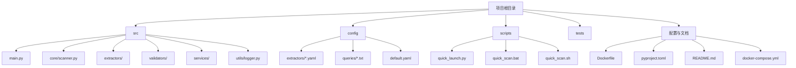
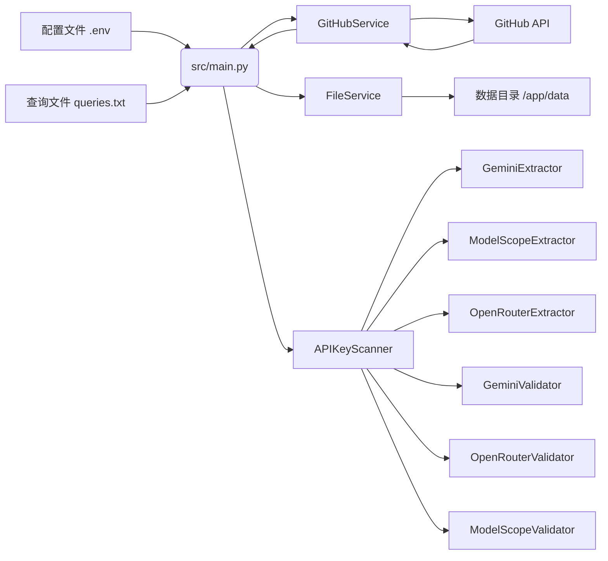
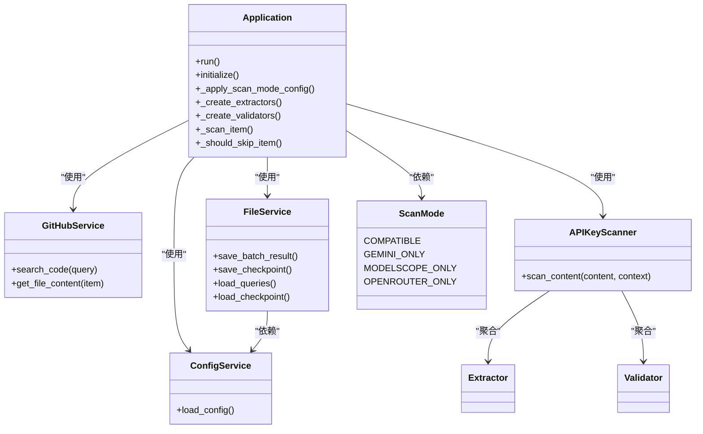
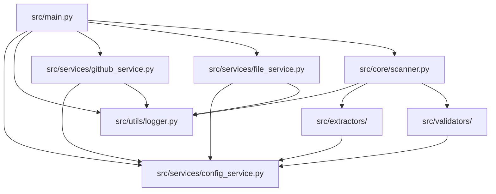

# Docker容器化部署

<cite>
**本文档引用的文件**   
- [Dockerfile](file://Dockerfile) - *在提交fcb6fef0中更新*
- [docker-compose.yml](file://docker-compose.yml) - *在提交fcb6fef0中更新*
- [src/main.py](file://src/main.py) - *主程序入口，重构后*
- [pyproject.toml](file://pyproject.toml) - *依赖管理配置*
- [config/queries/gemini.txt](file://config/queries/gemini.txt)
- [config/queries/modelscope.txt](file://config/queries/modelscope.txt)
- [config/queries/openrouter.txt](file://config/queries/openrouter.txt)
- [config/default.yaml](file://config/default.yaml)
</cite>

## 更新摘要
**已做更改**   
- 全面重构Docker构建流程，更新基础镜像为`python:3.11-slim`
- 替换包管理器从Poetry为`uv`，优化依赖安装速度
- 重写`CMD`指令，调用`src.main`模块并支持多种扫描模式
- 更新`docker-compose.yml`以支持多模式服务配置
- 移除过时文件路径引用（如`app/hajimi_king.py`），替换为新结构`src/main.py`
- 删除旧版Mermaid图示中不准确的组件关系
- 新增对`scan_mode`配置机制的说明

## 目录
1. [简介](#简介)
2. [项目结构](#项目结构)
3. [核心组件](#核心组件)
4. [架构概述](#架构概述)
5. [详细组件分析](#详细组件分析)
6. [依赖分析](#依赖分析)
7. [性能考量](#性能考量)
8. [故障排除指南](#故障排除指南)
9. [结论](#结论)

## 简介
本项目是一个名为“Hajimi King”的自动化工具，旨在通过GitHub代码搜索发现并验证Google Gemini、ModelScope和OpenRouter API密钥。系统采用模块化设计，支持Docker容器化部署，具备增量扫描、智能过滤、代理轮换和外部同步等高级功能。项目使用Python 3.11构建，通过`uv`包管理器安装依赖，利用GitHub API进行代码搜索，并通过可配置的同步机制将有效密钥发送至外部服务。本技术文档将深入解析其Docker构建过程、系统架构和核心功能实现。

## 项目结构
项目采用清晰的分层目录结构，将不同功能模块分离，便于维护和扩展。

**Diagram sources**
- [Dockerfile](file://Dockerfile)
- [docker-compose.yml](file://docker-compose.yml)
- [README.md](file://README.md)

**本文档引用的文件**
- [Dockerfile](file://Dockerfile)
- [docker-compose.yml](file://docker-compose.yml)
- [README.md](file://README.md)

## 核心组件
项目的核心功能由多个协同工作的Python模块构成。主程序`src/main.py`负责协调整个工作流，从`services`包中导入配置服务，利用`GitHubService`执行搜索，`FileService`管理数据持久化，并通过`APIKeyScanner`集成提取与验证逻辑。系统采用命令行参数和环境变量双重配置机制，支持灵活的部署模式，如仅ModelScope模式或兼容模式。其核心逻辑包括查询规范化、密钥提取、验证和结果保存，形成了一个完整的闭环。

**本文档引用的文件**
- [src/main.py](file://src/main.py)
- [src/services/config_service.py](file://src/services/config_service.py)
- [src/services/github_service.py](file://src/services/github_service.py)
- [src/services/file_service.py](file://src/services/file_service.py)
- [src/core/scanner.py](file://src/core/scanner.py)

## 架构概述
系统采用微内核架构，`src/main.py`作为主控制器，协调各个独立的服务模块。配置管理、日志记录、GitHub API交互、文件系统操作和密钥验证被设计为独立的、高内聚低耦合的组件。这种设计使得系统易于测试、维护和扩展。数据流始于配置加载和查询读取，经由GitHub搜索获取代码片段，再通过正则表达式提取潜在密钥，最后经过验证和分类，持久化到文件系统。

**Diagram sources**
- [src/main.py](file://src/main.py)
- [src/services/config_service.py](file://src/services/config_service.py)
- [src/services/github_service.py](file://src/services/github_service.py)
- [src/services/file_service.py](file://src/services/file_service.py)
- [src/core/scanner.py](file://src/core/scanner.py)

## 详细组件分析
### 主程序分析
`src/main.py`是整个应用的入口点和控制中心。它首先解析命令行参数以确定运行模式，然后进行系统配置检查和服务初始化。主循环按顺序处理每个搜索查询，对返回的代码片段进行过滤和处理。对于每个有效文件，它会提取密钥，进行验证，并将结果分类保存。

#### 主程序类图

**Diagram sources**
- [src/main.py](file://src/main.py)
- [src/services/config_service.py](file://src/services/config_service.py)
- [src/services/github_service.py](file://src/services/github_service.py)
- [src/services/file_service.py](file://src/services/file_service.py)
- [src/core/scanner.py](file://src/core/scanner.py)

### 配置管理分析
`ConfigService`模块封装了所有应用配置，通过`python-dotenv`从环境变量和`.env`文件中加载。它定义了GitHub令牌、代理设置、数据路径、验证服务端点等关键参数。`Config`类提供了`get_enabled_extractors`和`get_enabled_validators`等实用方法，简化了配置的使用。该模块在启动时会进行完整性检查，确保必要配置项已设置，从而避免运行时错误。

**本文档引用的文件**
- [src/services/config_service.py](file://src/services/config_service.py)

### 文件管理分析
`FileService`是系统的核心服务之一，负责所有持久化操作。它管理一个`Checkpoint`数据类，用于存储上次扫描时间、已处理的文件哈希（SHA）和查询，实现增量扫描。它还负责创建和管理日志文件、密钥文件，并根据日期动态更新文件名。`FileService`类在初始化时会加载查询列表，并提供保存有效密钥、限流密钥和检查点的方法。

**本文档引用的文件**
- [src/services/file_service.py](file://src/services/file_service.py)

### 扫描器与验证器分析
`APIKeyScanner`是核心处理引擎，接收内容字符串和上下文，调用所有启用的`Extractor`进行密钥提取，然后将提取结果传递给对应的`Validator`进行有效性验证。每种API类型（Gemini、ModelScope、OpenRouter）都有独立的提取器和验证器实现，确保逻辑隔离和可扩展性。验证过程支持代理轮换和错误重试。

**本文档引用的文件**
- [src/core/scanner.py](file://src/core/scanner.py)
- [src/extractors/base.py](file://src/extractors/base.py)
- [src/validators/base.py](file://src/validators/base.py)

## 依赖分析
项目依赖关系清晰，主程序依赖于所有服务和核心模块，而这些模块又共同依赖于配置和日志模块。

**Diagram sources**
- [src/main.py](file://src/main.py)
- [src/services/config_service.py](file://src/services/config_service.py)
- [src/utils/logger.py](file://src/utils/logger.py)
- [src/services/github_service.py](file://src/services/github_service.py)
- [src/services/file_service.py](file://src/services/file_service.py)
- [src/core/scanner.py](file://src/core/scanner.py)

## 性能考量
系统的性能主要受GitHub API速率限制和网络延迟影响。通过多GitHub令牌轮换和代理支持，可以有效规避IP封禁，提高搜索成功率。`GitHubService`中的指数退避重试机制增强了网络请求的鲁棒性。`APIKeyScanner`的模块化设计允许并行验证，而`FileService`的异步文件写入避免了I/O阻塞。建议使用高性能代理和多个有效的GitHub令牌以获得最佳性能。

## 故障排除指南
常见问题及解决方案：
- **问题：** GitHub搜索返回403错误。
  **解决方案：** 检查`GITHUB_TOKENS`环境变量是否正确配置，确保令牌具有`public_repo`权限，并未过期。
- **问题：** 密钥验证总是失败。
  **解决方案：** 检查`HAJIMI_CHECK_MODEL`配置是否正确，或尝试更换代理。
- **问题：** Docker容器无法启动。
  **解决方案：** 确保`.env`文件存在且路径正确，数据卷`./data`有读写权限。
- **问题：** 未发现任何密钥。
  **解决方案：** 检查`config/queries/*.txt`中的查询表达式是否有效，可参考GitHub代码搜索语法进行优化。

**本文档引用的文件**
- [README.md](file://README.md)
- [src/utils/logger.py](file://src/utils/logger.py)

## 结论
Hajimi King是一个功能强大且设计良好的自动化密钥发现工具。其模块化架构和清晰的依赖关系使得代码易于理解和维护。Docker化部署简化了环境配置，而丰富的配置选项则提供了极大的灵活性。通过深入理解其Docker构建过程和内部组件，用户可以有效地部署、定制和优化此工具，以满足特定的密钥发现需求。