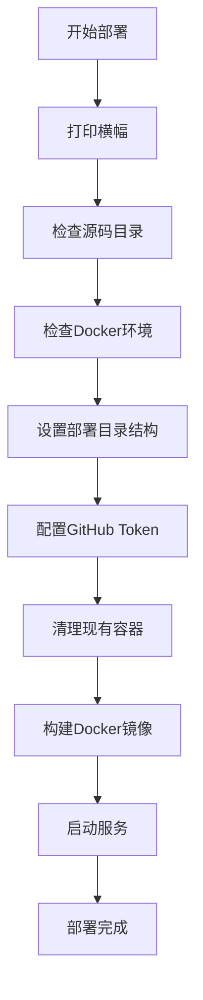

# 本地部署

<cite>
**本文档引用的文件**  
- [first_deploy.sh](file://first_deploy.sh)
- [pyproject.toml](file://pyproject.toml)
- [app/hajimi_king.py](file://app/hajimi_king.py)
- [Dockerfile](file://Dockerfile)
- [docker-compose.yml](file://docker-compose.yml)
- [common/config.py](file://common/config.py)
- [env.example](file://env.example)
</cite>

## 目录
1. [本地部署](#本地部署)
2. [脚本部署流程详解](#脚本部署流程详解)
3. [手动部署替代方案](#手动部署替代方案)
4. [首次运行验证](#首次运行验证)
5. [常见问题与解决方案](#常见问题与解决方案)

## 本地部署

本项目提供自动化部署脚本 `first_deploy.sh`，用于在外部目录独立部署 `hajimi-king` 项目。该脚本通过 Docker 和 Docker Compose 实现环境隔离与服务编排，确保部署过程的一致性和可重复性。

部署流程包括：源码目录检查、Docker 环境验证、部署目录结构初始化、GitHub Token 配置、Docker 镜像构建与服务启动。整个过程自动化完成，用户只需提供 GitHub Personal Access Token 即可。

**Section sources**
- [first_deploy.sh](file://first_deploy.sh#L1-L275)
- [README.md](file://README.md#L1-L343)

## 脚本部署流程详解

### 部署脚本功能概述

`first_deploy.sh` 是一个 Bash 脚本，负责完成 `hajimi-king` 项目的完整部署流程。其主要功能包括：

- 检查源码目录完整性
- 验证 Docker 环境可用性
- 初始化部署目录结构
- 配置 GitHub Token
- 构建 Docker 镜像
- 启动 Docker Compose 服务



**Diagram sources**
- [first_deploy.sh](file://first_deploy.sh#L1-L275)

**Section sources**
- [first_deploy.sh](file://first_deploy.sh#L1-L275)

### 环境初始化与配置自动化

#### Python虚拟环境与依赖管理

项目使用 `uv` 作为包管理器，在 `Dockerfile` 中实现依赖安装：

```dockerfile
# 安装uv包管理器
RUN pip install uv

# 使用uv安装Python依赖
RUN uv pip install --system --no-cache -r pyproject.toml
```

`pyproject.toml` 文件定义了项目依赖：

```toml
[project]
requires-python = ">=3.11"
dependencies = [
    "google-generativeai>=0.8.5",
    "python-dotenv>=1.1.1",
    "requests>=2.32.4",
]
```

#### 环境变量模板生成

脚本自动复制 `env.example` 为 `.env`，并引导用户输入 GitHub Token：

```bash
# 复制env.example到当前目录为.env（如果不存在）
if [[ ! -f "${DEPLOY_DIR}/.env" ]]; then
    cp "${SOURCE_DIR}/env.example" "${DEPLOY_DIR}/.env"
    log_success "复制配置文件: .env"
else
    log_info "配置文件已存在: .env"
fi
```

`.env` 文件包含关键配置项：

- `GITHUB_TOKENS`: GitHub 访问令牌（必填）
- `PROXY`: 代理服务器地址（可选）
- `DATE_RANGE_DAYS`: 仓库年龄过滤天数
- `TARGET_BASE_URLS`: ModelScope 提取目标URL

**Section sources**
- [Dockerfile](file://Dockerfile#L1-L27)
- [pyproject.toml](file://pyproject.toml#L1-L12)
- [env.example](file://env.example#L1-L49)

### 权限设置与可执行文件路径配置

部署脚本在执行过程中自动处理文件权限和路径配置：

- 创建 `data` 目录用于持久化存储
- 复制 `queries.example` 到 `data/queries.txt`
- 复制 `docker-compose.yml` 到部署目录
- 设置容器挂载卷 `./data:/app/data`

Docker Compose 配置如下：

```yaml
version: '3.8'
services:
  hajimi-king:
    image: hajimi-king:0.0.1
    container_name: hajimi-king
    restart: unless-stopped
    network_mode: host
    env_file:
      - .env
    volumes:
      - ./data:/app/data
```

**Section sources**
- [first_deploy.sh](file://first_deploy.sh#L1-L275)
- [docker-compose.yml](file://docker-compose.yml#L1-L15)

## 手动部署替代方案

对于无法运行脚本的受限环境，可采用以下手动部署步骤：

### 依赖项检查与系统准备

1. **检查Python版本**（3.11+）：
```bash
python --version
```

2. **安装系统工具**：
```bash
# Ubuntu/Debian
sudo apt-get update && sudo apt-get install -y git curl docker docker-compose

# CentOS/RHEL
sudo yum install -y git curl docker docker-compose
```

3. **安装uv包管理器**：
```bash
pip install uv
```

### 手动部署步骤

1. **克隆项目**：
```bash
git clone <repository-url>
cd APIKEY-king
```

2. **创建部署目录结构**：
```bash
mkdir -p data
cp env.example .env
cp queries.example data/queries.txt
```

3. **配置环境变量**：
编辑 `.env` 文件，填入 GitHub Token：
```bash
GITHUB_TOKENS=ghp_your_token_here_1,ghp_your_token_here_2
```

4. **构建并启动服务**：
```bash
# 构建镜像
docker build -t hajimi-king:0.0.1 .

# 启动服务
docker-compose up -d
```

**Section sources**
- [README.md](file://README.md#L1-L343)
- [Dockerfile](file://Dockerfile#L1-L27)

## 首次运行验证

### 验证命令示例

首次运行 `hajimi_king.py` 可使用以下命令：

```bash
# 兼容模式：未命中ms-key时回退到Gemini提取
python app/hajimi_king.py --mode compatible

# 仅ModelScope模式：只提取包含base_url的ms-key
python app/hajimi_king.py --mode modelscope-only
```

### 日志输出确认

查看日志以确认部署成功：

```bash
# 查看实时日志
docker-compose logs -f

# 查看服务状态
docker-compose ps

# 检查生成的密钥文件
ls data/keys/keys_valid_*.txt
cat data/keys/keys_valid_*.txt
```

成功部署的日志特征：
- 显示 "🚀 HAJIMI KING STARTING"
- 配置检查通过（✅ All required configurations are valid）
- 开始处理搜索查询（🔄 Loop #1）
- 找到有效密钥（✅ VALID: AIzaSy...）

**Section sources**
- [app/hajimi_king.py](file://app/hajimi_king.py#L1-L523)
- [common/Logger.py](file://common/Logger.py#L1-L25)

## 常见问题与解决方案

### 权限拒绝

**问题**：`Permission denied` 错误  
**解决方案**：
1. 确保用户在 `docker` 用户组中：
```bash
sudo usermod -aG docker $USER
```
2. 重启终端或执行 `newgrp docker`

### 网络超时

**问题**：`Connection timeout` 或 `Network unreachable`  
**解决方案**：
1. 配置代理：
```bash
# 在.env中添加
PROXY=http://your-proxy:port
```
2. 使用 WARP 代理：
```bash
PROXY=http://localhost:1080
```

### 依赖冲突

**问题**：`pip` 安装依赖冲突  
**解决方案**：
1. 使用 `uv` 清理缓存：
```bash
uv cache clean
```
2. 重新安装依赖：
```bash
uv pip install --system --no-cache -r pyproject.toml
```

### GitHub Token 无效

**问题**：`GitHub Token not found`  
**解决方案**：
1. 确认 Token 格式以 `ghp_` 开头
2. 确保 Token 具有 `public_repo` 权限
3. 在 [GitHub Settings > Tokens](https://github.com/settings/tokens) 重新生成

### Docker 构建失败

**问题**：`docker build` 失败  
**解决方案**：
1. 清理构建缓存：
```bash
docker builder prune
```
2. 检查网络连接，必要时配置 Docker 代理

**Section sources**
- [first_deploy.sh](file://first_deploy.sh#L1-L275)
- [common/config.py](file://common/config.py#L1-L203)
- [README.md](file://README.md#L1-L343)