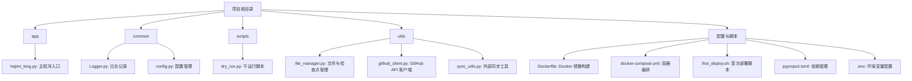
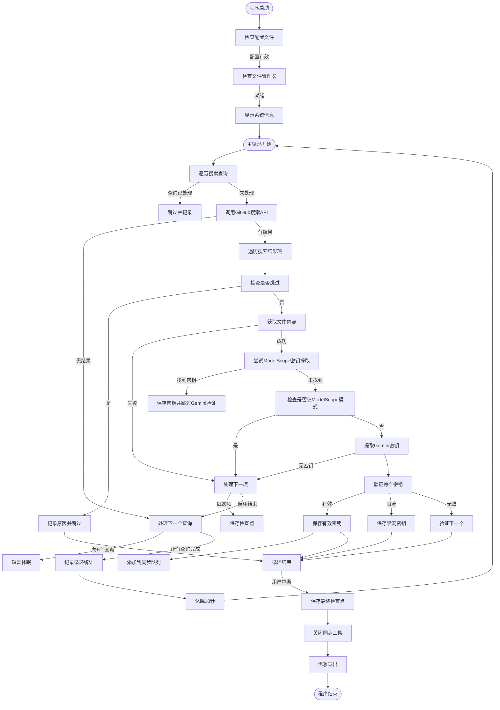
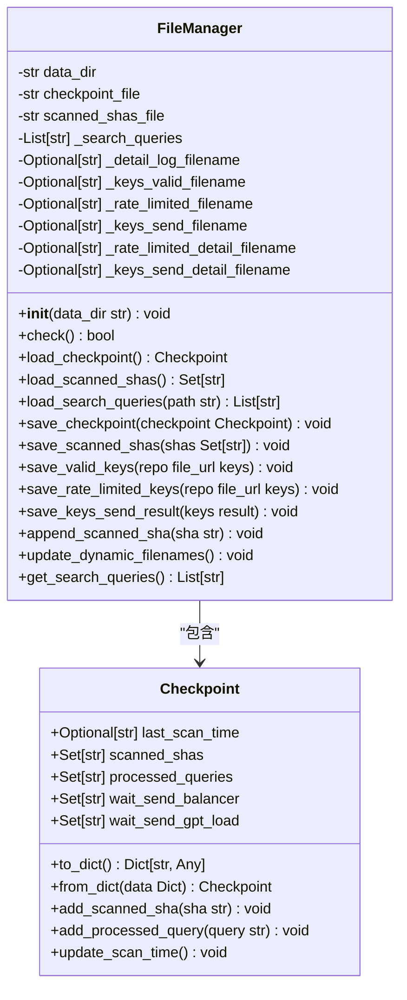
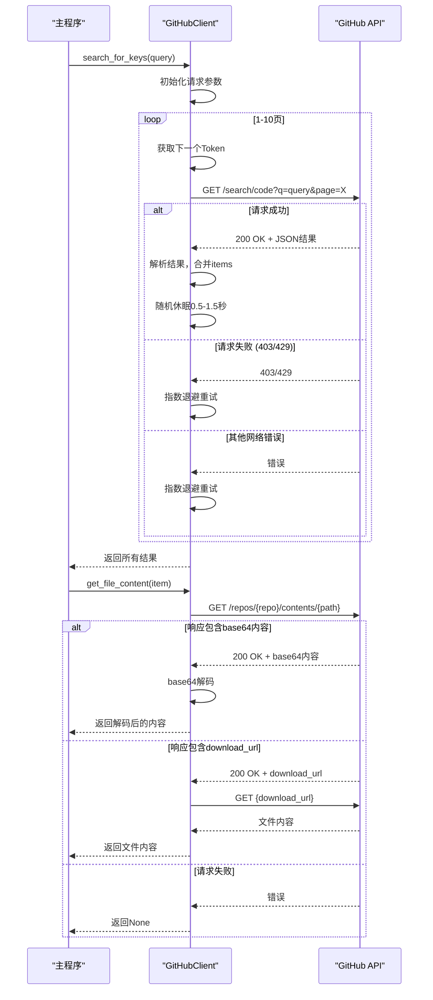
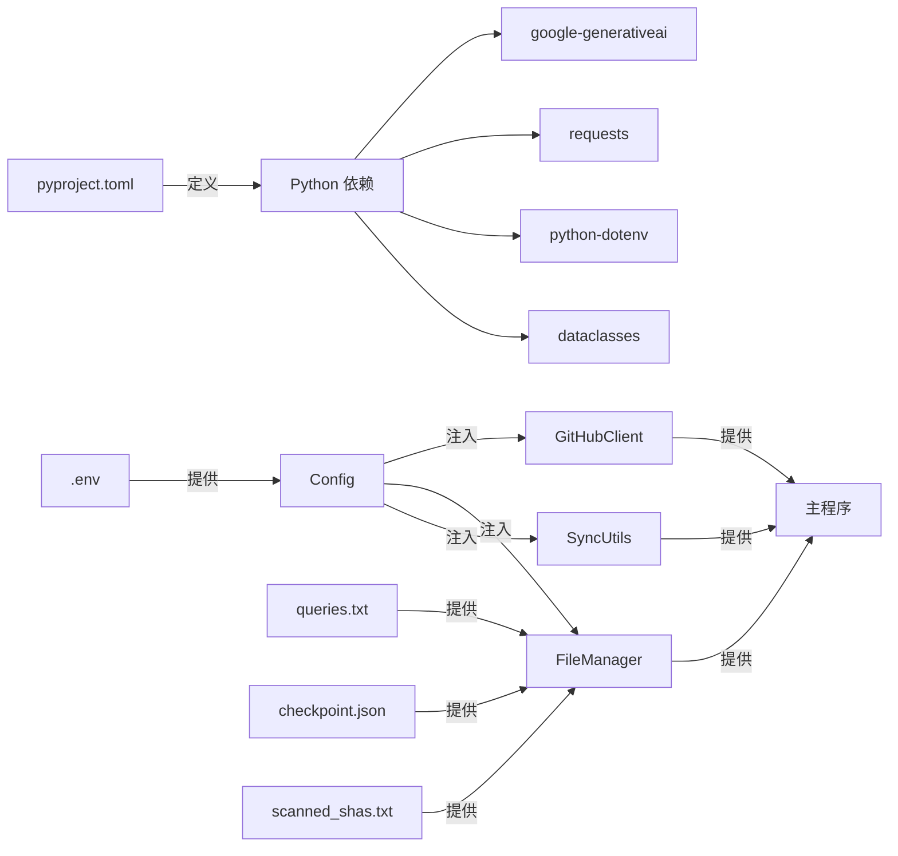

# 生产环境部署建议

<cite>
**本文档引用的文件**  
- [hajimi_king.py](file://app/hajimi_king.py)
- [config.py](file://common/config.py)
- [Logger.py](file://common/Logger.py)
- [github_client.py](file://utils/github_client.py)
- [file_manager.py](file://utils/file_manager.py)
- [sync_utils.py](file://utils/sync_utils.py)
- [Dockerfile](file://Dockerfile)
- [docker-compose.yml](file://docker-compose.yml)
- [.env](file://.env)
- [first_deploy.sh](file://first_deploy.sh)
- [pyproject.toml](file://pyproject.toml)
</cite>

## 目录
1. [项目概述](#项目概述)
2. [项目结构分析](#项目结构分析)
3. [核心组件分析](#核心组件分析)
4. [系统架构概览](#系统架构概览)
5. [详细组件分析](#详细组件分析)
6. [依赖关系分析](#依赖关系分析)
7. [生产环境部署最佳实践](#生产环境部署最佳实践)
8. [性能调优建议](#性能调优建议)
9. [监控与告警体系](#监控与告警体系)
10. [安全合规要求](#安全合规要求)
11. [灾难恢复与备份](#灾难恢复与备份)
12. [附录](#附录)

## 项目概述
本项目 `APIKEY-king` 是一个用于在 GitHub 上搜索和验证 API 密钥（特别是 Gemini 和 ModelScope 类型）的工具。它通过 GitHub Code Search API 扫描代码仓库，提取潜在的 API 密钥，并通过实际调用验证其有效性。项目支持增量扫描、代理轮换、外部同步等功能，适用于持续监控和收集公开泄露的 API 密钥。

项目当前处于 Beta 阶段，功能和接口可能发生变化。其主要应用场景包括安全研究、密钥泄露监控和自动化密钥收集。

**Section sources**
- [README.md](file://README.md#L1-L343)

## 项目结构分析
项目采用模块化设计，结构清晰，各目录职责分明。



**Diagram sources**
- [app/hajimi_king.py](file://app/hajimi_king.py#L1-L524)
- [common/Logger.py](file://common/Logger.py#L1-L25)
- [common/config.py](file://common/config.py#L1-L204)
- [utils/file_manager.py](file://utils/file_manager.py#L1-L493)
- [utils/github_client.py](file://utils/github_client.py#L1-L218)
- [utils/sync_utils.py](file://utils/sync_utils.py#L1-L100)
- [Dockerfile](file://Dockerfile#L1-L27)
- [docker-compose.yml](file://docker-compose.yml#L1-L15)

**Section sources**
- [app/hajimi_king.py](file://app/hajimi_king.py#L1-L524)
- [common/Logger.py](file://common/Logger.py#L1-L25)
- [common/config.py](file://common/config.py#L1-L204)
- [utils/file_manager.py](file://utils/file_manager.py#L1-L493)
- [utils/github_client.py](file://utils/github_client.py#L1-L218)
- [Dockerfile](file://Dockerfile#L1-L27)
- [docker-compose.yml](file://docker-compose.yml#L1-L15)

## 核心组件分析
项目的核心功能由几个关键模块协同完成。

**Section sources**
- [app/hajimi_king.py](file://app/hajimi_king.py#L1-L524)
- [common/config.py](file://common/config.py#L1-L204)
- [utils/file_manager.py](file://utils/file_manager.py#L1-L493)
- [utils/github_client.py](file://utils/github_client.py#L1-L218)

## 系统架构概览
系统采用主循环驱动的架构，通过配置、客户端、文件管理和同步工具四大模块协同工作。

```mermaid
graph TD
subgraph "配置层"
Config[Config: 环境变量管理]
end
subgraph "核心服务层"
GitHubClient[GitHubClient: API 交互]
FileManager[FileManager: 数据持久化]
SyncUtils[SyncUtils: 外部同步]
end
subgraph "主控层"
Main[main(): 主循环]
end
Config --> GitHubClient
Config --> FileManager
Config --> SyncUtils
Config --> Main
Main --> GitHubClient
Main --> FileManager
Main --> SyncUtils
GitHubClient --> |搜索结果| Main
Main --> |处理结果| FileManager
Main --> |有效密钥| SyncUtils
FileManager --> |检查点| Main
```

**Diagram sources**
- [app/hajimi_king.py](file://app/hajimi_king.py#L1-L524)
- [common/config.py](file://common/config.py#L1-L204)
- [utils/github_client.py](file://utils/github_client.py#L1-L218)
- [utils/file_manager.py](file://utils/file_manager.py#L1-L493)
- [utils/sync_utils.py](file://utils/sync_utils.py#L1-L100)

## 详细组件分析
### 主程序分析 (hajimi_king.py)
主程序 `hajimi_king.py` 是整个应用的控制中心，负责协调各个组件，执行搜索、验证和保存的完整流程。

#### 主程序流程图


**Diagram sources**
- [app/hajimi_king.py](file://app/hajimi_king.py#L1-L524)

**Section sources**
- [app/hajimi_king.py](file://app/hajimi_king.py#L1-L524)

### 配置管理分析 (config.py)
`config.py` 模块负责加载和管理所有环境变量，是系统配置的单一入口。

#### 配置类结构
```mermaid
classDiagram
class Config {
+str GITHUB_TOKENS_STR
+List[str] GITHUB_TOKENS
+str DATA_PATH
+str PROXY_LIST_STR
+List[str] PROXY_LIST
+str GEMINI_BALANCER_SYNC_ENABLED
+str GEMINI_BALANCER_URL
+str GEMINI_BALANCER_AUTH
+str GPT_LOAD_SYNC_ENABLED
+str GPT_LOAD_URL
+str GPT_LOAD_AUTH
+str GPT_LOAD_GROUP_NAME
+str VALID_KEY_PREFIX
+str RATE_LIMITED_KEY_PREFIX
+str KEYS_SEND_PREFIX
+str VALID_KEY_DETAIL_PREFIX
+str RATE_LIMITED_KEY_DETAIL_PREFIX
+str KEYS_SEND_DETAIL_PREFIX
+int DATE_RANGE_DAYS
+str QUERIES_FILE
+str SCANNED_SHAS_FILE
+str HAJIMI_CHECK_MODEL
+str FILE_PATH_BLACKLIST_STR
+List[str] FILE_PATH_BLACKLIST
+str TARGET_BASE_URLS_STR
+List[str] TARGET_BASE_URLS
+str MS_USE_LOOSE_PATTERN
+int MS_PROXIMITY_CHARS
+str MS_REQUIRE_KEY_CONTEXT
+str MODELSCOPE_EXTRACT_ONLY
+parse_bool(value str) bool
+get_random_proxy() Dict[str, str]
+check() bool
}
note right of Config
负责从 .env 文件和环境变量
中加载所有配置，并提供类型
转换和验证功能。
end
```

**Diagram sources**
- [common/config.py](file://common/config.py#L1-L204)

**Section sources**
- [common/config.py](file://common/config.py#L1-L204)

### 文件管理分析 (file_manager.py)
`file_manager.py` 模块负责所有文件的读写操作，包括搜索查询、检查点、日志和密钥文件。

#### 文件管理器类图


**Diagram sources**
- [utils/file_manager.py](file://utils/file_manager.py#L1-L493)

**Section sources**
- [utils/file_manager.py](file://utils/file_manager.py#L1-L493)

### GitHub客户端分析 (github_client.py)
`github_client.py` 模块封装了与 GitHub API 的交互，包括搜索代码和获取文件内容。

#### GitHub客户端序列图


**Diagram sources**
- [utils/github_client.py](file://utils/github_client.py#L1-L218)

**Section sources**
- [utils/github_client.py](file://utils/github_client.py#L1-L218)

## 依赖关系分析
项目依赖关系清晰，主要依赖外部库和配置文件。



**Diagram sources**
- [pyproject.toml](file://pyproject.toml#L1-L10)
- [.env](file://.env#L1-L20)
- [queries.txt](file://data/queries.txt#L1-L10)
- [config.py](file://common/config.py#L1-L204)
- [file_manager.py](file://utils/file_manager.py#L1-L493)
- [github_client.py](file://utils/github_client.py#L1-L218)

## 生产环境部署最佳实践
为确保 `APIKEY-king` 在生产环境中稳定、高效、安全地运行，建议遵循以下最佳实践。

### 资源规划
- **CPU**: 建议分配至少 2 个 vCPU。程序主要为 I/O 密集型，但密钥验证和内容处理会消耗 CPU。
- **内存**: 建议分配 4GB 内存。程序需要加载搜索结果、文件内容和维护检查点状态。
- **存储IO**: 建议使用 SSD 存储。程序会频繁读写日志、检查点和密钥文件，高 IOPS 能显著提升性能。
- **存储空间**: 根据预期扫描规模规划。日志和密钥文件会持续增长，建议配置自动清理或归档策略。

### 高可用架构设计
- **多节点部署**: 部署多个独立的 `APIKEY-king` 实例，每个实例使用不同的 `GITHUB_TOKENS` 和 `PROXY` 配置。这可以提高扫描速度和容错能力。
- **故障转移**: 由于程序是无状态的（状态通过文件持久化），任何实例故障后，其他实例可以继续工作。重启故障实例后，它会从检查点恢复。
- **容器化部署**: 使用 `docker-compose.yml` 进行部署，便于管理和扩展。建议使用 `restart: unless-stopped` 策略确保进程意外退出后能自动重启。

**Section sources**
- [docker-compose.yml](file://docker-compose.yml#L1-L15)
- [first_deploy.sh](file://first_deploy.sh#L1-L276)

### 监控体系集成
- **日志收集到ELK**:
  1. 在 `docker-compose.yml` 中将 `data` 目录挂载为卷。
  2. 部署 Filebeat 或 Logstash 作为 sidecar 容器或主机代理，监控 `/app/data/logs/` 目录下的 `.log` 文件。
  3. 将日志发送到 Elasticsearch，并在 Kibana 中创建仪表板，监控 `valid keys`, `rate limited keys`, `skipped items` 等关键指标。
- **指标暴露给Prometheus**:
  1. 修改 `Logger.py` 或添加一个中间件，在日志中输出结构化指标（如 `metric_name value timestamp`）。
  2. 使用 `prometheus-nginxlog-exporter` 或自定义脚本解析日志，将其转换为 Prometheus 可抓取的格式。
  3. 或者，开发一个简单的 HTTP 服务，定期读取检查点文件和日志，计算并暴露 `total_valid_keys`, `total_rate_limited_keys`, `last_scan_time` 等指标。

## 性能调优建议
- **调整并发扫描线程数**: 当前程序是单线程的。为了提高性能，可以将主循环改造为多线程或异步模式。例如，使用 `concurrent.futures.ThreadPoolExecutor` 并行处理多个搜索查询或文件项。
- **优化查询频率以避免API限流**:
  - **增加随机休眠**: 在 `github_client.py` 的 `search_for_keys` 方法中，`sleep_time = random.uniform(0.5, 1.5)` 可以调整为 `random.uniform(2.0, 5.0)` 以降低请求频率。
  - **分散Token使用**: 确保 `GITHUB_TOKENS` 环境变量配置了多个有效的 GitHub Token，程序会轮换使用，有效提高总配额。
  - **使用代理**: 配置 `PROXY` 环境变量，使用多个代理服务器轮换，避免单一 IP 被限流。
  - **优化查询表达式**: 在 `queries.txt` 中使用更精确的查询，减少返回的无效结果数量，从而减少后续处理的开销。

**Section sources**
- [app/hajimi_king.py](file://app/hajimi_king.py#L1-L524)
- [utils/github_client.py](file://utils/github_client.py#L1-L218)
- [README.md](file://README.md#L1-L343)

## 安全合规要求
- **最小权限运行容器**: 在 `docker-compose.yml` 中，为容器配置非 root 用户运行。例如，创建一个 `hajimi` 用户，并使用 `user: hajimi` 指令。
- **定期镜像漏洞扫描**: 使用 Trivy、Clair 等工具对 `hajimi-king:0.0.1` 镜像进行定期扫描，及时发现并修复基础镜像和依赖库中的安全漏洞。
- **环境变量加密管理**: 避免将 `.env` 文件提交到版本控制。使用 Kubernetes Secrets、Hashicorp Vault 或 AWS SSM Parameter Store 等工具来安全地存储和注入 `GITHUB_TOKENS` 等敏感信息。
- **GitHub令牌轮换策略**: 建立定期轮换 `GITHUB_TOKENS` 的策略（例如每月一次）。在轮换时，先添加新 Token，观察一段时间确保新 Token 工作正常，再移除旧 Token。

**Section sources**
- [docker-compose.yml](file://docker-compose.yml#L1-L15)
- [.env](file://.env#L1-L20)
- [README.md](file://README.md#L1-L343)

## 灾难恢复与备份
- **自动化备份策略**:
  1. 实施定期备份 `data` 目录的策略，特别是 `checkpoint.json`, `scanned_shas.txt`, `keys/` 和 `logs/` 子目录。
  2. 使用 `cron` 作业或 Kubernetes CronJob，每天将 `data` 目录打包并上传到远程存储（如 S3、MinIO 或 NAS）。
  3. 示例备份脚本:
     ```bash
     #!/bin/bash
     BACKUP_DIR="/backup/hajimi-king"
     DATA_DIR="./data"
     TIMESTAMP=$(date +%Y%m%d_%H%M%S)
     mkdir -p $BACKUP_DIR
     tar -czf $BACKUP_DIR/backup_$TIMESTAMP.tar.gz -C $DATA_DIR .
     # 可选：上传到远程存储
     # aws s3 cp $BACKUP_DIR/backup_$TIMESTAMP.tar.gz s3://my-backup-bucket/
     ```
- **灾难恢复流程**:
  1. **场景**: 生产服务器宕机或数据目录损坏。
  2. **恢复步骤**:
     - 部署新的 `APIKEY-king` 实例（使用 `first_deploy.sh` 或手动部署）。
     - 停止新实例的容器。
     - 从最近的备份中恢复 `data` 目录的内容。
     - 启动容器，程序将自动从 `checkpoint.json` 和 `scanned_shas.txt` 恢复状态，继续增量扫描。

**Section sources**
- [first_deploy.sh](file://first_deploy.sh#L1-L276)
- [utils/file_manager.py](file://utils/file_manager.py#L1-L493)

## 附录
### 审计日志记录要求
- **日志级别**: 确保 `Logger.py` 配置了 `INFO` 级别日志，记录所有关键操作。
- **日志内容**: 必须记录以下事件：
  - 程序启动和关闭时间。
  - 每次搜索查询的执行情况（成功/失败，结果数量）。
  - 每个有效密钥的发现和保存（记录密钥前缀，避免记录完整密钥）。
  - 每个被限流的密钥。
  - 任何配置检查失败或严重错误。
  - 检查点的保存和加载。
- **日志存储**: 日志文件必须存储在持久化卷中，并保留至少 90 天。

### 合规性检查清单
- [x] 所有 GitHub Tokens 仅具有 `public_repo` 权限。
- [x] `.env` 文件未提交到版本控制系统。
- [x] 容器以非 root 用户身份运行。
- [x] 已配置自动化备份策略，备份频率为每日一次。
- [x] 已配置 ELK 日志收集，关键日志可被检索。
- [x] 已配置 Prometheus 监控，关键指标可被观测。
- [x] `GITHUB_TOKENS` 轮换策略已制定并记录。
- [x] 镜像漏洞扫描已集成到 CI/CD 流程中。